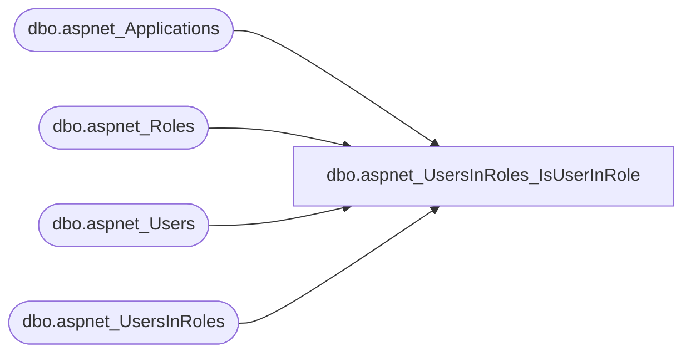

# dbo.aspnet_UsersInRoles_IsUserInRole

**Database:** ApplicationResources  
**Server:** bearcluster01  

## Architecture Diagram



## Table Dependencies

| Referenced Table |
|---|
| dbo.aspnet_Applications |
| dbo.aspnet_Roles |
| dbo.aspnet_Users |
| dbo.aspnet_UsersInRoles |

## Stored Procedure Code

```sql
CREATE PROCEDURE dbo.aspnet_UsersInRoles_IsUserInRole
    @ApplicationName  nvarchar(256),
    @UserName         nvarchar(256),
    @RoleName         nvarchar(256)
AS
BEGIN
    DECLARE @ApplicationId uniqueidentifier
    SELECT  @ApplicationId = NULL
    SELECT  @ApplicationId = ApplicationId FROM aspnet_Applications WHERE LOWER(@ApplicationName) = LoweredApplicationName
    IF (@ApplicationId IS NULL)
        RETURN(2)
    DECLARE @UserId uniqueidentifier
    SELECT  @UserId = NULL
    DECLARE @RoleId uniqueidentifier
    SELECT  @RoleId = NULL

    SELECT  @UserId = UserId
    FROM    dbo.aspnet_Users
    WHERE   LoweredUserName = LOWER(@UserName) AND ApplicationId = @ApplicationId

    IF (@UserId IS NULL)
        RETURN(2)

    SELECT  @RoleId = RoleId
    FROM    dbo.aspnet_Roles
    WHERE   LoweredRoleName = LOWER(@RoleName) AND ApplicationId = @ApplicationId

    IF (@RoleId IS NULL)
        RETURN(3)

    IF (EXISTS( SELECT * FROM dbo.aspnet_UsersInRoles WHERE  UserId = @UserId AND RoleId = @RoleId))
        RETURN(1)
    ELSE
        RETURN(0)
END
```

