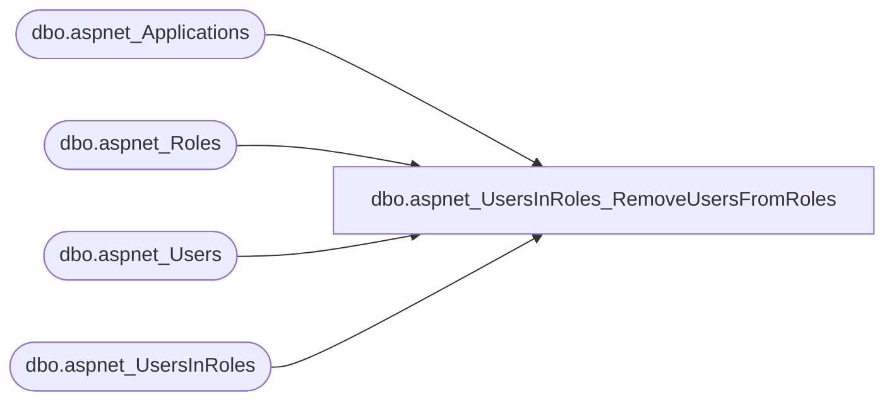

# dbo.aspnet_UsersInRoles_RemoveUsersFromRoles

**Database:** ApplicationResources  
**Server:** bearcluster01  

## Architecture Diagram



## Table Dependencies

| Referenced Table |
|---|
| dbo.aspnet_Applications |
| dbo.aspnet_Roles |
| dbo.aspnet_Users |
| dbo.aspnet_UsersInRoles |

## Stored Procedure Code

```sql
CREATE PROCEDURE dbo.aspnet_UsersInRoles_RemoveUsersFromRoles
	@ApplicationName  nvarchar(256),
	@UserNames		  nvarchar(4000),
	@RoleNames		  nvarchar(4000)
AS
BEGIN
	DECLARE @AppId uniqueidentifier
	SELECT  @AppId = NULL
	SELECT  @AppId = ApplicationId FROM aspnet_Applications WHERE LOWER(@ApplicationName) = LoweredApplicationName
	IF (@AppId IS NULL)
		RETURN(2)


	DECLARE @TranStarted   bit
	SET @TranStarted = 0

	IF( @@TRANCOUNT = 0 )
	BEGIN
		BEGIN TRANSACTION
		SET @TranStarted = 1
	END

	DECLARE @tbNames  table(Name nvarchar(256) NOT NULL PRIMARY KEY)
	DECLARE @tbRoles  table(RoleId uniqueidentifier NOT NULL PRIMARY KEY)
	DECLARE @tbUsers  table(UserId uniqueidentifier NOT NULL PRIMARY KEY)
	DECLARE @Num	  int
	DECLARE @Pos	  int
	DECLARE @NextPos  int
	DECLARE @Name	  nvarchar(256)
	DECLARE @CountAll int
	DECLARE @CountU	  int
	DECLARE @CountR	  int


	SET @Num = 0
	SET @Pos = 1
	WHILE(@Pos <= LEN(@RoleNames))
	BEGIN
		SELECT @NextPos = CHARINDEX(N',', @RoleNames,  @Pos)
		IF (@NextPos = 0 OR @NextPos IS NULL)
			SELECT @NextPos = LEN(@RoleNames) + 1
		SELECT @Name = RTRIM(LTRIM(SUBSTRING(@RoleNames, @Pos, @NextPos - @Pos)))
		SELECT @Pos = @NextPos+1

		INSERT INTO @tbNames VALUES (@Name)
		SET @Num = @Num + 1
	END

	INSERT INTO @tbRoles
	  SELECT RoleId
	  FROM   dbo.aspnet_Roles ar, @tbNames t
	  WHERE  LOWER(t.Name) = ar.LoweredRoleName AND ar.ApplicationId = @AppId
	SELECT @CountR = @@ROWCOUNT

	IF (@CountR <> @Num)
	BEGIN
		SELECT TOP 1 N'', Name
		FROM   @tbNames
		WHERE  LOWER(Name) NOT IN (SELECT ar.LoweredRoleName FROM dbo.aspnet_Roles ar,  @tbRoles r WHERE r.RoleId = ar.RoleId)
		IF( @TranStarted = 1 )
			ROLLBACK TRANSACTION
		RETURN(2)
	END


	DELETE FROM @tbNames WHERE 1=1
	SET @Num = 0
	SET @Pos = 1


	WHILE(@Pos <= LEN(@UserNames))
	BEGIN
		SELECT @NextPos = CHARINDEX(N',', @UserNames,  @Pos)
		IF (@NextPos = 0 OR @NextPos IS NULL)
			SELECT @NextPos = LEN(@UserNames) + 1
		SELECT @Name = RTRIM(LTRIM(SUBSTRING(@UserNames, @Pos, @NextPos - @Pos)))
		SELECT @Pos = @NextPos+1

		INSERT INTO @tbNames VALUES (@Name)
		SET @Num = @Num + 1
	END

	INSERT INTO @tbUsers
	  SELECT UserId
	  FROM   dbo.aspnet_Users ar, @tbNames t
	  WHERE  LOWER(t.Name) = ar.LoweredUserName AND ar.ApplicationId = @AppId

	SELECT @CountU = @@ROWCOUNT
	IF (@CountU <> @Num)
	BEGIN
		SELECT TOP 1 Name, N''
		FROM   @tbNames
		WHERE  LOWER(Name) NOT IN (SELECT au.LoweredUserName FROM dbo.aspnet_Users au,  @tbUsers u WHERE u.UserId = au.UserId)

		IF( @TranStarted = 1 )
			ROLLBACK TRANSACTION
		RETURN(1)
	END

	SELECT  @CountAll = COUNT(*)
	FROM	dbo.aspnet_UsersInRoles ur, @tbUsers u, @tbRoles r
	WHERE   ur.UserId = u.UserId AND ur.RoleId = r.RoleId

	IF (@CountAll <> @CountU * @CountR)
	BEGIN
		SELECT TOP 1 UserName, RoleName
		FROM		 @tbUsers tu, @tbRoles tr, dbo.aspnet_Users u, dbo.aspnet_Roles r
		WHERE		 u.UserId = tu.UserId AND r.RoleId = tr.RoleId AND
					 tu.UserId NOT IN (SELECT ur.UserId FROM dbo.aspnet_UsersInRoles ur WHERE ur.RoleId = tr.RoleId) AND
					 tr.RoleId NOT IN (SELECT ur.RoleId FROM dbo.aspnet_UsersInRoles ur WHERE ur.UserId = tu.UserId)
		IF( @TranStarted = 1 )
			ROLLBACK TRANSACTION
		RETURN(3)
	END

	DELETE FROM dbo.aspnet_UsersInRoles
	WHERE UserId IN (SELECT UserId FROM @tbUsers)
	  AND RoleId IN (SELECT RoleId FROM @tbRoles)
	IF( @TranStarted = 1 )
		COMMIT TRANSACTION
	RETURN(0)
END
                                                                                                                                                                                                                                                                                                                                                                                                                                                                                                                                                                                                                                                        
dbo,aspnet_WebEvent_LogEvent,CREATE PROCEDURE dbo.aspnet_WebEvent_LogEvent
        @EventId         char(32),
        @EventTimeUtc    datetime,
        @EventTime       datetime,
        @EventType       nvarchar(256),
        @EventSequence   decimal(19,0),
        @EventOccurrence decimal(19,0),
        @EventCode       int,
        @EventDetailCode int,
        @Message         nvarchar(1024),
        @ApplicationPath nvarchar(256),
        @ApplicationVirtualPath nvarchar(256),
        @MachineName    nvarchar(256),
        @RequestUrl      nvarchar(1024),
        @ExceptionType   nvarchar(256),
        @Details         ntext
AS
BEGIN
    INSERT
        dbo.aspnet_WebEvent_Events
        (
            EventId,
            EventTimeUtc,
            EventTime,
            EventType,
            EventSequence,
            EventOccurrence,
            EventCode,
            EventDetailCode,
            Message,
            ApplicationPath,
            ApplicationVirtualPath,
            MachineName,
            RequestUrl,
            ExceptionType,
            Details
        )
    VALUES
    (
        @EventId,
        @EventTimeUtc,
        @EventTime,
        @EventType,
        @EventSequence,
        @EventOccurrence,
        @EventCode,
        @EventDetailCode,
        @Message,
        @ApplicationPath,
        @ApplicationVirtualPath,
        @MachineName,
        @RequestUrl,
        @ExceptionType,
        @Details
    )
END
```

