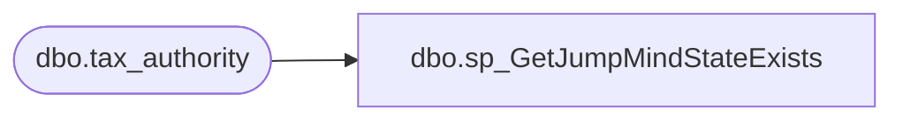

# dbo.sp_GetJumpMindStateExists

**Database:** ApplicationResources  
**Server:** bearcluster01  

## Architecture Diagram



## Table Dependencies

| Referenced Table |
|---|
| dbo.tax_authority |

## Stored Procedure Code

```sql
-- =============================================
-- Author:		Brandon Hickey
-- Create date: 3/28/2023
-- Description:	This will archive all logging records older than 30 days
-- =============================================
CREATE PROCEDURE [dbo].[sp_GetJumpMindStateExists] 
@State varchar(40)
AS
BEGIN
	SET NOCOUNT ON;

	SELECT COUNT(tax_authority.id) FROM tax_authority  
	WHERE UPPER(tax_authority.auth_name) = UPPER(@State)
END
```

