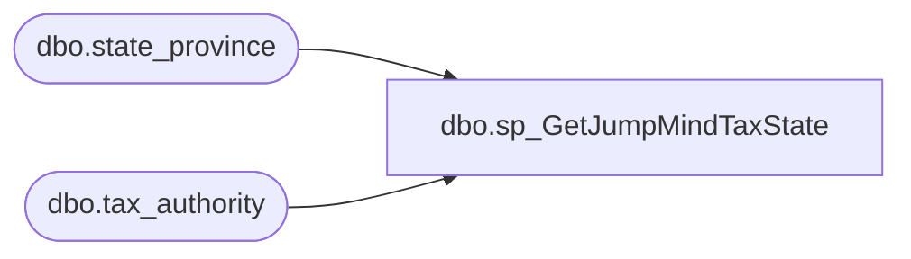

# dbo.sp_GetJumpMindTaxState

**Database:** ApplicationResources  
**Server:** bearcluster01  

## Architecture Diagram



## Table Dependencies

| Referenced Table |
|---|
| dbo.state_province |
| dbo.tax_authority |

## Stored Procedure Code

```sql
-- =============================================
-- Author:		Brandon Hickey
-- Create date: 3/9/2023
-- Description:	This will archive all logging records older than 30 days
-- =============================================
CREATE PROCEDURE [dbo].[sp_GetJumpMindTaxState] 
@StateID int
AS
BEGIN
	SET NOCOUNT ON;

	SELECT sp.nm_abbrv FROM tax_authority 
	LEFT JOIN state_province as sp ON UPPER(tax_authority.auth_name) = UPPER(sp.nm_full) 
	WHERE tax_authority.id = @StateID
END
```

