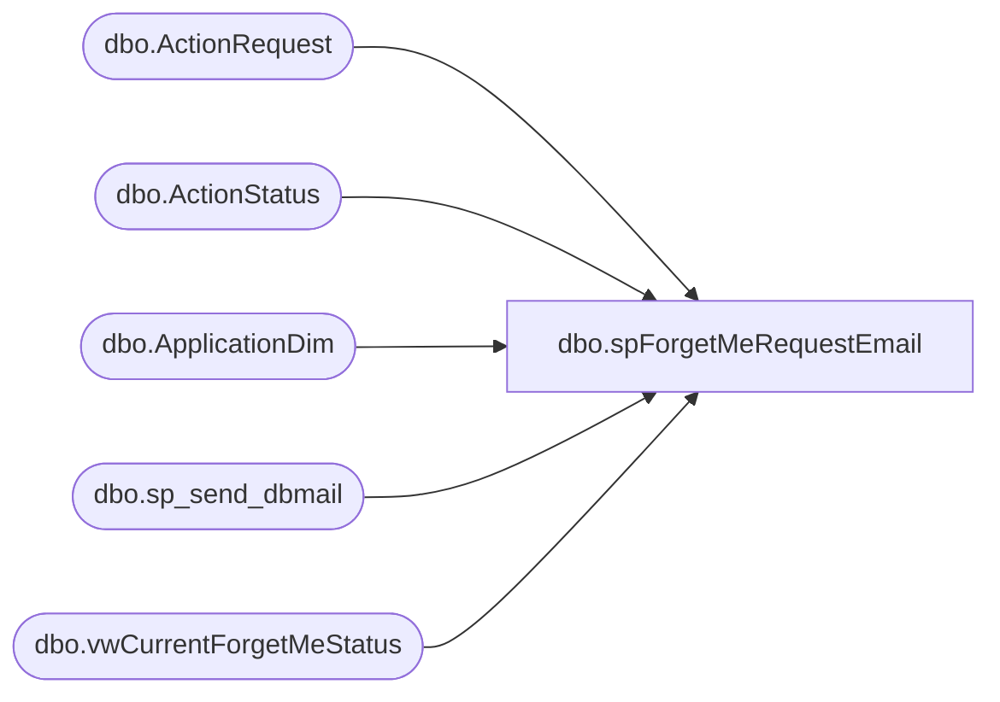

# dbo.spForgetMeRequestEmail

**Database:** BABWForgetMe  
**Server:** bearcluster01  

## Architecture Diagram



## Table Dependencies

| Referenced Table |
|---|
| dbo.ActionRequest |
| dbo.ActionStatus |
| dbo.ApplicationDim |
| dbo.sp_send_dbmail |
| dbo.vwCurrentForgetMeStatus |

## Stored Procedure Code

```sql
CREATE PROC [dbo].[spForgetMeRequestEmail]  
	--@intUserID INT
AS

-- Name: spForgetMeRequestEmail
--
-- Description:	Emails user using ForgetMe application  
-- l
-- Output: email
-- 
-- Available actions: 
--
-- Dependency: 
--		
--
-- Revision History
--		Name:			Date:			Comments:
--		Nigel Thomas	07/11/2017		Creation
	

SET NOCOUNT ON  

DECLARE @recipients NVARCHAR(2000),
@copy_recipients NVARCHAR(2000) ,
@subject NVARCHAR(1000) ,
@MessageTxt NVARCHAR(2000),
@forgetMeUri NVARCHAR(100)

select @recipients = COALESCE(@recipients + '; ','') + a.TeamEmailAddress
from (select distinct TeamEmailAddress from ApplicationDim) a

SET @copy_recipients = 'gregd@buildabear.com; blaken@buildabear.com'
SET @subject = 'ForgetMe Request Deadline Approaching'
SET @MessageTxt = 'There are ForgetMe requests that will fail to comply soon'
SET @forgetMeUri = 'https://intranet.buildabear.com/ForgetMe2?page=my-systems'

		Declare @Body varchar(8000),
			  @Body1 varchar(max),
			  @Xml varchar(max),
			  @TableTail varchar(max)
			  
		Set @Body1 = '';		 
		 
		SET NOCOUNT ON
		
		Set @TableTail = '</table><br><br><br>This email has been generated from STL-SQL-P-02.BABWForgetMe.dbo.spForgetMeRequestEmail</body></html>';		 

		
If (0 < (Select Count(*) FROM [BABWForgetMe].[dbo].[ActionStatus] A		
			LEFT OUTER JOIN  [BABWForgetMe].[dbo].[ActionRequest] D ON D.ActionRequestID = A.ActionRequestID 
			where CompletionDate IS NULL AND ValidationDate IS NOT NULL
			AND (SELECT DATEDIFF(d, getutcdate(), DATEADD(DAY, 30, ValidationDate))) = 7))

			 
		BEGIN
		SET @Xml = CAST((SELECT LEFT([EmailAddress], 3) + '*****@' 
	   + SUBSTRING([EmailAddress], CHARINDEX('@',[EmailAddress])+1,(LEN([EmailAddress]) - CHARINDEX('@',[EmailAddress])+1))

		 AS 'td','',
		[InsertDate] AS 'td' ,'',
		[ActionRequestName] as 'td'  
		FROM 
		(SELECT *  
		FROM BABWForgetMe.dbo.vwCurrentForgetMeStatus where CompletionDate IS NULL AND ValidationDate IS NOT NULL
		AND (SELECT DATEDIFF(d, getutcdate(), DATEADD(DAY, 30, ValidationDate))) = 7) tab
		FOR XML PATH('tr'), ELEMENTS ) AS NVARCHAR(MAX))

		SET @Body1 ='<html><body><H3>
		ForgetMe Request Deadline Approaching</H3>
		<tr>The deadline to process the following ForgetMe requests is ' + CAST(CAST(DATEADD(DAY, 7, GETDATE()) AS DATE) AS VARCHAR(10)) + '.  Please make your required updates ASAP.</tr> <br><br>
		<a href="' + @forgetMeUri + '">https://intranet.buildabear.com/ForgetMe2</a>
		<br><br><tr>This is system generated report. Please do not reply.</tr><br><br>
		<table border = 1> 
		<tr bgcolor="#C0C0C0">
		<th> EmailAddress </th> 
		<th>InsertDate </th> 
		<th> ActionRequestName </th> 
		</tr>' 

		SET @Body1 = @Body1 + @Xml +'</table></body></html>'
		
		SELECT @Body =  @Body1+ @TableTail

		EXEC msdb.dbo.sp_send_dbmail @recipients = @recipients, @copy_recipients = @copy_recipients, @subject = @subject, @body = @Body, @body_format = 'HTML'
	END
```

