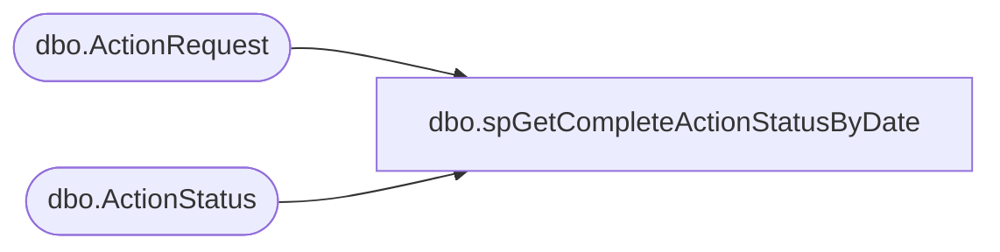

# dbo.spGetCompleteActionStatusByDate

**Database:** BABWForgetMe  
**Server:** bearcluster01  

## Architecture Diagram



## Table Dependencies

| Referenced Table |
|---|
| dbo.ActionRequest |
| dbo.ActionStatus |

## Stored Procedure Code

```sql
CREATE PROCEDURE spGetCompleteActionStatusByDate
	@CompletionDate AS Date

-- =============================================================================================================
-- Name: spGetCompleteActionStatusByDate
--
-- Description:	
--
-- Output: 
--	ds
-- Dependencies: 
--
-- Revision History
--		Name:			Date:			Comments:
--		Ben Barud		06/05/2018		Initial Creation
-- =============================================================================================================

AS
BEGIN

	SET NOCOUNT ON;

    SELECT '<?xml version="1.0" encoding="UTF-8"?><ActionStatuses>' +  
    CAST((SELECT [RecordKey]
	            ,[EmailAddress]
                ,[CompletionDate]
				,[ActionRequestName] AS 'RequestType'
    FROM [BABWForgetMe].[dbo].[ActionStatus] ast
	LEFT JOIN [BABWForgetMe].[dbo].ActionRequest ar ON ast.ActionRequestID = ar.ActionRequestID
    WHERE CAST(CompletionDate AS DATE) = @CompletionDate
    FOR XML PATH ('ActionStatus'), type
    ) AS VARCHAR(MAX)) + '</ActionStatuses>'
END
```

