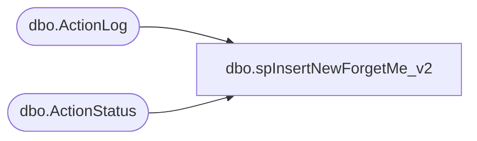

# dbo.spInsertNewForgetMe_v2

**Database:** BABWForgetMe  
**Server:** bearcluster01  

## Architecture Diagram



## Table Dependencies

| Referenced Table |
|---|
| dbo.ActionLog |
| dbo.ActionStatus |

## Stored Procedure Code

```sql
-- =============================================
-- Author:		Tim Bytnar
-- Create date: 05/21/2018
-- Description:	Inserts a new ForgetMe request into the proper tables
-- =============================================
CREATE PROCEDURE [dbo].[spInsertNewForgetMe_v2]
	@RecordKey varchar(26),
	@EmailAddress varchar(128),
	@FirstName varchar(64),
	@LastName varchar(64),
	@Address1 varchar(64),
	@Address2 varchar(64),
	@City varchar(64),
	@State varchar(64),
	@PostalCode varchar(16),
	@SFCCCustomerID varchar(28),
	@ActionRequested tinyint
AS
BEGIN
	SET NOCOUNT ON;

    INSERT INTO ActionStatus (RecordKey, EmailAddress, FirstName, LastName, Address1, Address2, City, State, PostalCode, InsertDate, ActionRequestID)
	SELECT @RecordKey, @EmailAddress, @FirstName, @LastName, @Address1, @Address2, @City, @State, @PostalCode, GETDATE() as InsertDate, @ActionRequested

	INSERT INTO ActionLog (RecordKey, ActionTableKey, ATKeyValue, ActionDate, AQKey)
	SELECT @RecordKey, 30 as ActionTableKey, ISNULL(@SFCCCustomerID,'') as ATKeyValue, GETDATE() as ActionDate, 25 as AQKey

END
```

