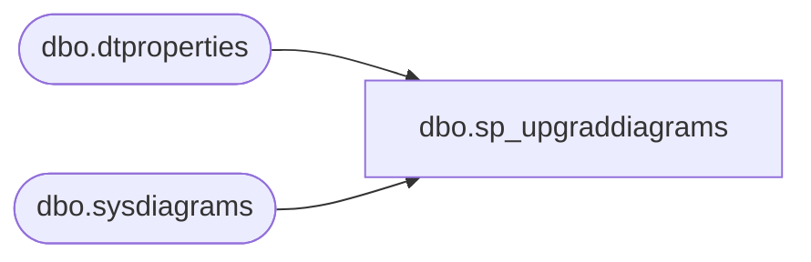

# dbo.sp_upgraddiagrams

**Database:** BABWForgetMe  
**Server:** bearcluster01  

## Architecture Diagram



## Table Dependencies

| Referenced Table |
|---|
| dbo.dtproperties |
| dbo.sysdiagrams |

## Stored Procedure Code

```sql
CREATE PROCEDURE dbo.sp_upgraddiagrams
	AS
	BEGIN
		IF OBJECT_ID(N'dbo.sysdiagrams') IS NOT NULL
			return 0;
	
		CREATE TABLE dbo.sysdiagrams
		(
			name sysname NOT NULL,
			principal_id int NOT NULL,	-- we may change it to varbinary(85)
			diagram_id int PRIMARY KEY IDENTITY,
			version int,
	
			definition varbinary(max)
			CONSTRAINT UK_principal_name UNIQUE
			(
				principal_id,
				name
			)
		);


		/* Add this if we need to have some form of extended properties for diagrams */
		/*
		IF OBJECT_ID(N'dbo.sysdiagram_properties') IS NULL
		BEGIN
			CREATE TABLE dbo.sysdiagram_properties
			(
				diagram_id int,
				name sysname,
				value varbinary(max) NOT NULL
			)
		END
		*/

		IF OBJECT_ID(N'dbo.dtproperties') IS NOT NULL
		begin
			insert into dbo.sysdiagrams
			(
				[name],
				[principal_id],
				[version],
				[definition]
			)
			select	 
				convert(sysname, dgnm.[uvalue]),
				DATABASE_PRINCIPAL_ID(N'dbo'),			-- will change to the sid of sa
				0,							-- zero for old format, dgdef.[version],
				dgdef.[lvalue]
			from dbo.[dtproperties] dgnm
				inner join dbo.[dtproperties] dggd on dggd.[property] = 'DtgSchemaGUID' and dggd.[objectid] = dgnm.[objectid]	
				inner join dbo.[dtproperties] dgdef on dgdef.[property] = 'DtgSchemaDATA' and dgdef.[objectid] = dgnm.[objectid]
				
			where dgnm.[property] = 'DtgSchemaNAME' and dggd.[uvalue] like N'_EA3E6268-D998-11CE-9454-00AA00A3F36E_' 
			return 2;
		end
		return 1;
	END
	
dbo,spDropThenCreate_tmpActionStatusGuestData,-- =============================================
-- Author:		<Author,,Name>
-- Create date: <Create Date,,>
-- Description:	<Description,,>
-- =============================================
CREATE PROCEDURE spDropThenCreate_tmpActionStatusGuestData

AS
BEGIN
	-- SET NOCOUNT ON added to prevent extra result sets from
	-- interfering with SELECT statements.
	SET NOCOUNT ON;
	IF OBJECT_ID('tmpActionStatusGuestData') IS NULL
	BEGIN
    
		CREATE TABLE [dbo].[tmpActionStatusGuestData](
		[RecordKey] [varchar](26) NOT NULL,
		[GuestDataTypeID] [int] NOT NULL,
		[FirstName] [nvarchar](64) NULL,
		[LastName] [nvarchar](64) NULL,
		[Address1] [nvarchar](100) NULL,
		[Address2] [nvarchar](100) NULL,
		[City] [nvarchar](50) NULL,
		[State] [nvarchar](50) NULL,
		[PostalCode] [nvarchar](50) NULL,
		[Country] [nvarchar](50) NULL,
		[Phone] [nvarchar](50) NULL,
		)
	END

	TRUNCATE TABLE [tmpActionStatusGuestData]
END
```

