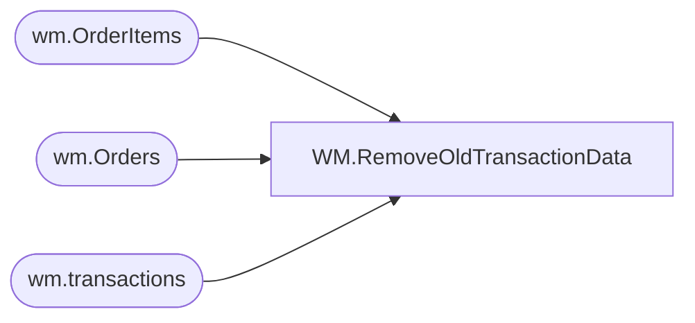

# WM.RemoveOldTransactionData

**Database:** BABWOrderManagement  
**Server:** bearcluster01  

## Architecture Diagram



## Table Dependencies

| Referenced Table |
|---|
| wm.OrderItems |
| wm.Orders |
| wm.transactions |

## Stored Procedure Code

```sql
-- =============================================
-- Author:		John Eck
-- Create date: 8/18/17
-- Description:	removes all data from wm tables for a specified transactionID used to remove pending sound orders so the updated order can be added.
-- =============================================
CREATE PROCEDURE [WM].[RemoveOldTransactionData]
	-- Add the parameters for the stored procedure here
@TransID int
AS
BEGIN
	-- SET NOCOUNT ON added to prevent extra result sets from
	-- interfering with SELECT statements.
	SET NOCOUNT ON;
delete from wm.OrderItems where OrderItemID in (select OrderItemID from wm.OrderItems OI 
                              inner join wm.Orders O on OI.OrderID = O.OrderID where transactionID = @transID)
delete from wm.Orders  where orderID in (select OrderID from wm.Orders where transactionID = @transID)
delete from wm.transactions where transactionID = @TransID
END


WM,spCheckIfJobCompletedRecently,-- =============================================
-- Author:		Tim Bytnar
-- Create date: 9/8/2017
-- Description:	A simple while loop that checks the most recent status of a job and make sure that it has completed recently.
-- =============================================
CREATE PROCEDURE [WM].[spCheckIfJobCompletedRecently] 
	@jobName varchar(36),
	@maxCount int
AS

WAITFOR DELAY '00:01:00'

--WE NEED TO FIX THE LOOP, IT WON'T WORK AS IT IS CODED BELOW
--WE NEED TO FIX THE LOOP SO IT CAPTURES THE MAX JOB HISTORY ID FOR THE JOB NAME, THEN DOES NOT EXIT THE LOOP UNTIL THAT HISTORY ID IS DONE.
/*
BEGIN
	SET NOCOUNT ON;
	DECLARE @count int = 0
	Declare @LastStartTime DateTime = (select start_execution_date from msdb.dbo.sysjobactivity a inner join msdb.dbo.sysjobs j on a.job_id = j.job_id
			where j.name =  @jobName )
	Declare @LastEndTime  DateTime = (select stop_execution_date from msdb.dbo.sysjobactivity a inner join msdb.dbo.sysjobs j on a.job_id = j.job_id
		where j.name =  @jobName )
    Declare @SecondsSinceStarted int
    Select @SecondsSinceStarted = DateDiff(s, @LastStartTime,GetDate())
	If @SecondsSinceStarted > 120
	    Begin
		 WaitFor Delay '00:02:00'
        End
	Else
	   Begin

    WHILE NOT ((select top 1 jh.run_status
	FROM msdb.dbo.sysjobs j
				inner join msdb.dbo.sysjobhistory jh
					ON j.job_id = jh.job_id
				WHERE j.name = @jobName
				group by j.name, jh.run_status, run_date, run_time
				order by run_date desc, run_time desc) = 1 -- Successfully Completed Status
			AND (select DATEDIFF( SECOND, activity.run_requested_date, GETDATE() ) 
					FROM msdb.dbo.sysjobs_view job
						JOIN 
						msdb.dbo.sysjobactivity activity
						 ON job.job_id = activity.job_id
					WHERE job.name = @jobName) <= 10 --Completed less than or equal to 5 seconds ago
				)
			AND @count < @maxCount
	BEGIN
		WAITFOR DELAY '00:00:10'
		set @count = @count + 1
	END

	IF @count >= @maxCount
	BEGIN
		RAISERROR('The job has ran longer than the 120 second timeout.',16,1)
	END
END
End
*/

WM,WareHouseQAapp_sp_GetOrder,create PROCEDURE [WM].[WareHouseQAapp_sp_GetOrder]
	@ordernum varchar(max)
AS
BEGIN

	select Orderid, OrderDate, OrderStatus, OrderType from wm.Orders where OrderNum=@ordernum;

END
```

