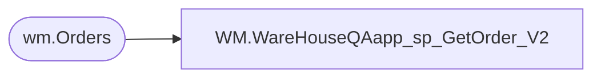

# WM.WareHouseQAapp_sp_GetOrder_V2

**Database:** BABWOrderManagement  
**Server:** bearcluster01  

## Architecture Diagram



## Table Dependencies

| Referenced Table |
|---|
| wm.Orders |

## Stored Procedure Code

```sql
CREATE PROCEDURE [WM].[WareHouseQAapp_sp_GetOrder_V2]
	@ordernum varchar(max)
AS
BEGIN

	select Orderid, OrderDate, OrderStatus, OrderType, ShippingMethod from wm.Orders where OrderNum=@ordernum;

END
```

