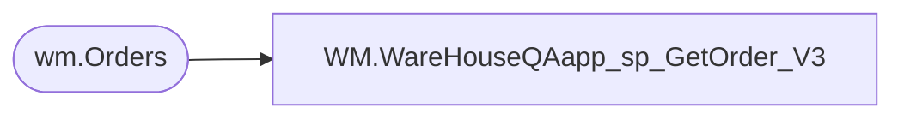

# WM.WareHouseQAapp_sp_GetOrder_V3

**Database:** BABWOrderManagement  
**Server:** bearcluster01  

## Architecture Diagram



## Table Dependencies

| Referenced Table |
|---|
| wm.Orders |

## Stored Procedure Code

```sql
CREATE PROCEDURE [WM].[WareHouseQAapp_sp_GetOrder_V3]
	@ordernum varchar(max)
AS
BEGIN

	select Orderid, OrderDate, OrderStatus, OrderType, ShippingMethod from wm.Orders where OrderNum like (@ordernum + '%') AND OrderStatus <> 'Complete';

END


WM,WareHouseQAapp_sp_GetOrderItem,CREATE PROCEDURE [WM].[WareHouseQAapp_sp_GetOrderItem]
	@orderid varchar(max)
AS
BEGIN

	select sku, ItemDescription, qty, isnull(ParentItem,0) ParentItem, orderitemid, 
	--isnull(convert(varchar(max),height),'') +
	--isnull(convert(varchar(max),weight),'') + 
	isnull(EyeColor,'') 
	--isnull(furcolor,'') + 
	--isnull(belongsto,'') + 
	--isnull(fullname,'') 
	as itemattr,
	idnum  
	from wm.OrderItems where OrderID=@orderid;

END

WM,WareHouseQAapp_sp_InsertLog,create PROCEDURE [WM].[WareHouseQAapp_sp_InsertLog]

	@OrderNumber varchar(max),
	@StationID varchar(max),
	@UserID varchar(max)


AS
BEGIN

	insert into WM.qalog (ordernumber,stationid,UserID, LogDateTime) 
	values
	(@OrderNumber, @stationid, @userid, getdate());

END
WM,WareHouseQAapp_sp_SaveFindABear,create  PROCEDURE [WM].[WareHouseQAapp_sp_SaveFindABear]
	@bearbarcode varchar(Max),
	@orderitemid int
AS
BEGIN

	update wm.orderitems set idnum=@bearbarcode where OrderItemID=@orderitemid;

END
```

