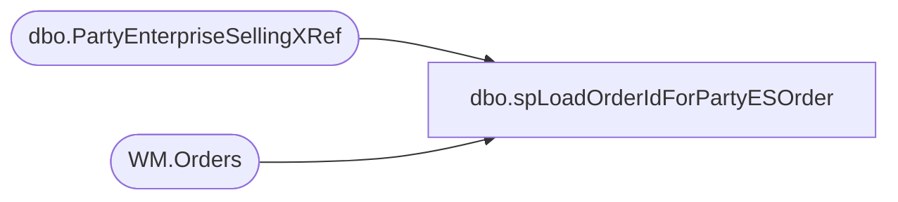

# dbo.spLoadOrderIdForPartyESOrder

**Database:** BABWPartyPlanner  
**Server:** bearcluster01  

## Architecture Diagram



## Table Dependencies

| Referenced Table |
|---|
| dbo.PartyEnterpriseSellingXRef |
| WM.Orders |

## Stored Procedure Code

```sql
CREATE PROCEDURE [dbo].[spLoadOrderIdForPartyESOrder]

AS
-- =============================================================================================================
-- Name: spLoadOrderIdForPartyESOrders 
--
-- Description:	This proc loads OrderId's for Party Request ES Orders
--
-- Output: 
--	
-- Dependencies: 
--
-- Revision History
--		Name:			Date:			Comments:
--		Ben Barud		12/13/2018		Initial Creation 
-- =============================================================================================================

BEGIN
	-- SET NOCOUNT ON added to prevent extra result sets from
	-- interfering with SELECT statements.
	SET NOCOUNT ON;

    WITH missingWebOrders
    AS
	(
	SELECT PartyID
		  ,EnterpriseSellingID
		  ,OrderId
	FROM BABWPartyPlanner.dbo.PartyEnterpriseSellingXRef
	WHERE OrderId IS NULL
	), webOrders
	AS
	(
	SELECT OrderId
		  ,EnterpriseSellingID
	FROM [WebOrderProcessing].[WM].[Orders]
	WHERE EnterpriseSellingID IN (SELECT EnterpriseSellingID FROM missingWebOrders)
	)

	UPDATE BABWPartyPlanner.dbo.PartyEnterpriseSellingXRef
	SET BABWPartyPlanner.dbo.PartyEnterpriseSellingXRef.OrderId = webOrders.OrderId
	FROM BABWPartyPlanner.dbo.PartyEnterpriseSellingXRef
	INNER JOIN webOrders ON BABWPartyPlanner.dbo.PartyEnterpriseSellingXRef.EnterpriseSellingID = webOrders.EnterpriseSellingID

END
```

