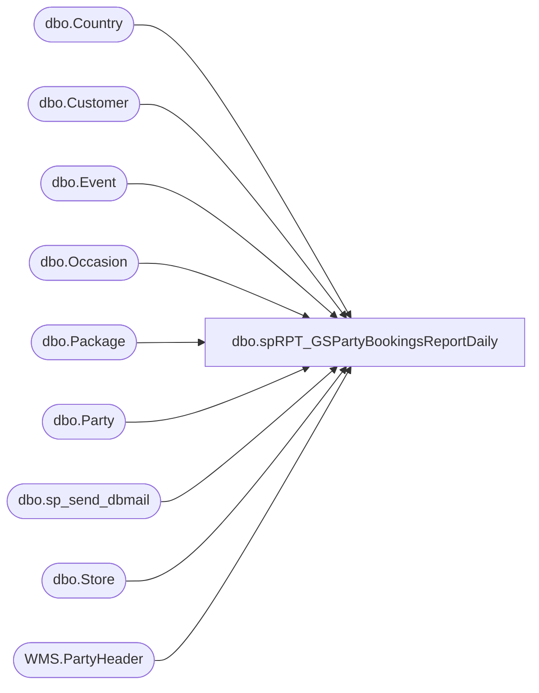

# dbo.spRPT_GSPartyBookingsReportDaily

**Database:** BABWPartyPlanner  
**Server:** bearcluster01  

## Architecture Diagram



## Table Dependencies

| Referenced Table |
|---|
| dbo.Country |
| dbo.Customer |
| dbo.Event |
| dbo.Occasion |
| dbo.Package |
| dbo.Party |
| dbo.sp_send_dbmail |
| dbo.Store |
| WMS.PartyHeader |

## Stored Procedure Code

```sql
CREATE PROC [dbo].[spRPT_GSPartyBookingsReportDaily]
-- =============================================================================================================
-- Name: [dbo].[spRPT_GSPartyBookingsReportDaily]
--
-- Description:	returns detail data for all parties booked the previous day with Girl Scouts occasions or packages chosen
--
-- Revision History
--		Name:			Date:			Comments:
--		TimB			3/8/2017		Initial Creation
--		LizzyT			7/29/2024		Updated report to include D365 TO numbers from [STL-SSIS-P-01].IntegrationStaging.WMS.PartyHeader;
--										Removed previous employees kevinpa@buildabear.com;sheelaa@buildabear.com; from the copy_recipients list
--
--
-- USAGE:  EXEC [dbo].[spRPT_GSPartyBookingsReportDaily] --@ac_recipients = 'lizzyt@buildabear.com'
-- =============================================================================================================

--@ac_recipients VARCHAR(255)

AS 
    SET NOCOUNT ON
    --SET ANSI_WARNINGS OFF 
    --SET ANSI_NULLS OFF
    SET ANSI_WARNINGS ON
    SET ANSI_NULLS ON


declare @html nvarchar(max),
		@head nvarchar(max),
		@tableHTML nvarchar(max),
		@GSPartiesHTML nvarchar(max),
		@Subject varchar(max)
declare @GSPartiesBooked TABLE(PartyLink XML, EventStart XML, StoreNumber XML, TotalGuests XML, CreatedBy XML, CreatedDate XML, OccasionName XML, PackageName XML, D365Order XML, EmailAddress varchar(256), CountryAbbr varchar(3))


----------------------------------------------------------------------------------------
--   Get my initial dataset (note I'm doing some HTML work in the cells here)
----------------------------------------------------------------------------------------
INSERT INTO @GSPartiesBooked
SELECT 
	   '<a href="https://www.buildabear.com/on/demandware.store/Sites-buildabear-us-Site/default/PartyAdmin-PrintDetail?partyId=' 
			+ CAST(p.PartyId as varchar(16)) 
			+ '">' 
			+ CAST(p.PartyId as varchar(16))
			+ '</a>'
	   as PartyLink,
	   	CASE
			WHEN c.CountryAbbr <> 'US' THEN '<span style="margin:5px;color:white;background-color:red">! ' + CAST(e.EventStart as varchar(30)) + ' !</span>'
			WHEN e.EventStart < DATEADD(day, 14, GETDATE()) THEN '<span style="margin:5px;background-color:yellow">| ' + CAST(e.EventStart as varchar(30)) + ' |</span>'
			ELSE CAST(e.EventStart as varchar(30))
	   END as EventStart,
	   CASE
			WHEN c.CountryAbbr <> 'US' THEN '<span style="margin:5px;color:white;background-color:red">! ' + CAST(s.StoreNumber as varchar(30)) + ' !</span>'
			WHEN e.EventStart < DATEADD(day, 14, GETDATE()) THEN '<span style="margin:5px;background-color:yellow">| ' + CAST(s.StoreNumber as varchar(30)) + ' |</span>'
			ELSE CAST(s.StoreNumber as varchar(30))
	   END as StoreNumber,
	   CASE
			WHEN c.CountryAbbr <> 'US' THEN '<span style="margin:5px;color:white;background-color:red">! ' + CAST(p.TotalGuests as varchar(30)) + ' !</span>'
			WHEN e.EventStart < DATEADD(day, 14, GETDATE()) THEN '<span style="margin:5px;background-color:yellow">| ' + CAST(p.TotalGuests as varchar(30)) + ' |</span>'
			ELSE CAST(p.TotalGuests as varchar(30))
	   END as TotalGuests,
	   CASE
			WHEN c.CountryAbbr <> 'US' THEN '<span style="margin:5px;color:white;background-color:red">! ' + CAST(e.CreatedBy as varchar(30)) + ' !</span>'
			WHEN e.EventStart < DATEADD(day, 14, GETDATE()) THEN '<span style="margin:5px;background-color:yellow">| ' + CAST(e.CreatedBy as varchar(30)) + ' |</span>'
			ELSE CAST(e.CreatedBy as varchar(30))
	   END as CreatedBy,
	   CASE
			WHEN c.CountryAbbr <> 'US' THEN '<span style="margin:5px;color:white;background-color:red">! ' + CAST(e.CreatedDate as varchar(30)) + ' !</span>'
			WHEN e.EventStart < DATEADD(day, 14, GETDATE()) THEN '<span style="margin:5px;background-color:yellow">| ' + CAST(e.CreatedDate as varchar(30)) + ' |</span>'
			ELSE CAST(e.CreatedDate as varchar(30))
	   END as CreatedDate,
	   CASE
			WHEN c.CountryAbbr <> 'US' THEN '<span style="margin:5px;color:white;background-color:red">! ' + CAST(o.OccasionName as varchar(30)) + ' !</span>'
			WHEN e.EventStart < DATEADD(day, 14, GETDATE()) THEN '<span style="margin:5px;background-color:yellow">| ' + CAST(o.OccasionName as varchar(30)) + ' |</span>'
			ELSE CAST(o.OccasionName as varchar(30))
	   END as OccasionName,
	   CASE
			WHEN c.CountryAbbr <> 'US' THEN '<span style="margin:5px;color:white;background-color:red">! ' + CAST(pa.PackageName as varchar(30)) + ' !</span>'
			WHEN e.EventStart < DATEADD(day, 14, GETDATE()) THEN '<span style="margin:5px;background-color:yellow">| ' + CAST(pa.PackageName as varchar(30)) + ' |</span>'
			ELSE CAST(pa.PackageName as varchar(30))
	   END as PackageName,   
	   CASE
			WHEN c.CountryAbbr <> 'US' THEN '<span style="margin:5px;color:white;background-color:red">! ' + CAST(ph.OrderID as varchar(30)) + ' !</span>'
			WHEN e.EventStart < DATEADD(day, 14, GETDATE()) THEN '<span style="margin:5px;background-color:yellow">| ' + CAST(ph.OrderID as varchar(30)) + ' |</span>'
			ELSE CAST(ph.OrderID as varchar(30))
	   END as D365Order,
	   cu.EmailAddress,
	   c.CountryAbbr
FROM Party p
LEFT JOIN Event e
	ON p.EventID = e.EventID
LEFT JOIN Occasion o
	ON p.OccasionID = o.OccasionID
LEFT JOIN Package pa
	ON p.PackageID = pa.PackageID
LEFT JOIN Store s
	ON e.StoreID = s.StoreID
LEFT JOIN Country c
	ON s.CountryID = c.CountryID
LEFT JOIN Customer cu
	ON p.CustomerID = cu.CustomerID
LEFT JOIN [STL-SSIS-P-01].IntegrationStaging.WMS.PartyHeader ph
	ON p.PartyId = ph.PartyId
WHERE CAST(e.CreatedDate as Date) = CAST(DATEADD(day, -1, GETDATE()) as Date)
AND (p.PackageID = 77 -- Girlscout themed party 
		OR p.OccasionID IN (110,111,112,113,114) -- All Girl scouts occasions)
	)

----------------------------------------------------------------------------------------
--   Setting the Subject, the opening tags for the full html, and the heading
----------------------------------------------------------------------------------------

set @Subject = 'Daily Girl Scout Parties for ' + CONVERT(VARCHAR,DATEADD(day, -1, GETDATE()), 101)

set @html = '<html><style>h3{margin-bottom:0px; font-family:Calibri;}div{margin-left:50px; font-family:Calibri;}</style>'

set @head = '<head><style>' +
	'td {border: solid black 1px;padding-left:5px;padding-right:5px;padding-top:1px;padding-bottom:1px;font-size:11pt;} td span {padding:5px;}' +
	'</style></head><body>' +
	'<div style="margin-top:20px; margin-left:5px; margin-bottom:15px; font-weight:bold; font-size:1.3em; font-family:calibri;">Daily Girl Scout Parties for ' + CONVERT(VARCHAR,DATEADD(day, -1, GETDATE()), 101) + '</div>'


----------------------------------------------------------------------------------------
--   Party Bookings HTML Table
----------------------------------------------------------------------------------------
set @GSPartiesHTML = '<div><h3>Party Counts</h3>Girl Scout Themed Parties Booked</div><div><table cellpadding=0 cellspacing=0 border=0>' +
	'<tr bgcolor=#4b6c9e>' +
	'<td align=center><font face="calibri" color=White><b>Party Link</b></font></td>' +    -- Manually type headers
	'<td align=center><font face="calibri" color=White><b>Event Start</b></font></td>' +    -- Manually type headers
	'<td align=center><font face="calibri" color=White><b>Store Number</b></font></td>' +    -- Manually type headers
	'<td align=center><font face="calibri" color=White><b>Total Guests</b></font></td>' +    -- Manually type headers
	'<td align=center><font face="calibri" color=White><b>Created By</b></font></td>' +    -- Manually type headers
	'<td align=center><font face="calibri" color=White><b>Created Date</b></font></td>' +    -- Manually type headers
	'<td align=center><font face="calibri" color=White><b>Occasion name</b></font></td>' +   -- Manually type headers
	'<td align=center><font face="calibri" color=White><b>Package name</b></font></td>'  +   -- Manually type headers
	'<td align=center><font face="calibri" color=White><b>D365 Order Id</b></font></td>'     -- Manually type headers

----------------------------------------------------------------------------------------
--   Assembling the body HTML
----------------------------------------------------------------------------------------
declare @body varchar(max)
select @body =
(
	select  td = PartyLink,     -- Here we put the column names
			td = EventStart,
			td = StoreNumber,
			td = TotalGuests,
			td = CreatedBy,
			td = CreatedDate, 
			td = OccasionName,
			td = PackageName,
			td = D365Order

	FROM @GSPartiesBooked
	for XML raw('tr'), elements
)

set @body = REPLACE(@body, '<td>', '<td align=center><font face="calibri">')
set @body = REPLACE(@body, '</td>', '</font></td>')
set @body = REPLACE(@body, '_x0020_', space(1))
set @body = REPLACE(@body, '_x003D_', '=')
set @body = REPLACE(@body, '<tr><TRRow>0</TRRow>', '<tr bgcolor=#F8F8FD>')
set @body = REPLACE(@body, '<tr><TRRow>1</TRRow>', '<tr bgcolor=#EEEEF4>')
set @body = REPLACE(@body, '<TRRow>0</TRRow>', '')


----------------------------------------------------------------------------------------
--   Combine the Party HTML Table with the Body
----------------------------------------------------------------------------------------
SET @GSPartiesHTML = @GSPartiesHTML + @body + '</table></div><BR>'

----------------------------------------------------------------------------------------
--   We need a list of email addresses for easy copy/paste action
----------------------------------------------------------------------------------------
DECLARE @listStr VARCHAR(MAX)
SELECT @listStr = CAST(COALESCE(@listStr + ';' , '') as varchar(MAX)) + EmailAddress
from @GSPartiesBooked
where CountryAbbr = 'US'

SET @listStr = '<a href="mailto:Guest.Services@buildabear.com?bcc=' + @listStr + '">Send Email</a>'

----------------------------------------------------------------------------------------
--   Put EVERYTHING together
----------------------------------------------------------------------------------------
set @html = @html + @head + ISNULL(@GSPartiesHTML,'') + 

'<BR><BR><h3>Link for Sending Email To All Guests</h3>' + @listStr + '</html>'
set @html = '<div style="color:Black; font-size:11pt; font-family:Calibri; width:100px;">' + @html + '</div>'

----------------------------------------------------------------------------------------
--   Send the email
----------------------------------------------------------------------------------------

exec msdb.dbo.sp_send_dbmail
	@profile_name = 'BIAdmin',
	@recipients = 'AnnieS@buildabear.com;ValerieC@buildabear.com;AmyS@buildabear.com;seanw@buildabear.com;Kaseyp@buildabear.com;yoshikon@buildabear.com;williamd@buildabear.com', --@ac_recipients,
	@copy_recipients = 'biadmin@buildabear.com;paigel@buildabear.com;juliah@buildabear.com',
	@body = @html,
	@subject = @Subject,
	@body_format = 'HTML'
```

