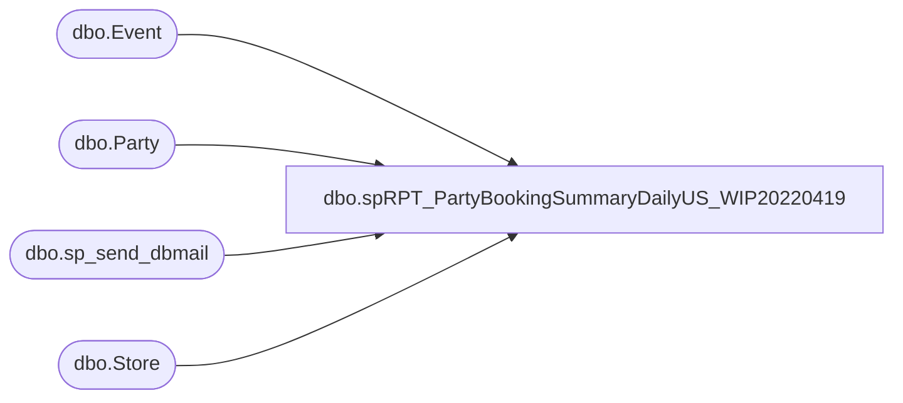

# dbo.spRPT_PartyBookingSummaryDailyUS_WIP20220419

**Database:** BABWPartyPlanner  
**Server:** bearcluster01  

## Architecture Diagram



## Table Dependencies

| Referenced Table |
|---|
| dbo.Event |
| dbo.Party |
| dbo.sp_send_dbmail |
| dbo.Store |

## Stored Procedure Code

```sql
CREATE PROC [dbo].[spRPT_PartyBookingSummaryDailyUS_WIP20220419]
-- =============================================================================================================
-- Name: [dbo].[spRPT_PartyBookingSummaryDailyUS]
--
-- Description:	returns detail data for US parties booked the previous day as well as a break out of BSRs
--
-- Revision History
--		Name:			Date:			Comments:
--		JustinD			3/26/2014		Created
--		JustinD			4/16/2014		Adjusted to look at all countries instead of only US
--		JustinD			4/23/2014		Added section to list parties ids booked by BSR
--		JustinD			11/4/2014		Changed order by for count of parties booked by BSR from count to name
--		TimB			10/3/2017		Migrated to new Party Database and ported code to new schema
--		TimB			11/10/2017		Complete rewrite to improve the tablular display of the numbers
--		Dan T			2022-04-20		Added totals to first 2 tables
--
-- USAGE:  EXEC [dbo].[spRPT_PartyBookingSummaryDailyUS] @ac_recipients = 'timb@buildabear.com'
-- =============================================================================================================

@ac_recipients VARCHAR(255)

AS 
    SET NOCOUNT ON
    SET ANSI_WARNINGS OFF 
    SET ANSI_NULLS OFF


declare @html nvarchar(max),
		@head nvarchar(max),
		@tableHTML nvarchar(max),
		@TotalstableHTML nvarchar(max),
		@BSRtableHTML nvarchar(max),
		@BSRDetailtableHTML nvarchar(max),
		@Subject varchar(max),
		@HibernationsHTML nvarchar(max)
declare @PartiesBooked TABLE(BookingMethod varchar(3), EventID int, PartyID int, CreatedBy varchar(50))
declare @Hibernations TABLE(EventDate date, EventStart time, EventEnd time, CreatedDate date, CreatedBy varchar(128), StoreID int)

--new 'total' versions
declare @PartiesBookedTotal TABLE(BookingMethod varchar(5), PartyCount int, SortOrder int)
declare @PartiesBookedBSRTotal TABLE(CreatedBy varchar(100), PartyCount int, SortOrder int)

INSERT INTO @Hibernations
	SELECT 
	   CAST([EventStart] AS date) AS EventDate
      ,CAST([EventStart] AS time) AS EvenStart
      ,CAST([EventEnd] AS time) AS EventEnd
      ,CAST([CreatedDate] AS date) AS CreatedDate
      ,UPPER(REPLACE (REPLACE(e.CreatedBy,'@buildabear.com',''), 'BAB\', '')) as CreatedBy
      ,e.[StoreID]
	FROM    BABWPartyPlanner.dbo.Event e WITH ( NOLOCK )
	LEFT JOIN Store s WITH (NOLOCK) ON e.StoreID = s.StoreID
	WHERE   e.CreatedDate BETWEEN CONVERT(VARCHAR,DATEADD(day, -1, GETDATE()), 101)
              AND CAST(CONVERT(CHAR(10), GETDATE(), 101) + ' 00:00:00' AS DATETIME)
              AND s.CountryID IN (1,2) --US an CANADA
              AND e.EventType = 0
			  AND DATEDIFF (hour, [EventStart], [EventEnd]) <= 2
			  


INSERT INTO @PartiesBooked
	SELECT CASE WHEN e.CreatedBy = 'guest' THEN 'WEB'
				WHEN e.CreatedBy LIKE 'store%' THEN 'POS'
			ELSE 'BSR'
			END AS BookingMethod,
			e.[EventID],
			p.PartyID,
			UPPER(REPLACE (REPLACE(e.CreatedBy,'@buildabear.com',''), 'BAB\', '')) as CreatedBy
		
	FROM    BABWPartyPlanner.dbo.Event e WITH ( NOLOCK )
	INNER JOIN BABWPartyPlanner.dbo.Party p WITH ( NOLOCK ) ON e.EventID = p.EventID
	LEFT JOIN Store s WITH (NOLOCK) ON e.StoreID = s.StoreID
	WHERE   e.CreatedDate BETWEEN CONVERT(VARCHAR,DATEADD(day, -1, GETDATE()), 101)
			AND CAST(CONVERT(CHAR(10), GETDATE(), 101) + ' 00:00:00' AS DATETIME)
			AND p.PartyStateID <> 2
			AND s.CountryID IN (1,2) --US an CANADA


INSERT INTO @PartiesBookedTotal
	select 
		BookingMethod,     
		COUNT(EventID) PartyCount,
		0 as SortOrder
	FROM @PartiesBooked
	GROUP BY BookingMethod
	UNION
	select 
		'TOTAL',     
		COUNT(EventID) PartyCount,
		1 as SortOrder
	FROM @PartiesBooked


INSERT INTO @PartiesBookedBSRTotal
	select
		CreatedBy,
		COUNT(EventID) PartyCount,
		0 as SortOrder
	FROM @PartiesBooked
	WHERE BookingMethod = 'BSR'
	GROUP BY CreatedBy
	UNION
	select
		'TOTAL',
		COUNT(EventID) PartyCount,
		1 as SortOrder
	FROM @PartiesBooked
	WHERE BookingMethod = 'BSR'


set @Subject = 'Daily US Party Summary for ' + CONVERT(VARCHAR,DATEADD(day, -1, GETDATE()), 101)

set @html = '<html><style>h3{margin-bottom:0px; font-family:Calibri;}div{margin-left:50px; font-family:Calibri;}</style>'

set @head = '<head><style>' +
	'td {border: solid black 1px;padding-left:5px;padding-right:5px;padding-top:1px;padding-bottom:1px;font-size:11pt;} ' +
	'</style></head><body>' +
	'<div style="margin-top:20px; margin-left:5px; margin-bottom:15px; font-weight:bold; font-size:1.3em; font-family:calibri;">Daily US Party Summary for ' + CONVERT(VARCHAR,DATEADD(day, -1, GETDATE()), 101) + '</div>'


----------------------------------------------------------------------------------------
--   Party Totals By BookingMethod
----------------------------------------------------------------------------------------
set @TotalstableHTML = '<div><h3>Party Counts</h3>Total parties booked by method.</div><div><table cellpadding=0 cellspacing=0 border=0>' +
	'<tr bgcolor=#4b6c9e>' +
	'<td align=center><font face="calibri" color=White><b>Booking Method</b></font></td>' +    -- Manually type headers
	'<td align=center><font face="calibri" color=White><b>Parties Booked</b></font></td>'     -- Manually type headers

declare @body varchar(max)
select @body =
(
	select  td = BookingMethod,     
			td = PartyCount
	FROM @PartiesBookedTotal
	ORDER BY SortOrder, BookingMethod
	for XML raw('tr'), elements
)
set @body = REPLACE(@body, '<td>', '<td align=center><font face="calibri">')
set @body = REPLACE(@body, '</td>', '</font></td>')
set @body = REPLACE(@body, '_x0020_', space(1))
set @body = REPLACE(@body, '_x003D_', '=')
set @body = REPLACE(@body, '<tr><TRRow>0</TRRow>', '<tr bgcolor=#F8F8FD>')
set @body = REPLACE(@body, '<tr><TRRow>1</TRRow>', '<tr bgcolor=#EEEEF4>')
set @body = REPLACE(@body, '<TRRow>0</TRRow>', '')

SET @TotalstableHTML = @TotalstableHTML + @body + '</table></div><BR>'


----------------------------------------------------------------------------------------
--   Party Totals By BSR
----------------------------------------------------------------------------------------

set @BSRtableHTML = '<div><h3>BSR Parties Booked Summary</h3>Total parties booked by BSR name.</div><div><table cellpadding=0 cellspacing=0 border=0>' +
	'<tr bgcolor=#4b6c9e>' +
	'<td align=center><font face="calibri" color=White><b>BSR Name</b></font></td>' +    -- Manually type headers
	'<td align=center><font face="calibri" color=White><b>Parties Booked</b></font></td>'     -- Manually type headers

select @body =
(
	select  td = CreatedBy,     
			td = PartyCount
	FROM @PartiesBookedBSRTotal
	order by SortOrder, CreatedBy
	for XML raw('tr'), elements
)
set @body = REPLACE(@body, '<td>', '<td align=center><font face="calibri">')
set @body = REPLACE(@body, '</td>', '</font></td>')
set @body = REPLACE(@body, '_x0020_', space(1))
set @body = Replace(@body, '_x003D_', '=')
set @body = Replace(@body, '<tr><TRRow>0</TRRow>', '<tr bgcolor=#F8F8FD>')
set @body = Replace(@body, '<tr><TRRow>1</TRRow>', '<tr bgcolor=#EEEEF4>')
set @body = Replace(@body, '<TRRow>0</TRRow>', '')

SET @BSRtableHTML = @BSRtableHTML + @body + '</table></div><BR>'


----------------------------------------------------------------------------------------
--   Party Details By BSR
----------------------------------------------------------------------------------------

set @BSRDetailtableHTML = '<div><h3>BSR Parties Booked Details</h3>Party number for each party booked by BSR.</div><div><table cellpadding=0 cellspacing=0 border=0>' +
	'<tr bgcolor=#4b6c9e>' +
	'<td align=center><font face="calibri" color=White><b>BSR Name</b></font></td>' +    -- Manually type headers
	'<td align=center><font face="calibri" color=White><b>Party Number</b></font></td>'     -- Manually type headers

select @body =
(
	select  td = CreatedBy,     -- Here we put the column names
			td = PartyID

	FROM @PartiesBooked
	WHERE BookingMethod = 'BSR'
	for XML raw('tr'), elements
)
set @body = REPLACE(@body, '<td>', '<td align=center><font face="calibri">')
set @body = REPLACE(@body, '</td>', '</font></td>')
set @body = REPLACE(@body, '_x0020_', space(1))
set @body = Replace(@body, '_x003D_', '=')
set @body = Replace(@body, '<tr><TRRow>0</TRRow>', '<tr bgcolor=#F8F8FD>')
set @body = Replace(@body, '<tr><TRRow>1</TRRow>', '<tr bgcolor=#EEEEF4>')
set @body = Replace(@body, '<TRRow>0</TRRow>', '')

SET @BSRDetailtableHTML = @BSRDetailtableHTML + @body + '</table></div><BR>'

----------------------------------------------------------------------------------------
--   Party Hibernations
----------------------------------------------------------------------------------------
set @HibernationsHTML = '<div><h3>Hibernations</h3>Hibernations less than or equal to 2 hours by BSR name.</div><div><table cellpadding=0 cellspacing=0 border=0>' +
	'<tr bgcolor=#4b6c9e>' +
	'<td align=center><font face="calibri" color=White><b>Event Date</b></font></td>' +			 -- Manually type headers
	'<td align=center><font face="calibri" color=White><b>Event Start Time</b></font></td>' +    -- Manually type headers
	'<td align=center><font face="calibri" color=White><b>Event End Time</b></font></td>' +      -- Manually type headers
	'<td align=center><font face="calibri" color=White><b>Created Date</b></font></td>' +		 -- Manually type headers
	'<td align=center><font face="calibri" color=White><b>Created By</b></font></td>' +			 -- Manually type headers
	'<td align=center><font face="calibri" color=White><b>Store ID</b></font></td>'         	 -- Manually type headers

select @body =
(
	select  td = EventDate,
			td = EventStart,     -- Here we put the column names
			td = EventEnd,
			td = CreatedDate,
			td = CreatedBy,
			td = StoreID
	FROM @Hibernations
	for XML raw('tr'), elements
)
set @body = REPLACE(@body, '<td>', '<td align=center><font face="calibri">')
set @body = REPLACE(@body, '</td>', '</font></td>')
set @body = REPLACE(@body, '_x0020_', space(1))
set @body = Replace(@body, '_x003D_', '=')
set @body = Replace(@body, '<tr><TRRow>0</TRRow>', '<tr bgcolor=#F8F8FD>')
set @body = Replace(@body, '<tr><TRRow>1</TRRow>', '<tr bgcolor=#EEEEF4>')
set @body = Replace(@body, '<TRRow>0</TRRow>', '')

SET @HibernationsHTML = @HibernationsHTML + @body + '</table></div>'
----------------------------------------------------------------------------------------
--   Tie it all together
----------------------------------------------------------------------------------------
set @html = @html + @head + ISNULL(@TotalstableHTML,'') + ISNULL(@BSRtableHTML,'') + ISNULL(@BSRDetailtableHTML,'') + ISNULL(@HibernationsHTML,'') + '</html>'
set @html = '<div style="color:Black; font-size:11pt; font-family:Calibri; width:100px;">' + @html + '</div>'


--SELECT CAST(@html as varchar(8000)) as result


exec msdb.dbo.sp_send_dbmail
	@profile_name = 'BIAdmin',
	@recipients = @ac_recipients,
	@body = @html,
	@subject = @Subject,
	@body_format = 'HTML'


dbo,spRPT_PartyBookingWeeklySummary,--CREATE PROCEDURE [dbo].[spRPT_PartyBookingWeeklySummary]
CREATE PROC [dbo].[spRPT_PartyBookingWeeklySummary]
/* =============================================================================================================
 Name: [spRPT_PartyBookingWeeklySummary]

 Description:	returns detail data for web sales based on site code

 Input:		@ac_date		varchar(20)		date to pull web sales
				@ac_sitecode	varchar(25)		'BABW_US','BABW_UK','BABW_CA'
				@ac_recipients  varchar(25)		email recipients
				@abit_mtd		bit				if 0, then only pull daily sales; if 1, pull month to date sales
				exec [dbo].[spRPT_PartyBookingWeeklySummary] 'BABW_US','lizzyt@buildabear.com'

 Output: 


 Revision History
		Name:			Date:			Comments:
		Lizzy Timm	    02/21/2018		Created
=============================================================================================================*/
	@ac_sitecode VARCHAR(25),
	@ac_recipients VARCHAR(255)
AS 
    SET NOCOUNT ON
----------------------------------------------------------------------------------------
/* ===== DECLARATIONS ===== */
----------------------------------------------------------------------------------------
DECLARE
	@Today DATE,
	@TodayLY DATE,
	@Yesterday DATE,
	@YesterdayLY DATE,
	@ThisYear INT,
	@LastYear INT,
	@FiscalYear INT,
	@FiscalYearLY INT,
	@FiscalWeek INT,
	@Week_Begin DATE,
	@Week_BeginLY DATE,
	@Week_End DATE,
	@Week_EndLY DATE,
	@DayOfYear INT,
	@PartyCount INT,
	@PartyCountLY INT,
	@countrycode varchar(4),
    @EmailSubject VARCHAR(100),
	@html nvarchar(max),
	@head nvarchar(max),
	@header nvarchar(max),
	@tableHTML nvarchar(max),
	@methodTableHTML nvarchar(max),
	@body varchar(max),
	@totalTableHTML nvarchar(max),
	@totalBody varchar(max)
DECLARE @TotalParties TABLE (TY int, LY int, diff varchar(8))
SET @Today = ( CAST(getdate() AS DATE) )
SET @TodayLY = (DATEADD(Year,-1,@Today))
SET @Yesterday = (DATEADD(Day,-1,@Today))
SET @YesterdayLY = (DATEADD(Year,-1,@Yesterday))
SET @ThisYear = CONVERT(INT, YEAR(GETDATE()))
SET @LastYear = CONVERT(INT, YEAR(DATEADD(YEAR,-1,GETDATE())))
SET @FiscalYear = (
	SELECT DISTINCT fiscal_year
	FROM papamart.dw.dbo.date_dim 
	--Subtract a week to ensure it is last year
	WHERE actual_date = DATEADD(week,-1,@Today)
)
SET @FiscalYearLY = (
	SELECT DISTINCT fiscal_year
	FROM papamart.dw.dbo.date_dim 
	--Subtract a week to ensure it is year before last
	WHERE actual_date = DATEADD(week,-1,@TodayLY)
)
SET @FiscalWeek = (
	SELECT DISTINCT fiscal_week
	FROM papamart.dw.dbo.date_dim 
	WHERE actual_date = DATEADD(week,-1,@Today)
)
SET @Week_Begin = (
	SELECT MIN (actual_date)
	FROM papamart.dw.dbo.date_dim 
	WHERE fiscal_year = @FiscalYear
	AND fiscal_week = @FiscalWeek
)
SET @Week_BeginLY = (
	SELECT MIN (actual_date)
	FROM papamart.dw.dbo.date_dim 
	WHERE fiscal_year = @FiscalYearLY
	AND fiscal_week = @FiscalWeek
)
SET @Week_End = (
	SELECT MAX (actual_date)
    FROM papamart.dw.dbo.date_dim 
    WHERE fiscal_year = @FiscalYear
    AND fiscal_week = @FiscalWeek
)
SET @Week_EndLY = (
	SELECT MAX (actual_date)
	FROM papamart.dw.dbo.date_dim 
	WHERE fiscal_year = @FiscalYearLY
	AND fiscal_week = @FiscalWeek
)
SET @DayOfYear = CONVERT(INT,(
	SELECT DISTINCT day_of_year
	FROM papamart.dw.dbo.date_dim 
	WHERE actual_date = ( CAST(DATEADD(DAY,-1,getdate())AS DATE) )
))
----------------------------------------------------------------------------------------
/*======Set Country=========*/
----------------------------------------------------------------------------------------
IF @ac_sitecode IN ('BABW_US', 'BABW_UK', 'BABW_CA')
BEGIN	
	IF @ac_sitecode = 'babw_us'
	BEGIN
		SET @countrycode = 'US'
	END

	IF @ac_sitecode = 'babw_uk'
	BEGIN
		SET @countrycode = 'UK'
	END

	IF @ac_sitecode = 'babw_ca'
	BEGIN
		SET @countrycode = 'CA'
	END
END
----------------------------------------------------------------------------------------
/*======Create Master Data Set=========*/
----------------------------------------------------------------------------------------
IF OBJECT_ID('tempdb..##PartiesBooked') IS NOT NULL DROP TABLE ##PartiesBooked
SELECT CASE WHEN e.CreatedBy = 'guest' THEN 'WEB'
		WHEN e.CreatedBy LIKE 'store%' THEN 'POS'
		ELSE 'BSR'
		END AS BookingMethod,
		e.eventid,
		CAST(e.CreatedDate AS DATE) AS CreatedDate,
		co.CountryAbbr
INTO ##PartiesBooked
FROM    BABWPartyPlanner.dbo.Event e WITH ( NOLOCK )
INNER JOIN BABWPartyPlanner.dbo.Party p WITH ( NOLOCK ) 
    ON e.EventID = p.EventID AND p.PartyStateID <>  2
INNER JOIN BABWPartyPlanner.dbo.Store s WITH ( NOLOCK ) 
    ON e.StoreID = s.StoreID
LEFT JOIN BABWPartyPlanner.dbo.Country co WITH (NOLOCK) 
    ON s.CountryID = co.CountryID
WHERE   e.EventType = 1
    AND e.Active = 1
    AND co.CountryAbbr = @countrycode
--This Year
IF OBJECT_ID('tempdb..##WMasterDatasetTY') IS NOT NULL DROP TABLE ##WMasterDatasetTY
SELECT  BookingMethod,
        COUNT(EventID) as PartiesBooked,
        CreatedDate,
        CountryAbbr,
        dd.fiscal_year,
        dd.fiscal_period,
        dd.fiscal_quarter,
        dd.fiscal_week,
        dd.month,
        dd.day_of_year
INTO ##WMasterDatasetTY
FROM ##PartiesBooked pb
LEFT JOIN papamart.dw.dbo.date_dim dd WITH (NOLOCK) 
    ON CAST(pb.CreatedDate AS DATE) = CAST(dd.actual_date AS DATE)
WHERE dd.fiscal_year = @ThisYear
GROUP BY BookingMethod, CreatedDate, CountryAbbr, dd.fiscal_year, dd.fiscal_period, dd.fiscal_quarter, dd.fiscal_week, dd.month, dd.day_of_year
--Last Year
IF OBJECT_ID('tempdb..##WMasterDatasetLY') IS NOT NULL DROP TABLE ##WMasterDatasetLY
SELECT  BookingMethod,
        COUNT(EventID) as PartiesBooked,
        CreatedDate,
        CountryAbbr,
        dd.fiscal_year,
        dd.fiscal_period,
        dd.fiscal_quarter,
        dd.fiscal_week,
        dd.month,
        dd.day_of_year
INTO ##WMasterDatasetLY
FROM ##PartiesBooked pb
LEFT JOIN papamart.dw.dbo.date_dim dd WITH (NOLOCK) 
    ON CAST(pb.CreatedDate AS DATE) = CAST(dd.actual_date AS DATE)
WHERE dd.fiscal_year = @LastYear
GROUP BY BookingMethod, CreatedDate, CountryAbbr, dd.fiscal_year, dd.fiscal_period, dd.fiscal_quarter, dd.fiscal_week, dd.month, dd.day_of_year
----------------------------------------------------------------------------------------
/*======Set HTML=========*/
----------------------------------------------------------------------------------------
set @html = '<html>'

set @head = '<head><style>'
			+ 'h3{margin-bottom:0px; font-family:Calibri;}'
			+ 'h2{margin-top:10px; margin-left:5px; margin-bottom:15px; font-weight:bold; font-size:1.3em; font-family:calibri;}'
			+ 'div{margin-left:50px; font-family:Calibri;}'
			+ 'td {border-collapse: collapse;border: solid black 1px;padding-left:5px;padding-right:5px;padding-top:1px;padding-bottom:1px;font-size:11pt;}'
			+ 'table {cellpadding:0; cellspacing:0; border:0; width:50%}'
			+ 'table.totals {cellpadding:0; cellspacing:0; border:0; width:25%}'
			+ 'th {background-color:#4b6c9e;border-collapse: collapse;border: solid black 1px; color: white; text-align:center; font-weight:bold;}'
			+ 'th.BookM{width: 25%;}'
			+ 'tr {background-color:#FFF;}'
			+ 'footer {margin-left:50px;}'
			+ '</style></head><body>'
----------------------------------------------------------------------------------------
/*=======Set Subject, Heading, and Tables Based on @abit_wtd ========*/
----------------------------------------------------------------------------------------
--Email Subject	
-------Set Part Counts for Email Subject
SET @PartyCount = (
	SELECT SUM(ISNULL(PartiesBooked, 0))
	FROM ##WMasterDatasetTY
	WHERE CreatedDate BETWEEN @Week_Begin AND @Week_End
)
SET @PartyCountLY = (
	SELECT SUM(ISNULL(PartiesBooked, 0)) 
	FROM ##WMasterDatasetLY
	WHERE CreatedDate BETWEEN @Week_BeginLY AND @Week_EndLY
)
-------Set Email Subect Text
SET @EmailSubject = ( 
	SELECT 'Fiscal Week ' + CAST(@FiscalWeek AS VARCHAR) + ': ' + @countrycode + ' Parties / ' 
	        + CAST(@PartyCount AS VARCHAR) 
            + ' TY Parties / '
            + CAST(@PartyCountLY AS VARCHAR) 
            + ' LY Parties'
)
-------Heading
SET @header = '<div><h2>' 
		+ CAST(@countrycode AS VARCHAR) + ', ' 
		+ 'Fiscal Week ' + CAST(@FiscalWeek AS VARCHAR) 
		+ '<br/>' 
		+ 'LY from ' + CAST(@Week_Begin AS VARCHAR) + ' to ' + CAST(@Week_End AS VARCHAR) 
		+ '<br/>' 
		+ 'TY from ' + CAST(@Week_BeginLY AS VARCHAR) + ' to ' + CAST(@Week_EndLY AS VARCHAR)
		+ '</h2></div>'
--Table (By Booking Method) 
-------Table Structure
SET @methodTableHTML = '<div><h3>Party Counts by Method</h3></div><div><table>' +
	'<tr>' +
	'<th class="bookM">Booking Method</th>' + 
	'<th>TY</th>' +
	'<th>LY</th>' +
	'<th>Diff</th>' 
-------Select Data for Table
SELECT @body =
(
	SELECT td= ISNULL(ty.BookingMethod, ly.BookingMethod),
			td = SUM(ISNULL(ty.PartiesBooked, 0)),
			td = SUM(ISNULL(ly.PartiesBooked, 0)),
			td = STR((cast(SUM(ISNULL(ty.PartiesBooked, 0)) as decimal) - cast(SUM(ISNULL(ly.PartiesBooked, 0)) as decimal)) / cast(SUM(ISNULL(ly.PartiesBooked, 1)) as decimal) * 100.00, 6, 1) + '%'
	FROM ##WMasterDatasetTY ty
	FULL OUTER JOIN ##WMasterDatasetLY ly
	ON ty.day_of_year = ly.day_of_year 
		AND ty.BookingMethod = ly.BookingMethod
		AND ty.CountryAbbr = ly.CountryAbbr
					WHERE ty.CreatedDate BETWEEN @Week_Begin AND @Week_End									   
	GROUP BY ly.BookingMethod, ty.BookingMethod
	ORDER BY ty.BookingMethod
	for XML raw('tr'), elements
)
-------Assign Data to Table Structure
SET @body = REPLACE(@body, '<td>', '<td align=center><font face="calibri">')
SET @body = REPLACE(@body, '</td>', '</font></td>')
SET @body = REPLACE(@body, '_x0020_', space(1))
SET @body = REPLACE(@body, '_x003D_', '=')
SET @body = REPLACE(@body, '<tr><TRRow>0</TRRow>', '<tr>')
SET @body = REPLACE(@body, '<tr><TRRow>1</TRRow>', '<tr>')
SET @body = REPLACE(@body, '<TRRow>0</TRRow>', '')
SET @methodTableHTML = @methodTableHTML + @body + '</table></div><BR/>'	
--Table (Totals)
-------Table Structure
SET @totalTableHTML = '<div><h3>Total Party Counts</h3></div><div><table class=totals>' +
		'<tr bgcolor=##4b6c9e>' + 
		'<th>TY</th>' +
		'<th>LY</th>' +
		'<th>Diff</th>' 
-------Select Data for Table
SELECT @totalBody = (
	SELECT  td = @PartyCount,
        td = @PartyCountLY,
        td = STR((cast(@PartyCount as decimal) - cast(@PartyCountLY as decimal)) / cast(@PartyCountLY as decimal) * 100.00, 6, 1) + '%'
	for XML raw('tr'), elements
)
-------Assign Data to Table Structure
SET @totalBody = REPLACE(@totalBody, '<td>', '<td align=center><font face="calibri">')
SET @totalBody = REPLACE(@totalBody, '</td>', '</font></td>')
SET @totalBody = REPLACE(@totalBody, '_x0020_', space(1))
SET @totalBody = REPLACE(@totalBody, '_x003D_', '=')
SET @totalBody = REPLACE(@totalBody, '<tr><TRRow>0</TRRow>', '<tr>')
SET @totalBody = REPLACE(@totalBody, '<tr><TRRow>1</TRRow>', '<tr>')
SET @totalBody = REPLACE(@totalBody, '<TRRow>0</TRRow>', '')
SET @totalTableHTML = @totalTableHTML + @totalBody + '</table></div><BR/>'	
--END
----------------------------------------------------------------------------------------
/*=======Close Tags and Bring Together========*/
----------------------------------------------------------------------------------------
SET @html = @html 
	+ @head
	+ @header 
	+ ISNULL(@methodTableHTML,'') 
	+ ISNULL(@totalTableHTML,'') 
	+ '</body><footer>Please notify webteam@buildabear.com with questions or comments on this report. stored procedure BABWPartyPlanner.dbo.spRPT_PartyBookingWeeklySummary.</footer></html>'
SET @html = '<div style="color:Black; font-size:11pt; font-family:Calibri; width:100px;">' 
	+ @html 
	+ '</div>'
--SELECT CAST(@html as varchar(8000)) as result
EXEC msdb.dbo.sp_send_dbmail
 @profile_name = 'BIAdmin',
	@recipients=@ac_recipients,
	@subject = @EmailSubject,
	@body = @html,
	@body_format = 'HTML'
dbo,spRPT_PartyGCBalancingReport,CREATE PROC [dbo].[spRPT_PartyGCBalancingReport]
-- =============================================================================================================
-- Name: [dbo].[spRPT_PartyGCBalancingReport]
--
-- Description:	returns detail data for US parties booked the previous day as well as a break out of BSRs
--
-- Revision History
--		Name:			Date:			Comments:
--		TimB			2/14/2018		Initial deployment
--
--
-- USAGE:  EXEC [dbo].[spRPT_PartyGCBalancingReport] @ac_recipients = 'timb@buildabear.com'
-- =============================================================================================================

@ac_recipients VARCHAR(255)

AS 

IF OBJECT_ID('tempdb..##RawPartyData') IS NOT NULL DROP TABLE ##RawPartyData
IF OBJECT_ID('tempdb..##BalancingStatus') IS NOT NULL DROP TABLE ##BalancingStatus
IF OBJECT_ID('tempdb..##PartiesWhatsWrong') IS NOT NULL DROP TABLE ##PartiesWhatsWrong
IF OBJECT_ID('tempdb..##GiftcardsWhatsWrong') IS NOT NULL DROP TABLE ##GiftcardsWhatsWrong
IF OBJECT_ID('tempdb..##MissingItems') IS NOT NULL DROP TABLE ##MissingItems


declare @html nvarchar(max),
		@head nvarchar(max),
		@tableHTML nvarchar(max),
		@BalancingTableHTML nvarchar(max),
		@MissingPartiesHTML nvarchar(max),
		@MissingGiftcardsHTML nvarchar(max),
		@Subject varchar(max)


set @Subject = 'Weekly Party Balancing Report for Past 7 Days'

set @html = '<html><style>h3{margin-bottom:0px; font-family:Calibri;}div{margin-left:50px; font-family:Calibri;}</style>'

set @head = '<head><style>' +
	'td {border: solid black 1px;padding-left:5px;padding-right:5px;padding-top:1px;padding-bottom:1px;font-size:11pt;} ' +
	'</style></head><body>' +
	'<div style="margin-top:20px; margin-left:5px; margin-bottom:15px; font-weight:bold; font-size:1.3em; font-family:calibri;">Weekly Party Balancing Report for Past 7 Days</div>'

---------------------------------------------------------------------------------------------
--   Grab all of the relavent party data
---------------------------------------------------------------------------------------------
SELECT e.CreatedBy,
		e.StoreID,
		CASE
			WHEN e.OrderNumber LIKE 'W0%' THEN CAST(e.CreatedDate as Date)
			WHEN e.OrderNumber LIKE 'U0%' THEN CAST(DATEADD(HOUR,6,e.CreatedDate) as Date)
			ELSE CAST(e.CreatedDate as Date)
		END as CreatedDate,
		e.OrderNumber,
		CASE
			WHEN e.OrderNumber LIKE 'W0%' THEN 'US'
			WHEN e.OrderNumber LIKE 'U0%' THEN 'UK'
			ELSE 'Unknown'
		END as CountryAbbr
INTO ##RawPartyData
FROM Event e
LEFT JOIN Party p
	ON e.EventID = p.EventID
LEFT JOIN Store s
	ON e.StoreID = s.StoreID
LEFT JOIN Country c
	ON s.CountryID = c.CountryID
WHERE EventType = 1 --Party EventType
AND Active = 1 --An Active Event
AND p.PartyStateID <> 2 --Not a cancelled party
AND CAST(e.CreatedDate as Date) <> '2018-02-07'
AND CAST(e.CreatedDate as Date) BETWEEN '11-15-2017' AND DATEADD(dd,-1,GETDATE())
AND p.POID IS NULL -- Not a PO Party (They dont have ordernumbers)
AND e.OrderNumber IS NOT NULL

---------------------------------------------------------------------------------------------
--   A couple CTE's to setup the Parties vs Giftcards comaparisons
---------------------------------------------------------------------------------------------
;WITH PartiesBooked AS
(
	SELECT CountryAbbr,
		   CreatedDate,
		   Count(*) as TotalBooked
	FROM ##RawPartyData
	GROUP BY CountryAbbr, CreatedDate
),
GiftcardsSold AS
(
	SELECT CAST(o.OrderDate as Date) as OrderDate,
		   CASE o.SourceSite
			   WHEN 'BABW-UK' THEN 'UK'
			   WHEN 'BABW-US' THEN 'US'
		   END as SourceSite,
		   Count(*) as TotalGCSold
	FROM WebOrderProcessing.WM.Orders o WITH (NOLOCK)
	LEFT JOIN WebOrderProcessing.WM.OrderItems oi WITH (NOLOCK) on o.OrderId = oi.OrderId and oi.Sku IN('090500','490500')
	WHERE GiftCardNumber IS NOT NULL
	GROUP BY CAST(o.OrderDate as Date), o.SourceSite
)
SELECT CountryAbbr,
	   CreatedDate,
	   pb.TotalBooked,
	   gs.TotalGCSold,
	   CASE
			WHEN pb.TotalBooked > gs.TotalGCSold THEN 'MissingGiftcards'
			WHEN pb.TotalBooked < gs.TotalGCSold THEN 'MissingParties'
			ELSE 'OK'
	   END as Balanced
INTO ##BalancingStatus
FROM PartiesBooked pb
LEFT JOIN GiftcardsSold gs
	ON pb.CreatedDate = gs.OrderDate AND pb.CountryAbbr = gs.SourceSite
WHERE DATEDIFF(DD,CreatedDate,DATEADD(day,-1,GETDATE())) < 7

---------------------------------------------------------------------------------------------
--   Generate the Balancing Results
---------------------------------------------------------------------------------------------

set @BalancingTableHTML = '<div><h3>Balancing</h3>Total Parties vs Giftcards Balancing</div><div><table cellpadding=0 cellspacing=0 border=0>' +
	'<tr bgcolor=#4b6c9e>' +
	'<td align=center><font face="calibri" color=White><b>Country</b></font></td>' +    -- Manually type headers
	'<td align=center><font face="calibri" color=White><b>Created Date</b></font></td>' +    -- Manually type headers
	'<td align=center><font face="calibri" color=White><b>Total Parties Booked</b></font></td>' +    -- Manually type headers
	'<td align=center><font face="calibri" color=White><b>Total GC Sold</b></font></td>' +    -- Manually type headers
	'<td align=center><font face="calibri" color=White><b>Balance Status</b></font></td>'     -- Manually type headers

declare @body varchar(max)
select @body =
(
	select  td = CountryAbbr,     -- Here we put the column names
			td = CreatedDate,
			td = TotalBooked,
			td = TotalGCSold,
			td = Balanced
	FROM ##BalancingStatus
	WHERE CountryAbbr <> 'Unknown' -- It happens when there are bad order numbers
	ORDER BY CreatedDate
	for XML raw('tr'), elements
)
set @body = REPLACE(@body, '<td>', '<td align=center><font face="calibri">')
set @body = REPLACE(@body, '</td>', '</font></td>')
set @body = REPLACE(@body, '_x0020_', space(1))
set @body = REPLACE(@body, '_x003D_', '=')
set @body = REPLACE(@body, '<tr><TRRow>0</TRRow>', '<tr bgcolor=#F8F8FD>')
set @body = REPLACE(@body, '<tr><TRRow>1</TRRow>', '<tr bgcolor=#EEEEF4>')
set @body = REPLACE(@body, '<TRRow>0</TRRow>', '')

SET @BalancingTableHTML = @BalancingTableHTML + @body + '</table></div><BR>'

---------------------------------------------------------------------------------------------
--   Displays the Balancing Results
---------------------------------------------------------------------------------------------
--SELECT * FROM ##BalancingStatus
--WHERE CountryAbbr <> 'Unknown' -- It happens when there are bad order numbers
--ORDER BY CreatedDate

---------------------------------------------------------------------------------------------
--   Get the days that are showing imbalanced
---------------------------------------------------------------------------------------------
DECLARE @DatesToCheck Table (DTC Date)
INSERT INTO @DatesToCheck
SELECT CreatedDate
FROM ##BalancingStatus

---------------------------------------------------------------------------------------------
--   Find the parties that were booked on the imbalanced days
---------------------------------------------------------------------------------------------
SELECT e.OrderNumber,
	   CAST(e.CreatedDate as Date) as CreatedDate 
INTO ##PartiesWhatsWrong
FROM Event e
LEFT JOIN Party p
	ON e.EventID = p.EventID
WHERE EventType = 1 --Party EventType
AND Active = 1 --An Active Event
AND p.PartyStateID <> 2 --Not a cancelled party
AND CAST(e.CreatedDate as Date) IN (SELECT * FROM @DatesToCheck)

---------------------------------------------------------------------------------------------
--   Find the giftcards that were purchased on the imbalanced days
---------------------------------------------------------------------------------------------
SELECT o.OrderNum,
       CAST(o.OrderDate as Date) as OrderDate
INTO ##GiftcardsWhatsWrong
FROM WebOrderProcessing.WM.Orders o WITH (NOLOCK)
LEFT JOIN WebOrderProcessing.WM.OrderItems oi WITH (NOLOCK) on o.OrderId = oi.OrderId and oi.Sku IN('090500','490500')
WHERE GiftCardNumber IS NOT NULL
AND CAST(o.OrderDate as Date) IN (SELECT * FROM @DatesToCheck)

---------------------------------------------------------------------------------------------
--   Join the two together
---------------------------------------------------------------------------------------------
SELECT g.OrderNum as OrderNumber,
	   g.OrderDate as OrderDate,
		'Parties' as MissingFrom
INTO ##MissingItems
FROM ##PartiesWhatsWrong p
RIGHT JOIN ##GiftcardsWhatsWrong g
	ON p.OrderNumber = g.OrderNum
WHERE p.OrderNumber IS NULL AND g.OrderNum IS NOT NULL
UNION ALL
SELECT p.OrderNumber as OrderNumber,
	   p.CreatedDate as OrderDate,
	   'GiftCards'
FROM ##PartiesWhatsWrong p
LEFT JOIN ##GiftcardsWhatsWrong g
	ON p.OrderNumber = g.OrderNum 
WHERE g.OrderNum IS NULL AND p.OrderNumber IS NOT NULL

---------------------------------------------------------------------------------------------
--   Generate the missing party details HTML
---------------------------------------------------------------------------------------------
set @MissingPartiesHTML = '<div><h3>Missing Parties</h3>Missing Party Details</div><div><table cellpadding=0 cellspacing=0 border=0>' +
	'<tr bgcolor=#4b6c9e>' +
	'<td align=center><font face="calibri" color=White><b>EventID</b></font></td>' +    -- Manually type headers
	'<td align=center><font face="calibri" color=White><b>PartyID</b></font></td>' +    -- Manually type headers
	'<td align=center><font face="calibri" color=White><b>CreatedDate</b></font></td>' +    -- Manually type headers
	'<td align=center><font face="calibri" color=White><b>EventStart</b></font></td>' +    -- Manually type headers
	'<td align=center><font face="calibri" color=White><b>CreatedBy</b></font></td>' +    -- Manually type headers
	'<td align=center><font face="calibri" color=White><b>StoreID</b></font></td>' +    -- Manually type headers
	'<td align=center><font face="calibri" color=White><b>OrderNumber</b></font></td>' +    -- Manually type headers
	'<td align=center><font face="calibri" color=White><b>PartyStateName</b></font></td>'    -- Manually type headers

select @body =
(
	SELECT td = e.EventID,
		   td = p.PartyID,
		   td = e.CreatedDate,
		   td = e.EventStart,
		   td = e.CreatedBy,
		   td = e.StoreID,
		   td = e.OrderNumber,
		   td = ps.PartyStateName
	FROM Event e
		LEFT JOIN Party p ON e.EventID = p.EventID 
		LEFT JOIN PartyState ps ON p.PartyStateID = ps.PartyStateID
	WHERE OrderNumber IN (SELECT OrderNumber from ##MissingItems WHERE MissingFrom = 'Parties')
	for XML raw('tr'), elements
)
set @body = REPLACE(@body, '<td>', '<td align=center><font face="calibri">')
set @body = REPLACE(@body, '</td>', '</font></td>')
set @body = REPLACE(@body, '_x0020_', space(1))
set @body = REPLACE(@body, '_x003D_', '=')
set @body = REPLACE(@body, '<tr><TRRow>0</TRRow>', '<tr bgcolor=#F8F8FD>')
set @body = REPLACE(@body, '<tr><TRRow>1</TRRow>', '<tr bgcolor=#EEEEF4>')
set @body = REPLACE(@body, '<TRRow>0</TRRow>', '')

SET @MissingPartiesHTML = @MissingPartiesHTML + @body + '</table></div><BR>'


---------------------------------------------------------------------------------------------
--   Display the missing party details
---------------------------------------------------------------------------------------------
--SELECT e.EventID,
--	   p.PartyID,
--	   e.CreatedDate,
--	   e.EventStart,
--	   e.CreatedBy,
--	   e.StoreID,
--	   e.OrderNumber,
--	   ps.PartyStateName
--FROM Event e
--LEFT JOIN Party p ON e.EventID = p.EventID 
--LEFT JOIN PartyState ps ON p.PartyStateID = ps.PartyStateID
--WHERE OrderNumber IN (SELECT OrderNumber from ##MissingItems WHERE MissingFrom = 'Parties')

---------------------------------------------------------------------------------------------
--   Generate the missing giftcard details HTML
---------------------------------------------------------------------------------------------
set @MissingGiftcardsHTML = '<div><h3>Missing Giftcards</h3>Missing Giftcard Details</div><div><table cellpadding=0 cellspacing=0 border=0>' +
	'<tr bgcolor=#4b6c9e>' +
	'<td align=center><font face="calibri" color=White><b>MissingOrderNumber</b></font></td>' +    -- Manually type headers
	'<td align=center><font face="calibri" color=White><b>OrderDate</b></font></td>' +    -- Manually type headers
	'<td align=center><font face="calibri" color=White><b>WebOrderNumber</b></font></td>' +    -- Manually type headers
	'<td align=center><font face="calibri" color=White><b>OrderDate</b></font></td>' +    -- Manually type headers
	'<td align=center><font face="calibri" color=White><b>SourceSite</b></font></td>' +    -- Manually type headers
	'<td align=center><font face="calibri" color=White><b>OrderStatus</b></font></td>'     -- Manually type headers

select @body =
(
	SELECT td = mi.OrderNumber,
		   td = mi.OrderDate,
		   td = CASE
				WHEN o.OrderNum IS NULL THEN 'Non-Existent'
				ELSE o.OrderNum
		   END,
		   td = o.OrderDate,
		   td = o.SourceSite,
		   td = o.OrderStatus
	FROM WebOrderProcessing.WM.Orders o
	LEFT JOIN WebOrderProcessing.WM.OrderItems oi
		ON o.OrderId = oi.OrderId
	RIGHT JOIN ##MissingItems mi
		ON o.OrderNum = mi.OrderNumber
	WHERE o.OrderNum IS NULL
	for XML raw('tr'), elements
)
set @body = REPLACE(@body, '<td>', '<td align=center><font face="calibri">')
set @body = REPLACE(@body, '</td>', '</font></td>')
set @body = REPLACE(@body, '_x0020_', space(1))
set @body = REPLACE(@body, '_x003D_', '=')
set @body = REPLACE(@body, '<tr><TRRow>0</TRRow>', '<tr bgcolor=#F8F8FD>')
set @body = REPLACE(@body, '<tr><TRRow>1</TRRow>', '<tr bgcolor=#EEEEF4>')
set @body = REPLACE(@body, '<TRRow>0</TRRow>', '')

SET @MissingGiftcardsHTML = @MissingGiftcardsHTML + @body + '</table></div><BR>'


---------------------------------------------------------------------------------------------
--   Display the missing giftcard details
---------------------------------------------------------------------------------------------
--SELECT mi.OrderNumber as MissingPartyOrderNumber,
--	   mi.OrderDate,
--	   CASE
--			WHEN o.OrderNum IS NULL THEN 'Non-Existent'
--			ELSE o.OrderNum
--	   END as WebOrderNumber,
--	   o.OrderDate,
--	   o.SourceSite,
--	   o.OrderStatus
--FROM WebOrderProcessing.WM.Orders o
--LEFT JOIN WebOrderProcessing.WM.OrderItems oi
--	ON o.OrderId = oi.OrderId
--RIGHT JOIN ##MissingItems mi
--	ON o.OrderNum = mi.OrderNumber
--WHERE o.OrderNum IS NULL

----------------------------------------------------------------------------------------
--   Tie it all together
----------------------------------------------------------------------------------------
set @html = @html + @head + ISNULL(@BalancingTableHTML,'') + ISNULL(@MissingPartiesHTML,'') + ISNULL(@MissingGiftcardsHTML,'') + '</html>'
set @html = '<div style="color:Black; font-size:11pt; font-family:Calibri; width:100px;">' + @html + '</div>'


--SELECT CAST(@html as varchar(8000)) as result


exec msdb.dbo.sp_send_dbmail
	@profile_name = 'BIAdmin',
	@recipients = @ac_recipients,
	@body = @html,
	@subject = @Subject,
	@body_format = 'HTML'
```

