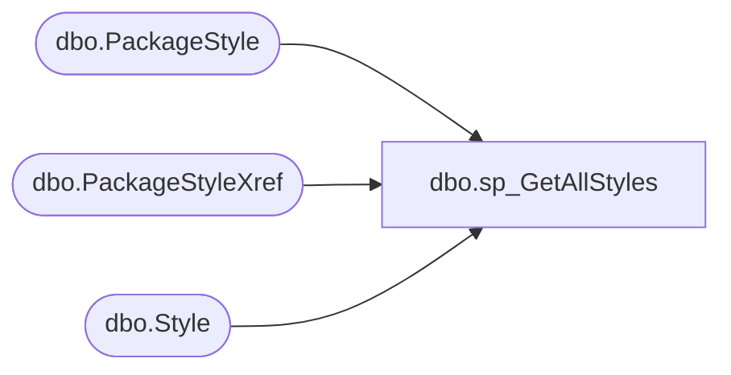

# dbo.sp_GetAllStyles

**Database:** BABWPartyPlanner  
**Server:** bearcluster01  

## Architecture Diagram



## Table Dependencies

| Referenced Table |
|---|
| dbo.PackageStyle |
| dbo.PackageStyleXref |
| dbo.Style |

## Stored Procedure Code

```sql
-- =============================================
-- Author:		<Carl Haufle>
-- Create date: <09/17/218>
-- Description:	<gets all styles>
-- =============================================
CREATE PROCEDURE [dbo].[sp_GetAllStyles]
AS

BEGIN
	SELECT s.[StyleCodeID]
	  ,PSX.PackageStyleID
	  ,PS.PackageID
      ,[StyleID]
      ,[StyleCode]
      ,[LongDesc]
      ,[ShortDesc]
  FROM [BABWPartyPlanner].[dbo].[Style] S
  RIGHT JOIN [BABWPartyPlanner].[dbo].[PackageStyleXref] PSX
  ON S.StyleCodeID = PSX.StyleCodeID
  RIGhT JOIN [BABWPartyPlanner].[dbo].[PackageStyle] PS
  ON PS.PackageStyleID = PSX.PackageStyleID

END
```

