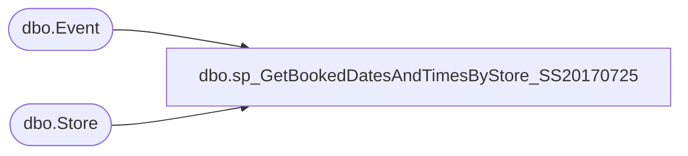

# dbo.sp_GetBookedDatesAndTimesByStore_SS20170725

**Database:** BABWPartyPlanner  
**Server:** bearcluster01  

## Architecture Diagram



## Table Dependencies

| Referenced Table |
|---|
| dbo.Event |
| dbo.Store |

## Stored Procedure Code

```sql
-- =============================================
-- Author:		Tim Bytnar
-- Create date: 5/4/2017
-- Description:	This proc will take the parameter StoreNumber and the numerical month and 
--                  produce an XML formatted list of all Bookings, for that specific store for a
--				3 month period from the one specified.
-- =============================================
CREATE PROCEDURE [dbo].[sp_GetBookedDatesAndTimesByStore_SS20170725] 
	@StoreNumber int = 0,
	@Month int = 1,
	@Year int = 2017
AS
BEGIN
	SET NOCOUNT ON;

    DECLARE @RangeStart date,
		  @RangeEnd date

    IF(@Month NOT IN (1,2,3,4,5,6,7,8,9,10,11,12))
	   BEGIN
		  SET @Month = 1
		  SET @StoreNumber = -999
	   END

    IF(@Year NOT BETWEEN 1997 AND 2050)
	   BEGIN
		  SET @Year = year(getdate())
	   END

    SET @RangeStart = CAST((CAST(@Month as varchar) + '/1/' + (CAST(@Year as varchar))) as date)
    SET @RangeEnd = DATEADD(month,3,@RangeStart);

    WITH StoreEvents AS
    (
	   SELECT s.StoreID, 
			e.EventID, 
			e.EventStart, 
			e.EventEnd
	   FROM Event e
	   LEFT JOIN Store s on e.StoreID = s.StoreID
	   WHERE s.StoreNumber = @StoreNumber
	   AND e.EventStart BETWEEN @RangeStart and @RangeEnd
	   AND e.Active = 1
    )

    SELECT '<?xml version="1.0" encoding="UTF-8"?>' + 
		 CAST((SELECT(SELECT
		  (SELECT se.EventStart as 'StartTime',
				se.EventEnd as 'EndTime'
		   FROM StoreEvents se 
		   FOR XML PATH ('Booking'),type)
		FOR XML PATH ('Bookings'),type)
		FOR XML PATH ('PartyStoreData'),type) AS nvarchar(max))
	as XMLResult
END


dbo,sp_GetBookedPartiesByCustomer,-- =============================================
-- Author:		Tim Bytnar
-- Create date: 4/27/2017
-- Description:	Takes the parameter @CustomerNumber and will get an XML formatted list of all parties for that customer.
-- =============================================
CREATE PROCEDURE [dbo].[sp_GetBookedPartiesByCustomer] 
	-- Add the parameters for the stored procedure here
	@LastName varchar(64) = NULL,
	@PartyID int = NULL,
	@PrimaryPhone varchar(32) = NULL,
	@EmailAddress varchar(128) = NULL,
	@CustomerNumber varchar(32) = NULL
AS
BEGIN
	SET NOCOUNT ON;

       DECLARE @WhereClause varchar(max) = ''
       DECLARE @sql varchar(max)
       if @LastName is not null AND @LastName <> ''
       BEGIN 
              SET @WhereClause = 'c.LastName = ''' + @LastName + ''' and '
       END
	   if @PartyID is not null AND @PartyID <> ''
       BEGIN 
              SET @WhereClause = 'p.PartyID = ' + CAST(@PartyID AS VARCHAR) + ' and '
       END
	   if @PrimaryPhone is not null AND @PrimaryPhone <> ''
       BEGIN 
              SET @WhereClause = 'c.PrimaryPhone = ''' + @PrimaryPhone + ''' and '
       END
	   if @EmailAddress is not null AND @EmailAddress <> ''
       BEGIN 
              SET @WhereClause = 'c.EmailAddress = ''' + @EmailAddress + ''' and '
       END
       if @CustomerNumber is not null AND @CustomerNumber <> ''
       BEGIN 
              SET @WhereClause = 'c.CustomerNumber = ''' + @CustomerNumber + ''' and '
       END
	   
	   IF LEN(@WhereClause) > 0
	   BEGIN
		SET @WhereClause = SUBSTRING(@WhereClause, 0, LEN(@WhereClause)-3)
	   END
  
    SET @sql = 'WITH ActiveEvents (EventID, StoreID, EventStart, EventEnd, CreatedBy, OrderNumber)
	AS
	(
		SELECT EventID, StoreID, EventStart, EventEnd, CreatedBy, OrderNumber
		FROM Event
		WHERE Active = 1
	)SELECT ''' + '<?xml version="1.0" encoding="UTF-8"?> ' + ''' +
       CAST(
           (SELECT(SELECT 
				p.PartyID,
				p.EventID,
				p.OccasionID,
                ISNULL(p.TotalGuests, 0) as TotalGuests,
                e.StoreID,
                e.EventStart,
                e.EventEnd,
                ISNULL(p.GOHFirstName, '''') as GOHFirstName,
                ISNULL(p.GOHAge, 0) as GOHAge,
                ISNULL(p.GuestAvgAge, 0) as GuestAvgAge,
                (SELECT OptionID AS ''' + 'Option' + '''
                     FROM OptionPartyXref o 
                      WHERE o.PartyID = p.PartyID 
                      FOR XML PATH (' + '''''' + '),type) AS Options,
                ISNULL(p.DepositAmount,0) as DepositAmount,
                ISNULL(e.CreatedBy, 1) as CreatedBy,
                (SELECT c.Comment AS ''' + 'CommentText' + ''', c.CreatedBy, c.CreatedDate
                     FROM Comment c
                     WHERE c.EventID = e.EventID 
                      FOR XML PATH (''' + 'Comment' + '''),type)  
                AS Comments,
                ISNULL(c.CustomerNumber, 0) as CustomerNumber,
                ISNULL(c.FirstName, ''' + 'None' + ''') as CustomerFirstName,
                ISNULL(c.LastName, ''' + 'None' + ''') as CustomerLastName,
                ISNULL(REPLACE(REPLACE(REPLACE(REPLACE(PrimaryPhone,''('',''''),'')'',''''),''-'',''''),'' '',''''), ''' + '' + ''') as PrimaryPhone,
                REPLACE(REPLACE(REPLACE(REPLACE(SecondaryPhone,''('',''''),'')'',''''),''-'',''''),'' '','''') as SecondaryPhone,
                ISNULL(c.Address1, '''') as Address1,
                ISNULL(c.Address2, '''') as Address2,
                ISNULL(c.Organization, '''') as Organization,
                ISNULL(c.City, '''') as City,
                ISNULL(c.State, '''') as State,
                ISNULL(c.Country, '''') as Country,
                ISNULL(c.Zipcode, '''' ) as ZipCode,
                ISNULL(c.EmailAddress, '''') as EmailAddress,
                ISNULL(p.GOHGender, 0) as GOHGender,
                ISNULL(p.PartyStateID, 0) as PartyStateID,
				ISNULL(oi.GiftCardNumber,0) as GiftcardNumber,
				ISNULL(e.OrderNumber,''None'') as OrderNumber

          FROM Party p
                LEFT JOIN Customer c WITH (NOLOCK) on p.CustomerID = c.CustomerID
                LEFT JOIN ActiveEvents e WITH (NOLOCK) on p.EventID = e.EventID   
				LEFT JOIN WebOrderProcessing.WM.Orders o WITH (NOLOCK) on e.OrderNumber = o.OrderNum
				LEFT JOIN WebOrderProcessing.WM.OrderItems oi WITH (NOLOCK) on o.OrderId = oi.OrderId and oi.Sku IN(''090500'',''490500'')
          WHERE ' + @WhereClause + '
		  ORDER BY e.EventStart DESC

          FOR XML PATH (''' + 'PartyBooking' + '''),type) FOR XML PATH (''' + 'PartyBookings' + ''')) 
    AS varchar(max))'

	EXEC (@sql)
END
```

