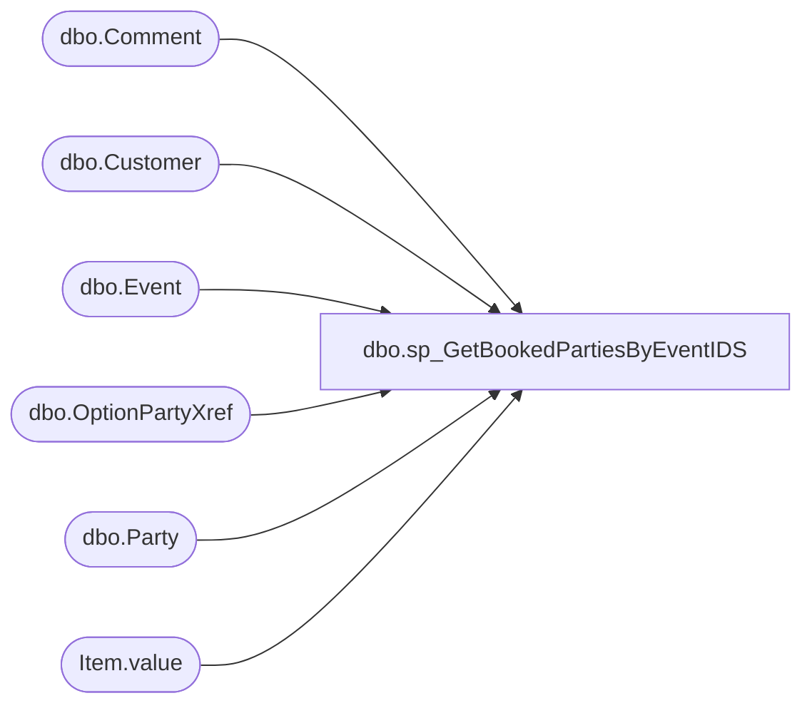

# dbo.sp_GetBookedPartiesByEventIDS

**Database:** BABWPartyPlanner  
**Server:** bearcluster01  

## Architecture Diagram



## Table Dependencies

| Referenced Table |
|---|
| dbo.Comment |
| dbo.Customer |
| dbo.Event |
| dbo.OptionPartyXref |
| dbo.Party |
| Item.value |

## Stored Procedure Code

```sql
-- =============================================
-- Author:		Tim Bytnar
-- Create date: 5/15/2017
-- Description:	Takes the parameter @EventID and will get an XML formatted list of all parties for that customer.
-- =============================================
CREATE PROCEDURE [dbo].[sp_GetBookedPartiesByEventIDS] 
	-- Add the parameters for the stored procedure here
	@EventIDs XML = NULL
AS
BEGIN
	SET NOCOUNT ON;

	WITH EventIDs as 
	(
		SELECT 'EventID' = T.Item.value('.', 'int')
		FROM @EventIDs.nodes('/EventIDs/EventID') AS T(Item)
	)

     SELECT '<?xml version="1.0" encoding="UTF-8"?>' + 
	CAST(
	    (SELECT(SELECT p.OccasionID,
		  ISNULL(p.TotalGuests, 0) as TotalGuests,
		  e.StoreID,
		  e.EventID,
		  p.PartyID,
		  e.EventStart,
		  e.EventEnd,
		  ISNULL(p.GOHFirstName, 'None') as GOHFirstName,
		  ISNULL(p.GOHAge, 0) as GOHAge,
		  ISNULL(p.GuestAvgAge, 0) as GuestAvgAge,
		  (SELECT OptionID AS 'Option'
			 FROM OptionPartyXref o 
			 WHERE o.PartyID = p.PartyID 
			 FOR XML PATH (''),type) AS Options,
		  ISNULL(p.DepositAmount,0) as DepositAmount,
		  ISNULL(e.CreatedBy, 1) as CreatedBy,
		  (SELECT c.Comment AS 'CommentText', c.CreatedBy, c.CreatedDate
			 FROM Comment c
			 WHERE c.EventID = e.EventID 
			 FOR XML PATH ('Comment'),type)  
		  AS Comments,
		  ISNULL(c.CustomerNumber, 0) as CustomerNumber,
		  ISNULL(c.FirstName, 'None') as CustomerFirstName,
		  ISNULL(c.LastName, 'None') as CustomerLastName,
		  PrimaryPhone,
		  SecondaryPhone,
		  ISNULL(c.Address1, 'None') as Address1,
		  ISNULL(c.Address2, 'None') as Address2,
		  ISNULL(c.Organization, 'None') as Organization,
		  ISNULL(c.City, 'None') as City,
		  ISNULL(c.State, 'None') as State,
		  ISNULL(c.Country, 'None') as Country,
		  ISNULL(c.Zipcode, 'None') as ZipCode,
		  ISNULL(c.EmailAddress, 'None') as EmailAddress,
		  ISNULL(p.GOHGender, 0) as GOHGender,
		  ISNULL(p.PartyStateID, 0) as PartyStateID

	   FROM Party p
		  LEFT JOIN Customer c WITH (NOLOCK) on p.CustomerID = c.CustomerID
		  LEFT JOIN Event e WITH (NOLOCK) on p.EventID = e.EventID
	   WHERE CAST(p.EventID AS VARCHAR) IN (SELECT EventID FROM EventIDs)

	   FOR XML PATH ('PartyBooking'),type) FOR XML PATH ('PartyBookings')) 
    AS varchar(max))
END


dbo,sp_GetBookedPartiesByPartyID,-- =====================================================================================================
-- Name: [sp_GetBookedPartiesByPartyID]
--
--Description: Takes the parameter @PartyID and will get an XML formatted list of all parties for that customer.

-- Revision History
--		Name:			Date:			Comments:	
--		Tim Bytnar		5/15/2016		Created proc
--		Tim Bytnar		11/6/2017		Adding in the join and retreival of Giftcard numbers from the WebOrderProcessing DB
--		Tim Bytnar		4/10/2018		Added support for getting the PMR Number
--		Ben Barud		12/13/2018		Added logic for PartyRequests shipped from web to include tracking number and shipping date
--		Ben Barud		3/4/2019		Updated PMRNumber column to pipe delimit PMRNumber and WebOrder Number in some cases
--		Ben Barud		04/30/2024		Added logic for Transfer Orders
--		Ben Barud		04/29/2026		Updated TO logic to join to StoreShipmentExport instead of PartyToDynamics
-- =====================================================================================================

CREATE PROCEDURE [dbo].[sp_GetBookedPartiesByPartyID] 
	-- Add the parameters for the stored procedure here
	@PartyID int = NULL
AS
BEGIN
	SET NOCOUNT ON;

DECLARE @ValidPMR table (PMRNumber int, EventID int)
DECLARE @ValidESPMR TABLE (OrderNumber VARCHAR(12), OrderID INT, PartyId INT, TrackingNumber VARCHAR(30), StatusDate VARCHAR(30))


SELECT PartyID,
	EventID
INTO #work
FROM KODIAK.PartyRequest.dbo.Party
WHERE (ISNUMERIC(EventID) = 1) 

INSERT INTO @ValidPMR
SELECT MAX(PartyID) as PMRNumber, 
	CAST(CAST(EventID AS FLOAT) AS INT) AS EventID
FROM #work
WHERE (ISNUMERIC(EventID) = 1) 
AND CAST(EventID AS FLOAT) < 2147483647
GROUP BY CAST(CAST(EventID AS FLOAT) AS INT);

  --DECLARE @partyID AS INT
  --SET @partyID = 964858;
  WITH prESOrder
  AS
  (
  SELECT TOP 1 OrderNumber, o.OrderId, xRef.PartyID
  FROM [WebOrderProcessing].[WM].[Orders] o
  INNER JOIN [BABWPartyPlanner].[dbo].[PartyEnterpriseSellingXRef] xRef ON o.OrderId = xRef.OrderId
  WHERE xRef.PartyID = @partyID
  ), tracking
  AS
  (
  SELECT TOP 1 oi.OrderId
              ,oi.TrackingNumber
			  ,CASE
			    WHEN ist.StatusDate IS NOT NULL THEN ist.StatusDate
				WHEN ist2.StatusDate IS NOT NULL THEN ist2.StatusDate
				ELSE ist.StatusDate
			   END AS 'StatusDate'
  FROM [WebOrderProcessing].[WM].[OrderItems] oi
  LEFT JOIN [WebOrderProcessing].[WM].[ItemStatus] ist ON oi.OrderItemID = ist.OrderItemID AND ist.[Status] = 'Shipped'
  LEFT JOIN [WebOrderProcessing].[WM].[ItemStatus_Archive] ist2 ON oi.OrderItemID = ist2.OrderItemID AND ist2.[Status] = 'Shipped'
  INNER JOIN prESOrder ON prESOrder.OrderId = oi.OrderId
  ), prTO
  AS
  (
	SELECT TOP 1 ph.[OrderId] AS OrderNumber, null AS OrderId, ph.[PartyId] AS PartyID, null AS TrackingNumber, CONVERT(VARCHAR, ptd.ShipDate, 126) AS 'StatusDate'
	FROM [STL-SSIS-P-01].[IntegrationStaging].[WMS].[PartyHeader] ph
	--INNER JOIN [STL-SSIS-P-01].[IntegrationStaging].[WMS].[PartyToDynamics] ptd ON ph.[PartyId] = ptd.[PartyId]
	INNER JOIN [STL-SSIS-P-01].[IntegrationStaging].[WMS].[StoreShipmentExport]  ptd ON ph.[PartyId] = ptd.AptosShipmentNumber AND ptd.AptosDistroNumber IS NULL
	WHERE ph.PartyId = @partyID
  )
  INSERT INTO @ValidESPMR
  SELECT OrderNumber, prESOrder.OrderId, PartyID, TrackingNumber, CONVERT(VARCHAR, StatusDate, 126) AS 'StatusDate'
  FROM prESOrder 
  INNER JOIN tracking ON tracking.OrderId = prESOrder.OrderId
  UNION
  SELECT OrderNumber, OrderId, PartyID, TrackingNumber, StatusDate
  FROM prTO

     SELECT '<?xml version="1.0" encoding="UTF-8"?>' + 
	CAST(
	    (SELECT(
		SELECT p.OccasionID,
		  ISNULL(p.TotalGuests, 0) as TotalGuests,
		  e.StoreID,
		  e.EventID,
		  p.PartyID,
		  e.CreatedDate,
		  e.EventStart,
		  e.EventEnd,
		  ISNULL(p.GOHFirstName, 'None') as GOHFirstName,
		  ISNULL(p.GOHAge, 0) as GOHAge,
		  ISNULL(p.GuestAvgAge, 0) as GuestAvgAge,
		  (SELECT OptionID AS 'Option'
			 FROM OptionPartyXref o 
			 WHERE o.PartyID = p.PartyID 
			 FOR XML PATH (''),type) AS Options,
		  ISNULL(p.DepositAmount,0) as DepositAmount,
		  ISNULL(e.CreatedBy, 1) as CreatedBy,
		  (SELECT c.Comment AS 'CommentText', c.CreatedBy, c.CreatedDate
			 FROM Comment c
			 WHERE c.EventID = e.EventID 
			 FOR XML PATH ('Comment'),type)  
		  AS Comments,
		  ISNULL(c.CustomerNumber, 0) as CustomerNumber,
		  ISNULL(c.FirstName, 'None') as CustomerFirstName,
		  ISNULL(c.LastName, 'None') as CustomerLastName,
		  c.PrimaryPhone,
		  c.SecondaryPhone,
		  ISNULL(c.Address1, 'None') as Address1,
		  ISNULL(c.Address2, 'None') as Address2,
		  ISNULL(poc.Organization, 'None') as Organization,
		  ISNULL(c.City, 'None') as City,
		  ISNULL(c.State, 'None') as State,
		  ISNULL(c.Country, 'None') as Country,
		  ISNULL(c.Zipcode, 'None') as ZipCode,
		  ISNULL(c.EmailAddress, 'None') as EmailAddress,
		  ISNULL(p.GOHGender, 0) as GOHGender,
		  ISNULL(p.PartyStateID, 0) as PartyStateID,
		  ISNULL(p.ThemeID, 0) as PartyThemeID,
		  ISNULL(p.PackageID,0) as PackageID,
		  ISNULL(oi.GiftCardNumber,0) as GiftcardNumber,
		  ISNULL(e.OrderNumber,'None') as OrderNumber,
		  ISNULL(po.PONumber,'None') as PONumber,
		  ISNULL(poc.FirstName,'None') as POFirstName,
		  ISNULL(poc.LastName,'None') as POLastName,
		  ISNULL(poc.EmailAddress,'None') as POEmailAddress,
		  ISNULL(poc.PrimaryPhone,'None') as POPrimaryPhone,
		  ISNULL(poc.TaxId,'None') as POTaxId,
		  CASE
				WHEN p.POID IS NULL THEN 0
				ELSE 1
		  END as IsPOParty,
		  --CASE
				--WHEN pmr.PMRNumber IS NOT NULL THEN pmr.PMRNumber
				--WHEN espmr.OrderNumber IS NOT NULL THEN espmr.OrderNumber
				--ELSE 0
		  --END AS PMRNumber,
		  CASE
		        WHEN pmr.PMRNumber IS NOT NULL AND espmr.OrderNumber IS NOT NULL THEN CAST(pmr.PMRNumber AS VARCHAR) + ' | ' + CAST(espmr.OrderNumber AS VARCHAR)
				WHEN pmr.PMRNumber IS NOT NULL THEN CAST(pmr.PMRNumber AS VARCHAR)
				WHEN espmr.OrderNumber IS NOT NULL THEN CAST(espmr.OrderNumber AS VARCHAR)
				ELSE '0'
		  END AS PMRNumber,
		  ISNULL(espmr.TrackingNumber, 'None') AS 'MerchTrackingNumber',
		  ISNULL(espmr.StatusDate, 'None') AS 'MerchShippingDate'
	   FROM Party p
		  LEFT JOIN Customer c WITH (NOLOCK) on p.CustomerID = c.CustomerID
		  LEFT JOIN Event e WITH (NOLOCK) on p.EventID = e.EventID
		  LEFT JOIN PurchaseOrder po WITH (NOLOCK) on p.POID = po.POID
		  LEFT JOIN Customer poc WITH (NOLOCK) on po.CustomerID = poc.CustomerID
		  LEFT JOIN [STL-SQLAAG-P-01].WebOrderProcessing.WM.Orders o WITH (NOLOCK) on e.OrderNumber = o.OrderNum
		  LEFT JOIN [STL-SQLAAG-P-01].WebOrderProcessing.WM.OrderItems oi WITH (NOLOCK) on o.OrderId = oi.OrderId and oi.Sku IN(090500,490500)
		  LEFT JOIN @ValidPMR pmr ON p.PartyID = pmr.EventID
		  LEFT JOIN @ValidESPMR espmr ON p.PartyID = espmr.PartyID
	   WHERE p.PartyID = @PartyID

	   FOR XML PATH ('PartyBooking'),type) FOR XML PATH ('PartyBookings')) 
    AS varchar(max))
END
dbo,sp_GetBookedPartiesByPartyID_BJB20190116,-- =====================================================================================================
-- Name: [sp_GetBookedPartiesByPartyID]
--
--Description: Takes the parameter @PartyID and will get an XML formatted list of all parties for that customer.

-- Revision History
--		Name:			Date:			Comments:	
--		Tim Bytnar		5/15/2016		Created proc
--		Tim Bytnar		11/6/2017		Adding in the join and retreival of Giftcard numbers from the WebOrderProcessing DB
--		Tim Bytnar		4/10/2018		Added support for getting the PMR Number
-- =====================================================================================================

CREATE PROCEDURE [dbo].[sp_GetBookedPartiesByPartyID_BJB20190116] 
	-- Add the parameters for the stored procedure here
	@PartyID int = NULL
AS
BEGIN
	SET NOCOUNT ON;

DECLARE @ValidPMR table (PMRNumber int, EventID int)

INSERT INTO @ValidPMR
SELECT MAX(PartyID) as PMRNumber, 
	CAST(CAST(EventID AS FLOAT) AS INT) AS EventID
FROM KODIAK.PartyRequest.dbo.Party
WHERE (ISNUMERIC(EventID) = 1) 
AND (EventID <> '1111111111111111111111111111111111')
GROUP BY CAST(CAST(EventID AS FLOAT) AS INT)

     SELECT '<?xml version="1.0" encoding="UTF-8"?>' + 
	CAST(
	    (SELECT(
		SELECT p.OccasionID,
		  ISNULL(p.TotalGuests, 0) as TotalGuests,
		  e.StoreID,
		  e.EventID,
		  p.PartyID,
		  e.CreatedDate,
		  e.EventStart,
		  e.EventEnd,
		  ISNULL(p.GOHFirstName, 'None') as GOHFirstName,
		  ISNULL(p.GOHAge, 0) as GOHAge,
		  ISNULL(p.GuestAvgAge, 0) as GuestAvgAge,
		  (SELECT OptionID AS 'Option'
			 FROM OptionPartyXref o 
			 WHERE o.PartyID = p.PartyID 
			 FOR XML PATH (''),type) AS Options,
		  ISNULL(p.DepositAmount,0) as DepositAmount,
		  ISNULL(e.CreatedBy, 1) as CreatedBy,
		  (SELECT c.Comment AS 'CommentText', c.CreatedBy, c.CreatedDate
			 FROM Comment c
			 WHERE c.EventID = e.EventID 
			 FOR XML PATH ('Comment'),type)  
		  AS Comments,
		  ISNULL(c.CustomerNumber, 0) as CustomerNumber,
		  ISNULL(c.FirstName, 'None') as CustomerFirstName,
		  ISNULL(c.LastName, 'None') as CustomerLastName,
		  c.PrimaryPhone,
		  c.SecondaryPhone,
		  ISNULL(c.Address1, 'None') as Address1,
		  ISNULL(c.Address2, 'None') as Address2,
		  ISNULL(poc.Organization, 'None') as Organization,
		  ISNULL(c.City, 'None') as City,
		  ISNULL(c.State, 'None') as State,
		  ISNULL(c.Country, 'None') as Country,
		  ISNULL(c.Zipcode, 'None') as ZipCode,
		  ISNULL(c.EmailAddress, 'None') as EmailAddress,
		  ISNULL(p.GOHGender, 0) as GOHGender,
		  ISNULL(p.PartyStateID, 0) as PartyStateID,
		  ISNULL(p.PackageID,0) as PackageID,
		  ISNULL(oi.GiftCardNumber,0) as GiftcardNumber,
		  ISNULL(e.OrderNumber,'None') as OrderNumber,
		  ISNULL(po.PONumber,'None') as PONumber,
		  ISNULL(poc.FirstName,'None') as POFirstName,
		  ISNULL(poc.LastName,'None') as POLastName,
		  ISNULL(poc.EmailAddress,'None') as POEmailAddress,
		  ISNULL(poc.PrimaryPhone,'None') as POPrimaryPhone,
		  ISNULL(poc.TaxId,'None') as POTaxId,
		  CASE
				WHEN p.POID IS NULL THEN 0
				ELSE 1
		  END as IsPOParty,
		  ISNULL(pmr.PMRNumber,0) as PMRNumber

	   FROM Party p
		  LEFT JOIN Customer c WITH (NOLOCK) on p.CustomerID = c.CustomerID
		  LEFT JOIN Event e WITH (NOLOCK) on p.EventID = e.EventID
		  LEFT JOIN PurchaseOrder po WITH (NOLOCK) on p.POID = po.POID
		  LEFT JOIN Customer poc WITH (NOLOCK) on po.CustomerID = poc.CustomerID
		  LEFT JOIN [STL-SQLAAG-P-01].WebOrderProcessing.WM.Orders o WITH (NOLOCK) on e.OrderNumber = o.OrderNum
		  LEFT JOIN [STL-SQLAAG-P-01].WebOrderProcessing.WM.OrderItems oi WITH (NOLOCK) on o.OrderId = oi.OrderId and oi.Sku IN(090500,490500)
		  LEFT JOIN @ValidPMR pmr ON p.PartyID = pmr.EventID
	   WHERE p.PartyID = @PartyID

	   FOR XML PATH ('PartyBooking'),type) FOR XML PATH ('PartyBookings')) 
    AS varchar(max))
END
```

