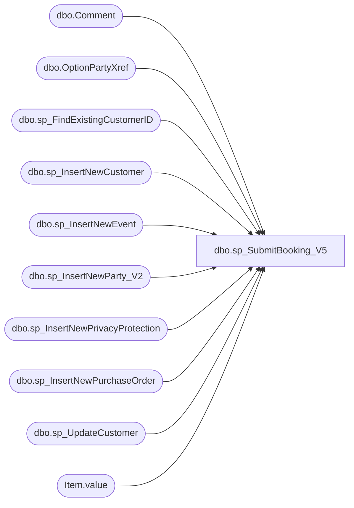

# dbo.sp_SubmitBooking_V5

**Database:** BABWPartyPlanner  
**Server:** bearcluster01  

## Architecture Diagram



## Table Dependencies

| Referenced Table |
|---|
| dbo.Comment |
| dbo.OptionPartyXref |
| dbo.sp_FindExistingCustomerID |
| dbo.sp_InsertNewCustomer |
| dbo.sp_InsertNewEvent |
| dbo.sp_InsertNewParty_V2 |
| dbo.sp_InsertNewPrivacyProtection |
| dbo.sp_InsertNewPurchaseOrder |
| dbo.sp_UpdateCustomer |
| Item.value |

## Stored Procedure Code

```sql
-- =============================================================================================================
-- Name: sp_SubmitBooking
--
-- Description:	This is the main coordinating procedure that will take in all parameters associated 
--                  with a Party and properly create records in each table associded with it.
--
-- Output: 
--	ds
-- Dependencies: 
--
-- Revision History
--		Name:			Date:			Comments:
--		Tim Bytnar		5/3/2017		Initial Creation
--		Tim Bytnar		9/5/2017		Added in the support for PackageID.
--      Tim Bytnar		9/28/2017		Fixed the comments data type for "CreatedBy" from int to varchar
--		Tim Bytnar		10/13/2017		Changed logic for inserting new customer or updating existing customer record
--		Tim Bytnar		11/6/2017		This seperate procedure is in place to provide alternative handling of party booking submissions
--										during the process of deploying the code from Staging to Production.  In particularly we are adding
--										the DECK order number to the Event.
--		Tim Bytnar		1/2/2018		Adding support for Purchase Orders, this includes a new "Customer" lookup for the PO Contact
--											and special code inserting a new purchase order record.
--		Ben Barud		01/15/2019		Commneted out logic for default party note for Girl Scout party
-- =============================================================================================================
CREATE PROCEDURE [dbo].[sp_SubmitBooking_V5] 
	-- Add the parameters for the stored procedure here
	   @FirstName varchar(64),
	   @LastName varchar(64) = '',
	   @PrimaryPhone varchar(32) = '',
	   @SecondaryPhone varchar(32) = '',
	   @EmailAddress varchar(128),
	   @Address1 varchar(128) = '',
	   @Address2 varchar(128) = '',
	   @City varchar(128) = '',
	   @State varchar(32) = '',
	   @Zipcode varchar(13) = '',
	   @Country varchar(64) = '',
	   @Organization varchar(64) = '',
	   @OccasionID int,
	   @TotalGuests int,
	   @GOHAge int = NULL,
	   @GOHFirstName varchar(50) = '',
	   @GOHGender int = NULL,
	   @GuestAvgAge int = NULL,
	   @DepositAmount decimal(9,2),
	   @EventStart datetime,
	   @EventEnd datetime,
	   @CreatedBy varchar(128),
	   @OrderNumber varchar(10),
	   @StoreID int,
	   @Options xml,
	   @Comments xml = '',
	   @PackageID int,
	   @CustomerNumber varchar(32) = '',
	   @isPOParty bit = 0,
	   @TaxId varchar(64) = '',
	   @POFirstName varchar(64) = '',
	   @POLastName varchar(64) = '',
	   @POPrimaryPhone varchar(32) = '',
	   @POEmailAddress varchar(128) = '',
	   @PONumber varchar(64) = '',
	   @ThemeID INT,
	   @privacyPolicyRead BIT,
	   @privacyPolicyReadDate DATETIME,
	   @privacyRegulation VARCHAR(50),
	   @privacyRegulationRead BIT,
	   @privacyRegulationReadDate DATETIME
	   
AS
BEGIN
	-- SET NOCOUNT ON added to prevent extra result sets from
	-- interfering with SELECT statements.
	SET NOCOUNT ON;

	BEGIN TRAN
	   BEGIN TRY
		   DECLARE @CustomerID int,
				 @EventID int = -1,
				 @PartyStateID int = 0,
				 @EventType int = 1,
				 @PartyID int
	
		  --First step is to determine if this is a new customer or not.  For that we call the sp_FindExistingCustomer with the FirstName, LastName and Email Address.
		  --It will give us either a CustomerID or a 0.  If it's 0 then it must be a new customer, therefore we insert a new customer record.
		  EXEC sp_FindExistingCustomerID @FirstName,@LastName,@EmailAddress,@CustomerNumber,@CustomerID OUTPUT

	      IF(@CustomerID = 0)
		  BEGIN
			  EXEC sp_InsertNewCustomer @FirstName,@LastName,@PrimaryPhone,@SecondaryPhone,@EmailAddress,@Address1,@Address2,@City,@State,@Zipcode,@Country,@Organization,@TaxId,@CustomerID OUTPUT
		  END
		  ELSE
		  BEGIN
			  EXEC sp_UpdateCustomer @NewFirstName = @FirstName, @NewLastName = @LastName, @NewEmailAddress = @EmailAddress, @NewPrimaryPhone = 'DONOTUPDATE', @NewOrganization = 'NONE', @CustomerID = @CustomerID, @NewTaxId = @TaxId
		  END

		  --Now we need to determine if the PurchaseOrder is being used by an existing cutomer and either update that record or insert a new one
		  DECLARE @POCustomerID int
		  EXEC sp_FindExistingCustomerID @POFirstName,@POLastName,@POEmailAddress,NULL,@POCustomerID OUTPUT

		  IF(@POCustomerID = 0)
		  BEGIN
			  EXEC sp_InsertNewCustomer @POFirstName,@POLastName,@POPrimaryPhone,NULL,@POEmailAddress,NULL,NULL,NULL,NULL,NULL,NULL,@Organization,@TaxId,@POCustomerID OUTPUT
		  END
		  ELSE
		  BEGIN
			  EXEC sp_UpdateCustomer @NewFirstName = @POFirstName, @NewLastName = @POLastName, @NewEmailAddress = @POEmailAddress, @NewPrimaryPhone = @POPrimaryPhone, @NewOrganization = @Organization, @CustomerID = @POCustomerID, @NewTaxId = @TaxId
		  END

		  --The next step is to insert a new Event record using sp_InsertNewEvent which will return the new EventID
		  EXEC sp_InsertNewEvent @EventStart,@EventEnd,@EventType,@CreatedBy,@StoreID,NULL,@OrderNumber,@EventID OUTPUT

		  --Next we will insert a new PurchaseOrder record (If there is a purchase order supplied in the first place)
 		  DECLARE @POID int
		  --IF(@PONumber != '')
		  --BEGIN
		  --    EXEC sp_InsertNewPurchaseOrder @PONumber,@POCustomerID,@POID OUTPUT
		  --END
		  IF(@isPOParty = 1)
		  BEGIN
			  IF(@PONumber != '' AND @PONumber IS NOT NULL)
			  BEGIN
				EXEC sp_InsertNewPurchaseOrder @PONumber,@POCustomerID,@POID OUTPUT
			  END
			  ELSE
			  BEGIN
				EXEC sp_InsertNewPurchaseOrder 'None',@POCustomerID,@POID OUTPUT
			  END			    
		  END

		  --Now that we have everything we need we can insert the new party record using sp_InsertNewParty and ultimately return the new PartyID to be used later.
		  EXEC sp_InsertNewParty_V2 @OccasionID,@TotalGuests,@CustomerID,@EventID,@GOHAge,@GOHFirstName,@GOHGender,@GuestAvgAge,@PartyStateID,@DepositAmount,@PackageID,@POID,@ThemeID,@PartyID OUTPUT

		  EXEC sp_InsertNewPrivacyProtection @eventID, @privacyPolicyRead, @privacyPolicyReadDate, @privacyRegulation, @privacyRegulationRead, @privacyRegulationReadDate

		  --Since there are potentially multiple options per party, we read in a simple XML string containing the Option values and insert them into the XREF table.
		  BEGIN TRAN
			 BEGIN TRY
				INSERT INTO OptionPartyXref (PartyID, OptionID) 
				SELECT @PartyID as 'PartyID','OptionID' = T.Item.value('.', 'int')
				FROM @Options.nodes('/Options/Option') AS T(Item)
			 COMMIT
			 END TRY
			 BEGIN CATCH
				IF(@@TRANCOUNT > 0)
				    ROLLBACK TRAN
			 END CATCH

		  --Same as the Options node we need to take in XML for the comments and insert a row for each new comment.
		  --BEGIN TRAN
			 --BEGIN TRY
				--INSERT INTO Comment (EventID,CreatedDate,Comment,CreatedBy)
				--SELECT @EventID as 'EventID',
    --				   'CreatedDate' = T.Item.value('CreatedDate[1]', 'datetime'),
				--   'Comment' = T.Item.value('CommentText[1]', 'varchar(512)'),
				--   'CreatedBy' = T.Item.value('CreatedBy[1]', 'varchar(512)')
				--FROM @Comments.nodes('/Comments/Comment') AS T(Item)
    --			 COMMIT
			 --END TRY
			 --BEGIN CATCH
				--IF(@@TRANCOUNT > 0)
				--    ROLLBACK TRAN
			 --END CATCH


			-- This inserts whatever comment was supplied during the booking 
			BEGIN
				BEGIN TRAN
					 BEGIN TRY
						INSERT INTO Comment (EventID,CreatedDate,Comment,CreatedBy)
						SELECT @EventID as 'EventID',
    						   'CreatedDate' = T.Item.value('CreatedDate[1]', 'datetime'),
						   'Comment' = T.Item.value('CommentText[1]', 'varchar(512)'),
						   'CreatedBy' = T.Item.value('CreatedBy[1]', 'varchar(512)')
						FROM @Comments.nodes('Comment') AS T(Item)
    					 COMMIT
					 END TRY
					 BEGIN CATCH
						IF(@@TRANCOUNT > 0)
							ROLLBACK TRAN
					 END CATCH
			END

			--This inserts a specific comment for just the Girl Scout parties
			--IF (@OccasionID IN (110,111,112,113,114) OR @PackageID = 77) -- Girlscout Parties
			--BEGIN
			--	INSERT INTO Comment (EventID,CreatedDate,Comment,CreatedBy)
			--	SELECT @EventID as 'EventID',
			--		   GETDATE() as 'CreatedDate',
			--		   'Guest has been contacted by Guest Services for product needs.  Waiting for the Guest to respond.' as 'Comment',
			--		   'SYSTEM' as 'CreatedBy'
			--END

			 SELECT @PartyID
	   COMMIT
    END TRY
    BEGIN CATCH
	   IF(@@TRANCOUNT > 0)
		  ROLLBACK TRAN
    END CATCH
END
dbo,sp_UpdateBooking,-- =============================================================================================================
-- Name: sp_UpdateBooking
--
-- Description:	This procedure will update a party and all of it's corresponding data fields.
--
-- Output: 
--	
-- Dependencies: 
--
-- Revision History
--		Name:			Date:			Comments:
--		Tim Bytnar		5/3/2017		Initial Creation
--		Ben Barud		8/28/2017		Added @result output parameter.  Entity Framework is challenged when
--									    returning select values with stored procs that have update statements.
--                                      The work around is add an output value.
--		Tim Bytnar		9/5/2017		Added in the support for PackageID updates.
--      Tim Bytnar      9/27/2017	    Added in support to add comments to a party during the update.
--      Tim Bytnar		9/28/2017		Fixed the comments data type for "CreatedBy" from int to varchar
--		Tim Bytnar		10/13/2017		Added in the support to update the customer data for the party
--		Tim Bytnar		1/2/2017		Added support for updating the store number
-- =============================================================================================================

CREATE PROCEDURE [dbo].[sp_UpdateBooking] 
	-- Add the parameters for the stored procedure here
	   @PartyID int,
	   @OccasionID int,
	   @TotalGuests int,
	   @GOHAge int,
	   @GOHFirstName varchar(50),
	   @GOHGender int,
	   @GuestAvgAge int,
	   @DepositAmount decimal(9,2),
	   @EventStart datetime,
	   @EventEnd datetime,
	   @PartyStateID int,
	   @PackageID int,
	   @FirstName varchar(64),
	   @LastName varchar(64),
	   @EmailAddress varchar(128),
	   @StoreID int,
	   @Comments xml = NULL,
	   @result int OUTPUT

AS
BEGIN
	-- SET NOCOUNT ON added to prevent extra result sets from
	-- interfering with SELECT statements.
	SET NOCOUNT ON;

	BEGIN TRAN
	   BEGIN TRY

		   DECLARE @EventID int,
				   @CustomerID int
	
		   SELECT @EventID = EventID, @CustomerID = CustomerId FROM BABWPartyPlanner.dbo.Party WHERE PartyID = @PartyID

		   UPDATE BABWPartyPlanner.dbo.Event
		   SET EventStart = @EventStart,
			  EventEnd = @EventEnd,
			  LastUpdated = GetDate(),
			  StoreID = @StoreID
		   WHERE EventID = @EventID

		   UPDATE BABWPartyPlanner.dbo.Party
		   SET OccasionID = @OccasionID,
			  TotalGuests = @TotalGuests,
			  GOHAge = @GOHAge,
			  GOHFirstName = @GOHFirstName,
			  GOHGender = @GOHGender,
			  GuestAvgAge = @GuestAvgAge,
			  PartyStateID = @PartyStateID,
			  DepositAmount = @DepositAmount,
			  PackageID = @PackageID
		   WHERE PartyID = @PartyID

		   EXEC sp_UpdateCustomer @FirstName, @LastName, @EmailAddress, 'DONOTUPDATE','NONE', @CustomerID, NULL

		   SELECT @result = @PartyID
	   COMMIT
	   END TRY
	   BEGIN CATCH
		  IF(@@TRANCOUNT > 0)
			 ROLLBACK TRAN
	   END CATCH

	   	IF @Comments IS NOT NULL 
		BEGIN
			BEGIN TRAN
				 BEGIN TRY
					INSERT INTO Comment (EventID,CreatedDate,Comment,CreatedBy)
					SELECT @EventID as 'EventID',
    					   'CreatedDate' = T.Item.value('CreatedDate[1]', 'datetime'),
					   'Comment' = T.Item.value('CommentText[1]', 'varchar(512)'),
					   'CreatedBy' = T.Item.value('CreatedBy[1]', 'varchar(512)')
					FROM @Comments.nodes('Comment') AS T(Item)
    				 COMMIT
				 END TRY
				 BEGIN CATCH
					IF(@@TRANCOUNT > 0)
						ROLLBACK TRAN
				 END CATCH
		END
	    
END
dbo,sp_UpdateBooking_TB_9-5-17,-- =============================================
-- Author:		Tim Bytnar
-- Create date: 5/3/2017
-- Description:	This procedure will update a party and all of it's corresponding data fields.
-- =============================================
CREATE PROCEDURE [dbo].[sp_UpdateBooking_TB_9-5-17] 
	-- Add the parameters for the stored procedure here
	   @PartyID int,
	   @OccasionID int,
	   @TotalGuests int,
	   @GOHAge int,
	   @GOHFirstName varchar(50),
	   @GOHGender int,
	   @GuestAvgAge int,
	   @DepositAmount decimal(9,2),
	   @EventStart datetime,
	   @EventEnd datetime,
	   @PartyStateID int,
	   @PackageID int,
	   @result int OUTPUT

-- =============================================================================================================
-- Name: sp_UpdateBooking
--
-- Description:	This procedure will update a party and all of it's corresponding data fields.
--
-- Output: 
--	
-- Dependencies: 
--
-- Revision History
--		Name:			Date:			Comments:
--		Tim Bytnar		5/3/2017		Initial Creation
--		Ben Barud		8/28/2017		Added @result output parameter.  Entity Framework is challenged when
--									    returning select values with stored procs that have update statements.
--                                      The work around is add an output value.
-- =============================================================================================================

AS
BEGIN
	-- SET NOCOUNT ON added to prevent extra result sets from
	-- interfering with SELECT statements.
	SET NOCOUNT ON;

	BEGIN TRAN
	   BEGIN TRY

		   DECLARE @EventID int
	
		   SET @EventID = (SELECT EventID FROM BABWPartyPlanner.dbo.Party WHERE PartyID = @PartyID)

		   UPDATE BABWPartyPlanner.dbo.Event
		   SET EventStart = @EventStart,
			  EventEnd = @EventEnd,
			  LastUpdated = GetDate()
		   WHERE EventID = @EventID

		   UPDATE BABWPartyPlanner.dbo.Party
		   SET OccasionID = @OccasionID,
			  TotalGuests = @TotalGuests,
			  GOHAge = @GOHAge,
			  GOHFirstName = @GOHFirstName,
			  GOHGender = @GOHGender,
			  GuestAvgAge = @GuestAvgAge,
			  PartyStateID = @PartyStateID,
			  DepositAmount = @DepositAmount,
			  PackageID = @PackageID
		   WHERE PartyID = @PartyID

		   SELECT @result = @PartyID
	   COMMIT
	   END TRY
	   BEGIN CATCH
		  IF(@@TRANCOUNT > 0)
			 ROLLBACK TRAN
	   END CATCH
	    
END

dbo,sp_UpdateBooking_V2,-- =============================================================================================================
-- Name: sp_UpdateBooking
--
-- Description:	This procedure will update a party and all of it's corresponding data fields.
--
-- Output: 
--	
-- Dependencies: 
--
-- Revision History
--		Name:			Date:			Comments:
--		Tim Bytnar		5/3/2017		Initial Creation
--		Ben Barud		8/28/2017		Added @result output parameter.  Entity Framework is challenged when
--									    returning select values with stored procs that have update statements.
--                                      The work around is add an output value.
--		Tim Bytnar		9/5/2017		Added in the support for PackageID updates.
--      Tim Bytnar      9/27/2017	    Added in support to add comments to a party during the update.
--      Tim Bytnar		9/28/2017		Fixed the comments data type for "CreatedBy" from int to varchar
--		Tim Bytnar		10/13/2017		Added in the support to update the customer data for the party
--		Tim Bytnar		1/2/2017		Added support for updating the store number
--		Tim Bytnar		1/4/2017		Adding support for updating the Purchase Order 
-- =============================================================================================================

CREATE PROCEDURE [dbo].[sp_UpdateBooking_V2] 
	-- Add the parameters for the stored procedure here
	   @PartyID int,
	   @OccasionID int,
	   @TotalGuests int,
	   @GOHAge int,
	   @GOHFirstName varchar(50),
	   @GOHGender int,
	   @GuestAvgAge int,
	   @DepositAmount decimal(9,2),
	   @EventStart datetime,
	   @EventEnd datetime,
	   @PartyStateID int,
	   @PackageID int,
	   @FirstName varchar(64),
	   @LastName varchar(64),
	   @EmailAddress varchar(128),
	   @StoreId int,
	   @Comments xml = NULL,
	   @isPOParty bit = 0,
	   @TaxId varchar(64) = '',
	   @POFirstName varchar(64) = '',
	   @POLastName varchar(64) = '',
	   @POPrimaryPhone varchar(32) = '',
	   @POEmailAddress varchar(128) = '',
	   @PONumber varchar(64) = '',
	   @result int OUTPUT

AS
BEGIN
	-- SET NOCOUNT ON added to prevent extra result sets from
	-- interfering with SELECT statements.
	SET NOCOUNT ON;

	BEGIN TRAN
	   BEGIN TRY

		   DECLARE @EventID int,
				   @CustomerID int,
				   @POCustomerID int,
				   @POID int
	
		   SELECT @EventID = p.EventID, 
				  @CustomerID = p.CustomerId,
				  @POCustomerID = po.CustomerID,
				  @POID = p.POID
		   FROM BABWPartyPlanner.dbo.Party p
		   LEFT JOIN BABWPartyPlanner.dbo.PurchaseOrder po
				ON p.POID = po.POID
		   WHERE PartyID = @PartyID

		   PRINT @EventId
		   PRINT @CustomerID
		   PRINT @POCustomerID
		   PRINT @POID

		   UPDATE BABWPartyPlanner.dbo.Event
		   SET EventStart = @EventStart,
			  EventEnd = @EventEnd,
			  StoreID = @StoreId,
			  LastUpdated = GetDate()
		   WHERE EventID = @EventID

		   PRINT 'Updating the Party'
		   UPDATE BABWPartyPlanner.dbo.Party
		   SET OccasionID = @OccasionID,
			  TotalGuests = @TotalGuests,
			  GOHAge = @GOHAge,
			  GOHFirstName = @GOHFirstName,
			  GOHGender = @GOHGender,
			  GuestAvgAge = @GuestAvgAge,
			  PartyStateID = @PartyStateID,
			  DepositAmount = @DepositAmount,
			  PackageID = @PackageID
		   WHERE PartyID = @PartyID

		   UPDATE BABWPartyPlanner.dbo.PurchaseOrder
		   SET PONumber = @PONumber

		   -- It's entirely possible with the introduction of PO Parties that the Party Customer and the PO Customer are two
		   -- seperate 
		   DECLARE @Organization varchar(64)
		   IF @CustomerID = @POCustomerID
			   BEGIN
					-- The party customer and the POCustomer are the same
					--Update the party booking customer record
				   SELECT @Organization = Organization FROM Customer WHERE CustomerID = @POCustomerID

				   --Update the Purchase Order contact customer record
				   EXEC sp_UpdateCustomer @POFirstName, @POLastName, @POEmailAddress, @POPrimaryPhone, @Organization, @POCustomerID, @TaxId
			   END
		   ELSE
			   BEGIN
					-- The party customer and the POCustomer are different
					--Update the party booking customer record
				   EXEC sp_UpdateCustomer @FirstName, @LastName, @EmailAddress, 'DONOTUPDATE','NONE', @CustomerID, @TaxId

				   SELECT @Organization = Organization FROM Customer WHERE CustomerID = @POCustomerID

				   --Update the Purchase Order contact customer record
				   EXEC sp_UpdateCustomer @POFirstName, @POLastName, @POEmailAddress, @POPrimaryPhone, @Organization, @POCustomerID, @TaxId
			   END

		   SELECT @result = @PartyID
	   COMMIT
	   END TRY
	   BEGIN CATCH
		  IF(@@TRANCOUNT > 0)
			 ROLLBACK TRAN
	   END CATCH

	   	IF @Comments IS NOT NULL 
		BEGIN
			BEGIN TRAN
				 BEGIN TRY
					INSERT INTO Comment (EventID,CreatedDate,Comment,CreatedBy)
					SELECT @EventID as 'EventID',
    					   'CreatedDate' = T.Item.value('CreatedDate[1]', 'datetime'),
					   'Comment' = T.Item.value('CommentText[1]', 'varchar(512)'),
					   'CreatedBy' = T.Item.value('CreatedBy[1]', 'varchar(512)')
					FROM @Comments.nodes('Comment') AS T(Item)
    				 COMMIT
				 END TRY
				 BEGIN CATCH
					IF(@@TRANCOUNT > 0)
						ROLLBACK TRAN
				 END CATCH
		END
	    
END
```

