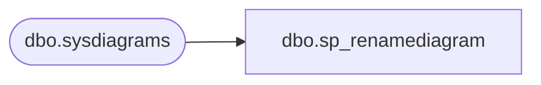

# dbo.sp_renamediagram

**Database:** BABWPartyPlanner  
**Server:** bearcluster01  

## Architecture Diagram



## Table Dependencies

| Referenced Table |
|---|
| dbo.sysdiagrams |

## Stored Procedure Code

```sql
CREATE PROCEDURE dbo.sp_renamediagram
	(
		@diagramname 		sysname,
		@owner_id		int	= null,
		@new_diagramname	sysname
	
	)
	WITH EXECUTE AS 'dbo'
	AS
	BEGIN
		set nocount on
		declare @theId 			int
		declare @IsDbo 			int
		
		declare @UIDFound 		int
		declare @DiagId			int
		declare @DiagIdTarg		int
		declare @u_name			sysname
		if((@diagramname is null) or (@new_diagramname is null))
		begin
			RAISERROR ('Invalid value', 16, 1);
			return -1
		end
	
		EXECUTE AS CALLER;
		select @theId = DATABASE_PRINCIPAL_ID();
		select @IsDbo = IS_MEMBER(N'db_owner'); 
		if(@owner_id is null)
			select @owner_id = @theId;
		REVERT;
	
		select @u_name = USER_NAME(@owner_id)
	
		select @DiagId = diagram_id, @UIDFound = principal_id from dbo.sysdiagrams where principal_id = @owner_id and name = @diagramname 
		if(@DiagId IS NULL or (@IsDbo = 0 and @UIDFound <> @theId))
		begin
			RAISERROR ('Diagram does not exist or you do not have permission.', 16, 1)
			return -3
		end
	
		-- if((@u_name is not null) and (@new_diagramname = @diagramname))	-- nothing will change
		--	return 0;
	
		if(@u_name is null)
			select @DiagIdTarg = diagram_id from dbo.sysdiagrams where principal_id = @theId and name = @new_diagramname
		else
			select @DiagIdTarg = diagram_id from dbo.sysdiagrams where principal_id = @owner_id and name = @new_diagramname
	
		if((@DiagIdTarg is not null) and  @DiagId <> @DiagIdTarg)
		begin
			RAISERROR ('The name is already used.', 16, 1);
			return -2
		end		
	
		if(@u_name is null)
			update dbo.sysdiagrams set [name] = @new_diagramname, principal_id = @theId where diagram_id = @DiagId
		else
			update dbo.sysdiagrams set [name] = @new_diagramname where diagram_id = @DiagId
		return 0
	END
	
dbo,sp_ShowUsers,-- =============================================
-- Author:		<Author,,Name>
-- Create date: <Create Date,,>
-- Description:	<Description,,>
-- =============================================
CREATE PROCEDURE sp_ShowUsers
AS
BEGIN

	select aduser, firstname,lastname from users order by lastname, firstname

END

dbo,sp_StorePackges,-- =============================================
-- Author:		<Author,,Name>
-- Create date: <Create Date,,>
-- Description:	<Description,,>
-- =============================================
CREATE PROCEDURE [dbo].[sp_StorePackges]
	@storeid int
AS
BEGIN


select a.packageid, packagename, isnull(b.PackageID,'0') as enabled from package a
left join Storepackagexref b

on 
b.storeid=@storeid
and a.packageid=b.packageid

where a.enabled=1 
order by orderby, packagename 

--select packageid, packagename, isnull(countryID,'0') as enabled from package 
--where
--enabled=1 
----and countryid=@countryid
--order by orderby, packagename 

END

dbo,sp_SubmitBooking,-- =============================================================================================================
-- Name: sp_SubmitBooking
--
-- Description:	This is the main coordinating procedure that will take in all parameters associated 
--                  with a Party and properly create records in each table associded with it.
--
-- Output: 
--	ds
-- Dependencies: 
--
-- Revision History
--		Name:			Date:			Comments:
--		Tim Bytnar		5/3/2017		Initial Creation
--		Tim Bytnar		9/5/2017		Added in the support for PackageID.
--      Tim Bytnar		9/28/2017		Fixed the comments data type for "CreatedBy" from int to varchar
--		Tim Bytnar		10/13/2017		Changed logic for inserting new customer or updating existing customer record
--		Tim Bytnar		1/2/2018		Adding support for Purchase Orders, this includes a new "Customer" lookup for the PO Contact
--											and special code inserting a new purchase order record.
-- =============================================================================================================
CREATE PROCEDURE [dbo].[sp_SubmitBooking] 
	-- Add the parameters for the stored procedure here
	   @FirstName varchar(64),
	   @LastName varchar(64) = '',
	   @PrimaryPhone varchar(32) = '',
	   @SecondaryPhone varchar(32) = '',
	   @EmailAddress varchar(128),
	   @Address1 varchar(128) = '',
	   @Address2 varchar(128) = '',
	   @City varchar(128) = '',
	   @State varchar(32) = '',
	   @Zipcode varchar(13) = '',
	   @Country varchar(64) = '',
	   @Organization varchar(64) = '',
	   @OccasionID int,
	   @TotalGuests int,
	   @GOHAge int = NULL,
	   @GOHFirstName varchar(50) = '',
	   @GOHGender int = NULL,
	   @GuestAvgAge int = NULL,
	   @DepositAmount decimal(9,2),
	   @EventStart datetime,
	   @EventEnd datetime,
	   @CreatedBy varchar(128),
	   --@CreatedBy int,
	   @StoreID int,
	   @Options xml,
	   @Comments xml = '',
	   @PackageID int,
	   @CustomerNumber varchar(32) = '',
	   @TaxId varchar(64) = '',
	   @POFirstName varchar(64),
	   @POLastName varchar(64) = '',
	   @POPrimaryPhone varchar(32) = '',
	   @POEmailAddress varchar(128),
	   @PONumber varchar(64) = ''
AS
BEGIN
	-- SET NOCOUNT ON added to prevent extra result sets from
	-- interfering with SELECT statements.
	SET NOCOUNT ON;

	BEGIN TRAN
	   BEGIN TRY
		   DECLARE @CustomerID int,
				 @EventID int = -1,
				 @PartyStateID int = 0,
				 @EventType int = 1,
				 @PartyID int
	
		  --First step is to determine if this is a new customer or not.  For that we call the sp_FindExistingCustomer with the FirstName, LastName and Email Address.
		  --It will give us either a CustomerID or a 0.  If it's 0 then it must be a new customer, therefore we insert a new customer record.
		  EXEC sp_FindExistingCustomerID @FirstName,@LastName,@EmailAddress,@CustomerNumber,@CustomerID OUTPUT

	      IF(@CustomerID = 0)
		  BEGIN
			  EXEC sp_InsertNewCustomer @FirstName,@LastName,@PrimaryPhone,@SecondaryPhone,@EmailAddress,@Address1,@Address2,@City,@State,@Zipcode,@Country,@Organization,@TaxId,@CustomerID OUTPUT
		  END
		  ELSE
		  BEGIN
			  EXEC sp_UpdateCustomer @NewFirstName = @FirstName, @NewLastName = @LastName, @NewEmailAddress = @EmailAddress, @CustomerID = @CustomerID, @NewTaxId = @TaxId
		  END

		  --Now we need to determine if the PurchaseOrder is being used by an existing cutomer and either update that record or insert a new one
		  DECLARE @POCustomerID int
		  EXEC sp_FindExistingCustomerID @POFirstName,@POLastName,@POEmailAddress,NULL,@POCustomerID OUTPUT

		  IF(@POCustomerID = 0)
		  BEGIN
			  EXEC sp_InsertNewCustomer @POFirstName,@POLastName,@POPrimaryPhone,NULL,@POEmailAddress,NULL,NULL,NULL,NULL,NULL,NULL,@Organization,@TaxId,@POCustomerID OUTPUT
		  END
		  ELSE
		  BEGIN
			  EXEC sp_UpdateCustomer @NewFirstName = @POFirstName, @NewLastName = @POLastName, @NewEmailAddress = @POEmailAddress, @CustomerID = @POCustomerID, @NewTaxId = @TaxId
		  END

		  --The next step is to insert a new Event record using sp_InsertNewEvent which will return the new EventID
		  EXEC sp_InsertNewEvent @EventStart,@EventEnd,@EventType,@CreatedBy,@StoreID,NULL,NULL,@EventID OUTPUT

		  --Next we will insert a new PurchaseOrder record (If there is a purchase order supplied in the first place)
		  DECLARE @POID int
		  IF(@PONumber != '')
		  BEGIN
		      EXEC @POID = sp_InsertNewPurchaseOrder @PONumber = @PONumber, @CustomerID = @POCustomerID
		  END

		  --Now that we have everything we need we can insert the new party record using sp_InsertNewParty and ultimately return the new PartyID to be used later.
		  EXEC sp_InsertNewParty @OccasionID,@TotalGuests,@CustomerID,@EventID,@GOHAge,@GOHFirstName,@GOHGender,@GuestAvgAge,@PartyStateID,@DepositAmount,@PackageID,@POID,@PartyID OUTPUT

		  --Since there are potentially multiple options per party, we read in a simple XML string containing the Option values and insert them into the XREF table.
		  BEGIN TRAN
			 BEGIN TRY
				INSERT INTO OptionPartyXref (PartyID, OptionID) 
				SELECT @PartyID as 'PartyID','OptionID' = T.Item.value('.', 'int')
				FROM @Options.nodes('/Options/Option') AS T(Item)
			 COMMIT
			 END TRY
			 BEGIN CATCH
				IF(@@TRANCOUNT > 0)
				    ROLLBACK TRAN
			 END CATCH

		  --Same as the Options node we need to take in XML for the comments and insert a row for each new comment.
		  BEGIN TRAN
			 BEGIN TRY
				INSERT INTO Comment (EventID,CreatedDate,Comment,CreatedBy)
				SELECT @EventID as 'EventID',
    				   'CreatedDate' = T.Item.value('CreatedDate[1]', 'datetime'),
				   'Comment' = T.Item.value('CommentText[1]', 'varchar(512)'),
				   'CreatedBy' = T.Item.value('CreatedBy[1]', 'varchar(512)')
				FROM @Comments.nodes('/Comments/Comment') AS T(Item)
    			 COMMIT
			 END TRY
			 BEGIN CATCH
				IF(@@TRANCOUNT > 0)
				    ROLLBACK TRAN
			 END CATCH

			 SELECT @PartyID
	   COMMIT
    END TRY
    BEGIN CATCH
	   IF(@@TRANCOUNT > 0)
		  ROLLBACK TRAN
    END CATCH
END
dbo,sp_SubmitBooking_TB_9-5-17,-- =============================================
-- Author:		Tim Bytnar
-- Create date: 5/3/2017
-- Description:	This is the main coordinating procedure that will take in all parameters associated 
--                  with a Party and properly create records in each table associded with it.
-- =============================================
CREATE PROCEDURE [dbo].[sp_SubmitBooking_TB_9-5-17] 
	-- Add the parameters for the stored procedure here
	   @FirstName varchar(64),
	   @LastName varchar(64) = '',
	   @PrimaryPhone varchar(32) = '',
	   @SecondaryPhone varchar(32) = '',
	   @EmailAddress varchar(128),
	   @Address1 varchar(128) = '',
	   @Address2 varchar(128) = '',
	   @City varchar(128) = '',
	   @State varchar(32) = '',
	   @Zipcode varchar(13) = '',
	   @Country varchar(64) = '',
	   @Organization varchar(64) = '',
	   @OccasionID int,
	   @TotalGuests int,
	   @GOHAge int = '',
	   @GOHFirstName varchar(50) = '',
	   @GOHGender int = '',
	   @GuestAvgAge int = '',
	   @DepositAmount decimal(9,2),
	   @EventStart datetime,
	   @EventEnd datetime,
	   @CreatedBy int,
	   @StoreID int,
	   @Options xml,
	   @Comments xml = '',
	   @PackageID int,
	   @CustomerNumber varchar(32) = ''
AS
BEGIN
	-- SET NOCOUNT ON added to prevent extra result sets from
	-- interfering with SELECT statements.
	SET NOCOUNT ON;
	   BEGIN TRY
		   DECLARE @CustomerID int,
				 @EventID int = -1,
				 @PartyStateID int = 0,
				 @EventType int = 0,
				 @PartyID int
	
		  --First step is to determine if this is a new customer or not.  For that we call the sp_FindExistingCustomer with the FirstName, LastName and Email Address.
		  --It will give us either a CustomerID or a 0.  If it's 0 then it must be a new customer, therefore we insert a new customer record.
		  EXEC sp_FindExistingCustomerID @FirstName,@LastName,@EmailAddress,@CustomerNumber,@CustomerID OUTPUT

		  IF @CustomerID = 0
			 BEGIN
				EXEC sp_InsertNewCustomer @FirstName,@LastName,@PrimaryPhone,@SecondaryPhone,@EmailAddress,@Address1,@Address2,@City,@State,@Zipcode,@Country,@Organization,@CustomerID OUTPUT
			 END

		  --The next step is to insert a new Event record using sp_InsertNewEvent which will return the new EventID
		  EXEC [sp_InsertNewEvent_TB_9-6-2017] @EventStart,@EventEnd,@EventType,@CreatedBy,@StoreID,NULL,@EventID OUTPUT

		  IF (@EventID != -1)
			  BEGIN
		  		  --Now that we have everything we need we can insert the new party record using sp_InsertNewParty and ultimately return the new PartyID to be used later.
				  EXEC sp_InsertNewParty @OccasionID,@TotalGuests,@CustomerID,@EventID,@GOHAge,@GOHFirstName,@GOHGender,@GuestAvgAge,@PartyStateID,@DepositAmount,@PackageID,@PartyID OUTPUT

				  --Since there are potentially multiple options per party, we read in a simple XML string containing the Option values and insert them into the XREF table.
				  BEGIN TRAN
					 BEGIN TRY
						INSERT INTO OptionPartyXref (PartyID, OptionID) 
						SELECT @PartyID as 'PartyID','OptionID' = T.Item.value('.', 'int')
						FROM @Options.nodes('/Options/Option') AS T(Item)
					 COMMIT
					 END TRY
					 BEGIN CATCH
						IF(@@TRANCOUNT > 0)
							ROLLBACK TRAN
					 END CATCH

				  --Same as the Options node we need to take in XML for the comments and insert a row for each new comment.
				  BEGIN TRAN
					 BEGIN TRY
						INSERT INTO Comment (EventID,CreatedDate,Comment,CreatedBy)
						SELECT @EventID as 'EventID',
    						   'CreatedDate' = T.Item.value('CreatedDate[1]', 'datetime'),
						   'Comment' = T.Item.value('CommentText[1]', 'varchar(512)'),
						   'CreatedBy' = T.Item.value('CreatedBy[1]', 'int')
						FROM @Comments.nodes('/Comments/Comment') AS T(Item)
    					 COMMIT
					 END TRY
					 BEGIN CATCH
						IF(@@TRANCOUNT > 0)
							ROLLBACK TRAN
					 END CATCH

					 SELECT @PartyID
			  END
		  ELSE
			  BEGIN
				   RETURN -1
			  END

    END TRY
    BEGIN CATCH
	   IF(@@TRANCOUNT > 0)
		  ROLLBACK TRAN
    END CATCH
END

dbo,sp_SubmitBooking_V2,-- =============================================================================================================
-- Name: sp_SubmitBooking
--
-- Description:	This is the main coordinating procedure that will take in all parameters associated 
--                  with a Party and properly create records in each table associded with it.
--
-- Output: 
--	ds
-- Dependencies: 
--
-- Revision History
--		Name:			Date:			Comments:
--		Tim Bytnar		5/3/2017		Initial Creation
--		Tim Bytnar		9/5/2017		Added in the support for PackageID.
--      Tim Bytnar		9/28/2017		Fixed the comments data type for "CreatedBy" from int to varchar
--		Tim Bytnar		10/13/2017		Changed logic for inserting new customer or updating existing customer record
--		Tim Bytnar		11/6/2017		This seperate procedure is in place to provide alternative handling of party booking submissions
--										during the process of deploying the code from Staging to Production.  In particularly we are adding
--										the DECK order number to the Event.
-- =============================================================================================================
CREATE PROCEDURE [dbo].[sp_SubmitBooking_V2] 
	-- Add the parameters for the stored procedure here
	   @FirstName varchar(64),
	   @LastName varchar(64) = '',
	   @PrimaryPhone varchar(32) = '',
	   @SecondaryPhone varchar(32) = '',
	   @EmailAddress varchar(128),
	   @Address1 varchar(128) = '',
	   @Address2 varchar(128) = '',
	   @City varchar(128) = '',
	   @State varchar(32) = '',
	   @Zipcode varchar(13) = '',
	   @Country varchar(64) = '',
	   @Organization varchar(64) = '',
	   @OccasionID int,
	   @TotalGuests int,
	   @GOHAge int = NULL,
	   @GOHFirstName varchar(50) = '',
	   @GOHGender int = NULL,
	   @GuestAvgAge int = NULL,
	   @DepositAmount decimal(9,2),
	   @EventStart datetime,
	   @EventEnd datetime,
	   @CreatedBy varchar(128),
	   @OrderNumber varchar(10),
	   @StoreID int,
	   @Options xml,
	   @Comments xml = '',
	   @PackageID int,
	   @CustomerNumber varchar(32) = ''
AS
BEGIN
	-- SET NOCOUNT ON added to prevent extra result sets from
	-- interfering with SELECT statements.
	SET NOCOUNT ON;

	BEGIN TRAN
	   BEGIN TRY
		   DECLARE @CustomerID int,
				 @EventID int = -1,
				 @PartyStateID int = 0,
				 @EventType int = 1,
				 @PartyID int
	
		  --First step is to determine if this is a new customer or not.  For that we call the sp_FindExistingCustomer with the FirstName, LastName and Email Address.
		  --It will give us either a CustomerID or a 0.  If it's 0 then it must be a new customer, therefore we insert a new customer record.
		  EXEC sp_FindExistingCustomerID @FirstName,@LastName,@EmailAddress,@CustomerNumber,@CustomerID OUTPUT

	      IF(@CustomerID = 0)
		  BEGIN
			  EXEC sp_InsertNewCustomer @FirstName,@LastName,@PrimaryPhone,@SecondaryPhone,@EmailAddress,@Address1,@Address2,@City,@State,@Zipcode,@Country,@Organization,NULL,@CustomerID OUTPUT
		  END
		  ELSE
		  BEGIN
			  EXEC sp_UpdateCustomer @NewFirstName = @FirstName, @NewLastName = @LastName, @NewEmailAddress = @EmailAddress, @NewPrimaryPhone = 'DONOTUPDATE', @NewOrganization = 'NONE', @CustomerID = @CustomerID, @NewTaxId = NULL
		  END

		  --The next step is to insert a new Event record using sp_InsertNewEvent which will return the new EventID
		  EXEC sp_InsertNewEvent @EventStart,@EventEnd,@EventType,@CreatedBy,@StoreID,NULL,@OrderNumber,@EventID OUTPUT

		  --Now that we have everything we need we can insert the new party record using sp_InsertNewParty and ultimately return the new PartyID to be used later.
		  EXEC sp_InsertNewParty @OccasionID,@TotalGuests,@CustomerID,@EventID,@GOHAge,@GOHFirstName,@GOHGender,@GuestAvgAge,@PartyStateID,@DepositAmount,@PackageID,NULL,@PartyID OUTPUT

		  --Since there are potentially multiple options per party, we read in a simple XML string containing the Option values and insert them into the XREF table.
		  BEGIN TRAN
			 BEGIN TRY
				INSERT INTO OptionPartyXref (PartyID, OptionID) 
				SELECT @PartyID as 'PartyID','OptionID' = T.Item.value('.', 'int')
				FROM @Options.nodes('/Options/Option') AS T(Item)
			 COMMIT
			 END TRY
			 BEGIN CATCH
				IF(@@TRANCOUNT > 0)
				    ROLLBACK TRAN
			 END CATCH

		  --Same as the Options node we need to take in XML for the comments and insert a row for each new comment.
		  BEGIN TRAN
			 BEGIN TRY
				INSERT INTO Comment (EventID,CreatedDate,Comment,CreatedBy)
				SELECT @EventID as 'EventID',
    				   'CreatedDate' = T.Item.value('CreatedDate[1]', 'datetime'),
				   'Comment' = T.Item.value('CommentText[1]', 'varchar(512)'),
				   'CreatedBy' = T.Item.value('CreatedBy[1]', 'varchar(512)')
				FROM @Comments.nodes('/Comments/Comment') AS T(Item)
    			 COMMIT
			 END TRY
			 BEGIN CATCH
				IF(@@TRANCOUNT > 0)
				    ROLLBACK TRAN
			 END CATCH

			 --This inserts a specific comment for just the Girl Scout parties
			IF (@OccasionID IN (110,111,112,113,114) OR @PackageID = 77) -- Girlscout Parties
			BEGIN
				INSERT INTO Comment (EventID,CreatedDate,Comment,CreatedBy)
				SELECT @EventID as 'EventID',
					   GETDATE() as 'CreatedDate',
					   'Guest has been contacted by Guest Services for product needs.  Waiting for the Guest to respond.' as 'Comment',
					   'SYSTEM' as 'CreatedBy'
			END

			 SELECT @PartyID
	   COMMIT
    END TRY
    BEGIN CATCH
	   IF(@@TRANCOUNT > 0)
		  ROLLBACK TRAN
    END CATCH
END
dbo,sp_SubmitBooking_V3,-- =============================================================================================================
-- Name: sp_SubmitBooking
--
-- Description:	This is the main coordinating procedure that will take in all parameters associated 
--                  with a Party and properly create records in each table associded with it.
--
-- Output: 
--	ds
-- Dependencies: 
--
-- Revision History
--		Name:			Date:			Comments:
--		Tim Bytnar		5/3/2017		Initial Creation
--		Tim Bytnar		9/5/2017		Added in the support for PackageID.
--      Tim Bytnar		9/28/2017		Fixed the comments data type for "CreatedBy" from int to varchar
--		Tim Bytnar		10/13/2017		Changed logic for inserting new customer or updating existing customer record
--		Tim Bytnar		11/6/2017		This seperate procedure is in place to provide alternative handling of party booking submissions
--										during the process of deploying the code from Staging to Production.  In particularly we are adding
--										the DECK order number to the Event.
--		Tim Bytnar		1/2/2018		Adding support for Purchase Orders, this includes a new "Customer" lookup for the PO Contact
--											and special code inserting a new purchase order record.
--		Ben Barud		01/15/2019		Commneted out logic for default party note for Girl Scout party
-- =============================================================================================================
CREATE PROCEDURE [dbo].[sp_SubmitBooking_V3] 
	-- Add the parameters for the stored procedure here
	   @FirstName varchar(64),
	   @LastName varchar(64) = '',
	   @PrimaryPhone varchar(32) = '',
	   @SecondaryPhone varchar(32) = '',
	   @EmailAddress varchar(128),
	   @Address1 varchar(128) = '',
	   @Address2 varchar(128) = '',
	   @City varchar(128) = '',
	   @State varchar(32) = '',
	   @Zipcode varchar(13) = '',
	   @Country varchar(64) = '',
	   @Organization varchar(64) = '',
	   @OccasionID int,
	   @TotalGuests int,
	   @GOHAge int = NULL,
	   @GOHFirstName varchar(50) = '',
	   @GOHGender int = NULL,
	   @GuestAvgAge int = NULL,
	   @DepositAmount decimal(9,2),
	   @EventStart datetime,
	   @EventEnd datetime,
	   @CreatedBy varchar(128),
	   @OrderNumber varchar(10),
	   @StoreID int,
	   @Options xml,
	   @Comments xml = '',
	   @PackageID int,
	   @CustomerNumber varchar(32) = '',
	   @isPOParty bit = 0,
	   @TaxId varchar(64) = '',
	   @POFirstName varchar(64) = '',
	   @POLastName varchar(64) = '',
	   @POPrimaryPhone varchar(32) = '',
	   @POEmailAddress varchar(128) = '',
	   @PONumber varchar(64) = ''
AS
BEGIN
	-- SET NOCOUNT ON added to prevent extra result sets from
	-- interfering with SELECT statements.
	SET NOCOUNT ON;

	BEGIN TRAN
	   BEGIN TRY
		   DECLARE @CustomerID int,
				 @EventID int = -1,
				 @PartyStateID int = 0,
				 @EventType int = 1,
				 @PartyID int
	
		  --First step is to determine if this is a new customer or not.  For that we call the sp_FindExistingCustomer with the FirstName, LastName and Email Address.
		  --It will give us either a CustomerID or a 0.  If it's 0 then it must be a new customer, therefore we insert a new customer record.
		  EXEC sp_FindExistingCustomerID @FirstName,@LastName,@EmailAddress,@CustomerNumber,@CustomerID OUTPUT

	      IF(@CustomerID = 0)
		  BEGIN
			  EXEC sp_InsertNewCustomer @FirstName,@LastName,@PrimaryPhone,@SecondaryPhone,@EmailAddress,@Address1,@Address2,@City,@State,@Zipcode,@Country,@Organization,@TaxId,@CustomerID OUTPUT
		  END
		  ELSE
		  BEGIN
			  EXEC sp_UpdateCustomer @NewFirstName = @FirstName, @NewLastName = @LastName, @NewEmailAddress = @EmailAddress, @NewPrimaryPhone = 'DONOTUPDATE', @NewOrganization = 'NONE', @CustomerID = @CustomerID, @NewTaxId = @TaxId
		  END

		  --Now we need to determine if the PurchaseOrder is being used by an existing cutomer and either update that record or insert a new one
		  DECLARE @POCustomerID int
		  EXEC sp_FindExistingCustomerID @POFirstName,@POLastName,@POEmailAddress,NULL,@POCustomerID OUTPUT

		  IF(@POCustomerID = 0)
		  BEGIN
			  EXEC sp_InsertNewCustomer @POFirstName,@POLastName,@POPrimaryPhone,NULL,@POEmailAddress,NULL,NULL,NULL,NULL,NULL,NULL,@Organization,@TaxId,@POCustomerID OUTPUT
		  END
		  ELSE
		  BEGIN
			  EXEC sp_UpdateCustomer @NewFirstName = @POFirstName, @NewLastName = @POLastName, @NewEmailAddress = @POEmailAddress, @NewPrimaryPhone = @POPrimaryPhone, @NewOrganization = @Organization, @CustomerID = @POCustomerID, @NewTaxId = @TaxId
		  END

		  --The next step is to insert a new Event record using sp_InsertNewEvent which will return the new EventID
		  EXEC sp_InsertNewEvent @EventStart,@EventEnd,@EventType,@CreatedBy,@StoreID,NULL,@OrderNumber,@EventID OUTPUT

		  --Next we will insert a new PurchaseOrder record (If there is a purchase order supplied in the first place)
 		  DECLARE @POID int
		  --IF(@PONumber != '')
		  --BEGIN
		  --    EXEC sp_InsertNewPurchaseOrder @PONumber,@POCustomerID,@POID OUTPUT
		  --END
		  IF(@isPOParty = 1)
		  BEGIN
			  IF(@PONumber != '' AND @PONumber IS NOT NULL)
			  BEGIN
				EXEC sp_InsertNewPurchaseOrder @PONumber,@POCustomerID,@POID OUTPUT
			  END
			  ELSE
			  BEGIN
				EXEC sp_InsertNewPurchaseOrder 'None',@POCustomerID,@POID OUTPUT
			  END			    
		  END

		  --Now that we have everything we need we can insert the new party record using sp_InsertNewParty and ultimately return the new PartyID to be used later.
		  EXEC sp_InsertNewParty @OccasionID,@TotalGuests,@CustomerID,@EventID,@GOHAge,@GOHFirstName,@GOHGender,@GuestAvgAge,@PartyStateID,@DepositAmount,@PackageID,@POID,@PartyID OUTPUT

		  --Since there are potentially multiple options per party, we read in a simple XML string containing the Option values and insert them into the XREF table.
		  BEGIN TRAN
			 BEGIN TRY
				INSERT INTO OptionPartyXref (PartyID, OptionID) 
				SELECT @PartyID as 'PartyID','OptionID' = T.Item.value('.', 'int')
				FROM @Options.nodes('/Options/Option') AS T(Item)
			 COMMIT
			 END TRY
			 BEGIN CATCH
				IF(@@TRANCOUNT > 0)
				    ROLLBACK TRAN
			 END CATCH

		  --Same as the Options node we need to take in XML for the comments and insert a row for each new comment.
		  --BEGIN TRAN
			 --BEGIN TRY
				--INSERT INTO Comment (EventID,CreatedDate,Comment,CreatedBy)
				--SELECT @EventID as 'EventID',
    --				   'CreatedDate' = T.Item.value('CreatedDate[1]', 'datetime'),
				--   'Comment' = T.Item.value('CommentText[1]', 'varchar(512)'),
				--   'CreatedBy' = T.Item.value('CreatedBy[1]', 'varchar(512)')
				--FROM @Comments.nodes('/Comments/Comment') AS T(Item)
    --			 COMMIT
			 --END TRY
			 --BEGIN CATCH
				--IF(@@TRANCOUNT > 0)
				--    ROLLBACK TRAN
			 --END CATCH


			-- This inserts whatever comment was supplied during the booking 
			BEGIN
				BEGIN TRAN
					 BEGIN TRY
						INSERT INTO Comment (EventID,CreatedDate,Comment,CreatedBy)
						SELECT @EventID as 'EventID',
    						   'CreatedDate' = T.Item.value('CreatedDate[1]', 'datetime'),
						   'Comment' = T.Item.value('CommentText[1]', 'varchar(512)'),
						   'CreatedBy' = T.Item.value('CreatedBy[1]', 'varchar(512)')
						FROM @Comments.nodes('Comment') AS T(Item)
    					 COMMIT
					 END TRY
					 BEGIN CATCH
						IF(@@TRANCOUNT > 0)
							ROLLBACK TRAN
					 END CATCH
			END

			----This inserts a specific comment for just the Girl Scout parties
			--IF (@OccasionID IN (110,111,112,113,114) OR @PackageID = 77) -- Girlscout Parties
			--BEGIN
			--	INSERT INTO Comment (EventID,CreatedDate,Comment,CreatedBy)
			--	SELECT @EventID as 'EventID',
			--		   GETDATE() as 'CreatedDate',
			--		   'Guest has been contacted by Guest Services for product needs.  Waiting for the Guest to respond.' as 'Comment',
			--		   'SYSTEM' as 'CreatedBy'
			--END

			 SELECT @PartyID
	   COMMIT
    END TRY
    BEGIN CATCH
	   IF(@@TRANCOUNT > 0)
		  ROLLBACK TRAN
    END CATCH
END
```

