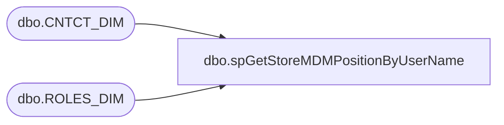

# dbo.spGetStoreMDMPositionByUserName

**Database:** BABWPartyPlanner_Restore  
**Server:** bearcluster01  

## Architecture Diagram



## Table Dependencies

| Referenced Table |
|---|
| dbo.CNTCT_DIM |
| dbo.ROLES_DIM |

## Stored Procedure Code

```sql
CREATE PROCEDURE [dbo].[spGetStoreMDMPositionByUserName] 
	@UserName AS VARCHAR(40)

AS

-- =============================================================================================================
-- Name: spGetStoreMDMPositionByUserName
--
-- Description:	Look up user Position in StoreMDM via UserName
--	
-- Output: Position and Position Description
--	
-- Available actions:
--	
-- Dependencies: 
--		BABWMstrData.dbo.CNTCT_DIM
--		BABWMstrData.dbo.ROLES_DIM

-- Revision History
--		Name:			Date:			Comments:
--		Ben Barud		07/20/2017		Creation
 	
-- =============================================================================================================

BEGIN
	-- SET NOCOUNT ON added to prevent extra result sets from
	-- interfering with SELECT statements.
	SET NOCOUNT ON;

    SELECT rd.R_POSITION AS 'Position' 
       ,rd.NM AS 'PositionDescription'
	FROM KODIAK.[BABWMstrData].[dbo].[CNTCT_DIM] cd
    LEFT JOIN KODIAK.[BABWMstrData].[dbo].[ROLES_DIM] rd ON cd.ROLE_ID = rd.ROLE_ID
    WHERE END_DATE = '2399-12-31 23:59:59.000' 
	AND SUBSTRING(cd.EMAIL, 0, CHARINDEX('@', cd.EMAIL)) = @UserName
END
```

