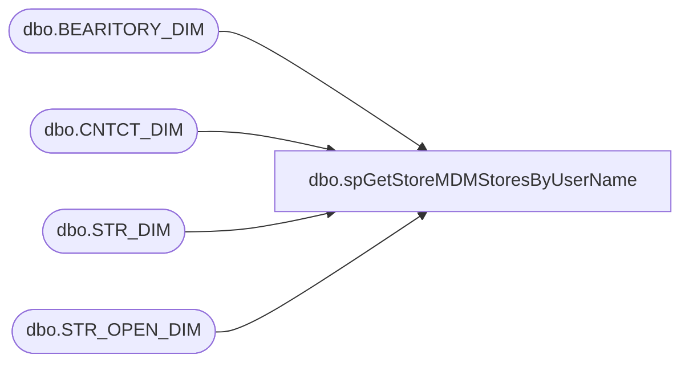

# dbo.spGetStoreMDMStoresByUserName

**Database:** BABWPartyPlanner_Restore  
**Server:** bearcluster01  

## Architecture Diagram



## Table Dependencies

| Referenced Table |
|---|
| dbo.BEARITORY_DIM |
| dbo.CNTCT_DIM |
| dbo.STR_DIM |
| dbo.STR_OPEN_DIM |

## Stored Procedure Code

```sql
CREATE PROCEDURE [dbo].[spGetStoreMDMStoresByUserName]
	@UserName AS VARCHAR(40)
AS

-- =============================================================================================================
-- Name: spGetStoreMDMPosition
--
-- Description:	Look up user Stores in StoreMDM via UserName
--	
-- Output: STR_NUMs
--	
-- Available actions:
--	
-- Dependencies: 
--		BABWMstrData.dbo.BEARITORY_DIM
--		BABWMstrData.dbo.CNTCT_DIM
--		BABWMstrData.dbo.STR_DIM

-- Revision History
--		Name:			Date:			Comments:
--		Ben Barud		07/20/2017		Creation
--		Ben Barud		10/23/2017		Added logic to exlude closed stores 	
-- =============================================================================================================

BEGIN
	-- SET NOCOUNT ON added to prevent extra result sets from
	-- interfering with SELECT statements.
	SET NOCOUNT ON;

	SELECT STR_NUM
	FROM
	(
    SELECT sd.STR_NUM
	      ,MAX(CLOSE_DT) AS 'CLOSE_DT'
		  ,MAX(CAST([PERM_CLOSE] AS INT)) AS 'PERM_CLOSE'
		  ,cd.EMAIL
    FROM KODIAK.[BABWMstrData].[dbo].[BEARITORY_DIM] bd
    LEFT JOIN KODIAK.[BABWMstrData].[dbo].[CNTCT_DIM] cd ON bd.CNTCT_ID = cd.CNTCT_ID
    LEFT JOIN KODIAK.[BABWMstrData].[dbo].[STR_DIM] sd ON bd.BEARITORY_ID = sd.BEARITORY_ID
	INNER JOIN KODIAK.[BABWMstrData].[dbo].[STR_OPEN_DIM] sod ON sod.STR_KEY = sd.STR_ID 
    --WHERE SUBSTRING(cd.EMAIL, 0, CHARINDEX('@', cd.EMAIL)) = @UserName
	GROUP BY sd.STR_NUM, cd.EMAIL
	--ORDER BY STR_NUM
	) AS innerQry
	WHERE SUBSTRING(EMAIL, 0, CHARINDEX('@', EMAIL)) = @UserName AND PERM_CLOSE = 0
END
```

