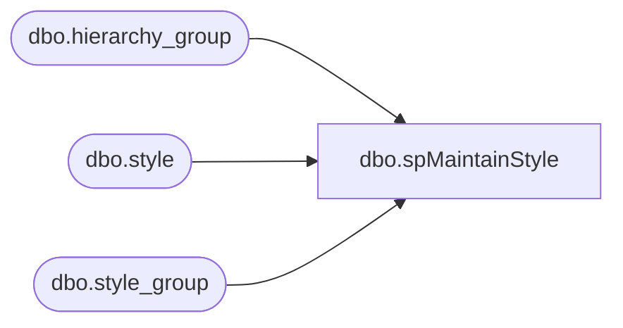

# dbo.spMaintainStyle

**Database:** BABWPartyPlanner_Restore  
**Server:** bearcluster01  

## Architecture Diagram



## Table Dependencies

| Referenced Table |
|---|
| dbo.hierarchy_group |
| dbo.style |
| dbo.style_group |

## Stored Procedure Code

```sql
CREATE PROC [dbo].[spMaintainStyle]
@Action VARCHAR(15)= 'Process'
AS

SET NOCOUNT ON

-- =============================================================================================================
-- Name: spMaintainStyle
--
-- Description:	INSERT, UPDATE, and DELETE from Style table from bedrockdb02.me_01.style
--
-- Output: Error logging.
-- 
-- Available actions: Maintain Style
--
-- @Action:
--	'ReturnVersion' = Do not do anything but return the version of the objects
--	'Process' = populate the object version log 
--
-- Revision History
--		Name:			Date:			Comments:
--		Ben Barud		09/13/2018		Creation

-- =============================================================================================================
DECLARE @Revision DATETIME
SET @Revision = '09/13/2018'
/*
exec spMaintainAttribute

*/
-- =============================================================================================================

----------------------------------------------------------------------------------------------------
--// Set options                                                                                //--
----------------------------------------------------------------------------------------------------
SET NOCOUNT ON

----------------------------------------------------------------------------------------------------
--// Revision                                                                                  //--
----------------------------------------------------------------------------------------------------
IF @Action = 'ReturnVersion'
BEGIN
	GOTO EndHere
END

----------------------------------------------------------------------------------------------------
--// Maintenance	                                                                            //--
----------------------------------------------------------------------------------------------------

INSERT INTO dbo.Style(StyleID, StyleCode,LongDesc, ShortDesc)
SELECT s.style_id, style_code,long_desc, short_desc
FROM bedrockdb02.me_01.dbo.style s
INNER JOIN bedrockdb02.me_01.dbo.style_group sg WITH (NOLOCK) ON s.style_id=sg.style_id 
INNER JOIN bedrockdb02.me_01.dbo.hierarchy_group hgsub WITH (NOLOCK) ON sg.hierarchy_group_id=hgsub.hierarchy_group_id 
WHERE s.style_id NOT IN (SELECT StyleID FROM dbo.Style)

UPDATE s
SET s.StyleCode = os.style_code, s.LongDesc = os.long_desc, s.ShortDesc = os.short_desc
FROM dbo.Style s
INNER JOIN bedrockdb02.me_01.dbo.style os ON s.StyleID = os.style_id
INNER JOIN bedrockdb02.me_01.dbo.style_group sg WITH (NOLOCK) ON os.style_id=sg.style_id 
INNER JOIN bedrockdb02.me_01.dbo.hierarchy_group hgsub WITH (NOLOCK) ON sg.hierarchy_group_id=hgsub.hierarchy_group_id 
WHERE s.StyleCode <> os.style_code  
OR s.LongDesc <> os.long_desc
OR s.ShortDesc <> os.short_desc

DELETE FROM dbo.Style WHERE StyleID NOT IN (SELECT style_id FROM bedrockdb02.me_01.dbo.style)

EndHere:
IF @Action = 'ReturnVersion'
BEGIN
	SELECT @Revision 
END

RETURN 0
```

