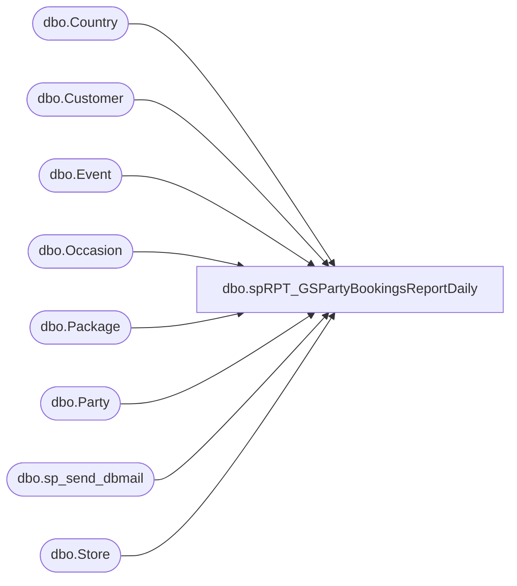

# dbo.spRPT_GSPartyBookingsReportDaily

**Database:** BABWPartyPlanner_Restore  
**Server:** bearcluster01  

## Architecture Diagram



## Table Dependencies

| Referenced Table |
|---|
| dbo.Country |
| dbo.Customer |
| dbo.Event |
| dbo.Occasion |
| dbo.Package |
| dbo.Party |
| dbo.sp_send_dbmail |
| dbo.Store |

## Stored Procedure Code

```sql
CREATE PROC [dbo].[spRPT_GSPartyBookingsReportDaily]
-- =============================================================================================================
-- Name: [dbo].[spRPT_GSPartyBookingsReportDaily]
--
-- Description:	returns detail data for all parties booked the previous day with Girl Scouts occasions or packages chosen
--
-- Revision History
--		Name:			Date:			Comments:
--		TimB			3/8/2017		Initial Creation
--
--
-- USAGE:  EXEC [dbo].[spRPT_GSPartyBookingsReportDaily] @ac_recipients = 'timb@buildabear.com'
-- =============================================================================================================

@ac_recipients VARCHAR(255)

AS 
    SET NOCOUNT ON
    SET ANSI_WARNINGS OFF 
    SET ANSI_NULLS OFF


declare @html nvarchar(max),
		@head nvarchar(max),
		@tableHTML nvarchar(max),
		@GSPartiesHTML nvarchar(max),
		@Subject varchar(max)
declare @GSPartiesBooked TABLE(PartyLink XML, EventStart XML, StoreNumber XML, TotalGuests XML, CreatedBy XML, CreatedDate XML, OccasionName XML, PackageName XML, EmailAddress varchar(256), CountryAbbr varchar(3))


----------------------------------------------------------------------------------------
--   Get my initial dataset (note I'm doing some HTML work in the cells here)
----------------------------------------------------------------------------------------
INSERT INTO @GSPartiesBooked
SELECT 
	   '<a href="https://www.buildabear.com/on/demandware.store/Sites-buildabear-us-Site/default/PartyAdmin-PrintDetail?partyId=' 
			+ CAST(p.PartyId as varchar(16)) 
			+ '">' 
			+ CAST(p.PartyId as varchar(16))
			+ '</a>'
	   as PartyLink,
	   	CASE
			WHEN c.CountryAbbr <> 'US' THEN '<span style="margin:5px;color:white;background-color:red">! ' + CAST(e.EventStart as varchar(30)) + ' !</span>'
			WHEN e.EventStart < DATEADD(day, 14, GETDATE()) THEN '<span style="margin:5px;background-color:yellow">| ' + CAST(e.EventStart as varchar(30)) + ' |</span>'
			ELSE CAST(e.EventStart as varchar(30))
	   END as EventStart,
	   CASE
			WHEN c.CountryAbbr <> 'US' THEN '<span style="margin:5px;color:white;background-color:red">! ' + CAST(s.StoreNumber as varchar(30)) + ' !</span>'
			WHEN e.EventStart < DATEADD(day, 14, GETDATE()) THEN '<span style="margin:5px;background-color:yellow">| ' + CAST(s.StoreNumber as varchar(30)) + ' |</span>'
			ELSE CAST(s.StoreNumber as varchar(30))
	   END as StoreNumber,
	   CASE
			WHEN c.CountryAbbr <> 'US' THEN '<span style="margin:5px;color:white;background-color:red">! ' + CAST(p.TotalGuests as varchar(30)) + ' !</span>'
			WHEN e.EventStart < DATEADD(day, 14, GETDATE()) THEN '<span style="margin:5px;background-color:yellow">| ' + CAST(p.TotalGuests as varchar(30)) + ' |</span>'
			ELSE CAST(p.TotalGuests as varchar(30))
	   END as TotalGuests,
	   CASE
			WHEN c.CountryAbbr <> 'US' THEN '<span style="margin:5px;color:white;background-color:red">! ' + CAST(e.CreatedBy as varchar(30)) + ' !</span>'
			WHEN e.EventStart < DATEADD(day, 14, GETDATE()) THEN '<span style="margin:5px;background-color:yellow">| ' + CAST(e.CreatedBy as varchar(30)) + ' |</span>'
			ELSE CAST(e.CreatedBy as varchar(30))
	   END as CreatedBy,
	   CASE
			WHEN c.CountryAbbr <> 'US' THEN '<span style="margin:5px;color:white;background-color:red">! ' + CAST(e.CreatedDate as varchar(30)) + ' !</span>'
			WHEN e.EventStart < DATEADD(day, 14, GETDATE()) THEN '<span style="margin:5px;background-color:yellow">| ' + CAST(e.CreatedDate as varchar(30)) + ' |</span>'
			ELSE CAST(e.CreatedDate as varchar(30))
	   END as CreatedDate,
	   CASE
			WHEN c.CountryAbbr <> 'US' THEN '<span style="margin:5px;color:white;background-color:red">! ' + CAST(o.OccasionName as varchar(30)) + ' !</span>'
			WHEN e.EventStart < DATEADD(day, 14, GETDATE()) THEN '<span style="margin:5px;background-color:yellow">| ' + CAST(o.OccasionName as varchar(30)) + ' |</span>'
			ELSE CAST(o.OccasionName as varchar(30))
	   END as OccasionName,
	   CASE
			WHEN c.CountryAbbr <> 'US' THEN '<span style="margin:5px;color:white;background-color:red">! ' + CAST(pa.PackageName as varchar(30)) + ' !</span>'
			WHEN e.EventStart < DATEADD(day, 14, GETDATE()) THEN '<span style="margin:5px;background-color:yellow">| ' + CAST(pa.PackageName as varchar(30)) + ' |</span>'
			ELSE CAST(pa.PackageName as varchar(30))
	   END as PackageName,
	   cu.EmailAddress,
	   c.CountryAbbr
FROM Party p
LEFT JOIN Event e
	ON p.EventID = e.EventID
LEFT JOIN Occasion o
	ON p.OccasionID = o.OccasionID
LEFT JOIN Package pa
	ON p.PackageID = pa.PackageID
LEFT JOIN Store s
	ON e.StoreID = s.StoreID
LEFT JOIN Country c
	ON s.CountryID = c.CountryID
LEFT JOIN Customer cu
	ON p.CustomerID = cu.CustomerID
WHERE CAST(e.CreatedDate as Date) = CAST(DATEADD(day, -1, GETDATE()) as Date)
AND (p.PackageID = 77 -- Girlscout themed party 
		OR p.OccasionID IN (110,111,112,113,114) -- All Girl scouts occasions)
	)

----------------------------------------------------------------------------------------
--   Setting the Subject, the opening tags for the full html, and the heading
----------------------------------------------------------------------------------------

set @Subject = 'Daily Girl Scout Parties for ' + CONVERT(VARCHAR,DATEADD(day, -1, GETDATE()), 101)

set @html = '<html><style>h3{margin-bottom:0px; font-family:Calibri;}div{margin-left:50px; font-family:Calibri;}</style>'

set @head = '<head><style>' +
	'td {border: solid black 1px;padding-left:5px;padding-right:5px;padding-top:1px;padding-bottom:1px;font-size:11pt;} td span {padding:5px;}' +
	'</style></head><body>' +
	'<div style="margin-top:20px; margin-left:5px; margin-bottom:15px; font-weight:bold; font-size:1.3em; font-family:calibri;">Daily Girl Scout Parties for ' + CONVERT(VARCHAR,DATEADD(day, -1, GETDATE()), 101) + '</div>'


----------------------------------------------------------------------------------------
--   Party Bookings HTML Table
----------------------------------------------------------------------------------------
set @GSPartiesHTML = '<div><h3>Party Counts</h3>Girl Scout Themed Parties Booked</div><div><table cellpadding=0 cellspacing=0 border=0>' +
	'<tr bgcolor=#4b6c9e>' +
	'<td align=center><font face="calibri" color=White><b>Party Link</b></font></td>' +    -- Manually type headers
	'<td align=center><font face="calibri" color=White><b>Event Start</b></font></td>' +    -- Manually type headers
	'<td align=center><font face="calibri" color=White><b>Store Number</b></font></td>' +    -- Manually type headers
	'<td align=center><font face="calibri" color=White><b>Total Guests</b></font></td>' +    -- Manually type headers
	'<td align=center><font face="calibri" color=White><b>Created By</b></font></td>' +    -- Manually type headers
	'<td align=center><font face="calibri" color=White><b>Created Date</b></font></td>' +    -- Manually type headers
	'<td align=center><font face="calibri" color=White><b>Occasion name</b></font></td>' +   -- Manually type headers
	'<td align=center><font face="calibri" color=White><b>Package name</b></font></td>'     -- Manually type headers

----------------------------------------------------------------------------------------
--   Assembling the body HTML
----------------------------------------------------------------------------------------
declare @body varchar(max)
select @body =
(
	select  td = PartyLink,     -- Here we put the column names
			td = EventStart,
			td = StoreNumber,
			td = TotalGuests,
			td = CreatedBy,
			td = CreatedDate, 
			td = OccasionName,
			td = PackageName

	FROM @GSPartiesBooked
	for XML raw('tr'), elements
)

set @body = REPLACE(@body, '<td>', '<td align=center><font face="calibri">')
set @body = REPLACE(@body, '</td>', '</font></td>')
set @body = REPLACE(@body, '_x0020_', space(1))
set @body = REPLACE(@body, '_x003D_', '=')
set @body = REPLACE(@body, '<tr><TRRow>0</TRRow>', '<tr bgcolor=#F8F8FD>')
set @body = REPLACE(@body, '<tr><TRRow>1</TRRow>', '<tr bgcolor=#EEEEF4>')
set @body = REPLACE(@body, '<TRRow>0</TRRow>', '')


----------------------------------------------------------------------------------------
--   Combine the Party HTML Table with the Body
----------------------------------------------------------------------------------------
SET @GSPartiesHTML = @GSPartiesHTML + @body + '</table></div><BR>'

----------------------------------------------------------------------------------------
--   We need a list of email addresses for easy copy/paste action
----------------------------------------------------------------------------------------
DECLARE @listStr VARCHAR(MAX)
SELECT @listStr = CAST(COALESCE(@listStr + ';' , '') as varchar(MAX)) + EmailAddress
from @GSPartiesBooked
where CountryAbbr = 'US'

SET @listStr = '<a href="mailto:Guest.Services@buildabear.com?bcc=' + @listStr + '">Send Email</a>'

----------------------------------------------------------------------------------------
--   Put EVERYTHING together
----------------------------------------------------------------------------------------
set @html = @html + @head + ISNULL(@GSPartiesHTML,'') + 

'<BR><BR><h3>Link for Sending Email To All Guests</h3>' + @listStr + '</html>'
set @html = '<div style="color:Black; font-size:11pt; font-family:Calibri; width:100px;">' + @html + '</div>'

----------------------------------------------------------------------------------------
--   Send the email
----------------------------------------------------------------------------------------

exec msdb.dbo.sp_send_dbmail
	@profile_name = 'BIAdmin',
	@recipients = @ac_recipients,
	@copy_recipients = 'biadmin@buildabear.com;kevinpa@buildabear.com;sheelaa@buildabear.com;arth@buildabear.com',
	@body = @html,
	@subject = @Subject,
	@body_format = 'HTML'


dbo,spRPT_PartyBookingAnnualSummary,--CREATE PROCEDURE [dbo].[spRPT_PartyBookingAnnualSummary]
CREATE PROC [dbo].[spRPT_PartyBookingAnnualSummary]
/* =============================================================================================================
 Name: [spRPT_PartyBookingAnnualSummary]

 Description:	returns detail data for web sales based on site code

 Input:		@ac_date		varchar(20)		date to pull web sales
				@ac_sitecode	varchar(25)		'BABW_US','BABW_UK','BABW_CA'
				@ac_recipients  varchar(25)		email recipients
				@abit_mtd		bit				if 0, then only pull daily sales; if 1, pull month to date sales
				exec [dbo].[spRPT_PartyBookingAnnualSummary]'BABW_US','lizzyt@buildabear.com'

 Output: 


 Revision History
		Name:			Date:			Comments:
		Lizzy Timm	    02/21/2018		Created
=============================================================================================================*/
	@ac_sitecode VARCHAR(25),
	@ac_recipients VARCHAR(255)
AS 
    SET NOCOUNT ON
----------------------------------------------------------------------------------------
/* ===== DECLARATIONS ===== */
----------------------------------------------------------------------------------------
DECLARE
	@Today DATE,
	@TodayLY DATE,
	@Yesterday DATE,
	@YesterdayLY DATE,
	@ThisYear INT,
	@LastYear INT,
	@FiscalYear INT,
	@FiscalYearLY INT,
	@Year_Begin DATE,
	@Year_BeginLY DATE,
	@Year_End DATE,
	@Year_EndLY DATE,
	@DayOfYear INT,
	@PartyCount INT,
	@PartyCountLY INT,
	@countrycode varchar(4),
    @EmailSubject VARCHAR(100),
	@html nvarchar(max),
	@head nvarchar(max),
	@header nvarchar(max),
	@tableHTML nvarchar(max),
	@methodTableHTML nvarchar(max),
	@body varchar(max),
	@totalTableHTML nvarchar(max),
	@totalBody varchar(max)
DECLARE @TotalParties TABLE (TY int, LY int, diff varchar(8))
SET @Today = ( CAST(getdate() AS DATE) )
SET @TodayLY = (DATEADD(Year,-1,@Today))
SET @Yesterday = (DATEADD(Day,-1,@Today))
SET @YesterdayLY = (DATEADD(Year,-1,@Yesterday))
SET @ThisYear = CONVERT(INT, YEAR(GETDATE()))
SET @LastYear = CONVERT(INT, YEAR(DATEADD(YEAR,-1,GETDATE())))
SET @FiscalYear = (
	SELECT DISTINCT fiscal_year
	FROM papamart.dw.dbo.date_dim 
	WHERE fiscal_year = @LastYear
)
SET @FiscalYearLY = (
	SELECT DISTINCT fiscal_year
	FROM papamart.dw.dbo.date_dim 
	WHERE fiscal_year = @LastYear - 1
)
SET @Year_Begin = (
	SELECT MIN (actual_date) 
	FROM papamart.dw.dbo.date_dim 
	WHERE fiscal_year = @FiscalYear
)
SET @Year_BeginLY = (
	SELECT MIN (actual_date) 
	FROM papamart.dw.dbo.date_dim 
	WHERE fiscal_year = @FiscalYearLY
)
SET @Year_End = (
	SELECT MAX (CAST(actual_date AS DATE)) 
	FROM papamart.dw.dbo.date_dim 
	WHERE fiscal_year = @FiscalYear
)
SET @Year_EndLY = (
	SELECT MAX (CAST(actual_date AS DATE)) 
	FROM papamart.dw.dbo.date_dim 
	WHERE fiscal_year = @FiscalYearLY
)
SET @DayOfYear = CONVERT(INT,(
	SELECT DISTINCT day_of_year
	FROM papamart.dw.dbo.date_dim 
	WHERE actual_date = ( CAST(DATEADD(DAY,-1,getdate())AS DATE) )
))
----------------------------------------------------------------------------------------
/*======Set Country=========*/
----------------------------------------------------------------------------------------
IF @ac_sitecode IN ('BABW_US', 'BABW_UK', 'BABW_CA')
BEGIN
		IF @ac_sitecode = 'babw_us'
		BEGIN
			SET @countrycode = 'US'
		END

		IF @ac_sitecode = 'babw_uk'
		BEGIN
			SET @countrycode = 'UK'
		END

		IF @ac_sitecode = 'babw_ca'
		BEGIN
			SET @countrycode = 'CA'
		END
END
----------------------------------------------------------------------------------------
/*======Create Master Data Set=========*/
----------------------------------------------------------------------------------------
IF OBJECT_ID('tempdb..##PartiesBooked') IS NOT NULL DROP TABLE ##PartiesBooked
SELECT CASE WHEN e.CreatedBy = 'guest' THEN 'WEB'
		WHEN e.CreatedBy LIKE 'store%' THEN 'POS'
		ELSE 'BSR'
		END AS BookingMethod,
		e.eventid,
		CAST(e.CreatedDate AS DATE) AS CreatedDate,
		co.CountryAbbr
INTO ##PartiesBooked
FROM    BABWPartyPlanner.dbo.Event e WITH ( NOLOCK )
INNER JOIN BABWPartyPlanner.dbo.Party p WITH ( NOLOCK ) 
    ON e.EventID = p.EventID AND p.PartyStateID <>  2
INNER JOIN BABWPartyPlanner.dbo.Store s WITH ( NOLOCK ) 
    ON e.StoreID = s.StoreID
LEFT JOIN BABWPartyPlanner.dbo.Country co WITH (NOLOCK) 
    ON s.CountryID = co.CountryID
WHERE   e.EventType = 1
    AND e.Active = 1
    AND co.CountryAbbr = @countrycode
--This Year
IF OBJECT_ID('tempdb..##AMasterDatasetTY') IS NOT NULL DROP TABLE ##AMasterDatasetTY
SELECT  BookingMethod,
        COUNT(EventID) as PartiesBooked,
        CreatedDate,
        CountryAbbr,
        dd.fiscal_year,
        dd.fiscal_period,
        dd.fiscal_quarter,
        dd.fiscal_week,
        dd.month,
        dd.day_of_year
INTO ##AMasterDatasetTY
FROM ##PartiesBooked pb
LEFT JOIN papamart.dw.dbo.date_dim dd WITH (NOLOCK) 
    ON CAST(pb.CreatedDate AS DATE) = CAST(dd.actual_date AS DATE)
WHERE CreatedDate BETWEEN @Year_Begin AND @Year_End
GROUP BY BookingMethod, CreatedDate, CountryAbbr, dd.fiscal_year, dd.fiscal_period, dd.fiscal_quarter, dd.fiscal_week, dd.month, dd.day_of_year
--Last Year
IF OBJECT_ID('tempdb..##AMasterDatasetLY') IS NOT NULL DROP TABLE ##AMasterDatasetLY
SELECT  BookingMethod,
        COUNT(EventID) as PartiesBooked,
        CreatedDate,
        CountryAbbr,
        dd.fiscal_year,
        dd.fiscal_period,
        dd.fiscal_quarter,
        dd.fiscal_week,
        dd.month,
        dd.day_of_year
INTO ##AMasterDatasetLY
FROM ##PartiesBooked pb
LEFT JOIN papamart.dw.dbo.date_dim dd WITH (NOLOCK) 
    ON CAST(pb.CreatedDate AS DATE) = CAST(dd.actual_date AS DATE)
WHERE CreatedDate BETWEEN @Year_BeginLY AND @Year_EndLY
GROUP BY BookingMethod, CreatedDate, CountryAbbr, dd.fiscal_year, dd.fiscal_period, dd.fiscal_quarter, dd.fiscal_week, dd.month, dd.day_of_year
----------------------------------------------------------------------------------------
/*======Set HTML=========*/
----------------------------------------------------------------------------------------
set @html = '<html>'

set @head = '<head><style>'
			+ 'h3{margin-bottom:0px; font-family:Calibri;}'
			+ 'h2{margin-top:10px; margin-left:5px; margin-bottom:15px; font-weight:bold; font-size:1.3em; font-family:calibri;}'
			+ 'div{margin-left:50px; font-family:Calibri;}'
			+ 'td {border-collapse: collapse;border: solid black 1px;padding-left:5px;padding-right:5px;padding-top:1px;padding-bottom:1px;font-size:11pt;}'
			+ 'table {cellpadding:0; cellspacing:0; border:0; width:50%}'
			+ 'table.totals {cellpadding:0; cellspacing:0; border:0; width:25%}'
			+ 'th {background-color:#4b6c9e;border-collapse: collapse;border: solid black 1px; color: white; text-align:center; font-weight:bold;}'
			+ 'th.BookM{width: 25%;}'
			+ 'tr {background-color:#FFF;}'
			+ 'footer {margin-left:50px;}'
			+ '</style></head><body>'
----------------------------------------------------------------------------------------
/*=======Set Subject, Heading, and Tables Based on @abit_wtd ========*/
----------------------------------------------------------------------------------------
--Email Subject	
	--Set Part Counts for Email Subject
SET @PartyCount = (
	SELECT SUM(ISNULL(PartiesBooked, 0))
	FROM ##AMasterDatasetTY
)
SET @PartyCountLY = (
	SELECT SUM(ISNULL(PartiesBooked, 0)) 
	FROM ##AMasterDatasetLY
)
--Set Email Subect Text
SET @EmailSubject = ( SELECT   'Fiscal Year ' + CAST(@FiscalYear AS VARCHAR) + ': ' + @countrycode + ' Parties / ' 
	+ CAST(@PartyCount AS VARCHAR) 
    + ' TY Parties / '
    + CAST(@PartyCountLY AS VARCHAR) 
    + ' LY Parties'
)
--Heading
SET @header = '<div><h2>' 
	+ CAST(@countrycode AS VARCHAR) + ', ' 
	+ 'Fiscal Year ' + CAST(@FiscalYear AS VARCHAR) 
	+ '<br/>' 
	+ 'LY from ' + CAST(@Year_Begin AS VARCHAR) + ' to ' + CAST(@Year_End AS VARCHAR) 
	+ '<br/>' 
	+ 'TY from ' + CAST(@Year_BeginLY AS VARCHAR) + ' to ' + CAST(@Year_EndLY AS VARCHAR)
	+ '</h2></div>'
--Table (By Booking Method) 
--------Table Structure
SET @methodTableHTML = '<div><h3>Party Counts by Method</h3></div><div><table>'
	+ '<tr>'
	+ '<th class="bookM">Booking Method</th>'
	+ '<th>TY</th>'
	+ '<th>LY</th>'
	+ '<th>Diff</th>' 
	--Select Data for Table
;WITH TYTotals AS
(
    SELECT SUM(PartiesBooked) TY,
            BookingMethod
    FROM ##AMasterDatasetTY
    GROUP BY BookingMethod
),
LYTotals AS
(
    SELECT SUM(PartiesBooked) LY,
			BookingMethod
    FROM ##AMasterDatasetLY
    GROUP BY BookingMethod
)
SELECT @body = (
	SELECT td = ty.BookingMethod,
			td = ty.TY,
			td = ly.LY,
			td = STR((cast(ty.TY as decimal) - cast(ly.LY as decimal)) / cast(ly.LY as decimal) * 100.00, 6, 1) + '%'
	FROM TYTotals ty
	LEFT JOIN LYTotals ly
		ON ty.BookingMethod = ly.BookingMethod
	ORDER BY ty.BookingMethod
	for XML raw('tr'), elements
)
-------Assign Data to Table Structure
SET @body = REPLACE(@body, '<td>', '<td align=center><font face="calibri">')
SET @body = REPLACE(@body, '</td>', '</font></td>')
SET @body = REPLACE(@body, '_x0020_', space(1))
SET @body = REPLACE(@body, '_x003D_', '=')
SET @body = REPLACE(@body, '<tr><TRRow>0</TRRow>', '<tr>')
SET @body = REPLACE(@body, '<tr><TRRow>1</TRRow>', '<tr>')
SET @body = REPLACE(@body, '<TRRow>0</TRRow>', '')
SET @methodTableHTML = @methodTableHTML + @body + '</table></div><BR/>'	
--Table (Totals)
-------Table Structure
SET @totalTableHTML = '<div><h3>Total Party Counts</h3></div><div><table class=totals>'
	+ '<tr bgcolor=##4b6c9e>' 
	+ '<th>TY</th>'
	+ '<th>LY</th>'
	+ '<th>Diff</th>' 
-------Select Data for Table
SELECT @totalBody = (
	SELECT  td = @PartyCount,
			td = @PartyCountLY,
			td = STR((cast(@PartyCount as decimal) - cast(@PartyCountLY as decimal)) / cast(@PartyCountLY as decimal) * 100.00, 6, 1) + '%'
	for XML raw('tr'), elements
)
-------Assign Data to Table Structure
SET @totalBody = REPLACE(@totalBody, '<td>', '<td align=center><font face="calibri">')
SET @totalBody = REPLACE(@totalBody, '</td>', '</font></td>')
SET @totalBody = REPLACE(@totalBody, '_x0020_', space(1))
SET @totalBody = REPLACE(@totalBody, '_x003D_', '=')
SET @totalBody = REPLACE(@totalBody, '<tr><TRRow>0</TRRow>', '<tr>')
SET @totalBody = REPLACE(@totalBody, '<tr><TRRow>1</TRRow>', '<tr>')
SET @totalBody = REPLACE(@totalBody, '<TRRow>0</TRRow>', '')
SET @totalTableHTML = @totalTableHTML + @totalBody + '</table></div><BR/>'	
----------------------------------------------------------------------------------------
/*=======Close Tags and Bring Together========*/
----------------------------------------------------------------------------------------
SET @html = @html 
	+ @head 
	+ @header 
	+ ISNULL(@methodTableHTML,'') 
	+ ISNULL(@totalTableHTML,'') 
	+ '</body><footer>Please notify webteam@buildabear.com with questions or comments on this report. stored procedure BABWPartyPlanner.dbo.spRPT_PartyBookingAnnualSummary.</footer></html>'
SET @html = '<div style="color:Black; font-size:11pt; font-family:Calibri; width:100px;">' 
	+ @html 
	+ '</div>'
--SELECT CAST(@html as varchar(8000)) as result
EXEC msdb.dbo.sp_send_dbmail
 --@profile_name = 'BIAdmin'
	@recipients=@ac_recipients,
	@subject = @EmailSubject,
	@body = @html,
	@body_format = 'HTML'
dbo,spRPT_PartyBookingCustomSummary,--CREATE PROCEDURE [dbo].[spRPT_PartyBookingCustomSummary]
CREATE PROC [dbo].[spRPT_PartyBookingCustomSummary]
/* =============================================================================================================
 Name: [spRPT_PartyBookingCustomSummary]

 Description:	returns detail data for web sales based on site code

 Input:		@ac_date		varchar(20)		date to pull web sales
				@ac_sitecode	varchar(25)		'BABW_US','BABW_UK','BABW_CA'
				@ac_recipients  varchar(25)		email recipients
				@abit_mtd		bit				if 0, then only pull daily sales; if 1, pull month to date sales
				exec [dbo].[spRPT_PartyBookingCustomSummary] '1/01/2018','1/30/2018','BABW_US','lizzyt@buildabear.com'
				exec [dbo].[spRPT_PartyBookingCustomSummary] '2/01/2018','2/19/2018','BABW_UK','lizzyt@buildabear.com'

 Output: 


 Revision History
		Name:			Date:			Comments:
		Lizzy Timm	    02/21/2018		Created
=============================================================================================================*/
    @ac_date_begin1 DATE,
	@ac_date_end1 DATE,
	@ac_sitecode VARCHAR(25),
	@ac_recipients VARCHAR(255)
AS 
    SET NOCOUNT ON
----------------------------------------------------------------------------------------
/* ===== DECLARATIONS ===== */
----------------------------------------------------------------------------------------
DECLARE
	@ac_date_begin2 DATE,
	@ac_date_end2 DATE,
	@PartyCount INT,
	@PartyCountLY INT,
	@countrycode varchar(4),
    @EmailSubject VARCHAR(100),
	@html nvarchar(max),
	@head nvarchar(max),
	@header nvarchar(max),
	@tableHTML nvarchar(max),
	@methodTableHTML nvarchar(max),
	@body varchar(max),
	@totalTableHTML nvarchar(max),
	@totalBody varchar(max)
DECLARE @TotalParties TABLE (TY int, LY int, diff varchar(8))
SET @ac_date_begin2 = (DATEADD(Year, -1, @ac_date_begin1)
)
SET @ac_date_end2 = (DATEADD(Year, -1, @ac_date_end1)
)
----------------------------------------------------------------------------------------
/*======Set Country=========*/
----------------------------------------------------------------------------------------
IF @ac_sitecode IN ('BABW_US', 'BABW_UK', 'BABW_CA')
BEGIN
		IF @ac_sitecode = 'babw_us'
		BEGIN
			SET @countrycode = 'US'
		END

		IF @ac_sitecode = 'babw_uk'
		BEGIN
			SET @countrycode = 'UK'
		END

		IF @ac_sitecode = 'babw_ca'
		BEGIN
			SET @countrycode = 'CA'
		END
END
----------------------------------------------------------------------------------------
/*======Create Master Data Set=========*/
----------------------------------------------------------------------------------------
IF OBJECT_ID('tempdb..##PartiesBooked') IS NOT NULL DROP TABLE ##PartiesBooked
SELECT CASE WHEN e.CreatedBy = 'guest' THEN 'WEB'
		WHEN e.CreatedBy LIKE 'store%' THEN 'POS'
		ELSE 'BSR'
		END AS BookingMethod,
		e.eventid,
		CAST(e.CreatedDate AS DATE) AS CreatedDate,
		co.CountryAbbr
INTO ##PartiesBooked
FROM BABWPartyPlanner.dbo.Event e WITH ( NOLOCK )
INNER JOIN BABWPartyPlanner.dbo.Party p WITH ( NOLOCK ) 
    ON e.EventID = p.EventID AND p.PartyStateID <>  2
INNER JOIN BABWPartyPlanner.dbo.Store s WITH ( NOLOCK ) 
    ON e.StoreID = s.StoreID
LEFT JOIN BABWPartyPlanner.dbo.Country co WITH (NOLOCK) 
    ON s.CountryID = co.CountryID
WHERE   e.EventType = 1
    AND e.Active = 1
    AND co.CountryAbbr = @countrycode
--This Year
IF OBJECT_ID('tempdb..##CMasterDatasetTY') IS NOT NULL DROP TABLE ##CMasterDatasetTY
SELECT  BookingMethod,
        COUNT(EventID) as PartiesBooked,
        CreatedDate
INTO ##CMasterDatasetTY
FROM ##PartiesBooked pb
LEFT JOIN papamart.dw.dbo.date_dim dd WITH (NOLOCK) 
    ON CAST(pb.CreatedDate AS DATE) = CAST(dd.actual_date AS DATE)
WHERE CreatedDate BETWEEN @ac_date_begin1 and @ac_date_end1
GROUP BY BookingMethod, CreatedDate, CountryAbbr
--Last Year
IF OBJECT_ID('tempdb..##CMasterDatasetLY') IS NOT NULL DROP TABLE ##CMasterDatasetLY
SELECT  BookingMethod,
        COUNT(EventID) as PartiesBooked,
        CreatedDate,
        CountryAbbr
INTO ##CMasterDatasetLY
FROM ##PartiesBooked pb
LEFT JOIN papamart.dw.dbo.date_dim dd WITH (NOLOCK) 
    ON CAST(pb.CreatedDate AS DATE) = CAST(dd.actual_date AS DATE)
WHERE CreatedDate BETWEEN @ac_date_begin2 and @ac_date_end2
GROUP BY BookingMethod, CreatedDate, CountryAbbr
----------------------------------------------------------------------------------------
/*======Set HTML=========*/
----------------------------------------------------------------------------------------
set @html = '<html>'

set @head = '<head><style>'
			+ 'h3{margin-bottom:0px; font-family:Calibri;}'
			+ 'h2{margin-top:10px; margin-left:5px; margin-bottom:15px; font-weight:bold; font-size:1.3em; font-family:calibri;}'
			+ 'div{margin-left:50px; font-family:Calibri;}'
			+ 'td {border-collapse: collapse;border: solid black 1px;padding-left:5px;padding-right:5px;padding-top:1px;padding-bottom:1px;font-size:11pt;}'
			+ 'table {cellpadding:0; cellspacing:0; border:0; width:50%}'
			+ 'table.totals {cellpadding:0; cellspacing:0; border:0; width:25%}'
			+ 'th {background-color:#4b6c9e;border-collapse: collapse;border: solid black 1px; color: white; text-align:center; font-weight:bold;}'
			+ 'th.BookM{width: 25%;}'
			+ 'tr {background-color:#FFF;}'
			+ 'footer {margin-left:50px;}'
			+ '</style></head><body>'
----------------------------------------------------------------------------------------
/*=======Set Subject, Heading, and Tables Based on @abit_wtd ========*/
----------------------------------------------------------------------------------------
--Email Subject	
-------Set Part Counts for Email Subject
SET @PartyCount = (
	SELECT SUM(ISNULL(PartiesBooked,0))
	FROM ##CMasterDatasetTY
)
SET @PartyCountLY = (
	SELECT SUM(ISNULL(PartiesBooked,0))
	FROM ##CMasterDatasetLY
	WHERE CreatedDate BETWEEN @ac_date_begin2 AND @ac_date_end2
)
-------Set Email Subect Text
SET @EmailSubject = ( 
	SELECT 'Custom: ' + @countrycode + ', Parties / ' 
			+ CAST(@PartyCount AS VARCHAR) 
			+ ' TY Parties / '
			+ CAST(@PartyCountLY AS VARCHAR) 
			+ ' LY Parties'
)
--Heading
SET @header = '<div><h2>' 
	+ CAST(@countrycode AS VARCHAR) + ', ' 
	+ 'Custom Dates ' 
	+ '<br/>' 
	+ 'TY from ' + CAST(@ac_date_begin1 AS VARCHAR) + ' to ' + CAST(@ac_date_end1 AS VARCHAR) 
	+ '<br/>' 
	+ 'LY from ' + CAST(@ac_date_begin2 AS VARCHAR) + ' to ' + CAST(@ac_date_end2 AS VARCHAR)
	+ '</h2></div>'
--Table (By Booking Method) 
--------Table Structure
SET @methodTableHTML = '<div><h3>Party Counts by Method</h3></div><div><table>'
		+ '<tr>'
		+ '<th class="bookM">Booking Method</th>' 
		+ '<th>TY</th>'
		+ '<th>LY</th>'
		+ '<th>Diff</th>' 
--------Select Data for Table
;WITH TYTotals AS
(
	SELECT SUM(PartiesBooked) TY,
			BookingMethod
	FROM ##CMasterDatasetTY
	GROUP BY BookingMethod
),
LYTotals AS
(
	SELECT SUM(PartiesBooked) LY,
			BookingMethod
	FROM ##CMasterDatasetLY
	GROUP BY BookingMethod
)
SELECT @body = (
	SELECT td = ty.BookingMethod,
			td = ty.TY,
			td = ly.LY,
			td = STR((cast(ty.TY as decimal) - cast(ly.LY as decimal)) / cast(ly.LY as decimal) * 100.00, 6, 1) + '%'
	FROM TYTotals ty
	LEFT JOIN LYTotals ly
		ON ty.BookingMethod = ly.BookingMethod
	ORDER BY ty.BookingMethod
	for XML raw('tr'), elements
)
--------Assign Data to Table Structure
SET @body = REPLACE(@body, '<td>', '<td align=center><font face="calibri">')
SET @body = REPLACE(@body, '</td>', '</font></td>')
SET @body = REPLACE(@body, '_x0020_', space(1))
SET @body = REPLACE(@body, '_x003D_', '=')
SET @body = REPLACE(@body, '<tr><TRRow>0</TRRow>', '<tr>')
SET @body = REPLACE(@body, '<tr><TRRow>1</TRRow>', '<tr>')
SET @body = REPLACE(@body, '<TRRow>0</TRRow>', '')
SET @methodTableHTML = @methodTableHTML + @body + '</table></div><BR/>'	
--Table (Totals)
-------Table Structure
SET @totalTableHTML = '<div><h3>Total Party Counts</h3></div><div><table class=totals>'
	+ '<tr bgcolor=##4b6c9e>'
	+ '<th>TY</th>'
	+ '<th>LY</th>'
	+ '<th>Diff</th>' 
--------Select Data for Table
SELECT @totalBody =
(
	SELECT  td = @PartyCount,
			td = @PartyCountLY,
			td = STR((cast(@PartyCount as decimal) - cast(@PartyCountLY as decimal)) / cast(@PartyCountLY as decimal) * 100.00, 6, 1) + '%'
	for XML raw('tr'), elements
)
--------Assign Data to Table Structure
SET @totalBody = REPLACE(@totalBody, '<td>', '<td align=center><font face="calibri">')
SET @totalBody = REPLACE(@totalBody, '</td>', '</font></td>')
SET @totalBody = REPLACE(@totalBody, '_x0020_', space(1))
SET @totalBody = REPLACE(@totalBody, '_x003D_', '=')
SET @totalBody = REPLACE(@totalBody, '<tr><TRRow>0</TRRow>', '<tr>')
SET @totalBody = REPLACE(@totalBody, '<tr><TRRow>1</TRRow>', '<tr>')
SET @totalBody = REPLACE(@totalBody, '<TRRow>0</TRRow>', '')
SET @totalTableHTML = @totalTableHTML + @totalBody + '</table></div><BR/>'	
----------------------------------------------------------------------------------------
/*=======Close Tags and Bring Together========*/
----------------------------------------------------------------------------------------
SET @html = @html 
	+ @head 
	+ @header 
	+ ISNULL(@methodTableHTML,'') 
	+ ISNULL(@totalTableHTML,'') 
	+ '</body><footer>Please notify webteam@buildabear.com with questions or comments on this report. stored procedure BABWPartyPlanner.dbo.spRPT_PartyBookingCustomSummary.</footer></html>'
SET @html = '<div style="color:Black; font-size:11pt; font-family:Calibri; width:100px;">' 
	+ @html 
	+ '</div>'
--SELECT CAST(@html as varchar(8000)) as result
EXEC msdb.dbo.sp_send_dbmail
 --@profile_name = 'BIAdmin'
	@recipients=@ac_recipients,
	@subject = @EmailSubject,
	@body = @html,
	@body_format = 'HTML'
dbo,spRPT_PartyBookingDuplicatesReport,CREATE PROC [dbo].[spRPT_PartyBookingDuplicatesReport]
-- =============================================================================================================
-- Name: [dbo].[spRPT_PartyBookingDuplicatesReport]
--
-- Description:	returns detail data for US parties booked the previous day as well as a break out of BSRs
--
-- Revision History
--		Name:			Date:			Comments:
--		Tim Bytnar		2/12/2018		Created

--
--
-- USAGE:  EXEC [dbo].[spRPT_PartyBookingDuplicatesReport] @ac_recipients = 'timb@buildabear.com'
-- =============================================================================================================

@ac_recipients VARCHAR(255)

AS 
    SET NOCOUNT ON
    SET ANSI_WARNINGS OFF 
    SET ANSI_NULLS OFF


declare @html nvarchar(max),
		@head nvarchar(max),
		@tableHTML nvarchar(max),
		@TotalstableHTML nvarchar(max),
		@BSRtableHTML nvarchar(max),
		@BSRDetailtableHTML nvarchar(max),
		@Subject varchar(max),
		@HibernationsHTML nvarchar(max)
declare @DuplicatedParties TABLE(Duplicates int, OrderNumber varchar(32), StoreID int, CreatedDate datetime, EventStart datetime)

INSERT INTO @DuplicatedParties
SELECT COUNT(*) as Duplicates,
	   e.OrderNumber,
	   e.StoreID,
	   CAST(CreatedDate as Date) as CreatedDate,
	   e.EventStart
FROM Event e
LEFT JOIN Party p
	on e.EventID = p.EventID
WHERE e.Active = 1
AND p.PartyStateID <> 2
AND e.CreatedDate > '2017-10-11' --Around the time the OrderNumber started being populated
AND e.OrderNumber IS NOT NULL
AND e.EventStart > GETDATE()
GROUP BY e.OrderNumber,e.StoreID,CAST(CreatedDate as Date),e.EventStart
HAVING COUNT(*) > 1


set @Subject = 'Duplicate Parties Found on ' + CONVERT(VARCHAR,DATEADD(day, -1, GETDATE()), 101)

set @html = '<html><style>h3{margin-bottom:0px; font-family:Calibri;}div{margin-left:50px; font-family:Calibri;}</style>'

set @head = '<head><style>' +
	'td {border: solid black 1px;padding-left:5px;padding-right:5px;padding-top:1px;padding-bottom:1px;font-size:11pt;} ' +
	'</style></head><body>' +
	'<div style="margin-top:20px; margin-left:5px; margin-bottom:15px; font-weight:bold; font-size:1.3em; font-family:calibri;">Duplicate Parties Found on ' + CONVERT(VARCHAR,DATEADD(day, -1, GETDATE()), 101) + '</div>'


----------------------------------------------------------------------------------------
--   Party Totals By BookingMethod
----------------------------------------------------------------------------------------
set @TotalstableHTML = '<div><h3>Duplicated Parties</h3>All duplicated parties and their created/eventstart dates.</div><div><table cellpadding=0 cellspacing=0 border=0>' +
	'<tr bgcolor=#4b6c9e>' +
	'<td align=center><font face="calibri" color=White><b>Number of Party</b></font></td>' +    -- Manually type headers
	'<td align=center><font face="calibri" color=White><b>Web Order Number</b></font></td>' +    -- Manually type headers
	'<td align=center><font face="calibri" color=White><b>Store Number</b></font></td>'+    -- Manually type headers
	'<td align=center><font face="calibri" color=White><b>Created Date</b></font></td>'+    -- Manually type headers
	'<td align=center><font face="calibri" color=White><b>Event Start</b></font></td>'    -- Manually type headers

declare @body varchar(max)
select @body =
(
	select  td = Duplicates,     -- Here we put the column names
			td = OrderNumber,
			td = StoreID,
			td = CreatedDate,
			td = EventStart
	FROM @DuplicatedParties
	for XML raw('tr'), elements
)
set @body = REPLACE(@body, '<td>', '<td align=center><font face="calibri">')
set @body = REPLACE(@body, '</td>', '</font></td>')
set @body = REPLACE(@body, '_x0020_', space(1))
set @body = REPLACE(@body, '_x003D_', '=')
set @body = REPLACE(@body, '<tr><TRRow>0</TRRow>', '<tr bgcolor=#F8F8FD>')
set @body = REPLACE(@body, '<tr><TRRow>1</TRRow>', '<tr bgcolor=#EEEEF4>')
set @body = REPLACE(@body, '<TRRow>0</TRRow>', '')

SET @TotalstableHTML = @TotalstableHTML + @body + '</table></div><BR>'

----------------------------------------------------------------------------------------
--   Tie it all together
----------------------------------------------------------------------------------------
set @html = @html + @head + ISNULL(@TotalstableHTML,'') + '</html>'
set @html = '<div style="color:Black; font-size:11pt; font-family:Calibri; width:100px;">' + @html + '</div>'


--SELECT CAST(@html as varchar(8000)) as result

IF EXISTS (SELECT * FROM @DuplicatedParties)
BEGIN
	exec msdb.dbo.sp_send_dbmail
		@profile_name = 'BIAdmin',
		@recipients = @ac_recipients,
		@body = @html,
		@subject = @Subject,
		@body_format = 'HTML'
END
dbo,spRPT_PartyBookingMonthlySummary,--CREATE PROCEDURE [dbo].[spRPT_PartyBookingMonthlySummary]
CREATE PROC [dbo].[spRPT_PartyBookingMonthlySummary]
/* =============================================================================================================
 Name: [spRPT_PartyBookingMonthlySummary]

 Description:	returns detail data for web sales based on site code

 Input:		@ac_date		varchar(20)		date to pull web sales
				@ac_sitecode	varchar(25)		'BABW_US','BABW_UK','BABW_CA'
				@ac_recipients  varchar(25)		email recipients
				@abit_mtd		bit				if 0, then only pull daily sales; if 1, pull month to date sales
				exec [dbo].[spRPT_PartyBookingMonthlySummary]'BABW_US','lizzyt@buildabear.com'			

 Output: 


 Revision History
		Name:			Date:			Comments:
		Lizzy Timm	    02/21/2018		Created
=============================================================================================================*/
	@ac_sitecode VARCHAR(25),
	@ac_recipients VARCHAR(255)
AS 
    SET NOCOUNT ON
----------------------------------------------------------------------------------------
/* ===== DECLARATIONS ===== */
----------------------------------------------------------------------------------------
DECLARE
	@Today DATE,
	@TodayLY DATE,
	@Yesterday DATE,
	@YesterdayLY DATE,
	@ThisYear INT,
	@LastYear INT,
	@FiscalYear INT,
	@FiscalYearLY INT,
	@Period INT,
	@Period_Begin DATE,
	@Period_BeginLY DATE,
	@Period_End DATE,
	@Period_EndLY DATE,
	@DayOfYear INT,
	@PartyCount INT,
	@PartyCountLY INT,
	@countrycode varchar(4),
    @EmailSubject VARCHAR(100),
	@html nvarchar(max),
	@head nvarchar(max),
	@header nvarchar(max),
	@tableHTML nvarchar(max),
	@methodTableHTML nvarchar(max),
	@body varchar(max),
	@totalTableHTML nvarchar(max),
	@totalBody varchar(max)
DECLARE @TotalParties TABLE (TY int, LY int, diff varchar(8))
SET @Today = ( CAST(getdate() AS DATE) )
SET @TodayLY = (DATEADD(Year,-1,@Today))
SET @Yesterday = (DATEADD(Day,-1,@Today))
SET @YesterdayLY = (DATEADD(Year,-1,@Yesterday))
SET @ThisYear = CONVERT(INT, YEAR(GETDATE()))
SET @LastYear = CONVERT(INT, YEAR(DATEADD(YEAR,-1,GETDATE())))
SET @FiscalYear = (
	SELECT DISTINCT fiscal_year
	FROM papamart.dw.dbo.date_dim 
	WHERE CAST(actual_date as Date) = CAST(DATEADD(MONTH,-1,@Today) as Date)
)
SET @FiscalYearLY = (
	SELECT DISTINCT fiscal_year
	FROM papamart.dw.dbo.date_dim 
	WHERE CAST(actual_date as Date) = CAST(DATEADD(MONTH,-1,@TodayLY) as Date)
)
SET @Period =(
	SELECT DISTINCT fiscal_period
    FROM papamart.dw.dbo.date_dim 
    WHERE actual_date = DATEADD(month,-1,@Today)
)
SET @Period_Begin = (
	SELECT MIN (actual_date) 
    FROM papamart.dw.dbo.date_dim 
    WHERE fiscal_year = @FiscalYear
    AND fiscal_period = @Period
)
SET @Period_BeginLY = (
	SELECT MIN (actual_date) 
    FROM papamart.dw.dbo.date_dim 
    WHERE fiscal_year = @FiscalYearLY
    AND fiscal_period = @Period
)
SET @Period_End = (
	SELECT MAX (actual_date) 
    FROM papamart.dw.dbo.date_dim 
    WHERE fiscal_year = @FiscalYear
    AND fiscal_period = @Period
)
SET @Period_EndLY = (
	SELECT MAX (actual_date) 
	FROM papamart.dw.dbo.date_dim 
	WHERE fiscal_year = @FiscalYearLY
	AND fiscal_period = @Period
)
SET @DayOfYear = CONVERT(INT,(
	SELECT DISTINCT day_of_year
	FROM papamart.dw.dbo.date_dim 
	WHERE actual_date = ( CAST(DATEADD(DAY,-1,getdate())AS DATE) )
))
----------------------------------------------------------------------------------------
/*======Set Country=========*/
----------------------------------------------------------------------------------------
IF @ac_sitecode IN ('BABW_US', 'BABW_UK', 'BABW_CA')
BEGIN
		IF @ac_sitecode = 'babw_us'
		BEGIN
			SET @countrycode = 'US'
		END

		IF @ac_sitecode = 'babw_uk'
		BEGIN
			SET @countrycode = 'UK'
		END

		IF @ac_sitecode = 'babw_ca'
		BEGIN
			SET @countrycode = 'CA'
		END
END
----------------------------------------------------------------------------------------
/*======Create Master Data Set=========*/
----------------------------------------------------------------------------------------
IF OBJECT_ID('tempdb..##PartiesBooked') IS NOT NULL DROP TABLE ##PartiesBooked
SELECT CASE WHEN e.CreatedBy = 'guest' THEN 'WEB'
		WHEN e.CreatedBy LIKE 'store%' THEN 'POS'
		ELSE 'BSR'
		END AS BookingMethod,
		e.eventid,
		CAST(e.CreatedDate AS DATE) AS CreatedDate,
		co.CountryAbbr
INTO ##PartiesBooked
FROM BABWPartyPlanner.dbo.Event e WITH ( NOLOCK )
INNER JOIN BABWPartyPlanner.dbo.Party p WITH ( NOLOCK ) 
    ON e.EventID = p.EventID AND p.PartyStateID <>  2
INNER JOIN BABWPartyPlanner.dbo.Store s WITH ( NOLOCK ) 
    ON e.StoreID = s.StoreID
LEFT JOIN BABWPartyPlanner.dbo.Country co WITH (NOLOCK) 
    ON s.CountryID = co.CountryID
WHERE   e.EventType = 1
        AND e.Active = 1
        AND co.CountryAbbr = @countrycode
--This Year
IF OBJECT_ID('tempdb..##MMasterDatasetTY') IS NOT NULL DROP TABLE ##MMasterDatasetTY
SELECT  BookingMethod,
		COUNT(EventID) as PartiesBooked,
		CreatedDate,
		CountryAbbr,
		dd.fiscal_year,
		dd.fiscal_period,
		dd.fiscal_quarter,
		dd.fiscal_week,
		dd.month,
		dd.day_of_year
INTO ##MMasterDatasetTY
FROM ##PartiesBooked pb
LEFT JOIN papamart.dw.dbo.date_dim dd WITH (NOLOCK) 
    ON CAST(pb.CreatedDate AS DATE) = CAST(dd.actual_date AS DATE)
WHERE CreatedDate BETWEEN @Period_Begin AND @Period_End
GROUP BY BookingMethod, CreatedDate, CountryAbbr, dd.fiscal_year, dd.fiscal_period, dd.fiscal_quarter, dd.fiscal_week, dd.month, dd.day_of_year
--Last Year
IF OBJECT_ID('tempdb..##MMasterDatasetLY') IS NOT NULL DROP TABLE ##MMasterDatasetLY
SELECT  BookingMethod,
		COUNT(EventID) as PartiesBooked,
		CreatedDate,
		CountryAbbr,
		dd.fiscal_year,
		dd.fiscal_period,
		dd.fiscal_quarter,
		dd.fiscal_week,
		dd.month,
		dd.day_of_year
INTO ##MMasterDatasetLY
FROM ##PartiesBooked pb
LEFT JOIN papamart.dw.dbo.date_dim dd WITH (NOLOCK) 
    ON CAST(pb.CreatedDate AS DATE) = CAST(dd.actual_date AS DATE)
WHERE CreatedDate BETWEEN @Period_BeginLY AND @Period_EndLY
GROUP BY BookingMethod, CreatedDate, CountryAbbr, dd.fiscal_year, dd.fiscal_period, dd.fiscal_quarter, dd.fiscal_week, dd.month, dd.day_of_year

----------------------------------------------------------------------------------------
/*======Set HTML=========*/
----------------------------------------------------------------------------------------
set @html = '<html>'

set @head = '<head><style>'
			+ 'h3{margin-bottom:0px; font-family:Calibri;}'
			+ 'h2{margin-top:10px; margin-left:5px; margin-bottom:15px; font-weight:bold; font-size:1.3em; font-family:calibri;}'
			+ 'div{margin-left:50px; font-family:Calibri;}'
			+ 'td {border-collapse: collapse;border: solid black 1px;padding-left:5px;padding-right:5px;padding-top:1px;padding-bottom:1px;font-size:11pt;}'
			+ 'table {cellpadding:0; cellspacing:0; border:0; width:50%}'
			+ 'table.totals {cellpadding:0; cellspacing:0; border:0; width:25%}'
			+ 'th {background-color:#4b6c9e;border-collapse: collapse;border: solid black 1px; color: white; text-align:center; font-weight:bold;}'
			+ 'th.BookM{width: 25%;}'
			+ 'tr {background-color:#FFF;}'
			+ 'footer {margin-left:50px;}'
			+ '</style></head><body>'
----------------------------------------------------------------------------------------
/*=======Set Subject, Heading, and Tables Based on @abit_wtd ========*/
----------------------------------------------------------------------------------------
--Email Subject	
-------Set Part Counts for Email Subject
SET @PartyCount = (
	SELECT SUM(ISNULL(PartiesBooked, 0))
	FROM ##MMasterDatasetTY
	WHERE CreatedDate BETWEEN @Period_Begin AND @Period_End
)
SET @PartyCountLY = (
	SELECT SUM(ISNULL(PartiesBooked, 0)) 
	FROM ##MMasterDatasetLY
	WHERE CreatedDate BETWEEN @Period_BeginLY AND @Period_EndLY
)
-------Set Email Subect Text
SET @EmailSubject = ( 
SELECT 'Fiscal Period ' 
		+ CAST(@Period AS VARCHAR) 
		+ ': ' 
		+ @countrycode 
		+ ' Parties / ' 
		+ CAST(@PartyCount AS VARCHAR) 
		+ ' TY Parties / '
		+ CAST(@PartyCountLY AS VARCHAR) 
		+ ' LY Parties'
)
--Heading
SET @header = '<div><h2>' 
		+ CAST(@countrycode AS VARCHAR) + ', ' 
		+ 'Fiscal Period ' + CAST(@Period AS VARCHAR) 
		+ '<br/>' 
		+ 'LY from ' + CAST(@Period_Begin AS VARCHAR) + ' to ' + CAST(@Period_End AS VARCHAR) 
		+ '<br/>' 
		+ 'TY from ' + CAST(@Period_BeginLY AS VARCHAR) + ' to ' + CAST(@Period_EndLY AS VARCHAR)
		+ '</h2></div>'
--Table (By Booking Method) 
-------Table Structure
SET @methodTableHTML = '<div><h3>Party Counts by Method</h3></div><div><table>'
		+ '<tr>'
		+ '<th class="bookM">Booking Method</th>'
		+ '<th>TY</th>'
		+ '<th>LY</th>'
		+ '<th>Diff</th>' 
	--Select Data for Table
;WITH TYTotals AS
(
	SELECT SUM(PartiesBooked) TY,
				BookingMethod
	FROM ##MMasterDatasetTY
	GROUP BY BookingMethod
),
LYTotals AS
(
	SELECT SUM(PartiesBooked) LY,
				BookingMethod
	FROM ##MMasterDatasetLY
	GROUP BY BookingMethod
)
SELECT @body = (
	SELECT td = ty.BookingMethod,
				td = ty.TY,
				td = ly.LY,
				td = STR((cast(ty.TY as decimal) - cast(ly.LY as decimal)) / cast(ly.LY as decimal) * 100.00, 6, 1) + '%'
	FROM TYTotals ty
	LEFT JOIN LYTotals ly
		ON ty.BookingMethod = ly.BookingMethod
	ORDER BY ty.BookingMethod
	for XML raw('tr'), elements
	)
-------Assign Data to Table Structure
SET @body = REPLACE(@body, '<td>', '<td align=center><font face="calibri">')
SET @body = REPLACE(@body, '</td>', '</font></td>')
SET @body = REPLACE(@body, '_x0020_', space(1))
SET @body = REPLACE(@body, '_x003D_', '=')
SET @body = REPLACE(@body, '<tr><TRRow>0</TRRow>', '<tr>')
SET @body = REPLACE(@body, '<tr><TRRow>1</TRRow>', '<tr>')
SET @body = REPLACE(@body, '<TRRow>0</TRRow>', '')
SET @methodTableHTML = @methodTableHTML + @body + '</table></div><BR/>'	
--Table (Totals)
-------Table Structure
SET @totalTableHTML = '<div><h3>Total Party Counts</h3></div><div><table class=totals>' +
		'<tr bgcolor=##4b6c9e>' + 
		'<th>TY</th>' +
		'<th>LY</th>' +
		'<th>Diff</th>' 
	--Select Data for Table
SELECT @totalBody = (
	SELECT  td = @PartyCount,
			td = @PartyCountLY,
			td = STR((cast(@PartyCount as decimal) - cast(@PartyCountLY as decimal)) / cast(@PartyCountLY as decimal) * 100.00, 6, 1) + '%'
	for XML raw('tr'), elements
)
-------Assign Data to Table Structure
SET @totalBody = REPLACE(@totalBody, '<td>', '<td align=center><font face="calibri">')
SET @totalBody = REPLACE(@totalBody, '</td>', '</font></td>')
SET @totalBody = REPLACE(@totalBody, '_x0020_', space(1))
SET @totalBody = REPLACE(@totalBody, '_x003D_', '=')
SET @totalBody = REPLACE(@totalBody, '<tr><TRRow>0</TRRow>', '<tr>')
SET @totalBody = REPLACE(@totalBody, '<tr><TRRow>1</TRRow>', '<tr>')
SET @totalBody = REPLACE(@totalBody, '<TRRow>0</TRRow>', '')
SET @totalTableHTML = @totalTableHTML + @totalBody + '</table></div><BR/>'	
----------------------------------------------------------------------------------------
/*=======Close Tags and Bring Together========*/
----------------------------------------------------------------------------------------
SET @html = @html 
		+ @head 
		+ @header 
		+ ISNULL(@methodTableHTML,'') 
		+ ISNULL(@totalTableHTML,'') 
		+ '</body><footer>Please notify webteam@buildabear.com with questions or comments on this report. stored procedure BABWPartyPlanner.dbo.spRPT_PartyBookingMonthlySummary.</footer></html>'
SET @html = '<div style="color:Black; font-size:11pt; font-family:Calibri; width:100px;">' 
		+ @html 
		+ '</div>'
--SELECT CAST(@html as varchar(8000)) as result
EXEC msdb.dbo.sp_send_dbmail
 @profile_name = 'BIAdmin',
	@recipients=@ac_recipients,
	@subject = @EmailSubject,
	@body = @html,
	@body_format = 'HTML'
```

