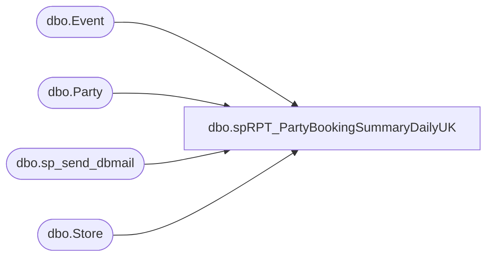

# dbo.spRPT_PartyBookingSummaryDailyUK

**Database:** BABWPartyPlanner_Restore  
**Server:** bearcluster01  

## Architecture Diagram



## Table Dependencies

| Referenced Table |
|---|
| dbo.Event |
| dbo.Party |
| dbo.sp_send_dbmail |
| dbo.Store |

## Stored Procedure Code

```sql
CREATE PROC [dbo].[spRPT_PartyBookingSummaryDailyUK]
-- =============================================================================================================
-- Name: [dbo].[spRPT_PartyBookingSummaryDailyUK]
--
-- Description:	returns detail data for UK parties booked the previous day as well as a break out of BSRs
--
-- Revision History
--		Name:			Date:			Comments:
--		Tim Bytnar		11/28/2017		Created copy of US proc and converted to UK
--		Dan T			2022-04-20		Added totals to first 2 tables
--
--
-- USAGE:  EXEC [dbo].[spRPT_PartyBookingSummaryDailyUK] @ac_recipients = 'timb@buildabear.com'
-- =============================================================================================================

@ac_recipients VARCHAR(255)

AS 
    SET NOCOUNT ON
    SET ANSI_WARNINGS OFF 
    SET ANSI_NULLS OFF


declare @html nvarchar(max),
		@head nvarchar(max),
		@tableHTML nvarchar(max),
		@TotalstableHTML nvarchar(max),
		@BSRtableHTML nvarchar(max),
		@BSRDetailtableHTML nvarchar(max),
		@Subject varchar(max),
		@HibernationsHTML nvarchar(max)
declare @PartiesBooked TABLE(BookingMethod varchar(3), EventID int, PartyID int, CreatedBy varchar(50))
declare @Hibernations TABLE(EventDate date, EventStart time, EventEnd time, CreatedDate date, CreatedBy varchar(128), StoreID int)

declare @PartiesBookedTotal TABLE(BookingMethod varchar(5), PartyCount int, SortOrder int)
declare @PartiesBookedBSRTotal TABLE(CreatedBy varchar(100), PartyCount int, SortOrder int)

INSERT INTO @Hibernations
	SELECT 
	   CAST([EventStart] AS date) AS EventDate
      ,CAST([EventStart] AS time) AS EvenStart
      ,CAST([EventEnd] AS time) AS EventEnd
      ,CAST([CreatedDate] AS date) AS CreatedDate
      ,UPPER(REPLACE (REPLACE(e.CreatedBy,'@buildabear.com',''), 'BAB\', '')) as CreatedBy
      ,e.[StoreID]
	FROM    BABWPartyPlanner.dbo.Event e WITH ( NOLOCK )
	LEFT JOIN Store s WITH (NOLOCK) ON e.StoreID = s.StoreID
	WHERE   e.CreatedDate BETWEEN CONVERT(VARCHAR,DATEADD(day, -1, GETDATE()), 101)
              AND CAST(CONVERT(CHAR(10), GETDATE(), 101) + ' 00:00:00' AS DATETIME)
              AND s.CountryID NOT IN (1,2) -- All UK Countries
              AND e.EventType = 0
			  AND DATEDIFF (hour, [EventStart], [EventEnd]) <= 2
			  


INSERT INTO @PartiesBooked
	SELECT CASE WHEN e.CreatedBy = 'guest' THEN 'WEB'
				WHEN e.CreatedBy LIKE 'store%' THEN 'POS'
			ELSE 'BSR'
			END AS BookingMethod,
			e.[EventID],
			p.PartyID,
			UPPER(REPLACE (REPLACE(e.CreatedBy,'@buildabear.com',''), 'BAB\', '')) as CreatedBy
		
	FROM    BABWPartyPlanner.dbo.Event e WITH ( NOLOCK )
	INNER JOIN BABWPartyPlanner.dbo.Party p WITH ( NOLOCK ) ON e.EventID = p.EventID
	LEFT JOIN Store s WITH (NOLOCK) ON e.StoreID = s.StoreID
	WHERE   e.CreatedDate BETWEEN CONVERT(VARCHAR,DATEADD(day, -1, GETDATE()), 101)
			AND CAST(CONVERT(CHAR(10), GETDATE(), 101) + ' 00:00:00' AS DATETIME)
			AND p.PartyStateID <> 2
			AND s.CountryID NOT IN (1,2) -- All UK Countries


INSERT INTO @PartiesBookedTotal
	select 
		BookingMethod,     
		COUNT(EventID) PartyCount,
		0 as SortOrder
	FROM @PartiesBooked
	GROUP BY BookingMethod
	UNION
	select 
		'TOTAL',     
		COUNT(EventID) PartyCount,
		1 as SortOrder
	FROM @PartiesBooked


INSERT INTO @PartiesBookedBSRTotal
	select
		CreatedBy,
		COUNT(EventID) PartyCount,
		0 as SortOrder
	FROM @PartiesBooked
	WHERE BookingMethod = 'BSR'
	GROUP BY CreatedBy
	UNION
	select
		'TOTAL',
		COUNT(EventID) PartyCount,
		1 as SortOrder
	FROM @PartiesBooked
	WHERE BookingMethod = 'BSR'

set @Subject = 'Daily UK Party Summary for ' + CONVERT(VARCHAR,DATEADD(day, -1, GETDATE()), 101)

set @html = '<html><style>h3{margin-bottom:0px; font-family:Calibri;}div{margin-left:50px; font-family:Calibri;}</style>'

set @head = '<head><style>' +
	'td {border: solid black 1px;padding-left:5px;padding-right:5px;padding-top:1px;padding-bottom:1px;font-size:11pt;} ' +
	'</style></head><body>' +
	'<div style="margin-top:20px; margin-left:5px; margin-bottom:15px; font-weight:bold; font-size:1.3em; font-family:calibri;">Daily UK Party Summary for ' + CONVERT(VARCHAR,DATEADD(day, -1, GETDATE()), 101) + '</div>'


----------------------------------------------------------------------------------------
--   Party Totals By BookingMethod
----------------------------------------------------------------------------------------
set @TotalstableHTML = '<div><h3>Party Counts</h3>Total parties booked by method.</div><div><table cellpadding=0 cellspacing=0 border=0>' +
	'<tr bgcolor=#4b6c9e>' +
	'<td align=center><font face="calibri" color=White><b>Booking Method</b></font></td>' +    -- Manually type headers
	'<td align=center><font face="calibri" color=White><b>Parties Booked</b></font></td>'     -- Manually type headers

declare @body varchar(max)
select @body =
(
	select  td = BookingMethod,     
			td = PartyCount
	FROM @PartiesBookedTotal
	ORDER BY SortOrder, BookingMethod
	for XML raw('tr'), elements
)
set @body = REPLACE(@body, '<td>', '<td align=center><font face="calibri">')
set @body = REPLACE(@body, '</td>', '</font></td>')
set @body = REPLACE(@body, '_x0020_', space(1))
set @body = REPLACE(@body, '_x003D_', '=')
set @body = REPLACE(@body, '<tr><TRRow>0</TRRow>', '<tr bgcolor=#F8F8FD>')
set @body = REPLACE(@body, '<tr><TRRow>1</TRRow>', '<tr bgcolor=#EEEEF4>')
set @body = REPLACE(@body, '<TRRow>0</TRRow>', '')

SET @TotalstableHTML = @TotalstableHTML + @body + '</table></div><BR>'


----------------------------------------------------------------------------------------
--   Party Totals By BSR
----------------------------------------------------------------------------------------

set @BSRtableHTML = '<div><h3>BSR Parties Booked Summary</h3>Total parties booked by BSR name.</div><div><table cellpadding=0 cellspacing=0 border=0>' +
	'<tr bgcolor=#4b6c9e>' +
	'<td align=center><font face="calibri" color=White><b>BSR Name</b></font></td>' +    -- Manually type headers
	'<td align=center><font face="calibri" color=White><b>Parties Booked</b></font></td>'     -- Manually type headers

select @body =
(
	select  td = CreatedBy,     
			td = PartyCount
	FROM @PartiesBookedBSRTotal
	order by SortOrder, CreatedBy
	for XML raw('tr'), elements
)
set @body = REPLACE(@body, '<td>', '<td align=center><font face="calibri">')
set @body = REPLACE(@body, '</td>', '</font></td>')
set @body = REPLACE(@body, '_x0020_', space(1))
set @body = Replace(@body, '_x003D_', '=')
set @body = Replace(@body, '<tr><TRRow>0</TRRow>', '<tr bgcolor=#F8F8FD>')
set @body = Replace(@body, '<tr><TRRow>1</TRRow>', '<tr bgcolor=#EEEEF4>')
set @body = Replace(@body, '<TRRow>0</TRRow>', '')

SET @BSRtableHTML = @BSRtableHTML + @body + '</table></div><BR>'


----------------------------------------------------------------------------------------
--   Party Details By BSR
----------------------------------------------------------------------------------------

set @BSRDetailtableHTML = '<div><h3>BSR Parties Booked Details</h3>Party number for each party booked by BSR.</div><div><table cellpadding=0 cellspacing=0 border=0>' +
	'<tr bgcolor=#4b6c9e>' +
	'<td align=center><font face="calibri" color=White><b>BSR Name</b></font></td>' +    -- Manually type headers
	'<td align=center><font face="calibri" color=White><b>Party Number</b></font></td>'     -- Manually type headers

select @body =
(
	select  td = CreatedBy,     -- Here we put the column names
			td = PartyID

	FROM @PartiesBooked
	WHERE BookingMethod = 'BSR'
	for XML raw('tr'), elements
)
set @body = REPLACE(@body, '<td>', '<td align=center><font face="calibri">')
set @body = REPLACE(@body, '</td>', '</font></td>')
set @body = REPLACE(@body, '_x0020_', space(1))
set @body = Replace(@body, '_x003D_', '=')
set @body = Replace(@body, '<tr><TRRow>0</TRRow>', '<tr bgcolor=#F8F8FD>')
set @body = Replace(@body, '<tr><TRRow>1</TRRow>', '<tr bgcolor=#EEEEF4>')
set @body = Replace(@body, '<TRRow>0</TRRow>', '')

SET @BSRDetailtableHTML = @BSRDetailtableHTML + @body + '</table></div><BR>'

----------------------------------------------------------------------------------------
--   Party Hibernations
----------------------------------------------------------------------------------------
set @HibernationsHTML = '<div><h3>Hibernations</h3>Hibernations less than or equal to 2 hours by BSR name.</div><div><table cellpadding=0 cellspacing=0 border=0>' +
	'<tr bgcolor=#4b6c9e>' +
	'<td align=center><font face="calibri" color=White><b>Event Date</b></font></td>' +			 -- Manually type headers
	'<td align=center><font face="calibri" color=White><b>Event Start Time</b></font></td>' +    -- Manually type headers
	'<td align=center><font face="calibri" color=White><b>Event End Time</b></font></td>' +      -- Manually type headers
	'<td align=center><font face="calibri" color=White><b>Created Date</b></font></td>' +		 -- Manually type headers
	'<td align=center><font face="calibri" color=White><b>Created By</b></font></td>' +			 -- Manually type headers
	'<td align=center><font face="calibri" color=White><b>Store ID</b></font></td>'         	 -- Manually type headers

select @body =
(
	select  td = EventDate,
			td = EventStart,     -- Here we put the column names
			td = EventEnd,
			td = CreatedDate,
			td = CreatedBy,
			td = StoreID
	FROM @Hibernations
	for XML raw('tr'), elements
)
set @body = REPLACE(@body, '<td>', '<td align=center><font face="calibri">')
set @body = REPLACE(@body, '</td>', '</font></td>')
set @body = REPLACE(@body, '_x0020_', space(1))
set @body = Replace(@body, '_x003D_', '=')
set @body = Replace(@body, '<tr><TRRow>0</TRRow>', '<tr bgcolor=#F8F8FD>')
set @body = Replace(@body, '<tr><TRRow>1</TRRow>', '<tr bgcolor=#EEEEF4>')
set @body = Replace(@body, '<TRRow>0</TRRow>', '')

SET @HibernationsHTML = @HibernationsHTML + @body + '</table></div>'
----------------------------------------------------------------------------------------
--   Tie it all together
----------------------------------------------------------------------------------------
set @html = @html + @head + ISNULL(@TotalstableHTML,'') + ISNULL(@BSRtableHTML,'') + ISNULL(@BSRDetailtableHTML,'') + ISNULL(@HibernationsHTML,'') + '</html>'
set @html = '<div style="color:Black; font-size:11pt; font-family:Calibri; width:100px;">' + @html + '</div>'


--SELECT CAST(@html as varchar(8000)) as result


exec msdb.dbo.sp_send_dbmail
	@profile_name = 'BIAdmin',
	@recipients = @ac_recipients,
	@body = @html,
	@subject = @Subject,
	@body_format = 'HTML'
```

