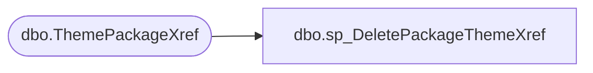

# dbo.sp_DeletePackageThemeXref

**Database:** BABWPartyPlanner_Restore  
**Server:** bearcluster01  

## Architecture Diagram



## Table Dependencies

| Referenced Table |
|---|
| dbo.ThemePackageXref |

## Stored Procedure Code

```sql
-- =============================================
-- Author:		<Carl Haufle>
-- Create date: <12/5/2019>
-- Description:	<deletes records based off of a packageID>
-- =============================================
CREATE PROCEDURE [dbo].[sp_DeletePackageThemeXref]
	-- Add the parameters for the stored procedure here
	@packageID int
AS
BEGIN
	-- SET NOCOUNT ON added to prevent extra result sets from
	-- interfering with SELECT statements.
	SET NOCOUNT ON;

      DELETE 
	FROM [BABWPartyPlanner].[dbo].[ThemePackageXref]
	where PackageID = @packageID
END
```

