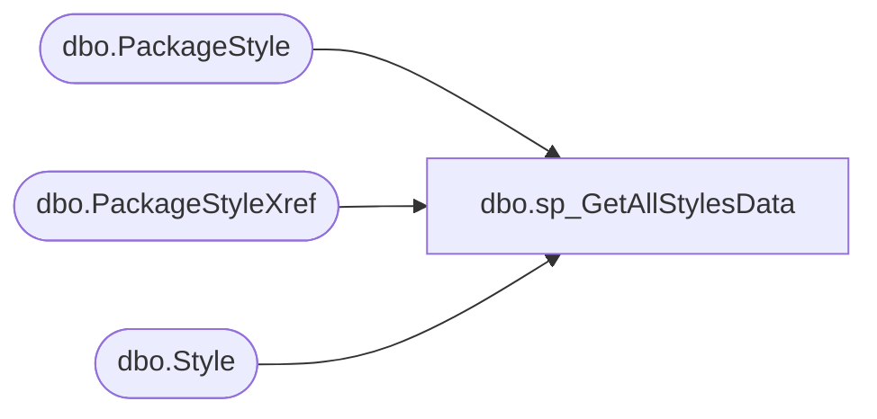

# dbo.sp_GetAllStylesData

**Database:** BABWPartyPlanner_Restore  
**Server:** bearcluster01  

## Architecture Diagram



## Table Dependencies

| Referenced Table |
|---|
| dbo.PackageStyle |
| dbo.PackageStyleXref |
| dbo.Style |

## Stored Procedure Code

```sql
CREATE Procedure [dbo].[sp_GetAllStylesData]
@PackageID nvarchar(50)
as
Begin
	SELECT s.[StyleCodeID]
	  ,PSX.PackageStyleID
	  ,PS.PackageID
      ,[StyleID]
      ,[StyleCode]
      ,[LongDesc]
      ,[ShortDesc]
  FROM [BABWPartyPlanner].[dbo].[Style] S
  RIGHT JOIN [BABWPartyPlanner].[dbo].[PackageStyleXref] PSX
  ON S.StyleCodeID = PSX.StyleCodeID
  RIGhT JOIN [BABWPartyPlanner].[dbo].[PackageStyle] PS
  ON PS.PackageStyleID = PSX.PackageStyleID
  WHERE PS.PackageID = @PackageID 
End

dbo,sp_GetBookedDatesAndTimesByStore,CREATE PROCEDURE [dbo].[sp_GetBookedDatesAndTimesByStore] 
	@StoreNumber int = 0,
	@Year int = 2017,
	@Month int = 1

-- =============================================================================================================
-- Name: sp_GetBookedDatesAndTimesByStore 
--
-- Description:	This proc will take the parameter StoreNumber and the numerical month and 
--                  produce an XML formatted list of all Bookings, for that specific store for a
--				3 month period from the one specified.
--
-- Output: Use Tax Data
--	
-- Dependencies: 
--
-- Revision History
--		Name:			Date:			Comments:
--		Tim Bytnar		5/4/2017		Initial Creation
--		Stephen Sarakas 7/25/2017		Added EventType to be returned
--		Ben Barud		8/14/2017		Changed 3 month period to 6 month period, per Michael Guinn
--		Ben Barud		8/23/2017		Changed 6 month period to 7 month period, per Blake Nickerson
--		Tim Bytnar		10/12/2017		Added an OrderBy statement to the Events XML code to appease Kevin P.
--		Tim Bytnar		10/13/2017		Added logic to grab only active parties (not cancelled) and events.
--      Blake Nickerson 1/30/2018       Added logic to the selection of hibernations to make sure we get month crossover parties
-- =============================================================================================================
	
AS
BEGIN
	SET NOCOUNT ON;

    DECLARE @RangeStart date,
		    @RangeEnd date,
		    @StoreID int;

	SELECT * INTO #tmpStoreHours
	FROM [dbo].[fnGetStoreHoursForStore](@StoreNumber);

    IF(@Month NOT IN (1,2,3,4,5,6,7,8,9,10,11,12))
	   BEGIN
		  SET @Month = 1
		  SET @StoreNumber = -999
	   END

    IF(@Year NOT BETWEEN 1997 AND 2050)
	   BEGIN
		  SET @Year = year(getdate())
	   END

    SET @RangeStart = CAST((CAST(@Month as varchar) + '/1/' + (CAST(@Year as varchar))) as date)
    SET @RangeEnd = DATEADD(month,7,@RangeStart);

	SET @StoreID = (SELECT TOP 1 StoreID FROM Store WHERE StoreNumber = @StoreNumber);


	WITH StoreHibernations AS
	(
		SELECT e.StoreID, 
			e.EventID, 
			e.EventStart, 
			e.EventEnd,
			e.EventType
		FROM Event e
		WHERE e.StoreID = @StoreID
		--AND (e.EventStart BETWEEN @RangeStart and @RangeEnd OR e.EventEnd BETWEEN @RangeStart and @RangeEnd)  - BlakeN Code
		AND NOT (EventStart > @RangeEnd OR EventEnd < @RangeStart)
		AND e.Active = 1
		AND e.EventType = 0
	),
	StoreParties AS
	(
		SELECT e.StoreID, 
			e.EventID, 
			e.EventStart, 
			e.EventEnd,
			e.EventType
		FROM Event e
		LEFT JOIN Party p
		ON e.EventID = p.EventID
		WHERE e.StoreID = @StoreID
		AND e.EventStart BETWEEN @RangeStart and @RangeEnd
		AND p.PartyStateID NOT IN (2,3)
		AND e.Active = 1
		AND e.EventType = 1
	),
	StoreEvents AS
	(
		SELECT * FROM StoreHibernations
		UNION ALL
		SELECT * FROM StoreParties

	),
	StoreBookingHours AS
	(
		SELECT 
				CASE
		   			WHEN (DayOfWeek = 0) THEN 'Sunday'
					WHEN (DayOfWeek = 1) THEN 'Monday'
					WHEN (DayOfWeek = 2) THEN 'Tuesday'
					WHEN (DayOfWeek = 3) THEN 'Wednesday'
					WHEN (DayOfWeek = 4) THEN 'Thursday'
					WHEN (DayOfWeek = 5) THEN 'Friday'
					WHEN (DayOfWeek = 6) THEN 'Saturday'
				END AS 'DayOfWeek'
		      ,StartHour
			  ,EndHour
		FROM StoreBookingHour
		WHERE StoreID = @StoreID
	)

    SELECT '<?xml version="1.0" encoding="UTF-8"?>' + 
		 CAST((SELECT
		 (SELECT
		  (SELECT se.EventStart as 'StartTime',
				se.EventEnd as 'EndTime',
				se.EventType as 'EventType',
				se.EventID as 'EventID'				
		   FROM StoreEvents se 
		   ORDER BY se.EventType ASC
		   FOR XML PATH ('Booking'),type)
		 FOR XML PATH ('Bookings'),type),
		 (SELECT sbh.DayOfWeek,
		         sbh.StartHour,
				 sbh.EndHour
		  FROM StoreBookingHours sbh
		  FOR XML PATH ('StoreBookingHours'),type),
		  (SELECT 
			(SELECT 
				SundayOpen as 'Open',
				SundayClose as 'Close'
		     FROM #tmpStoreHours
		     FOR XML PATH ('Sunday'),type),
			 			(SELECT 
				MondayOpen as 'Open',
				MondayClose as 'Close'
		     FROM #tmpStoreHours
		     FOR XML PATH ('Monday'),type),
			 			(SELECT 
				TuesdayOpen as 'Open',
				TuesdayClose as 'Close'
		     FROM #tmpStoreHours
		     FOR XML PATH ('Tuesday'),type),
			 			(SELECT 
				WednesdayOpen as 'Open',
				WednesdayClose as 'Close'
		     FROM #tmpStoreHours
		     FOR XML PATH ('Wednesday'),type),
			 			(SELECT 
				ThursdayOpen as 'Open',
				ThursdayClose as 'Close'
		     FROM #tmpStoreHours
		     FOR XML PATH ('Thursday'),type),
			 			(SELECT 
				FridayOpen as 'Open',
				FridayClose as 'Close'
		     FROM #tmpStoreHours
		     FOR XML PATH ('Friday'),type),
			 			(SELECT 
				SaturdayOpen as 'Open',
				SaturdayClose as 'Close'
		     FROM #tmpStoreHours
		     FOR XML PATH ('Saturday'),type)
		   FOR XML PATH ('StoreHours'),type)
		 FOR XML PATH ('PartyStoreData'),type) AS nvarchar(max))
	as XMLResult
END
```

