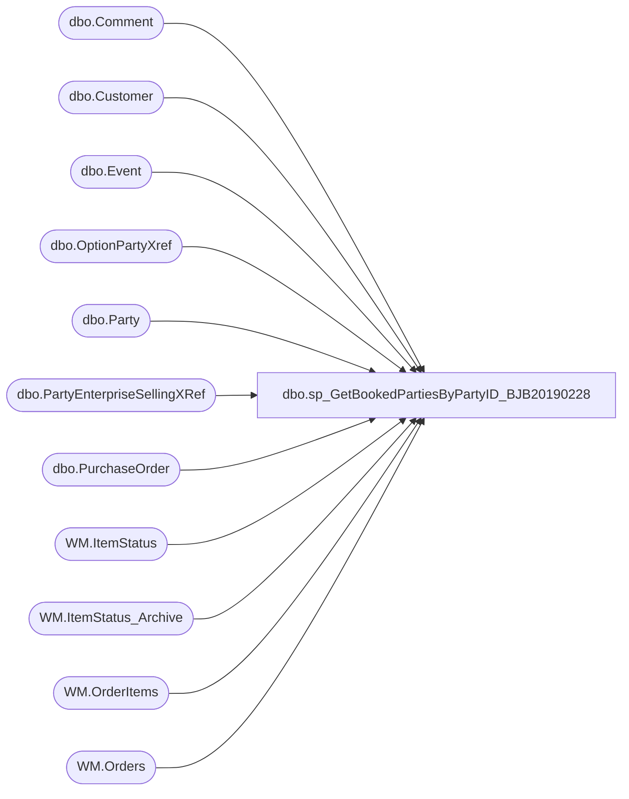

# dbo.sp_GetBookedPartiesByPartyID_BJB20190228

**Database:** BABWPartyPlanner_Restore  
**Server:** bearcluster01  

## Architecture Diagram



## Table Dependencies

| Referenced Table |
|---|
| dbo.Comment |
| dbo.Customer |
| dbo.Event |
| dbo.OptionPartyXref |
| dbo.Party |
| dbo.PartyEnterpriseSellingXRef |
| dbo.PurchaseOrder |
| WM.ItemStatus |
| WM.ItemStatus_Archive |
| WM.OrderItems |
| WM.Orders |

## Stored Procedure Code

```sql
-- =====================================================================================================
-- Name: [sp_GetBookedPartiesByPartyID]
--
--Description: Takes the parameter @PartyID and will get an XML formatted list of all parties for that customer.

-- Revision History
--		Name:			Date:			Comments:	
--		Tim Bytnar		5/15/2016		Created proc
--		Tim Bytnar		11/6/2017		Adding in the join and retreival of Giftcard numbers from the WebOrderProcessing DB
--		Tim Bytnar		4/10/2018		Added support for getting the PMR Number
--		Ben Barud		12/13/2018		Added logic for PartyRequests shipped from web to include tracking number and shipping date
-- =====================================================================================================

CREATE PROCEDURE [dbo].[sp_GetBookedPartiesByPartyID_BJB20190228] 
	-- Add the parameters for the stored procedure here
	@PartyID int = NULL
AS
BEGIN
	SET NOCOUNT ON;

DECLARE @ValidPMR table (PMRNumber int, EventID int)
DECLARE @ValidESPMR TABLE (OrderNumber VARCHAR(10), OrderID INT, PartyId INT, TrackingNumber VARCHAR(30), StatusDate VARCHAR(30))

INSERT INTO @ValidPMR
SELECT MAX(PartyID) as PMRNumber, 
	CAST(CAST(EventID AS FLOAT) AS INT) AS EventID
FROM KODIAK.PartyRequest.dbo.Party
WHERE (ISNUMERIC(EventID) = 1) 
AND (EventID <> '1111111111111111111111111111111111')
GROUP BY CAST(CAST(EventID AS FLOAT) AS INT);

  --DECLARE @partyID AS INT
  --SET @partyID = 964858;
  WITH prESOrder
  AS
  (
  SELECT TOP 1 OrderNumber, o.OrderId, xRef.PartyID
  FROM [WebOrderProcessing].[WM].[Orders] o
  INNER JOIN [BABWPartyPlanner].[dbo].[PartyEnterpriseSellingXRef] xRef ON o.OrderId = xRef.OrderId
  WHERE xRef.PartyID = @partyID
  ), tracking
  AS
  (
    SELECT TOP 1 oi.OrderId
              ,oi.TrackingNumber
			  ,CASE
			    WHEN ist.StatusDate IS NOT NULL THEN ist.StatusDate
				WHEN ist2.StatusDate IS NOT NULL THEN ist2.StatusDate
				ELSE ist.StatusDate
			   END AS 'StatusDate'
  FROM [WebOrderProcessing].[WM].[OrderItems] oi
  LEFT JOIN [WebOrderProcessing].[WM].[ItemStatus] ist ON oi.OrderItemID = ist.OrderItemID AND ist.[Status] = 'Shipped'
  LEFT JOIN [WebOrderProcessing].[WM].[ItemStatus_Archive] ist2 ON oi.OrderItemID = ist2.OrderItemID AND ist2.[Status] = 'Shipped'
  INNER JOIN prESOrder ON prESOrder.OrderId = oi.OrderId
  )
  INSERT INTO @ValidESPMR
  SELECT OrderNumber, prESOrder.OrderId, PartyID, TrackingNumber, CONVERT(VARCHAR, StatusDate, 126) AS 'StatusDate'
  FROM prESOrder 
  INNER JOIN tracking ON tracking.OrderId = prESOrder.OrderId


     SELECT '<?xml version="1.0" encoding="UTF-8"?>' + 
	CAST(
	    (SELECT(
		SELECT p.OccasionID,
		  ISNULL(p.TotalGuests, 0) as TotalGuests,
		  e.StoreID,
		  e.EventID,
		  p.PartyID,
		  e.CreatedDate,
		  e.EventStart,
		  e.EventEnd,
		  ISNULL(p.GOHFirstName, 'None') as GOHFirstName,
		  ISNULL(p.GOHAge, 0) as GOHAge,
		  ISNULL(p.GuestAvgAge, 0) as GuestAvgAge,
		  (SELECT OptionID AS 'Option'
			 FROM OptionPartyXref o 
			 WHERE o.PartyID = p.PartyID 
			 FOR XML PATH (''),type) AS Options,
		  ISNULL(p.DepositAmount,0) as DepositAmount,
		  ISNULL(e.CreatedBy, 1) as CreatedBy,
		  (SELECT c.Comment AS 'CommentText', c.CreatedBy, c.CreatedDate
			 FROM Comment c
			 WHERE c.EventID = e.EventID 
			 FOR XML PATH ('Comment'),type)  
		  AS Comments,
		  ISNULL(c.CustomerNumber, 0) as CustomerNumber,
		  ISNULL(c.FirstName, 'None') as CustomerFirstName,
		  ISNULL(c.LastName, 'None') as CustomerLastName,
		  c.PrimaryPhone,
		  c.SecondaryPhone,
		  ISNULL(c.Address1, 'None') as Address1,
		  ISNULL(c.Address2, 'None') as Address2,
		  ISNULL(poc.Organization, 'None') as Organization,
		  ISNULL(c.City, 'None') as City,
		  ISNULL(c.State, 'None') as State,
		  ISNULL(c.Country, 'None') as Country,
		  ISNULL(c.Zipcode, 'None') as ZipCode,
		  ISNULL(c.EmailAddress, 'None') as EmailAddress,
		  ISNULL(p.GOHGender, 0) as GOHGender,
		  ISNULL(p.PartyStateID, 0) as PartyStateID,
		  ISNULL(p.PackageID,0) as PackageID,
		  ISNULL(oi.GiftCardNumber,0) as GiftcardNumber,
		  ISNULL(e.OrderNumber,'None') as OrderNumber,
		  ISNULL(po.PONumber,'None') as PONumber,
		  ISNULL(poc.FirstName,'None') as POFirstName,
		  ISNULL(poc.LastName,'None') as POLastName,
		  ISNULL(poc.EmailAddress,'None') as POEmailAddress,
		  ISNULL(poc.PrimaryPhone,'None') as POPrimaryPhone,
		  ISNULL(poc.TaxId,'None') as POTaxId,
		  CASE
				WHEN p.POID IS NULL THEN 0
				ELSE 1
		  END as IsPOParty,
		  CASE
		        WHEN pmr.PMRNumber IS NOT NULL AND espmr.OrderNumber IS NOT NULL THEN CAST(pmr.PMRNumber AS VARCHAR) + '|' + CAST(espmr.OrderNumber AS VARCHAR)
				WHEN pmr.PMRNumber IS NOT NULL THEN CAST(pmr.PMRNumber AS VARCHAR)
				WHEN espmr.OrderNumber IS NOT NULL THEN CAST(espmr.OrderNumber AS VARCHAR)
				ELSE '0'
		  END AS PMRNumber,
		  ISNULL(espmr.TrackingNumber, 'None') AS 'MerchTrackingNumber',
		  ISNULL(espmr.StatusDate, 'None') AS 'MerchShippingDate'
	   FROM Party p
		  LEFT JOIN Customer c WITH (NOLOCK) on p.CustomerID = c.CustomerID
		  LEFT JOIN Event e WITH (NOLOCK) on p.EventID = e.EventID
		  LEFT JOIN PurchaseOrder po WITH (NOLOCK) on p.POID = po.POID
		  LEFT JOIN Customer poc WITH (NOLOCK) on po.CustomerID = poc.CustomerID
		  LEFT JOIN [STL-SQLAAG-P-01].WebOrderProcessing.WM.Orders o WITH (NOLOCK) on e.OrderNumber = o.OrderNum
		  LEFT JOIN [STL-SQLAAG-P-01].WebOrderProcessing.WM.OrderItems oi WITH (NOLOCK) on o.OrderId = oi.OrderId and oi.Sku IN(090500,490500)
		  LEFT JOIN @ValidPMR pmr ON p.PartyID = pmr.EventID
		  LEFT JOIN @ValidESPMR espmr ON p.PartyID = espmr.PartyID
	   WHERE p.PartyID = @PartyID

	   FOR XML PATH ('PartyBooking'),type) FOR XML PATH ('PartyBookings')) 
    AS varchar(max))
END

dbo,sp_GetBookedPartiesByWebOrder,-- =====================================================================================================
-- Name: [sp_GetBookedPartiesByWebOrder]
--
--Description: Takes the parameter @WebOrderNumber and will get an XML formatted list of all parties for that customer.

-- Revision History
--		Name:			Date:			Comments:	
--		Ben Barud		3/9/2022		Initial
-- =====================================================================================================

CREATE PROCEDURE [dbo].[sp_GetBookedPartiesByWebOrder] 
	-- Add the parameters for the stored procedure here
	@WebOrderNumber VARCHAR(14) = NULL
AS
BEGIN
	SET NOCOUNT ON;

DECLARE @ValidPMR table (PMRNumber int, EventID int)
DECLARE @ValidESPMR TABLE (OrderNumber VARCHAR(10), OrderID INT, PartyId INT, TrackingNumber VARCHAR(30), StatusDate VARCHAR(30))


SELECT PartyID,
	EventID
INTO #work
FROM KODIAK.PartyRequest.dbo.Party
WHERE (ISNUMERIC(EventID) = 1) 

INSERT INTO @ValidPMR
SELECT MAX(PartyID) as PMRNumber, 
	CAST(CAST(EventID AS FLOAT) AS INT) AS EventID
FROM #work
WHERE (ISNUMERIC(EventID) = 1) 
AND CAST(EventID AS FLOAT) < 2147483647
GROUP BY CAST(CAST(EventID AS FLOAT) AS INT);

  --DECLARE @partyID AS INT
  --SET @partyID = 964858;
  WITH prESOrder
  AS
  (
  SELECT TOP 1 OrderNumber, o.OrderId, xRef.PartyID
  FROM [WebOrderProcessing].[WM].[Orders] o
  INNER JOIN [BABWPartyPlanner].[dbo].[PartyEnterpriseSellingXRef] xRef ON o.OrderId = xRef.OrderId
  WHERE o.Ordernumber = @WebOrderNumber
  ), tracking
  AS
  (
  SELECT TOP 1 oi.OrderId
              ,oi.TrackingNumber
			  ,CASE
			    WHEN ist.StatusDate IS NOT NULL THEN ist.StatusDate
				WHEN ist2.StatusDate IS NOT NULL THEN ist2.StatusDate
				ELSE ist.StatusDate
			   END AS 'StatusDate'
  FROM [WebOrderProcessing].[WM].[OrderItems] oi
  LEFT JOIN [WebOrderProcessing].[WM].[ItemStatus] ist ON oi.OrderItemID = ist.OrderItemID AND ist.[Status] = 'Shipped'
  LEFT JOIN [WebOrderProcessing].[WM].[ItemStatus_Archive] ist2 ON oi.OrderItemID = ist2.OrderItemID AND ist2.[Status] = 'Shipped'
  INNER JOIN prESOrder ON prESOrder.OrderId = oi.OrderId
  )
  INSERT INTO @ValidESPMR
  SELECT OrderNumber, prESOrder.OrderId, PartyID, TrackingNumber, CONVERT(VARCHAR, StatusDate, 126) AS 'StatusDate'
  FROM prESOrder 
  INNER JOIN tracking ON tracking.OrderId = prESOrder.OrderId


     SELECT '<?xml version="1.0" encoding="UTF-8"?>' + 
	CAST(
	    (SELECT(
		SELECT p.OccasionID,
		  ISNULL(p.TotalGuests, 0) as TotalGuests,
		  e.StoreID,
		  e.EventID,
		  p.PartyID,
		  e.CreatedDate,
		  e.EventStart,
		  e.EventEnd,
		  ISNULL(p.GOHFirstName, 'None') as GOHFirstName,
		  ISNULL(p.GOHAge, 0) as GOHAge,
		  ISNULL(p.GuestAvgAge, 0) as GuestAvgAge,
		  (SELECT OptionID AS 'Option'
			 FROM OptionPartyXref o 
			 WHERE o.PartyID = p.PartyID 
			 FOR XML PATH (''),type) AS Options,
		  ISNULL(p.DepositAmount,0) as DepositAmount,
		  ISNULL(e.CreatedBy, 1) as CreatedBy,
		  (SELECT c.Comment AS 'CommentText', c.CreatedBy, c.CreatedDate
			 FROM Comment c
			 WHERE c.EventID = e.EventID 
			 FOR XML PATH ('Comment'),type)  
		  AS Comments,
		  ISNULL(c.CustomerNumber, 0) as CustomerNumber,
		  ISNULL(c.FirstName, 'None') as CustomerFirstName,
		  ISNULL(c.LastName, 'None') as CustomerLastName,
		  c.PrimaryPhone,
		  c.SecondaryPhone,
		  ISNULL(c.Address1, 'None') as Address1,
		  ISNULL(c.Address2, 'None') as Address2,
		  ISNULL(poc.Organization, 'None') as Organization,
		  ISNULL(c.City, 'None') as City,
		  ISNULL(c.State, 'None') as State,
		  ISNULL(c.Country, 'None') as Country,
		  ISNULL(c.Zipcode, 'None') as ZipCode,
		  ISNULL(c.EmailAddress, 'None') as EmailAddress,
		  ISNULL(p.GOHGender, 0) as GOHGender,
		  ISNULL(p.PartyStateID, 0) as PartyStateID,
		  ISNULL(p.ThemeID, 0) as PartyThemeID,
		  ISNULL(p.PackageID,0) as PackageID,
		  ISNULL(oi.GiftCardNumber,0) as GiftcardNumber,
		  ISNULL(e.OrderNumber,'None') as OrderNumber,
		  ISNULL(po.PONumber,'None') as PONumber,
		  ISNULL(poc.FirstName,'None') as POFirstName,
		  ISNULL(poc.LastName,'None') as POLastName,
		  ISNULL(poc.EmailAddress,'None') as POEmailAddress,
		  ISNULL(poc.PrimaryPhone,'None') as POPrimaryPhone,
		  ISNULL(poc.TaxId,'None') as POTaxId,
		  CASE
				WHEN p.POID IS NULL THEN 0
				ELSE 1
		  END as IsPOParty,
		  --CASE
				--WHEN pmr.PMRNumber IS NOT NULL THEN pmr.PMRNumber
				--WHEN espmr.OrderNumber IS NOT NULL THEN espmr.OrderNumber
				--ELSE 0
		  --END AS PMRNumber,
		  CASE
		        WHEN pmr.PMRNumber IS NOT NULL AND espmr.OrderNumber IS NOT NULL THEN CAST(pmr.PMRNumber AS VARCHAR) + ' | ' + CAST(espmr.OrderNumber AS VARCHAR)
				WHEN pmr.PMRNumber IS NOT NULL THEN CAST(pmr.PMRNumber AS VARCHAR)
				WHEN espmr.OrderNumber IS NOT NULL THEN CAST(espmr.OrderNumber AS VARCHAR)
				ELSE '0'
		  END AS PMRNumber,
		  ISNULL(espmr.TrackingNumber, 'None') AS 'MerchTrackingNumber',
		  ISNULL(espmr.StatusDate, 'None') AS 'MerchShippingDate'
	   FROM Party p
		  LEFT JOIN Customer c WITH (NOLOCK) on p.CustomerID = c.CustomerID
		  LEFT JOIN Event e WITH (NOLOCK) on p.EventID = e.EventID
		  LEFT JOIN PurchaseOrder po WITH (NOLOCK) on p.POID = po.POID
		  LEFT JOIN Customer poc WITH (NOLOCK) on po.CustomerID = poc.CustomerID
		  LEFT JOIN [STL-SQLAAG-P-01].WebOrderProcessing.WM.Orders o WITH (NOLOCK) on e.OrderNumber = o.OrderNum
		  LEFT JOIN [STL-SQLAAG-P-01].WebOrderProcessing.WM.OrderItems oi WITH (NOLOCK) on o.OrderId = oi.OrderId and oi.Sku IN('090500','490500')
		  LEFT JOIN @ValidPMR pmr ON p.PartyID = pmr.EventID
		  LEFT JOIN @ValidESPMR espmr ON p.PartyID = espmr.PartyID
	   WHERE e.OrderNumber = @WebOrderNumber

	   FOR XML PATH ('PartyBooking'),type) FOR XML PATH ('PartyBookings')) 
    AS varchar(max))
END
dbo,sp_GetCommentsByEventID,-- =============================================
-- Author:		Carl Haufle
-- Create date: 6/27/2017
-- Description:	Returns all comments based on a provided event ID
-- =============================================
CREATE PROCEDURE [dbo].[sp_GetCommentsByEventID] 
@eventID INT
AS
BEGIN
SELECT [EventID]
      ,[CreatedDate]
      ,[Comment]
      ,[CreatedBy]      
  FROM [BABWPartyPlanner].[dbo].[Comment]

  WHERE EventID = @eventID
  ORDER BY CreatedDate Asc
END

dbo,sp_GetCountryDetail,-- =============================================
-- Author:		<Author,,Name>
-- Create date: <Create Date,,>
-- Description:	<Description,,>
-- =============================================
CREATE PROCEDURE sp_GetCountryDetail
	@countryid int
AS
BEGIN
	
	select countryid, countryname, countryabbr, enabled from country where countryid=@countryid;

END

dbo,sp_GetDisplayOnlyStoreInfo,-- =============================================
-- Author:		<Author,,Name>
-- Create date: <Create Date,,>
-- Description:	<Description,,>
-- =============================================
CREATE PROCEDURE [dbo].[sp_GetDisplayOnlyStoreInfo]
	@storenum int
AS
BEGIN

select a.str_num, a.nm_full fullname , line_1 line1, line_2 line2, cty_nm city, pstl_cd as zip, c.NM_ABBRV as state, d.NM_ABBRV as country,
(case when (sod.CLOSE_DT > getdate()) then 1 else 0 end) as enabled,
isnull(e.BSRMessage,'') BSRMessage, isnull(e.webmessage, '') webmessage, maxguests, MinGuests, CanBookOnline, BookingParties
from (((kodiak.BABWMstrData.[dbo].[STR_DIM] a inner join kodiak.BABWMstrData.[dbo].[STR_ADDR_DIM] b on a.str_id=b.STR_ID and b.CURR_ADDR=1)
inner join kodiak.BABWMstrData.[dbo].[STR_OPEN_DIM] sod on a.STR_ID = sod.STR_KEY
inner join kodiak.BABWMstrData.[dbo].[ST_PRVNC_DIM] c on b.ST_PRVNC_ID = c.ST_PRVNC_ID)
inner join kodiak.BABWMstrData.[dbo].[CNTRY_DIM] d on a.CNTRY_ID = d.CNTRY_ID)
inner join store e on e.storeID=a.str_num
where a.STR_NUM=@storenum
order by a.STR_NUM

END
dbo,sp_GetEnabledPackagesForStore,-- =============================================================================================================
-- Name: [sp_GetEnabledPackagesForStore]
--
-- Description:	Returns ALL enabled packages and flags those that are bound to a store as StorePackageStatus
--
-- Input:		@StoreNumber		int		Store number to query for
--
-- Execute:   EXEC sp_GetEnabledPackagesForStore @StoreNumber = 2
--
-- Dependencies: 
--
-- Revision History
--		Name:			Date:			Comments:
--		Tim Bytnar		2/14/2018		Created

-- =============================================================================================================
CREATE PROCEDURE [dbo].[sp_GetEnabledPackagesForStore]
	@StoreNumber int
AS
BEGIN
	-- SET NOCOUNT ON added to prevent extra result sets from
	-- interfering with SELECT statements.
	SET NOCOUNT ON;

    DECLARE  @StoreID int
	SELECT @StoreID = StoreID FROM Store WHERE StoreNumber = @StoreNumber

	;WITH EnabledPackages AS
	(
		SELECT PackageID,
			   PackageName
		FROM Package
		WHERE Enabled = 1
	),
	AddedToStore AS
	(
		SELECT PackageID
		FROM StorePackageXref
		WHERE StoreID = @StoreID
	)
	SELECT e.PackageID,
		   e.PackageName,
		   CASE 
				WHEN a.PackageID IS NOT NULL THEN 1
				ELSE 0
			END as StorePackageStatus
	FROM AddedToStore a
	RIGHT JOIN EnabledPackages e
		ON a.PackageId = e.PackageID
	ORDER BY e.PackageName
END

dbo,sp_GetEventDatesByGroup,-- =============================================
-- Author:		Carl Haufle
-- Create date: 7/10/2017
-- Description:	Returns a list of event dates based on groupID and a Start and End date
-- =============================================
CREATE PROCEDURE [dbo].[sp_GetEventDatesByGroup] 
@groupID INT,
@startDate datetime,
@endDate datetime

AS
BEGIN

    DECLARE @startRange DATETIME, @endRange DATETIME, @eventID INT

    IF OBJECT_ID('tempdb..#tmp_Events') IS NOT NULL DROP TABLE #tmp_Events
    CREATE TABLE #tmp_Events(EventID int,EventStart datetime,EventEnd datetime)

    IF OBJECT_ID('tempdb..#tmp_Datelist') IS NOT NULL DROP TABLE #tmp_Datelist
    CREATE TABLE #tmp_Datelist(EventDate date)

    INSERT INTO #tmp_Events
    SELECT MAX(EventID) as EventID,
	   CONVERT(VARCHAR(10), EventStart, 101) AS 'EventStart',
	   CONVERT(VARCHAR(10), EventEnd, 101) AS 'EventEnd'
    FROM [BABWPartyPlanner].[dbo].[vwEventIDsByStoreGroupID]
    WHERE StoreGroupID = @groupID
	   AND NOT (EventStart > @endDate OR EventEnd < @startDate)
	   AND Active = 1
    GROUP BY CONVERT(VARCHAR(10), EventStart, 101),CONVERT(VARCHAR(10), EventEnd, 101)

    WHILE EXISTS(SELECT EventID FROM #tmp_Events)
    BEGIN
	   SELECT TOP 1 @eventID=EventID,@startRange=EventStart,@endRange=EventEnd from #tmp_Events

	   INSERT INTO #tmp_Datelist
	   SELECT  DATEADD(DAY, nbr - 1, @startRange) as EventDate
	   FROM    ( SELECT    ROW_NUMBER() OVER ( ORDER BY c.object_id ) AS Nbr
			   FROM      sys.columns c
			 ) nbrs
	   WHERE   nbr - 1 <= DATEDIFF(DAY, @startRange, @endRange)

	   DELETE #tmp_Events WHERE EventID = @eventID
    END


    Select DISTINCT(EventDate) from #tmp_Datelist
    ORDER BY EventDate


END


dbo,sp_GetEventsByDate,-- =============================================
-- Author:		Carl Haufle
-- Create date: 5/11/2017
-- Description:	Returns a list of events based on storeID between a start and end date
-- =============================================
CREATE PROCEDURE [dbo].[sp_GetEventsByDate] 
@storeID INT,
@startDate DATETIME,
@endDate DATETIME
AS
BEGIN
    SELECT e.[EventID]
      ,e.[EventStart]
      ,e.[EventEnd]
      ,e.[EventType]
      ,e.[CreatedDate]
      ,e.[CreatedBy]
      ,e.[LastUpdated]
      ,e.[StoreID]
	  ,s.[StoreNumber]
  FROM [BABWPartyPlanner].[dbo].[Event] e
    LEFT JOIN [BABWPartyPlanner].[dbo].[Store] s
		ON e.StoreID = s.StoreID

	WHERE e.StoreID = @storeID
	AND NOT (EventStart > @endDate OR EventEnd < @startDate)
	AND Active = 1
	ORDER BY EventStart
END

dbo,sp_GetEventsByGroup,-- =============================================
-- Author:		Carl Haufle
-- Create date: 5/2/2017
-- Description:	Returns a list of events based on storeID and a given year
-- =============================================
CREATE PROCEDURE [dbo].[sp_GetEventsByGroup] 
@groupID INT,
@startDate datetime,
@endDate datetime

AS
BEGIN

SELECT EventID,
	   StoreID,
	   StoreNumber,
	   EventType,
	   EventStart,
	   EventEnd
  FROM [BABWPartyPlanner].[dbo].[vwEventIDsByStoreGroupID]
  WHERE StoreGroupID = @groupID
  	AND NOT (EventStart > @endDate OR EventEnd < @startDate)
	AND Active = 1

  ORDER BY EventStart

END


dbo,sp_GetEventsByStore,-- =============================================
-- Author:		Carl Haufle
-- Create date: 5/2/2017
-- Description:	Returns a list of events based on storeID and a given year
-- =============================================
CREATE PROCEDURE [dbo].[sp_GetEventsByStore] 
@storeID INT,
@year int
AS
BEGIN
    SELECT e.[EventID]
      ,e.[EventStart]
      ,e.[EventEnd]
      ,e.[EventType]
      ,e.[StoreID]
	  ,s.[StoreNumber]
  FROM [BABWPartyPlanner].[dbo].[Event] e
      LEFT JOIN [BABWPartyPlanner].[dbo].[Store] s
		ON e.StoreID = s.StoreID

  WHERE e.StoreID = @storeID
  AND year(EventStart) = @year
  AND Active = 1
END

dbo,sp_GetEventsForAllStores,-- =============================================
-- Author:		Tim Bytnar
-- Create date: 5/11/2017
-- Description:	Returns a list of events for all stores between a start and end date
-- =============================================
CREATE PROCEDURE [dbo].[sp_GetEventDatesForAllStores] 
@startDate DATETIME,
@endDate DATETIME
AS
BEGIN
    SELECT e.[EventID]
      ,e.[EventStart]
      ,e.[EventEnd]
      ,e.[EventType]
      ,e.[CreatedDate]
      ,e.[CreatedBy]
      ,e.[LastUpdated]
      ,e.[StoreID]
	  ,s.[StoreNumber]
  FROM [BABWPartyPlanner].[dbo].[Event] e
  	LEFT JOIN [BABWPartyPlanner].[dbo].[Store] s
		ON e.StoreID = s.StoreID

	WHERE Active = 1
	AND NOT (EventStart > @endDate OR EventEnd < @startDate)
	ORDER BY EventStart
END

dbo,sp_GetEventsForAllStoresByDM,-- =============================================
-- Author:		Tim Bytnar
-- Create date: 7/17/2017
-- Description:	Returns a list of event dates based on a Start and End date for all stores for a District Manager
-- =============================================
CREATE PROCEDURE [dbo].[sp_GetEventDatesForAllStoresByDM] 
@startDate datetime,
@endDate datetime,
@DMEmail varchar(128)

AS
BEGIN

	DECLARE @startRange DATETIME, @endRange DATETIME, @eventID INT;

	WITH DMStores AS
	(
		SELECT StoreID
		FROM vwStoreToStoreMDM
		WHERE DistrictManager = @DMEmail
	)

	SELECT e.[EventID]
		,e.[EventStart]
		,e.[EventEnd]
		,e.[EventType]
		,e.[CreatedDate]
		,e.[CreatedBy]
		,e.[LastUpdated]
		,e.[StoreID]
		,s.[StoreNumber]
	FROM [BABWPartyPlanner].[dbo].[Event] e
	LEFT JOIN [BABWPartyPlanner].[dbo].[Store] s
		ON e.StoreID = s.StoreID

	WHERE Active = 1
	AND e.StoreID IN (SELECT StoreID FROM DMStores)
	AND NOT (EventStart > @endDate OR EventEnd < @startDate)
	ORDER BY EventStart

END


dbo,sp_GetGroupInfo,-- =============================================
-- Author:		<Author,,Name>
-- Create date: <Create Date,,>
-- Description:	<Description,,>
-- =============================================
CREATE PROCEDURE sp_GetGroupInfo
	@groupid int
AS
BEGIN

	select StoreGroupName, isnull(storegroupdesc,'') storegroupdesc from storegroup where StoreGroupID=@groupid;

END
```

