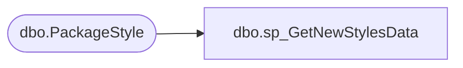

# dbo.sp_GetNewStylesData

**Database:** BABWPartyPlanner_Restore  
**Server:** bearcluster01  

## Architecture Diagram



## Table Dependencies

| Referenced Table |
|---|
| dbo.PackageStyle |

## Stored Procedure Code

```sql
CREATE Procedure [dbo].[sp_GetNewStylesData]
@PackageID nvarchar(50)
as
Begin
	SELECT  [PackageStyleID]
      ,[PackageID]
      
  FROM [BABWPartyPlanner].[dbo].[PackageStyle]
  WHERE PackageID = @PackageID 
End

dbo,sp_GetOptionDetail,-- =============================================
-- Author:		<Author,,Name>
-- Create date: <Create Date,,>
-- Description:	<Description,,>
-- =============================================
CREATE PROCEDURE [dbo].[sp_GetOptionDetail]

	@optionid int

AS
BEGIN
	
	select optionid, optionname, optiondesc, 
	convert(varchar, OptionStartdate, 101) OptionStartdate, 
	convert(varchar, OptionEndDate, 101) OptionEndDate,
	enabled, 
	isnull(DefaultCost,0) DefaultCost
	from [option]	
	where optionid=@optionid;

END

dbo,sp_GetPackgeDetail,-- =============================================
-- Author:		<Author,,Name>
-- Create date: <Create Date,,>
-- Description:	<Description,,>
-- =============================================
CREATE PROCEDURE [dbo].[sp_GetPackgeDetail]
	@packageid varchar(max)
AS
BEGIN

	--https://anubhavg.wordpress.com/2009/06/11/how-to-format-datetime-date-in-sql-server-2005

	select packageid, packagename, 
	packagelongdesc, 
	convert(varchar, PackageStartDate, 101) PackageStartDate, 
	convert(varchar, PackageEndDate, 101) PackageEndDate,
	MinGuestSpend, Enabled, PackageShortDesc, countryid
	from package where packageid=@packageid
	
	
END

dbo,sp_GetPartyChoicesByStore,-- =============================================================================================================
-- Name: sp_GetPartyChoicesByStore
--
-- Description:	This proc will take the parameter StoreNumber and  produce an XML formatted list of 
--				all Options, Packages, Occasions and DepositLevels for that specific store
--
--
-- Output: 
--		XML formatted data that feeds the web application for displaying available party choices
--
-- Dependencies: 
--
-- EXAMPLE:
--		exec sp_GetPartyChoicesByStore 2036
--
-- Revision History
--		Name:			Date:			Comments:
--		Tim Bytnar		4/28/2017		created								
--		Tim Bytnar		3/27/2018		Added in several Linked Server joins to Kodiak to retrieve the "NoDepositRequired" field from StoreMDM
--		Ben Barud		3/12/2019		Added logic for themes
-- =============================================================================================================
CREATE PROCEDURE [dbo].[sp_GetPartyChoicesByStore] 
	@StoreNumber int = 0
AS
BEGIN
    SET NOCOUNT ON;

    WITH StoreInfo AS
	(
		SELECT s.StoreID,
			   ISNULL(s.MinGuests,5) as MinGuests,
			   ISNULL(s.MaxGuests,20) as MaxGuests,
			   ISNULL(s.WebMessage, '') as WebMessage,
			   ISNULL(s.BSRMessage, '') as BSRMessage,
			   ISNULL(s.CanBookOnline, 1) as CanBookOnline,
			   CASE
					WHEN avd.TITLE = 'NoDepositRequired' THEN 1
					ELSE 0
			   END as NoDepositRequired
		FROM Store s WITH (NOLOCK)
		LEFT JOIN Kodiak.BABWMstrData.dbo.STR_DIM sd
			ON s.StoreNumber = sd.STR_NUM
		LEFT JOIN Kodiak.BABWMstrData.dbo.STR_ATTR_DIM sad
			ON sd.STR_ID = sad.STR_ID AND sad.ATTR_MSTR_ID = 38
		LEFT JOIN Kodiak.BABWMstrData.dbo.ATTR_VALUE_DIM avd
		ON sad.ATTR_VALUE_ID = avd.ATTR_VALUE_ID
		WHERE s.StoreNumber = @StoreNumber
	),	
	StorePackages AS
    (
	   SELECT s.StoreID,
			p.PackageID,
			p.PackageName,
			p.PackageLongDesc
	   FROM Package p WITH (NOLOCK)
	   LEFT JOIN StorePackageXref spx
			ON spx.PackageId = p.PackageID
	   LEFT JOIN Store s
			ON spx.StoreID = s.StoreID
	   WHERE s.StoreNumber = @StoreNumber
	   AND p.Enabled = 1
	   AND GETDATE() BETWEEN p.PackageStartDate AND p.PackageEndDate
	   AND IsTheme = 0
    ),
	StoreThemes AS
	(
	   SELECT DISTINCT s.StoreID,
			t.ThemeID,
			t.ThemeName,
			t.ThemeDesc
	   FROM Store s
	   LEFT JOIN StorePackageXref spx ON s.StoreID = spx.StoreID 
	   LEFT JOIN ThemePackageXref tpx ON spx.PackageId = tpx.PackageID
	   LEFT JOIN Theme t ON tpx.ThemeID = t.ThemeID
	   WHERE s.StoreNumber = @StoreNumber
	   AND t.Enabled = 1
	),
    StoreOptions AS
    (
	   SELECT o.OptionID,
			o.OptionName,
			o.OptionDesc,
			o.DefaultCost,
			o.CostPer,
			o.OrderBy
	   FROM "Option" o WITH (NOLOCK)
	   LEFT JOIN OptionStoreXref osx on o.OptionID = osx.OptionID
	   LEFT JOIN Store s on osx.StoreID = s.StoreID
	   WHERE s.StoreNumber = @StoreNumber
	   AND o.Enabled = 1
	   AND GETDATE() BETWEEN o.OptionStartDate AND o.OptionEndDate 
    ),
    DepositLevels AS
    (
	   SELECT NumGuests,
			Amount
	   FROM DepositLevel WITH (NOLOCK)
    ),
    Occasions AS
    (
	   SELECT OccasionID,
			OccasionName
	   FROM Occasion WITH (NOLOCK)
	   WHERE Enabled = 1
    )

    SELECT '<?xml version="1.0" encoding="UTF-8"?>' + 
		 CAST((SELECT
		  (SELECT si.StoreID,
				  si.MinGuests,
				  si.MaxGuests,
				  si.WebMessage,
				  si.BSRMessage,
				  si.CanBookOnline,
				  si.NoDepositRequired
		   FROM StoreInfo si WITH (NOLOCK)
		   FOR XML PATH ('StoreInfo'),type),
		  (SELECT sp.PackageID as 'ID',
				sp.PackageName as 'Name',
				sp.PackageLongDesc as 'Description',
				(SELECT x.ThemeID
				 FROM ThemePackageXref x WITH (NOLOCK)
				 INNER JOIN StoreThemes st ON x.ThemeID = st.ThemeID
				 WHERE x.PackageID = sp.PackageID
				 FOR XML PATH(''), type) AS Themes
		   FROM StorePackages sp WITH (NOLOCK)
		   FOR XML PATH ('Package'),type) AS Packages,  
		  (SELECT st.ThemeID as 'ID',
				st.ThemeName as 'Name'
		   FROM StoreThemes st WITH (NOLOCK)
		   FOR XML PATH ('Theme'),type) AS Themes,
		  (SELECT so.OptionID as 'ID',
				so.OptionName as 'Name',
				so.OptionDesc as 'Description',
				so.DefaultCost as 'Cost',
				so.CostPer as 'CostPer',
				so.OrderBy as 'OrderBy'
		   FROM StoreOptions so WITH (NOLOCK)
		   FOR XML Path ('Option'),type) AS Options,
		   (SELECT o.OccasionID as 'ID',
				 o.OccasionName as 'Name'
		    FROM Occasions o WITH (NOLOCK)
		    FOR XML PATH ('Occasion'),type) AS Occasions,
		   (SELECT dl.NumGuests,
				 dl.Amount
		    FROM DepositLevels dl WITH (NOLOCK)
		    FOR XML PATH ('DepositLevel'),type) AS DepositLevels
	     FOR XML PATH ('PartyStoreData'),type) AS nvarchar(max))
	as XMLResult
END
```

