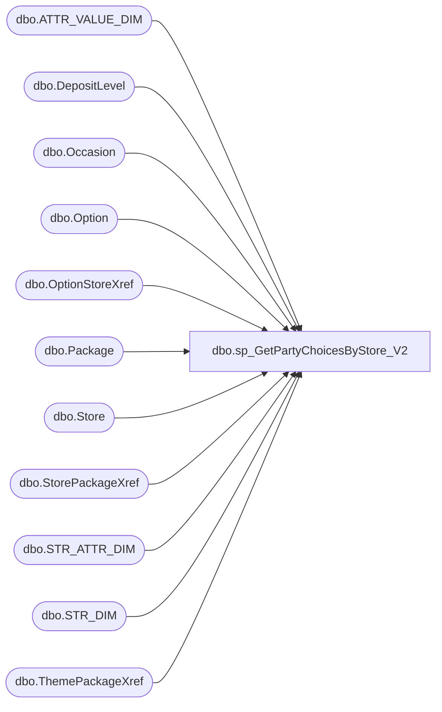

# dbo.sp_GetPartyChoicesByStore_V2

**Database:** BABWPartyPlanner_Restore  
**Server:** bearcluster01  

## Architecture Diagram



## Table Dependencies

| Referenced Table |
|---|
| dbo.ATTR_VALUE_DIM |
| dbo.DepositLevel |
| dbo.Occasion |
| dbo.Option |
| dbo.OptionStoreXref |
| dbo.Package |
| dbo.Store |
| dbo.StorePackageXref |
| dbo.STR_ATTR_DIM |
| dbo.STR_DIM |
| dbo.ThemePackageXref |

## Stored Procedure Code

```sql
-- =============================================================================================================
-- Name: sp_GetPartyChoicesByStore
--
-- Description:	This proc will take the parameter StoreNumber and  produce an XML formatted list of 
--				all Options, Packages, Occasions and DepositLevels for that specific store
--
--
-- Output: 
--		XML formatted data that feeds the web application for displaying available party choices
--
-- Dependencies: 
--
-- EXAMPLE:
--		exec sp_GetPartyChoicesByStore 2036
--
-- Revision History
--		Name:			Date:			Comments:
--		Tim Bytnar		4/28/2017		created								
--		Tim Bytnar		3/27/2018		Added in several Linked Server joins to Kodiak to retrieve the "NoDepositRequired" field from StoreMDM
--		Ben Barud		3/12/2019		Added logic for themes
-- =============================================================================================================
CREATE PROCEDURE [dbo].[sp_GetPartyChoicesByStore_V2] 
	@StoreNumber int = 0
AS
BEGIN
    SET NOCOUNT ON;

    WITH StoreInfo AS
	(
		SELECT s.StoreID,
			   ISNULL(s.MinGuests,5) as MinGuests,
			   ISNULL(s.MaxGuests,20) as MaxGuests,
			   ISNULL(s.WebMessage, '') as WebMessage,
			   ISNULL(s.BSRMessage, '') as BSRMessage,
			   ISNULL(s.CanBookOnline, 1) as CanBookOnline,
			   CASE
					WHEN avd.TITLE = 'NoDepositRequired' THEN 1
					ELSE 0
			   END as NoDepositRequired
		FROM Store s WITH (NOLOCK)
		LEFT JOIN Kodiak.BABWMstrData.dbo.STR_DIM sd
			ON s.StoreNumber = sd.STR_NUM
		LEFT JOIN Kodiak.BABWMstrData.dbo.STR_ATTR_DIM sad
			ON sd.STR_ID = sad.STR_ID AND sad.ATTR_MSTR_ID = 38
		LEFT JOIN Kodiak.BABWMstrData.dbo.ATTR_VALUE_DIM avd
		ON sad.ATTR_VALUE_ID = avd.ATTR_VALUE_ID
		WHERE s.StoreNumber = @StoreNumber
	),	
	StorePackages AS
    (
	   SELECT s.StoreID,
			p.PackageID,
			p.PackageName,
			p.PackageLongDesc
	   FROM Package p WITH (NOLOCK)
	   LEFT JOIN StorePackageXref spx
			ON spx.PackageId = p.PackageID
	   LEFT JOIN Store s
			ON spx.StoreID = s.StoreID
	   WHERE s.StoreNumber = @StoreNumber
	   AND p.Enabled = 1
	   AND GETDATE() BETWEEN p.PackageStartDate AND p.PackageEndDate
	   AND IsTheme = 0
    ),
	StoreThemes AS
	(
	   SELECT s.StoreID,
			p.PackageID,
			p.PackageName,
			p.PackageLongDesc
	   FROM Package p WITH (NOLOCK)
	   LEFT JOIN StorePackageXref spx
			ON spx.PackageId = p.PackageID
	   LEFT JOIN Store s
			ON spx.StoreID = s.StoreID
	   WHERE s.StoreNumber = @StoreNumber
	   AND p.Enabled = 1
	   AND GETDATE() BETWEEN p.PackageStartDate AND p.PackageEndDate
	   AND IsTheme = 1
	),
    StoreOptions AS
    (
	   SELECT o.OptionID,
			o.OptionName,
			o.OptionDesc,
			o.DefaultCost,
			o.CostPer,
			o.OrderBy
	   FROM "Option" o WITH (NOLOCK)
	   LEFT JOIN OptionStoreXref osx on o.OptionID = osx.OptionID
	   LEFT JOIN Store s on osx.StoreID = s.StoreID
	   WHERE s.StoreNumber = @StoreNumber
	   AND o.Enabled = 1
	   AND GETDATE() BETWEEN o.OptionStartDate AND o.OptionEndDate 
    ),
    DepositLevels AS
    (
	   SELECT NumGuests,
			Amount
	   FROM DepositLevel WITH (NOLOCK)
    ),
    Occasions AS
    (
	   SELECT OccasionID,
			OccasionName
	   FROM Occasion WITH (NOLOCK)
	   WHERE Enabled = 1
    )

    SELECT '<?xml version="1.0" encoding="UTF-8"?>' + 
		 CAST((SELECT
		  (SELECT si.StoreID,
				  si.MinGuests,
				  si.MaxGuests,
				  si.WebMessage,
				  si.BSRMessage,
				  si.CanBookOnline,
				  si.NoDepositRequired
		   FROM StoreInfo si WITH (NOLOCK)
		   FOR XML PATH ('StoreInfo'),type),
		  (SELECT sp.PackageID as 'ID',
				sp.PackageName as 'Name',
				sp.PackageLongDesc as 'Description',
				(SELECT x.ThemeID
				 FROM ThemePackageXref x WITH (NOLOCK)
				 INNER JOIN StoreThemes st ON x.ThemeID = st.PackageID
				 WHERE x.PackageID = sp.PackageID
				 FOR XML PATH(''), type) AS Themes
		   FROM StorePackages sp WITH (NOLOCK)
		   FOR XML PATH ('Package'),type) AS Packages,  
		  (SELECT st.PackageID as 'ID',
				st.PackageName as 'Name',
				st.PackageLongDesc as 'Description'
		   FROM StoreThemes st WITH (NOLOCK)
		   FOR XML PATH ('Theme'),type) AS Themes,
		  (SELECT so.OptionID as 'ID',
				so.OptionName as 'Name',
				so.OptionDesc as 'Description',
				so.DefaultCost as 'Cost',
				so.CostPer as 'CostPer',
				so.OrderBy as 'OrderBy'
		   FROM StoreOptions so WITH (NOLOCK)
		   FOR XML Path ('Option'),type) AS Options,
		   (SELECT o.OccasionID as 'ID',
				 o.OccasionName as 'Name'
		    FROM Occasions o WITH (NOLOCK)
		    FOR XML PATH ('Occasion'),type) AS Occasions,
		   (SELECT dl.NumGuests,
				 dl.Amount
		    FROM DepositLevels dl WITH (NOLOCK)
		    FOR XML PATH ('DepositLevel'),type) AS DepositLevels
	     FOR XML PATH ('PartyStoreData'),type) AS nvarchar(max))
	as XMLResult
END

dbo,sp_GetStoreBookingHours,-- =============================================
-- Author:		<Author,,Name>
-- Create date: <Create Date,,>
-- Description:	<Description,,>
-- =============================================
CREATE PROCEDURE [dbo].[sp_GetStoreBookingHours]
	@storeid int,
	@dayofweek int
AS
BEGIN


if not exists (SELECT 1 FROM StoreBookingHour WHERE StoreID = @storeid AND DayOfWeek = @dayofweek) 
	select @dayofweek dayofweek, '' starthour, '' endhour,  0 rowindex;
else
	select @dayofweek dayofweek, starthour, endhour, rowindex  from storebookinghour where storeid = @storeid and dayofweek= @dayofweek order by starthour;


END

dbo,sp_GetStoreGroup_AllStoresWithoutSelectedGroup,-- =============================================
-- Author:		<Author,,Name>
-- Create date: <Create Date,,>
-- Description:	<Description,,>
-- =============================================
CREATE PROCEDURE [dbo].[sp_GetStoreGroup_AllStoresWithoutSelectedGroup]
	@selgroupid int
AS
BEGIN

	select storeid, storenumber, isnull(a.StoreGroupID, -1) as StoreGroupID,
	case	
		when a.StoreGroupID=@selgroupid then 1
		else 0
	end as selected,
	StoreGroupName 
	from vwStoreToStoreMDM a
	left join storegroup b
	on a.storegroupid=b.storegroupid
	order by selected desc, storenumber

END

dbo,sp_GetStoreGroupBookingHours,-- =============================================
-- Author:		<Author,,Name>
-- Create date: <Create Date,,>
-- Description:	<Description,,>
-- =============================================
create PROCEDURE [dbo].[sp_GetStoreGroupBookingHours]
	@groupid int,
	@dayofweek int
AS
BEGIN

select starthour, endhour from storegroupbookinghour where groupid = @groupid and dayofweek = @dayofweek;

END

dbo,sp_GetStoreHours,-- =============================================
-- Author:		<Author,,Name>
-- Create date: <Create Date,,>
-- Description:	<Description,,>
-- =============================================
CREATE PROCEDURE [dbo].[sp_GetStoreHours]
	@storenum int
AS
BEGIN

IF NOT EXISTS ( SELECT 1 FROM sys.sysservers WHERE srvname = 'kodiak' )
begin
	-- link server not exists, add
	exec sp_addlinkedserver 'kodiak'
end


	declare @userStartDate datetime = getdate();
	declare @numberDays integer = 7;
	declare @selBearitory varchar(50) = 'ALL';


	-- calculate start date to be previous sunday
	DECLARE @startDate AS datetime
	SET @startDate = (SELECT TOP 1
				actual_date
			FROM
				kodiak.BABWMstrData.dbo.vw_DATE_DIM
			WHERE
				actual_date <= @userStartDate
				AND day_name = 'SUNDAY'
			ORDER BY actual_date DESC)

	-- Get the Ending Date to be the following Saturday
	DECLARE @endingDate AS datetime
	SET @endingDate = DATEADD(DAY, @numberDays, @startDate)
	SET @endingDate = (SELECT TOP 1
				actual_date
			FROM
				kodiak.BABWMstrData.dbo.vw_DATE_DIM
			WHERE
				actual_date >= @endingDate
				AND day_name = 'SATURDAY'
			ORDER BY actual_date ASC)

	-- get store list
	IF OBJECT_ID('tempdb..#StoreList') IS NOT NULL
	BEGIN
		DROP TABLE #StoreList
	END

	SELECT
		country_dim.NM_ABBRV AS country,
		STR_NUM,
		store.NM_ABBRV,
		BD.NM AS BearitoryName
	INTO #StoreList
	FROM
		kodiak.BABWMstrData.dbo.STR_DIM store
		JOIN kodiak.BABWMstrData.dbo.CNTRY_DIM country_dim
			ON store.CNTRY_ID = country_dim.CNTRY_ID
		INNER JOIN kodiak.BABWMstrData.dbo.BEARITORY_DIM BD WITH (NOLOCK)
			ON store.BEARITORY_ID = BD.BEARITORY_ID

		JOIN kodiak.BABWMstrData.dbo.STR_OPEN_DIM stropen
			ON store.STR_ID = stropen.STR_KEY
			AND @startDate BETWEEN DATEADD(DAY, -14, stropen.OPEN_DT) AND stropen.CLOSE_DT

			and STR_NUM = @storenum

	WHERE
		country_dim.NM_ABBRV IN ('CA', 'US', 'UK') -- and str_open_dt is not null
	ORDER BY STR_NUM

	IF @selBearitory <> 'All'
	BEGIN
		DELETE FROM #StoreList
		WHERE BearitoryName <> @selBearitory
	END


	-- get date list

	IF OBJECT_ID('tempdb..#Dates') IS NOT NULL
	BEGIN
		DROP TABLE #Dates
	END


	SELECT
		sub.actual_date,
		sub.yearWeek
	INTO #Dates
	FROM
		(SELECT
				actual_date,
				fiscal_year * 100 + fiscal_week AS yearWeek
			FROM
				kodiak.[BABWMstrData].[dbo].[vw_DATE_DIM]
			WHERE
				actual_date BETWEEN @startDate AND @endingDate)
		sub

	-- use CROSS JOIN to get all stores / date combinations
	IF OBJECT_ID('tempdb..#StoresAndDates') IS NOT NULL
	BEGIN
		DROP TABLE #StoresAndDates
	END
	SELECT
		Country,
		STR_NUM,
		actual_date,
		yearWeek,
		s.BearitoryName,
		s.NM_ABBRV
	INTO #StoresAndDates
	FROM
		#StoreList s
		CROSS JOIN #Dates


	-- update with regular hours of operation (hoo)
	IF OBJECT_ID('tempdb..#StoreHours') IS NOT NULL
	BEGIN
		DROP TABLE #StoreHours
	END
	SELECT
		sd.Country,
		sd.STR_NUM,
		sd.actual_date,
		sd.yearWeek,
		hoo.strt_tm,
		hoo.end_tm,
		CAST(0 AS bit) AS isOverriden,
		CAST(DATEDIFF(MINUTE, hoo.strt_tm, hoo.end_tm) AS decimal(10, 2)) / 60 AS hoursNormalSched,
		sd.BearitoryName,
		sd.NM_ABBRV
	INTO #StoreHours
	FROM
		#StoresAndDates sd
		JOIN kodiak.BABWMstrData.dbo.vw_DATE_DIM dd
			ON sd.actual_date = dd.actual_date
		JOIN kodiak.BABWMstrData.dbo.STR_DIM store
			ON store.STR_NUM = sd.STR_NUM
		LEFT OUTER JOIN kodiak.BABWMstrData.dbo.STR_OPRNL_HR_DIM hoo
			ON hoo.STR_ID = store.STR_ID
			AND dd.day_of_week = hoo.DY_OF_WK_ID
			AND sd.actual_date BETWEEN COALESCE(STRT_DT, @startDate) AND COALESCE(END_DT, '12-31-2399')
	ORDER BY	sd.STR_NUM,
				sd.actual_date


	-- update with temporary hours
	UPDATE #StoreHours
		SET	strt_tm = temphoo.strt_tm,
			end_tm = temphoo.end_tm,
			isOverriden =
				CASE
					WHEN sh.strt_tm <> ISNULL(temphoo.strt_tm, '12:00AM') OR sh.end_tm <> ISNULL(temphoo.end_tm, '12:00AM') OR sh.isOverriden = 1 THEN 1
					ELSE 0
				END
	FROM
		#StoreHours sh
		JOIN kodiak.BABWMstrData.dbo.STR_DIM store
			ON store.STR_NUM = sh.STR_NUM
		JOIN kodiak.BABWMstrData.dbo.STR_TMP_OPRNL_HR_DIM temphoo
			ON temphoo.STR_ID = store.STR_ID
			AND temphoo.SCHD_DT = sh.actual_date


	-- return rows
	SELECT
		Country,
		STR_NUM,
		actual_date,
		yearWeek,
		strt_tm,
		end_tm,
		CAST(DATEDIFF(MINUTE, strt_tm, end_tm) AS decimal(10, 2)) / 60 AS hoursSched,
		isOverriden,
		x.hoursNormalSched,
		BearitoryName,
		NM_ABBRV
	FROM /* Adjust for stores working to Midnight */
		(SELECT
				y.Country,
				y.STR_NUM,
				y.actual_date,
				y.yearWeek,
				y.strt_tm ,
				CASE
						WHEN y.end_tm <= y.strt_tm THEN DATEADD(DAY, 1, y.end_tm)
						ELSE y.end_tm
					END AS end_tm,
				y.isOverriden,
				y.hoursNormalSched,
				y.BearitoryName,
				y.NM_ABBRV
			FROM
				(SELECT top 7
						Country,
						STR_NUM,
						actual_date,
						yearWeek
						/* Just get the time portions of the fields */,
						strt_tm - CAST(CONVERT(varchar, strt_tm, 101) AS datetime) AS strt_tm,
						end_tm - CAST(CONVERT(varchar, end_tm, 101) AS datetime) AS end_tm,
						isOverriden,
						hoursNormalSched,
						BearitoryName,
						NM_ABBRV
					FROM
						#StoreHours
						ORDER BY actual_date)
				y)
		x
	ORDER BY	Country,
				STR_NUM


END

dbo,sp_GetStoreHours_with_day_of_week,-- =============================================
-- Author:		<Author,,Name>
-- Create date: <Create Date,,>
-- Description:	<Description,,>
-- =============================================
CREATE PROCEDURE [dbo].[sp_GetStoreHours_with_day_of_week]
	@storenum int
AS
BEGIN

IF NOT EXISTS ( SELECT 1 FROM sys.sysservers WHERE srvname = 'kodiak' )
begin
	-- link server not exists, add
	exec sp_addlinkedserver 'kodiak'
end


	declare @userStartDate datetime = getdate();
	declare @numberDays integer = 7;
	declare @selBearitory varchar(50) = 'ALL';


	-- calculate start date to be previous sunday
	DECLARE @startDate AS datetime
	SET @startDate = (SELECT TOP 1
				actual_date
			FROM
				kodiak.BABWMstrData.dbo.vw_DATE_DIM
			WHERE
				actual_date <= @userStartDate
				AND day_name = 'SUNDAY'
			ORDER BY actual_date DESC)

	-- Get the Ending Date to be the following Saturday
	DECLARE @endingDate AS datetime
	SET @endingDate = DATEADD(DAY, @numberDays, @startDate)
	SET @endingDate = (SELECT TOP 1
				actual_date
			FROM
				kodiak.BABWMstrData.dbo.vw_DATE_DIM
			WHERE
				actual_date >= @endingDate
				AND day_name = 'SATURDAY'
			ORDER BY actual_date ASC)

	-- get store list
	IF OBJECT_ID('tempdb..#StoreList') IS NOT NULL
	BEGIN
		DROP TABLE #StoreList
	END

	SELECT
		country_dim.NM_ABBRV AS country,
		STR_NUM,
		store.NM_ABBRV,
		BD.NM AS BearitoryName
	INTO #StoreList
	FROM
		kodiak.BABWMstrData.dbo.STR_DIM store
		JOIN kodiak.BABWMstrData.dbo.CNTRY_DIM country_dim
			ON store.CNTRY_ID = country_dim.CNTRY_ID
		INNER JOIN kodiak.BABWMstrData.dbo.BEARITORY_DIM BD WITH (NOLOCK)
			ON store.BEARITORY_ID = BD.BEARITORY_ID

		JOIN kodiak.BABWMstrData.dbo.STR_OPEN_DIM stropen
			ON store.STR_ID = stropen.STR_KEY
			AND @startDate BETWEEN stropen.OPEN_DT AND stropen.CLOSE_DT

			and STR_NUM = @storenum

	WHERE
		country_dim.NM_ABBRV IN ('CA', 'US', 'UK') -- and str_open_dt is not null
	ORDER BY STR_NUM

	IF @selBearitory <> 'All'
	BEGIN
		DELETE FROM #StoreList
		WHERE BearitoryName <> @selBearitory
	END


	-- get date list

	IF OBJECT_ID('tempdb..#Dates') IS NOT NULL
	BEGIN
		DROP TABLE #Dates
	END


	SELECT
		sub.actual_date,
		sub.yearWeek
	INTO #Dates
	FROM
		(SELECT
				actual_date,
				fiscal_year * 100 + fiscal_week AS yearWeek
			FROM
				kodiak.[BABWMstrData].[dbo].[vw_DATE_DIM]
			WHERE
				actual_date BETWEEN @startDate AND @endingDate)
		sub

	-- use CROSS JOIN to get all stores / date combinations
	IF OBJECT_ID('tempdb..#StoresAndDates') IS NOT NULL
	BEGIN
		DROP TABLE #StoresAndDates
	END
	SELECT
		Country,
		STR_NUM,
		actual_date,
		yearWeek,
		s.BearitoryName,
		s.NM_ABBRV
	INTO #StoresAndDates
	FROM
		#StoreList s
		CROSS JOIN #Dates


	-- update with regular hours of operation (hoo)
	IF OBJECT_ID('tempdb..#StoreHours') IS NOT NULL
	BEGIN
		DROP TABLE #StoreHours
	END
	SELECT
		sd.Country,
		sd.STR_NUM,
		sd.actual_date,
		sd.yearWeek,
		hoo.strt_tm,
		hoo.end_tm,
		CAST(0 AS bit) AS isOverriden,
		CAST(DATEDIFF(MINUTE, hoo.strt_tm, hoo.end_tm) AS decimal(10, 2)) / 60 AS hoursNormalSched,
		sd.BearitoryName,
		sd.NM_ABBRV,
		day_of_week
	INTO #StoreHours
	FROM
		#StoresAndDates sd
		JOIN kodiak.BABWMstrData.dbo.vw_DATE_DIM dd
			ON sd.actual_date = dd.actual_date
		JOIN kodiak.BABWMstrData.dbo.STR_DIM store
			ON store.STR_NUM = sd.STR_NUM
		LEFT OUTER JOIN kodiak.BABWMstrData.dbo.STR_OPRNL_HR_DIM hoo
			ON hoo.STR_ID = store.STR_ID
			AND dd.day_of_week = hoo.DY_OF_WK_ID
			AND sd.actual_date BETWEEN COALESCE(STRT_DT, @startDate) AND COALESCE(END_DT, '12-31-2399')
	ORDER BY	sd.STR_NUM,
				sd.actual_date


	-- update with temporary hours
	UPDATE #StoreHours
		SET	strt_tm = temphoo.strt_tm,
			end_tm = temphoo.end_tm,
			isOverriden =
				CASE
					WHEN sh.strt_tm <> ISNULL(temphoo.strt_tm, '12:00AM') OR sh.end_tm <> ISNULL(temphoo.end_tm, '12:00AM') OR sh.isOverriden = 1 THEN 1
					ELSE 0
				END
	FROM
		#StoreHours sh
		JOIN kodiak.BABWMstrData.dbo.STR_DIM store
			ON store.STR_NUM = sh.STR_NUM
		JOIN kodiak.BABWMstrData.dbo.STR_TMP_OPRNL_HR_DIM temphoo
			ON temphoo.STR_ID = store.STR_ID
			AND temphoo.SCHD_DT = sh.actual_date


	-- return rows
	SELECT
		Country,
		STR_NUM,
		actual_date,
		yearWeek,
		strt_tm,
		end_tm,
		CAST(DATEDIFF(MINUTE, strt_tm, end_tm) AS decimal(10, 2)) / 60 AS hoursSched,
		isOverriden,
		x.hoursNormalSched,
		BearitoryName,
		NM_ABBRV,
		day_of_week
	FROM /* Adjust for stores working to Midnight */
		(SELECT
				y.Country,
				y.STR_NUM,
				y.actual_date,
				y.yearWeek,
				y.strt_tm ,
				CASE
						WHEN y.end_tm <= y.strt_tm THEN DATEADD(DAY, 1, y.end_tm)
						ELSE y.end_tm
					END AS end_tm,
				y.isOverriden,
				y.hoursNormalSched,
				y.BearitoryName,
				y.NM_ABBRV,
				day_of_week
			FROM
				(SELECT top 7
						Country,
						STR_NUM,
						actual_date,
						yearWeek
						/* Just get the time portions of the fields */,
						strt_tm - CAST(CONVERT(varchar, strt_tm, 101) AS datetime) AS strt_tm,
						end_tm - CAST(CONVERT(varchar, end_tm, 101) AS datetime) AS end_tm,
						isOverriden,
						hoursNormalSched,
						BearitoryName,
						NM_ABBRV,
						day_of_week
					FROM
						#StoreHours
						ORDER BY actual_date)
				y)
		x
	ORDER BY	Country,
				STR_NUM


END

dbo,sp_GetStorePartyInfoByStore,-- =============================================
-- Author:		Stephen Sarakas
-- Create date: 7/27/2017
-- Description:	Created new StoredProc to return more specific information about store's parties' 
-- =============================================
CREATE PROCEDURE [dbo].[sp_GetStorePartyInfoByStore] 
	@StoreNumber int = 0,
	@Year int = 2017,
	@Month int = 1
	
AS
BEGIN
	SET NOCOUNT ON;

	DECLARE @RangeStart date,
		  @RangeEnd date

    IF(@Month NOT IN (1,2,3,4,5,6,7,8,9,10,11,12))
	   BEGIN
		  SET @Month = 1
		  SET @StoreNumber = -999
	   END

    IF(@Year NOT BETWEEN 1997 AND 2050)
	   BEGIN
		  SET @Year = year(getdate())
	   END

    SET @RangeStart = CAST((CAST(@Month as varchar) + '/1/' + (CAST(@Year as varchar))) as date)
    SET @RangeEnd = DATEADD(month,1,@RangeStart);

    WITH StoreEvents AS
    (
	   SELECT p.PartyID
			 ,e.EventStart
			 ,e.EventEnd
			 ,c.LastName
			 ,p.TotalGuests
			 ,e.EventType
	   FROM Event e WITH (NOLOCK)
	   LEFT JOIN Store s on e.StoreID = s.StoreID
	   LEFT JOIN Party p on e.EventID = p.EventID
	   LEFT JOIN Customer c on p.CustomerID = c.CustomerID
	   WHERE s.StoreNumber = @StoreNumber
	   AND e.EventStart BETWEEN @RangeStart and @RangeEnd
	   AND e.Active = 1
    )


    SELECT '<?xml version="1.0" encoding="UTF-8"?>' + 
		CAST((SELECT
		   (SELECT se.PartyID as 'PartyID',
				se.EventStart as 'StartTime',
				se.EventEnd as 'EndTime',
				se.LastName as 'LastName',
				se.TotalGuests as 'TotalGuests',
				se.EventType as 'EventType'			
		   FROM StoreEvents se WITH (NOLOCK)
		   FOR XML PATH ('PartyInfo'),type)
		FOR XML PATH ('StorePartys'),type) AS nvarchar(max))
	as XMLResult
END

dbo,sp_GetStoreWithNoPackge,-- =============================================
-- Author:		<Author,,Name>
-- Create date: <Create Date,,>
-- Description:	<Description,,>
-- =============================================
CREATE PROCEDURE [dbo].[sp_GetStoreWithNoPackge]
AS
BEGIN
	EXEC [dbo].[sp_CreateMissingStores];
	Select DISTINCT storeid, storenumber, storename
	--(select storegroupid from store b where a.storenumber=b.storenumber) as storegroupid
    from vwStoreToStoreMDM a 
	where storenumber not in 
	(select DISTINCT(storeid) from StorePackageXref WITH (NOLOCK))
	order by storenumber

END
```

