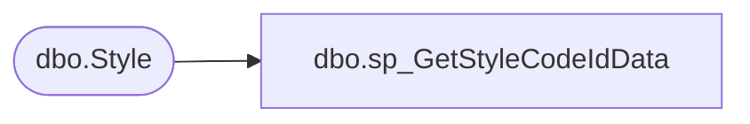

# dbo.sp_GetStyleCodeIdData

**Database:** BABWPartyPlanner_Restore  
**Server:** bearcluster01  

## Architecture Diagram



## Table Dependencies

| Referenced Table |
|---|
| dbo.Style |

## Stored Procedure Code

```sql
-- =============================================
-- Author:		Nigel Thomas
-- Create date: 12/05/2018
-- Description:	Gets counts for count of items submitted to the inv_supplies tables
-- =============================================
CREATE PROCEDURE [dbo].[sp_GetStyleCodeIdData]
	-- Add the parameters for the stored procedure here
	@StyleCode varchar(20)
AS
BEGIN
	SET NOCOUNT ON;

SELECT  [StyleCodeID]
  FROM [BABWPartyPlanner].[dbo].[Style]
  where StyleCode = @StyleCode


END
```

