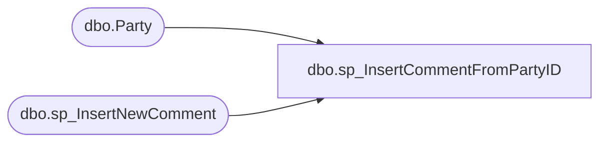

# dbo.sp_InsertCommentFromPartyID

**Database:** BABWPartyPlanner_Restore  
**Server:** bearcluster01  

## Architecture Diagram



## Table Dependencies

| Referenced Table |
|---|
| dbo.Party |
| dbo.sp_InsertNewComment |

## Stored Procedure Code

```sql
-- =============================================================================================================
-- Name: sp_InsertCommentFromPartyID
--
-- Description:	This proc will insert the supplied comment to the appropriate table based upon the supplied PartyID
--
-- EXAMPLE:
--		exec sp_InsertCommentFromPartyID 1234567 'This is a test comment for the this procedure.'
--
-- Revision History
--		Name:			Date:			Comments:
--		Tim Bytnar		3/27/18		created								
-- =============================================================================================================
CREATE PROCEDURE [dbo].[sp_InsertCommentFromPartyID]
	-- Add the parameters for the stored procedure here
	@PartyID int,
	@Comment varchar(MAX)
AS
BEGIN
	SET NOCOUNT ON;

	DECLARE @EventID int

	SELECT @EventID = EventID FROM Party WHERE PartyID = @PartyID
	
	EXEC sp_InsertNewComment @EventID, @Comment, 'PMR_SYSTEM'

END


dbo,sp_InsertNewComment,-- =============================================
-- Author:		Tim Bytnar
-- Create date: 5/2/2017
-- Description:	A simple proc that will insert a new comment
-- =============================================
CREATE PROCEDURE [dbo].[sp_InsertNewComment] 
	@EventID int, 
	@Comment varchar(512),
	@CreatedBy varchar(128)
AS
BEGIN
    BEGIN TRY
	   BEGIN TRAN
		  INSERT INTO BABWPartyPlanner.dbo.Comment (EventID, Comment, CreatedBy, CreatedDate)
		  VALUES (@EventID, @Comment, @CreatedBy, GETDATE())
	   COMMIT
    END TRY
    BEGIN CATCH
	   IF(@@TRANCOUNT > 0)
		  ROLLBACK TRAN
    END CATCH
END

dbo,sp_InsertNewCustomer,-- =============================================
-- Author:		Tim Bytnar
-- Create date: 5/2/2017
-- Description:	A Simple insert that will return the newly created customer's ID.
-- =============================================
CREATE PROCEDURE [dbo].[sp_InsertNewCustomer] 
    @FirstName varchar(64),
    @LastName varchar(64),
    @PrimaryPhone varchar(32),
    @SecondaryPhone varchar(32),
    @EmailAddress varchar(128),
    @Address1 varchar(128),
    @Address2 varchar(128),
    @City varchar(128),
    @State varchar(32),
    @Zipcode varchar(6),
    @Country varchar(64),
    @Organization varchar(64),
	@TaxId varchar(64) = '',
    @CustomerID int OUTPUT
AS
BEGIN
    BEGIN TRY
	   BEGIN TRAN
		  DECLARE @CustomerIDResult table (ID int)
		  INSERT INTO Customer(FirstName, LastName, PrimaryPhone, SecondaryPhone, EmailAddress, Address1, Address2, City, State, Zipcode, Country, Organization, TaxId)
			 OUTPUT inserted.CustomerID INTO @CustomerIDResult
		  VALUES (@FirstName, @LastName, @PrimaryPhone, @SecondaryPhone, @EmailAddress, @Address1, @Address2, @City, @State, @Zipcode, @Country, @Organization, @TaxId)
		  SET @CustomerID = (SELECT ID FROM @CustomerIDResult)
	   COMMIT
    END TRY
    BEGIN CATCH
	   IF(@@TRANCOUNT > 0)
		  ROLLBACK TRAN
    END CATCH
END
dbo,sp_InsertNewEvent,-- =============================================================================================================
-- Name: sp_InsertEvent
--
-- Description:	A simple proc that will insert a new event and return the newly created event ID.
--
-- Output: 
--
-- Dependencies: 
--
-- Revision History
--		Name:			Date:			Comments:
--		Tim Bytnar		5/2/2017		Initial Creation
--		Tim Bytnar		11/6/2017		Added in the support for OrderNumber
-- =============================================================================================================
CREATE PROCEDURE [dbo].[sp_InsertNewEvent] 
	@EventStart datetime,
	@EventEnd datetime,
	@EventType int,
	@CreatedBy varchar(128) = 'SYSTEM',
	@StoreID int,
	@Comment varchar(512) = NULL,
	@OrderNumber varchar(10) = NULL,
	@EventID int OUTPUT
AS
BEGIN
    BEGIN TRY
	   BEGIN TRAN
		  DECLARE @EventIDResult table (ID int);
		  --INSERT INTO BABWPartyPlanner.dbo.Event (EventStart, EventEnd, EventType, CreatedBy, StoreID, CreatedDate, Active)
		  INSERT INTO BABWPartyPlanner.dbo.Event (EventStart, EventEnd, EventType, CreatedBy, StoreID, CreatedDate, Active, OrderNumber)
			 OUTPUT inserted.EventID INTO @EventIDResult
		  --VALUES (@EventStart, @EventEnd, @EventType, @CreatedBy, @StoreID, GETDATE(), 1)
		  VALUES (@EventStart, @EventEnd, @EventType, @CreatedBy, @StoreID, GETDATE(), 1, @OrderNumber)
		  SET @EventID = (SELECT ID FROM @EventIDResult)

		  IF @Comment IS NOT NULL
		  BEGIN
			EXEC sp_InsertNewComment @EventID, @Comment, @CreatedBy
		  END
	   COMMIT
    END TRY
    BEGIN CATCH
	   IF(@@TRANCOUNT > 0)
		  ROLLBACK TRAN
    END CATCH
END
dbo,sp_InsertNewEvent_TB_9-6-2017,-- =============================================
-- Author:		Tim Bytnar
-- Create date: 5/2/2017
-- Description:	A simple proc that will insert a new event and return the newly created event ID.
-- =============================================
CREATE PROCEDURE [dbo].[sp_InsertNewEvent_TB_9-6-2017] 
	@EventStart datetime,
	@EventEnd datetime,
	@EventType int,
	@CreatedBy varchar(128) = 'SYSTEM',
	@StoreID int,
	@Comment varchar(512) = NULL,
	@EventID int OUTPUT
AS
BEGIN
    BEGIN TRY


			IF NOT EXISTS(SELECT EventID
						FROM Event
						WHERE NOT (EventStart > @EventStart --EventEnd
								  OR EventEnd < @EventEnd) --EventStart
						AND StoreID = @StoreID)
			BEGIN
				BEGIN TRAN
				DECLARE @EventIDResult table (ID int);

				INSERT INTO BABWPartyPlanner.dbo.Event (EventStart, EventEnd, EventType, CreatedBy, StoreID, CreatedDate, Active)
					 OUTPUT inserted.EventID INTO @EventIDResult
				  VALUES (@EventStart, @EventEnd, @EventType, @CreatedBy, @StoreID, GETDATE(), 1)

				  SET @EventID = (SELECT ID FROM @EventIDResult)

				  IF @Comment IS NOT NULL
				  BEGIN
					EXEC sp_InsertNewComment @EventID, @Comment, @CreatedBy
				  END
			    COMMIT
			END
			ELSE
			BEGIN
				RETURN -1
			END

    END TRY
    BEGIN CATCH
	   IF(@@TRANCOUNT > 0)
		  ROLLBACK TRAN
    END CATCH
END

dbo,sp_InsertNewHibernation,-- =============================================
-- Author:		Carl Haufle
-- Create date: 5/25/2017
-- Description:  Inserts a set of Events (Hibernations only) for a particular Store Group or for all stores
-- Updates:  Tim Bytnar - added the logic for a set based insert using CTE
--           Tim Bytnar - added the logic for creating an event for all stores using the @AllStores variable
-- =============================================
CREATE PROCEDURE [dbo].[sp_InsertNewHibernation] 
@StoreGroupID INT,
@EventStart datetime,
@EventEnd datetime,
@CreatedBy varchar(128) = 'SYSTEM',
@Comment varchar(512) = NULL,
@AllStores bit = 0,
@DMEmail varchar(128) = NULL,
@DMAllStores bit = 0
AS
BEGIN
	DECLARE @EventIDList table (EventID int);
    BEGIN TRY
	   BEGIN TRAN;
		  IF @DMAllStores = 1
		  BEGIN
			 WITH DMAllStores AS
			 (
				SELECT StoreID
				FROM vwStoreToStoreMDM
				WHERE DistrictManager = @DMEmail
			 )

			 INSERT INTO BABWPartyPlanner.dbo.Event (EventStart, EventEnd, EventType, CreatedBy, StoreID, CreatedDate, Active)
				OUTPUT inserted.EventID INTO @EventIDList
			 SELECT @EventStart as EventStart, @EventEnd as EventEnd, 0 as EventType, @CreatedBy as CreatedBy, StoreID, GetDate() as CreatedDate, 1
			 FROM DMAllStores

			 IF @Comment IS NOT NULL
			 BEGIN
				    INSERT INTO BABWPartyPlanner.dbo.Comment (Comment,CreatedBy,CreatedDate,EventID,LastUpdated)
				    SELECT @Comment,@CreatedBy,GETDATE(),EventID,GETDATE()
				    FROM @EventIDList
			 END
		  END
		  ELSE
		  IF @AllStores = 1
		  BEGIN
				WITH AllStores AS
				(
				SELECT Distinct(StoreID)
				FROM BABWPartyPlanner.dbo.Store
				)
				INSERT INTO BABWPartyPlanner.dbo.Event (EventStart, EventEnd, EventType, CreatedBy, StoreID, CreatedDate, Active)
					OUTPUT inserted.EventID INTO @EventIDList
				SELECT @EventStart as EventStart, @EventEnd as EventEnd, 0 as EventType, @CreatedBy as CreatedBy, StoreID, GetDate() as CreatedDate, 1
				FROM AllStores

				IF @Comment IS NOT NULL
				BEGIN
					INSERT INTO BABWPartyPlanner.dbo.Comment (Comment,CreatedBy,CreatedDate,EventID,LastUpdated)
					SELECT @Comment,@CreatedBy,GETDATE(),EventID,GETDATE()
					FROM @EventIDList
				END
		  END
		  ELSE
		  BEGIN
				WITH GroupStores AS
					(
						SELECT StoreID
						FROM BABWPartyPlanner.dbo.Store
						WHERE StoreGroupID = @StoreGroupID
					)
				INSERT INTO BABWPartyPlanner.dbo.Event (EventStart, EventEnd, EventType, CreatedBy, StoreID, CreatedDate, Active)
					OUTPUT inserted.EventID INTO @EventIDList
				SELECT @EventStart as EventStart, @EventEnd as EventEnd, 0 as EventType, @CreatedBy as CreatedBy, StoreID, GetDate() as CreatedDate, 1 
				FROM GroupStores

				IF @Comment IS NOT NULL
				BEGIN
					INSERT INTO BABWPartyPlanner.dbo.Comment (Comment,CreatedBy,CreatedDate,EventID,LastUpdated)
					SELECT @Comment,@CreatedBy,GETDATE(),EventID,GETDATE()
					FROM @EventIDList
				END
		  END

	   COMMIT
    END TRY
    BEGIN CATCH
	   IF(@@TRANCOUNT > 0)
		  ROLLBACK TRAN
    END CATCH

END

dbo,sp_InsertNewParty,-- =============================================
-- Author:		Tim Bytnar
-- Create date: 5/2/2017
-- Description:	This stored proc will insert the Party record data and return the newly created PartyID
-- =============================================
CREATE PROCEDURE [dbo].[sp_InsertNewParty] 
	@OccasionID int,
	@TotalGuests int,
	@CustomerID int,
	@EventID int,
	@GOHAge int,
	@GOHFirstName varchar(50),
	@GOHGender int,
	@GuestAvgAge int,
	@PartyStateID int = 0,
	@DepositAmount decimal(9,2),
	@PackageID int,
	@POID int = NULL,
	@PartyID int OUTPUT
AS
BEGIN
	SET NOCOUNT ON;
    BEGIN TRY
	   BEGIN TRAN
		   DECLARE @PartyIDResult table(id int)

		   INSERT INTO BABWPartyPlanner.dbo.Party (OccasionID, TotalGuests, CustomerID, EventID, GOHAge, GOHFirstName, GOHGender, GuestAvgAge, PartyStateID, DepositAmount, PackageID, POID)
			 OUTPUT inserted.PartyID into @PartyIDResult
		   VALUES (@OccasionID, @TotalGuests, @CustomerID, @EventID, @GOHAge, @GOHFirstName, @GOHGender, @GuestAvgAge, @PartyStateID, @DepositAmount, @PackageID, @POID)

		   SET @PartyID = (SELECT ID from @PartyIDResult)
	   COMMIT
    END TRY
    BEGIN CATCH
	   IF(@@TRANCOUNT > 0)
		  ROLLBACK TRAN
    END CATCH
END
dbo,sp_InsertNewParty_TB_9-5-17,-- =============================================
-- Author:		Tim Bytnar
-- Create date: 5/2/2017
-- Description:	This stored proc will insert the Party record data and return the newly created PartyID
-- =============================================
CREATE PROCEDURE [dbo].[sp_InsertNewParty_TB_9-5-17] 
	@OccasionID int,
	@TotalGuests int,
	@CustomerID int,
	@EventID int,
	@GOHAge int,
	@GOHFirstName varchar(50),
	@GOHGender int,
	@GuestAvgAge int,
	@PartyStateID int = 0,
	@DepositAmount decimal(9,2),
	@PackageID int,
	@PartyID int OUTPUT
AS
BEGIN
	SET NOCOUNT ON;
    BEGIN TRY
	   BEGIN TRAN
		   DECLARE @PartyIDResult table(id int)

		   INSERT INTO BABWPartyPlanner.dbo.Party (OccasionID, TotalGuests, CustomerID, EventID, GOHAge, GOHFirstName, GOHGender, GuestAvgAge, PartyStateID, DepositAmount, PackageID)
			 OUTPUT inserted.PartyID into @PartyIDResult
		   VALUES (@OccasionID, @TotalGuests, @CustomerID, @EventID, @GOHAge, @GOHFirstName, @GOHGender, @GuestAvgAge, @PartyStateID, @DepositAmount, @PackageID)

		   SET @PartyID = (SELECT ID from @PartyIDResult)
	   COMMIT
    END TRY
    BEGIN CATCH
	   IF(@@TRANCOUNT > 0)
		  ROLLBACK TRAN
    END CATCH
END
```

