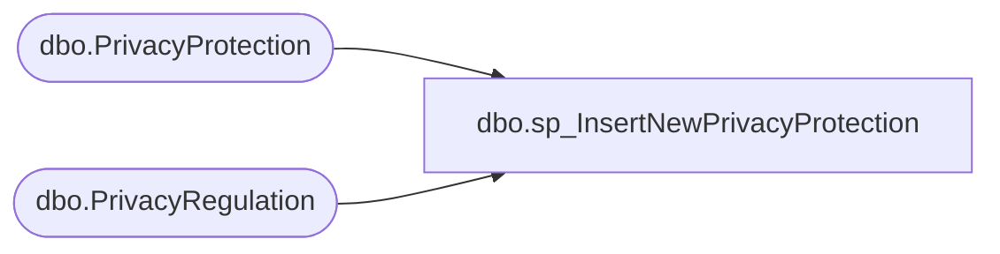

# dbo.sp_InsertNewPrivacyProtection

**Database:** BABWPartyPlanner_Restore  
**Server:** bearcluster01  

## Architecture Diagram



## Table Dependencies

| Referenced Table |
|---|
| dbo.PrivacyProtection |
| dbo.PrivacyRegulation |

## Stored Procedure Code

```sql
CREATE PROCEDURE [dbo].[sp_InsertNewPrivacyProtection]

-- =============================================================================================================
-- Name: sp_InsertNewPrivacyProtection
--
-- Description:	Inserts new privacy protection entry for Party Events
--
-- Output: 
--	
-- Dependencies: 
--
-- Revision History
--		Name:			Date:			Comments:
--		Ben Barud		3/7/2022		Initial Creation
-- =============================================================================================================

	@evendID INT,
	@privacyPolicyRead BIT,
	@privacyPolicyReadDate DATETIME,
	@privacyRegulation VARCHAR(50),
	@privacyRegulationRead BIT,
	@privacyRegulationReadDate DATETIME

AS
BEGIN
	-- SET NOCOUNT ON added to prevent extra result sets from
	-- interfering with SELECT statements.
	SET NOCOUNT ON;

    DECLARE @privacyRegulationID INT, @privacyProtectionID INT

	SELECT @privacyRegulationID = PrivacyRegulationID FROM [BABWPartyPlanner].[dbo].[PrivacyRegulation] WHERE PrivacyRegulationKeyword = 'GDPR'

	BEGIN TRY 
		INSERT INTO [BABWPartyPlanner].[dbo].[PrivacyProtection] (EventID, 
			PrivacyPolicyRead,
			PrivacyPolicyReadDate,
			PrivacyRegulationID,
			PrivacyRegulationRead,
			PrivacyRegulationReadDate)
		VALUES(@evendID, @privacyPolicyRead, @privacyPolicyReadDate, @privacyRegulationID, @privacyRegulationRead, @privacyRegulationReadDate)

		SET @privacyProtectionID = @@IDENTITY

	END TRY
	BEGIN CATCH
		--SET @privacyProtectionID = -1
	END CATCH

	--SELECT @privacyProtectionID
END
dbo,sp_InsertNewPurchaseOrder,-- =============================================================================================================
-- Name: sp_InsertNewPurchaseOrder
--
-- Description:	A simple proc that will insert a new purchase order and return the newly created POID.
--
-- Output: 
--
-- Dependencies: 
--
-- Revision History
--		Name:			Date:			Comments:
--		Tim Bytnar		1/2/2018		Initial Creation
-- =============================================================================================================
CREATE PROCEDURE [dbo].[sp_InsertNewPurchaseOrder] 
	@PONumber varchar(64),
	@CustomerID int,
	@POID int OUTPUT
AS
BEGIN
    BEGIN TRY
	   BEGIN TRAN
		  DECLARE @POIDResult table (ID int);

		  INSERT INTO BABWPartyPlanner.dbo.PurchaseOrder (PONumber,CustomerID)
			 OUTPUT inserted.POID INTO @POIDResult
		  VALUES (@PONumber,@CustomerID)
		  SET @POID = (SELECT ID FROM @POIDResult)

	   COMMIT
    END TRY
    BEGIN CATCH
	   IF(@@TRANCOUNT > 0)
		  ROLLBACK TRAN
    END CATCH
END
```

