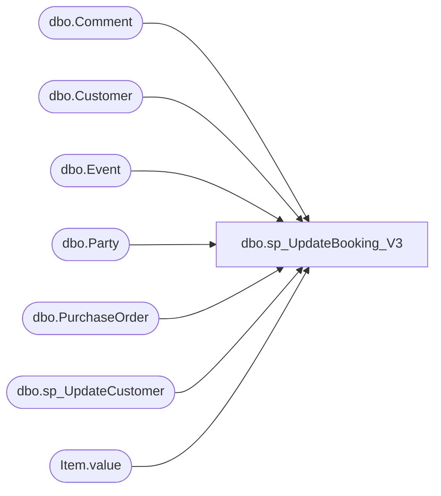

# dbo.sp_UpdateBooking_V3

**Database:** BABWPartyPlanner_Restore  
**Server:** bearcluster01  

## Architecture Diagram



## Table Dependencies

| Referenced Table |
|---|
| dbo.Comment |
| dbo.Customer |
| dbo.Event |
| dbo.Party |
| dbo.PurchaseOrder |
| dbo.sp_UpdateCustomer |
| Item.value |

## Stored Procedure Code

```sql
-- =============================================================================================================
-- Name: sp_UpdateBooking
--
-- Description:	This procedure will update a party and all of it's corresponding data fields.
--
-- Output: 
--	
-- Dependencies: 
--
-- Revision History
--		Name:			Date:			Comments:
--		Tim Bytnar		5/3/2017		Initial Creation
--		Ben Barud		8/28/2017		Added @result output parameter.  Entity Framework is challenged when
--									    returning select values with stored procs that have update statements.
--                                      The work around is add an output value.
--		Tim Bytnar		9/5/2017		Added in the support for PackageID updates.
--      Tim Bytnar      9/27/2017	    Added in support to add comments to a party during the update.
--      Tim Bytnar		9/28/2017		Fixed the comments data type for "CreatedBy" from int to varchar
--		Tim Bytnar		10/13/2017		Added in the support to update the customer data for the party
--		Tim Bytnar		1/2/2017		Added support for updating the store number
--		Tim Bytnar		1/4/2017		Adding support for updating the Purchase Order 
--		Ben Barud		3/12/2019		Added support for updating ThemeID
-- =============================================================================================================

CREATE PROCEDURE [dbo].[sp_UpdateBooking_V3] 
	-- Add the parameters for the stored procedure here
	   @PartyID int,
	   @OccasionID int,
	   @TotalGuests int,
	   @GOHAge int,
	   @GOHFirstName varchar(50),
	   @GOHGender int,
	   @GuestAvgAge int,
	   @DepositAmount decimal(9,2),
	   @EventStart datetime,
	   @EventEnd datetime,
	   @PartyStateID int,
	   @PackageID int,
	   @FirstName varchar(64),
	   @LastName varchar(64),
	   @EmailAddress varchar(128),
	   @StoreId int,
	   @Comments xml = NULL,
	   @isPOParty bit = 0,
	   @TaxId varchar(64) = '',
	   @POFirstName varchar(64) = '',
	   @POLastName varchar(64) = '',
	   @POPrimaryPhone varchar(32) = '',
	   @POEmailAddress varchar(128) = '',
	   @PONumber varchar(64) = '',
	   @ThemeID int,
	   @result int OUTPUT

AS
BEGIN
	-- SET NOCOUNT ON added to prevent extra result sets from
	-- interfering with SELECT statements.
	SET NOCOUNT ON;

	BEGIN TRAN
	   BEGIN TRY

		   IF @ThemeID = -99
		   BEGIN
				SET @ThemeID = NULL;
		   END
		   DECLARE @EventID int,
				   @CustomerID int,
				   @POCustomerID int,
				   @POID int
	
		   SELECT @EventID = p.EventID, 
				  @CustomerID = p.CustomerId,
				  @POCustomerID = po.CustomerID,
				  @POID = p.POID
		   FROM BABWPartyPlanner.dbo.Party p
		   LEFT JOIN BABWPartyPlanner.dbo.PurchaseOrder po
				ON p.POID = po.POID
		   WHERE PartyID = @PartyID

		   PRINT @EventId
		   PRINT @CustomerID
		   PRINT @POCustomerID
		   PRINT @POID

		   UPDATE BABWPartyPlanner.dbo.Event
		   SET EventStart = @EventStart,
			  EventEnd = @EventEnd,
			  StoreID = @StoreId,
			  LastUpdated = GetDate()
		   WHERE EventID = @EventID

		   PRINT 'Updating the Party'
		   UPDATE BABWPartyPlanner.dbo.Party
		   SET OccasionID = @OccasionID,
			  TotalGuests = @TotalGuests,
			  GOHAge = @GOHAge,
			  GOHFirstName = @GOHFirstName,
			  GOHGender = @GOHGender,
			  GuestAvgAge = @GuestAvgAge,
			  PartyStateID = @PartyStateID,
			  DepositAmount = @DepositAmount,
			  PackageID = @PackageID,
			  ThemeID = @ThemeID
		   WHERE PartyID = @PartyID

		   UPDATE BABWPartyPlanner.dbo.PurchaseOrder
		   SET PONumber = @PONumber

		   -- It's entirely possible with the introduction of PO Parties that the Party Customer and the PO Customer are two
		   -- seperate 
		   DECLARE @Organization varchar(64)
		   IF @CustomerID = @POCustomerID
			   BEGIN
					-- The party customer and the POCustomer are the same
					--Update the party booking customer record
				   SELECT @Organization = Organization FROM Customer WHERE CustomerID = @POCustomerID

				   --Update the Purchase Order contact customer record
				   EXEC sp_UpdateCustomer @POFirstName, @POLastName, @POEmailAddress, @POPrimaryPhone, @Organization, @POCustomerID, @TaxId
			   END
		   ELSE
			   BEGIN
					-- The party customer and the POCustomer are different
					--Update the party booking customer record
				   EXEC sp_UpdateCustomer @FirstName, @LastName, @EmailAddress, 'DONOTUPDATE','NONE', @CustomerID, @TaxId

				   SELECT @Organization = Organization FROM Customer WHERE CustomerID = @POCustomerID

				   --Update the Purchase Order contact customer record
				   EXEC sp_UpdateCustomer @POFirstName, @POLastName, @POEmailAddress, @POPrimaryPhone, @Organization, @POCustomerID, @TaxId
			   END

		   SELECT @result = @PartyID
	   COMMIT
	   END TRY
	   BEGIN CATCH
		  IF(@@TRANCOUNT > 0)
			 ROLLBACK TRAN
	   END CATCH

	   	IF @Comments IS NOT NULL 
		BEGIN
			BEGIN TRAN
				 BEGIN TRY
					INSERT INTO Comment (EventID,CreatedDate,Comment,CreatedBy)
					SELECT @EventID as 'EventID',
    					   'CreatedDate' = T.Item.value('CreatedDate[1]', 'datetime'),
					   'Comment' = T.Item.value('CommentText[1]', 'varchar(512)'),
					   'CreatedBy' = T.Item.value('CreatedBy[1]', 'varchar(512)')
					FROM @Comments.nodes('Comment') AS T(Item)
    				 COMMIT
				 END TRY
				 BEGIN CATCH
					IF(@@TRANCOUNT > 0)
						ROLLBACK TRAN
				 END CATCH
		END
	    
END

dbo,sp_UpdateCountry,-- =============================================
-- Author:		<Author,,Name>
-- Create date: <Create Date,,>
-- Description:	<Description,,>
-- =============================================
CREATE PROCEDURE sp_UpdateCountry
	@countryid int,
	@countryname nvarchar(64),
	@countryabbr nvarchar(8),
	@enabled bit
AS
BEGIN
	
	update country set 
	countryname=@countryname, 
	countryabbr=@countryabbr,
	enabled=@enabled
	where countryid=@countryid;

END

dbo,sp_UpdateCountryOption,-- =============================================
-- Author:		<Author,,Name>
-- Create date: <Create Date,,>
-- Description:	<Description,,>
-- =============================================
CREATE PROCEDURE sp_UpdateCountryOption

	@optionid int,
	@countryid int

AS
BEGIN

	if not (exists (select * from countryoptionxref where optionid=@optionid and countryid=@countryid))
	begin
		insert into CountryOptionXref (optionid,countryid) values (@optionid, @countryid);
	end

END

dbo,sp_UpdateCustomer,-- =============================================================================================================
-- Name: sp_UpdateCustomer
--
-- Description:	This procedure will update the Firstname,Lastname and EmailAddress for a customer in the database
--
-- Output: 
--	
-- Dependencies: 
--
-- Revision History
--		Name:			Date:			Comments:
--		Tim Bytnar		10/13/2017		Initial Creation
--		Tim Bytnar		1/4/2018		Adding support for updating the PO Customer Records TaxId
-- =============================================================================================================
CREATE PROCEDURE [dbo].[sp_UpdateCustomer]
	   @NewFirstName varchar(64),
	   @NewLastName varchar(64),
	   @NewEmailAddress varchar(128),
	   @NewPrimaryPhone varchar(32),
	   @NewOrganization varchar(64),
	   @CustomerID int,
	   @NewTaxId varchar(64)
AS
BEGIN
	SET NOCOUNT ON;
		DECLARE    @FirstName varchar(64),
				   @LastName varchar(64),
				   @EmailAddress varchar(128),
				   @PrimaryPhone varchar(32),
				   @Organization varchar(64),
				   @TaxId varchar(64)
		SELECT @FirstName = FirstName, 
			   @LastName = LastName, 
			   @EmailAddress = EmailAddress, 
			   @PrimaryPhone = PrimaryPhone, 
			   @Organization = Organization,
			   @TaxId = ISNULL(TaxId,0) 
	    FROM Customer WITH (NOLOCK) WHERE CustomerID = @CustomerID

		IF(@NewPrimaryPhone = 'DONOTUPDATE')
		BEGIN
			SELECT @NewPrimaryPhone = PrimaryPhone FROM Customer WHERE CustomerID = @CustomerID
		END	

		IF(@NewFirstName <> @FirstName 
			OR @NewLastName <> @LastName 
			OR @NewEmailAddress <> @EmailAddress 
			OR @NewPrimaryPhone <> @PrimaryPhone 
			OR @NewOrganization <> @Organization
			OR @NewTaxId != @TaxId
			)
		BEGIN
			BEGIN TRAN
				BEGIN TRY
					UPDATE Customer
					SET FirstName = @NewFirstName,
						LastName = @NewLastName,
						EmailAddress = @NewEmailAddress,
						PrimaryPhone = @NewPrimaryPhone,
						Organization = @NewOrganization,
						TaxId = @NewTaxId
					WHERE CustomerID = @CustomerID
					COMMIT
				END TRY
				BEGIN CATCH
				IF(@@TRANCOUNT > 0)
					ROLLBACK TRAN
				END CATCH
		END
END
dbo,sp_UpdateGroupBookingHours,-- =============================================
-- Author:		<Author,,Name>
-- Create date: <Create Date,,>
-- Description:	<Description,,>
-- =============================================
CREATE PROCEDURE [dbo].[sp_UpdateGroupBookingHours]

	@Groupid int,
	@dayofweek int,
	@starthour time(7),
	@endhour time(7)

AS
BEGIN

	if not (exists (select * from storegroupbookinghour where groupid=@Groupid and DayOfWeek=@dayofweek))
	begin
		insert into storegroupbookinghour (groupid,DayOfWeek, StartHour,EndHour) values (@Groupid, @dayofweek, @starthour, @endhour);
	end


	-- then update/overwrite each store in the group

	

	declare @storeid int;

	DECLARE MY_CURSOR CURSOR 
	  LOCAL STATIC READ_ONLY FORWARD_ONLY
	FOR select distinct storeid from store where StoreGroupID=@groupid

	OPEN MY_CURSOR
	FETCH NEXT FROM MY_CURSOR INTO @storeid
	WHILE @@FETCH_STATUS = 0
	BEGIN 
		delete from storebookinghour where storeid=@storeid and DayOfWeek=@dayofweek;
		insert into storebookinghour (storeid, dayofweek, starthour, endhour) values( @storeid, @dayofweek, @STARTHOUR,@endhour);
		FETCH NEXT FROM MY_CURSOR INTO @storeid
	END
	CLOSE MY_CURSOR
	DEALLOCATE MY_CURSOR

	END

dbo,sp_UpdateGroupInfo,-- =============================================
-- Author:		<Author,,Name>
-- Create date: <Create Date,,>
-- Description:	<Description,,>
-- =============================================
Create PROCEDURE [dbo].[sp_UpdateGroupInfo]
	@groupid int,
	@groupname varchar(max),
	@groupdesc varchar(max)
AS
BEGIN
	
	if not (exists (select * from storegroup where StoreGroupID=@Groupid))
		begin
		-- add new group
			insert into storegroup (StoreGroupName,StoreGroupDesc) values (@groupname, @groupdesc);
		end
	else
		begin
		--update
			update StoreGroup set StoreGroupName=@groupname, StoreGroupDesc=@groupdesc where StoreGroupID=@groupid;
		end

END

dbo,sp_UpdateOptionDetail,-- =============================================
-- Author:		<Author,,Name>
-- Create date: <Create Date,,>
-- Description:	<Description,,>
-- =============================================
CREATE PROCEDURE sp_UpdateOptionDetail

	@optionid int,
	@optionname varchar(max),
	@optiondesc varchar(max),
	@OptionStartdate varchar(18),
	@OptionEndDate varchar(18),
	@ENABLED bit

AS
BEGIN

	update [option]
	set 
	optionname = @optionname, 
	optiondesc = @optiondesc,
	OptionStartdate = @OptionStartdate, 
	OptionEndDate = @OptionEndDate,
	enabled =@ENABLED
	where optionid=@optionid;

END

dbo,sp_UpdateOptionOrder,-- =============================================
-- Author:		<Author,,Name>
-- Create date: <Create Date,,>
-- Description:	<Description,,>
-- =============================================
create PROCEDURE [dbo].[sp_UpdateOptionOrder]

	@order int,
	@id int

AS
BEGIN
update [option] set orderby=@order where optionid=@id
END

dbo,sp_UpdatePackageDetail,-- =============================================
-- Author:		<Author,,Name>
-- Create date: <Create Date,,>
-- Description:	<Description,,>
-- =============================================
CREATE PROCEDURE [dbo].[sp_UpdatePackageDetail]

	@packageid int,
	@packagename nvarchar(max),
	@packagelongdesc nvarchar(max),
	@PackageStartDate varchar(15),
	@PackageEndDate varchar(15),
	@MinGuestSpend numeric(18,2),
	@Enabled int,
	@PackageShortDesc nvarchar(max)
AS
BEGIN
update package set 
PackageName=@packagename,
PackageLongDesc=@packagelongdesc,
PackageStartDate = @packagestartdate,
PackageEndDate = @PackageEndDate,
MinGuestSpend = @MinGuestSpend,
Enabled = @Enabled,
PackageShortDesc=@PackageShortDesc
where packageid=@packageid

if @Enabled=0	
	update package set orderby=99999 where packageid=@packageid;

END

dbo,sp_UpdatePackageOrder,-- =============================================
-- Author:		<Author,,Name>
-- Create date: <Create Date,,>
-- Description:	<Description,,>
-- =============================================
CREATE PROCEDURE sp_UpdatePackageOrder

	@order int,
	@id int

AS
BEGIN
update package set orderby=@order where packageid=@id
END

dbo,sp_UpdatePackageOrder_DisabledPackage,-- =============================================
-- Author:		<Author,,Name>
-- Create date: <Create Date,,>
-- Description:	<Description,,>
-- =============================================
CREATE PROCEDURE sp_UpdatePackageOrder_DisabledPackage
AS
BEGIN
update package set orderby=999999 where Enabled=0
END

dbo,sp_UpdateStoreBookingHours,-- =============================================
-- Author:		<Author,,Name>
-- Create date: <Create Date,,>
-- Description:	<Description,,>
-- =============================================
CREATE PROCEDURE sp_UpdateStoreBookingHours

	@storeid int,
	@dayofweek int,
	@starthour time(7),
	@endhour time(7)

AS
BEGIN

	if not (exists (select * from storebookinghour where storeid=@storeid and DayOfWeek=@dayofweek))
	begin
		insert into storebookinghour (storeid,DayOfWeek, StartHour,EndHour) values (@storeid, @dayofweek, @starthour, @endhour);
	end

END

dbo,sp_UpdateStoreGroup,-- =============================================
-- Author:		<Author,,Name>
-- Create date: <Create Date,,>
-- Description:	<Description,,>
-- =============================================
CREATE PROCEDURE sp_UpdateStoreGroup
	@grouplist varchar(max),
	@groupid int
AS
BEGIN


	declare @sql nvarchar(max);
	declare @sql2 nvarchar(max);
	declare @sqlcommand nvarchar(max);

	-- remove previous assinged group
	update store set StoreGroupID=null where storegroupid=@groupid;


	set @sql=' update store set storegroupid=' + convert(varchar(max),@groupid) + ' where storeid in (' ;
	set @sql2=' )';
	set @sqlcommand= @sql + @grouplist + @sql2;
	exec (@sqlcommand);
END

dbo,sp_UpdateStoreInfo,-- =============================================
-- Author:		<Author,,Name>
-- Create date: <Create Date,,>
-- Description:	<Description,,>
-- =============================================
CREATE PROCEDURE [dbo].[sp_UpdateStoreInfo]

	@storeid int,
	@bsrmessage varchar(max),
	@webmessage varchar(max),
	@maxguests int,
	@minguests int,
	@canbookonline bit,
	@bookingparties bit

AS
BEGIN

	update store set BSRMessage=@bsrmessage, WebMessage=@webmessage ,
	MaxGuests=@maxguests,
	MinGuests=@minguests,
	CanBookOnline = @canbookonline,
	BookingParties = @bookingparties
	where storeid = @storeid;

END
dbo,sp_UpdateStoreOption,-- =============================================
-- Author:		<Author,,Name>
-- Create date: <Create Date,,>
-- Description:	<Description,,>
-- =============================================
create procedure [dbo].[sp_UpdateStoreOption]
	@storeid int,
	@optionid int
AS
BEGIN

	if not (exists (select * from [dbo].[OptionStoreXref] where storeid=@storeid and optionid=@optionid))
	begin
		insert into [dbo].[OptionStoreXref] (storeid,optionid) values (@storeid, @optionid);
	end

END

dbo,sp_UpdateStorePackage,-- =============================================
-- Author:		<Author,,Name>
-- Create date: <Create Date,,>
-- Description:	<Description,,>
-- =============================================
CREATE procedure sp_UpdateStorePackage
	@storeid int,
	@packageid int
AS
BEGIN

	if not (exists (select * from StorePackageXref where storeid=@storeid and packageid=@packageid))
	begin
		insert into StorePackageXref (storeid,packageid) values (@storeid, @packageid);
	end

END
```

