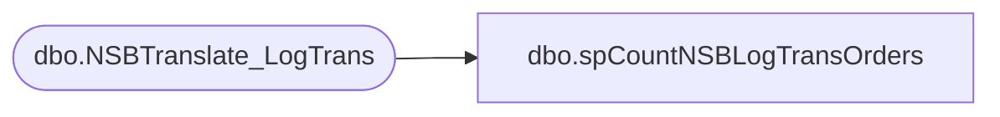

# dbo.spCountNSBLogTransOrders

**Database:** BABWeCommerce  
**Server:** bearcluster01  

## Architecture Diagram



## Table Dependencies

| Referenced Table |
|---|
| dbo.NSBTranslate_LogTrans |

## Stored Procedure Code

```sql
-- =============================================
-- Author:		Schlobohm, Ken
-- Create date: 08/01/2011
-- Description:	Find orders sent to audit works
-- =============================================
CREATE PROCEDURE [dbo].[spCountNSBLogTransOrders]
	-- Add the parameters for the stored procedure here
	@sOrderNumber varchar(50)
AS
BEGIN
	-- SET NOCOUNT ON added to prevent extra result sets from
	-- interfering with SELECT statements.
	SET NOCOUNT ON;

	SELECT Count(1)
	FROM [dbo].[NSBTranslate_LogTrans]
	WHERE sOrderNumber = @sOrderNumber
END
```

