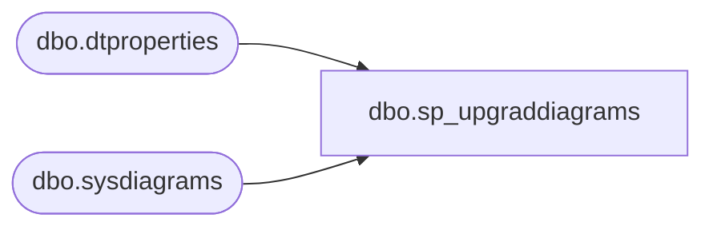

# dbo.sp_upgraddiagrams

**Database:** BABWeCommerce  
**Server:** bearcluster01  

## Architecture Diagram



## Table Dependencies

| Referenced Table |
|---|
| dbo.dtproperties |
| dbo.sysdiagrams |

## Stored Procedure Code

```sql
CREATE PROCEDURE dbo.sp_upgraddiagrams
	AS
	BEGIN
		IF OBJECT_ID(N'dbo.sysdiagrams') IS NOT NULL
			return 0;
	
		CREATE TABLE dbo.sysdiagrams
		(
			name sysname NOT NULL,
			principal_id int NOT NULL,	-- we may change it to varbinary(85)
			diagram_id int PRIMARY KEY IDENTITY,
			version int,
	
			definition varbinary(max)
			CONSTRAINT UK_principal_name UNIQUE
			(
				principal_id,
				name
			)
		);


		/* Add this if we need to have some form of extended properties for diagrams */
		/*
		IF OBJECT_ID(N'dbo.sysdiagram_properties') IS NULL
		BEGIN
			CREATE TABLE dbo.sysdiagram_properties
			(
				diagram_id int,
				name sysname,
				value varbinary(max) NOT NULL
			)
		END
		*/

		IF OBJECT_ID(N'dbo.dtproperties') IS NOT NULL
		begin
			insert into dbo.sysdiagrams
			(
				[name],
				[principal_id],
				[version],
				[definition]
			)
			select	 
				convert(sysname, dgnm.[uvalue]),
				DATABASE_PRINCIPAL_ID(N'dbo'),			-- will change to the sid of sa
				0,							-- zero for old format, dgdef.[version],
				dgdef.[lvalue]
			from dbo.[dtproperties] dgnm
				inner join dbo.[dtproperties] dggd on dggd.[property] = 'DtgSchemaGUID' and dggd.[objectid] = dgnm.[objectid]	
				inner join dbo.[dtproperties] dgdef on dgdef.[property] = 'DtgSchemaDATA' and dgdef.[objectid] = dgnm.[objectid]
				
			where dgnm.[property] = 'DtgSchemaNAME' and dggd.[uvalue] like N'_EA3E6268-D998-11CE-9454-00AA00A3F36E_' 
			return 2;
		end
		return 1;
	END
	
dbo,spBABW_ServiceRequest_Add,-- =============================================
-- Author:		Schlobohm, Ken
-- Create date: 10/13/2010
-- Description:	The babw.services project uses this procedure to store
-- the request objects that are being used. The purpose of this
-- process is to assist with debugging.
-- =============================================
CREATE PROCEDURE [dbo].[spBABW_ServiceRequest_Add]
	@ServiceName varchar(50),
	@Value xml
AS
BEGIN
	insert into babw_serviceRequest (ServiceName, Value, CreatedDate) Values (@ServiceName, @Value, GETDATE());
	
	SELECT @@IDENTITY;
END

dbo,spBABW_ServiceRequest_Get,-- =============================================
-- Author:		Schlobohm, Ken
-- Create date: 10/20/2010
-- Description:	<Description,,>
-- =============================================
CREATE PROCEDURE [dbo].[spBABW_ServiceRequest_Get]
	@ServiceName varchar(50),
	@ServiceRequestID int
AS
BEGIN
	DECLARE @matchingRequestId int
	
	SELECT	@matchingRequestId = COUNT(1)
	from	[BABW_ServiceRequest]
	where	ServiceName = @ServiceName
	AND		ID = @ServiceRequestID
	
	IF @matchingRequestId = 0
	BEGIN
		SELECT	@ServiceRequestID = MAX(ID)
		FROM	[dbo].[BABW_ServiceRequest]
		WHERE	ServiceName = @ServiceName
	
	END
		
	SELECT	[Value]
	FROM	[dbo].[BABW_ServiceRequest]
	WHERE	ServiceName = @ServiceName
	AND		ID = @ServiceRequestID
	
END
```

