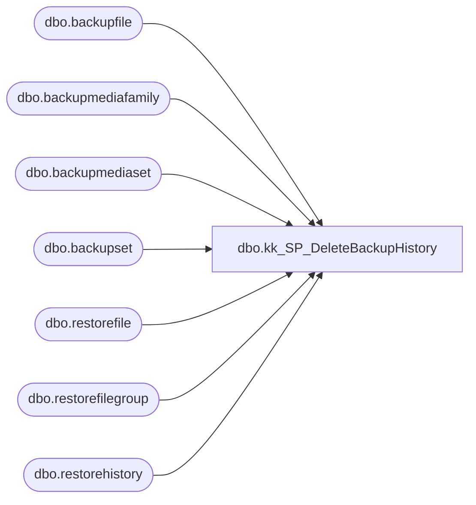

# dbo.kk_SP_DeleteBackupHistory

**Database:** DBAUtility  
**Server:** bearcluster01  

## Architecture Diagram



## Table Dependencies

| Referenced Table |
|---|
| dbo.backupfile |
| dbo.backupmediafamily |
| dbo.backupmediaset |
| dbo.backupset |
| dbo.restorefile |
| dbo.restorefilegroup |
| dbo.restorehistory |

## Stored Procedure Code

```sql
CREATE PROCEDURE dbo.kk_SP_DeleteBackupHistory
        @intDaysToRetain        int=NULL,	-- Used for routine, daily, scheduled maintenance
	@dtCutoff		datetime=NULL,	-- Used to purge "old records" in batches

        @intDebug               int=0   -- 0=Off, 1=On

/* WITH ENCRYPTION */
AS

/*
 * kk_SP_DeleteBackupHistory    Purge backup history in MSDB database
 *
 *   Use the CutoffDate to remove batches from large MSDB bit-by-bit
 *   then schedule as a task using RetainDays to keep recent records
 *   See TEST RIG, below, for details
 *
 * Returns:
 *
 *      Nothing
 *
 * ERRORS:
 *
 * -1   No rows found
 * -2   Multiple rows found
 *
 * HISTORY:
 *
 * 12-Jun-2004 KBM  Started (From code provided by Tara Duggan 
 *                  http://www.sqlteam.com/forums/topic.asp?TOPIC_ID=36201 )
 */

SET NOCOUNT ON
SET XACT_ABORT ON

-- Local Variables
DECLARE	@intErrNo	int,
	@intRowCount	int

	-- Remove TIME
	SELECT	@dtCutoff = CONVERT(varchar(11), 
		COALESCE(@dtCutoff, DATEADD(day, -@intDaysToRetain, GetDate())), 113)

	IF @intDebug >= 1 SELECT [@intDaysToRetain]=@intDaysToRetain, 
				[@dtCutoff]=@dtCutoff

	BEGIN TRANSACTION kk_SP_DeleteBackupHistory_01

	DELETE FROM msdb..restorefile
	FROM	msdb..restorefile RF
		JOIN msdb..restorehistory RH
			ON RF.restore_history_id = RH.restore_history_id
		JOIN msdb..backupset BS
			ON RH.backup_set_id = BS.backup_set_id
	WHERE	BS.backup_finish_date < @dtCutoff
	SELECT	@intErrNo = @@ERROR, @intRowCount = @@ROWCOUNT
	IF @intDebug >= 1 SELECT 'restorefile', @intErrNo, @intRowCount
	IF @intErrNo <> 0 GOTO kk_SP_DeleteBackupHistory_Abort

	DELETE FROM msdb..restorefilegroup
	FROM	msdb..restorefilegroup RFG
		JOIN msdb..restorehistory RH
			ON RFG.restore_history_id = RH.restore_history_id
		JOIN msdb..backupset BS
			ON RH.backup_set_id = BS.backup_set_id
	WHERE	BS.backup_finish_date < @dtCutoff
	SELECT	@intErrNo = @@ERROR, @intRowCount = @@ROWCOUNT
	IF @intDebug >= 1 SELECT 'restorefilegroup', @intErrNo, @intRowCount
	IF @intErrNo <> 0 GOTO kk_SP_DeleteBackupHistory_Abort
	
	DELETE FROM msdb..restorehistory
	FROM	msdb..restorehistory RH
		JOIN msdb..backupset BS
			ON RH.backup_set_id = BS.backup_set_id
	WHERE	BS.backup_finish_date < @dtCutoff
	SELECT	@intErrNo = @@ERROR, @intRowCount = @@ROWCOUNT
	IF @intDebug >= 1 SELECT 'restorehistory', @intErrNo, @intRowCount
	IF @intErrNo <> 0 GOTO kk_SP_DeleteBackupHistory_Abort

-- This bit moved further down
-- 	DELETE FROM msdb..backupfile
-- 	FROM	msdb..backupfile BF
-- 		JOIN msdb..backupset BS
-- 			ON BF.backup_set_id = BS.backup_set_id
-- 	WHERE	BS.backup_finish_date < @dtCutoff
-- 	SELECT	@intErrNo = @@ERROR, @intRowCount = @@ROWCOUNT
-- 	IF @intDebug >= 1 SELECT 'backupfile', @intErrNo, @intRowCount
-- 	IF @intErrNo <> 0 GOTO kk_SP_DeleteBackupHistory_Abort
	
	SELECT media_set_id, backup_finish_date
	INTO	#Temp
	FROM	msdb..backupset BS
	WHERE backup_finish_date < @dtCutoff
	SELECT	@intErrNo = @@ERROR, @intRowCount = @@ROWCOUNT
	IF @intDebug >= 1 SELECT '#Temp', @intErrNo, @intRowCount
	IF @intErrNo <> 0 GOTO kk_SP_DeleteBackupHistory_Abort

	DELETE FROM msdb..backupfile
	FROM	msdb..backupfile BF
		JOIN msdb..backupset BS
			ON BF.backup_set_id = BS.backup_set_id
		JOIN #Temp T
			ON BS.media_set_id = T.media_set_id
--	Changed to use JOIN instead of WHERE because some records were left behind
--	WHERE	BS.backup_finish_date < @dtCutoff
	SELECT	@intErrNo = @@ERROR, @intRowCount = @@ROWCOUNT
	IF @intDebug >= 1 SELECT 'backupfile', @intErrNo, @intRowCount
	IF @intErrNo <> 0 GOTO kk_SP_DeleteBackupHistory_Abort

	DELETE FROM msdb..backupset
	FROM	msdb..backupset BS
		JOIN #Temp T
			ON BS.media_set_id = T.media_set_id
--	Changed to use JOIN instead of WHERE because some records were left behind
--	WHERE	backup_finish_date < @dtCutoff
	SELECT	@intErrNo = @@ERROR, @intRowCount = @@ROWCOUNT
	IF @intDebug >= 1 SELECT 'backupset', @intErrNo, @intRowCount
	IF @intErrNo <> 0 GOTO kk_SP_DeleteBackupHistory_Abort
	
	DELETE FROM msdb..backupmediafamily
	FROM	msdb..backupmediafamily BMF
		JOIN msdb..backupmediaset BMS
			ON BMF.media_set_id = BMS.media_set_id
		JOIN #Temp T
			ON BMS.media_set_id = T.media_set_id
	SELECT	@intErrNo = @@ERROR, @intRowCount = @@ROWCOUNT
	IF @intDebug >= 1 SELECT 'backupmediafamily', @intErrNo, @intRowCount
	IF @intErrNo <> 0 GOTO kk_SP_DeleteBackupHistory_Abort

	DELETE FROM msdb..backupmediaset
	FROM	msdb..backupmediaset BMS
		JOIN #Temp T
			ON BMS.media_set_id = T.media_set_id
	SELECT	@intErrNo = @@ERROR, @intRowCount = @@ROWCOUNT
	IF @intDebug >= 1 SELECT 'backupmediaset', @intErrNo, @intRowCount
	IF @intErrNo <> 0 GOTO kk_SP_DeleteBackupHistory_Abort

	
kk_SP_DeleteBackupHistory_Abort:

	IF @intErrNo <> 0
	BEGIN
		ROLLBACK
		IF @intDebug >= 1 SELECT 'ROLLBACK'
	END
	ELSE
	BEGIN
		COMMIT TRANSACTION kk_SP_DeleteBackupHistory_01
		IF @intDebug >= 1 SELECT 'COMMIT'
	END

	DROP TABLE #Temp

kk_SP_DeleteBackupHistory_Exit:

	SET NOCOUNT OFF

	RETURN @intErrNo

/* TEST RIG (Highlight a section and run in Query Analyser)

-- Oldest backup record in MSDB
SELECT	MIN(backup_start_date)
FROM	msdb.dbo.backupset

-- To sort out an existing MSDB old records must be deleted in batches
-- It takes a while to delete a large backlog - I did about 2,500 backups per batch

-- Find cutoff date - based on deleting 2,500 backups

-- Now set the BACKUP date (from above) to delete the oldest batch
EXEC dbo.kk_SP_DeleteBackupHistory
        @intDaysToRetain = NULL,
	@dtCutoff	 = '5/25/2004'
	
SELECT	MAX(backup_start_date)
FROM	
(
	SELECT TOP 2500 backup_start_date
	FROM	msdb.dbo.backupset
	ORDER BY backup_start_date ASC
) X
	,@intDebug=1
ROLLBACK	-- Just in case SP failed half way through 
-- (otherwise will leave a hanging transaction, ignore error if SProc was OK)

-- Move the date forward and repeat until up to the "Retain Days" from today


-- Other stuff that is useful in sorting out the problem:

-- Check out the size of the problem:
SELECT [Table]='backupfile', [Count]=COUNT(*) FROM msdb.dbo.backupfile
UNION ALL SELECT 'backupmediafamily', COUNT(*) FROM msdb.dbo.backupmediafamily
UNION ALL SELECT 'backupmediaset', COUNT(*) FROM msdb.dbo.backupmediaset
UNION ALL SELECT 'backupset', COUNT(*) FROM msdb.dbo.backupset
ORDER BY 1

-- Check size of objects in MSDB
SELECT	[Size in MB] = SUM(IDX.reserved)/128,
	[Object Name] = OBJ.name
FROM	msdb.dbo.sysindexes IDX
	JOIN msdb.dbo.sysobjects OBJ
		ON OBJ.id = IDX.id
WHERE	IDX.indid IN (0, 1, 255)
GROUP BY IDX.id, OBJ.name
ORDER BY 1 DESC

-- Traditional microsoft method 
--    (Dog slow, don't attempt more than a couple of hundred deletions)
-- USE msdb
-- EXEC sp_delete_backuphistory @oldest_date = '16-Jan-2002'

-- Check File sizes
EXEC master.dbo.xp_cmdshell 'DIR D:\MSSQL\DATA\msdb*.* /ON'

-- Check fragmentation
USE MSDB
DBCC SHOWCONTIG (backupset) WITH ALL_INDEXES

-- Fix!! fragmentation
DBCC DBREINDEX (backupset) 
DBCC DBREINDEX (backupmediafamily) 
DBCC DBREINDEX (backupfile) 
DBCC DBREINDEX (backupmediaset) 

-- Shrink DB - NOTE: May need repeated use to do full shrink
USE MSDB
SELECT [--SQL]='DBCC SHRINKFILE (', fileid, ') --', size, name, CHAR(13)+CHAR(10)+'GO'
FROM	msdb.dbo.sysfiles

-- Fix up Usage Stats on MSDB
USE MSDB
DBCC UPDATEUSAGE (0)

 */
--================== kk_SP_DeleteBackupHistory ==================--
```

