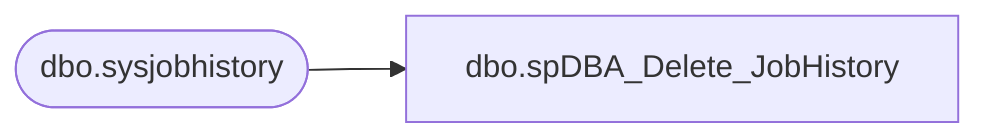

# dbo.spDBA_Delete_JobHistory

**Database:** DBAUtility  
**Server:** bearcluster01  

## Architecture Diagram



## Table Dependencies

| Referenced Table |
|---|
| dbo.sysjobhistory |

## Stored Procedure Code

```sql
CREATE PROC [dbo].[spDBA_Delete_JobHistory]
@Action VARCHAR(20) = 'Process'
As

-- =============================================================================================================
-- Name: spDBA_Delete_JobHistory
--
-- Description:	Deletes job history in chunks
--
-- Output: none
-- 
-- Available actions:
-- @Action:
--	'ReturnVersion' = Do not do anything but return the version of the objects
--	'Process' = populate the object version log 

-- Dependencies: 
--  None
--
-- Revision History:
--		Mike Pelikan	06/27/2012		Modified for versioning
--										Added Comments

-- =============================================================================================================
DECLARE @Revision DATETIME
SET @Revision = '06/27/2012'

----------------------------------------------------------------------------------------------------
--// Set options                                                                                //--
----------------------------------------------------------------------------------------------------
SET NOCOUNT ON

----------------------------------------------------------------------------------------------------
--// Revision                                                                                  //--
----------------------------------------------------------------------------------------------------
IF @Action = 'ReturnVersion'
BEGIN
	GOTO EndHere
END

----------------------------------------------------------------------------------------------------
--// Declare variables                                                                          //--
----------------------------------------------------------------------------------------------------

DECLARE @OldestJobHistoryDate DATETIME
DECLARE @DaysToLeave INT
DECLARE @DaysToDeleteAtOnce INT
DECLARE @DeleteDate DATETIME
DECLARE @Counter INT
DECLARE @CounterText VARCHAR(100)
DECLARE @datepart INT

----------------------------------------------------------------------------------------------------

SELECT @OldestJobHistoryDate = convert(datetime,rtrim(run_date)) 
FROM msdb..sysjobhistory
WHERE instance_id = (select MIN(instance_id) FROM msdb..sysjobhistory)

SELECT @OldestJobHistoryDate
SET @DaysToLeave = 60
SET @DaysToDeleteAtOnce = 1

SELECT @Counter = DATEDIFF(DAY,@OldestJobHistoryDate,GETDATE())

WHILE @Counter >= @DaysToLeave  
BEGIN   
 SET @CounterText = CONVERT(VARCHAR(30),GETDATE(),21) + ' processing ' + CONVERT(VARCHAR(30),DATEADD(DAY, -@Counter,GETDATE()),21)
 SELECT @DeleteDate = CONVERT(VARCHAR(30),DATEADD(DAY, -@Counter,GETDATE()),21) 
 RAISERROR (@CounterText , 10, 1) WITH NOWAIT   
 SET @datepart = CONVERT(INT, CONVERT(VARCHAR, @DeleteDate, 112))
 DELETE FROM msdb.dbo.sysjobhistory WHERE (run_date < @datepart)
 SELECT @Counter = @Counter - @DaysToDeleteAtOnce  
END 

EndHere:
IF @Action = 'ReturnVersion'
BEGIN
	SELECT @Revision 
END


dbo,spDBA_DeleteBackupHistory_SQLExpress,CREATE PROCEDURE spDBA_DeleteBackupHistory_SQLExpress
@Action VARCHAR
AS
-- =============================================================================================================
-- Name: spDBA_DeleteBackupHistory_SQLExpress
--
-- Description:	Calls sp_delete_backuphistory for SQL Express boxes
--
-- Output: 
--
-- Available actions:
--
-- Dependencies: 
--
-- Revision History
--		Name:			Date:			Comments:
--		Mike Pelikan	07/12/2012		Created because it is easier to execute a procedure with out dynamic variables

DECLARE @Revision DATETIME
SET @Revision = '07/12/2012'
 	
/*


*/
-- =============================================================================================================


SET NOCOUNT ON
----------------------------------------------------------------------------------------------------
--// Revision Return		                                                                    //--
----------------------------------------------------------------------------------------------------
IF @Action = 'ReturnVersion' GOTO Logging

----------------------------------------------------------------------------------------------------

DECLARE @CleanupDate datetime 
SET @CleanupDate = DATEADD(dd,-30,GETDATE()) 
EXECUTE msdb.dbo.sp_delete_backuphistory @oldest_date = @CleanupDate

Logging:
IF @Action = 'ReturnVersion'
BEGIN
	SELECT @Revision
END


dbo,spDBA_DeleteOldFiles,CREATE PROC [dbo].[spDBA_DeleteOldFiles] 
	@path VARCHAR(100), @filemask VARCHAR(20), @retention INT = 2
AS


-- =============================================================================================================
-- Name: spDBA_DeleteOldFiles
--
-- Description:	Deletes files 
--
-- @path: directory location of files to delete.
-- @filemask: file extension of files to delete.
-- @retention: number of days of files to keep.
--
-- Output: 
--
-- Available actions: delete files
--
-- Dependency: 
--
-- Revision History
--		Name:			Date:			Comments:
--		Mike Pelikan	01/08/2014		Changed Name and added comment block

DECLARE @Revision DATETIME
SET @Revision = '01/08/2014'
 	
/*

*/
-- =============================================================================================================
SET NOCOUNT ON 

declare @cmd varchar(1000)
declare @rowcnt int	--stores @@rowcount
declare @WhichFile VARCHAR(1000)

--declare @path varchar(100)
--declare @filemask varchar(20)
--declare @retention int
--
--select @path = 'i:\postfuture\uploaded\'
--select @filemask = '*.zip'
--select @retention = 7

-- Stores the name of the file to be deleted
CREATE TABLE #DeleteOldFiles
 (
  DirInfo VARCHAR(7000)
 )

-- Build the command that will list out all of the files in a directory
SELECT @cmd = 'dir ' + @path + @filemask + ' /OD'

  -- Run the dir command and put the results into a temp table
  INSERT INTO #DeleteOldFiles
  EXEC master.dbo.xp_cmdshell @cmd

  -- Delete all rows from the temp table except the ones that correspond to the files to be deleted
  DELETE
  FROM #DeleteOldFiles
  WHERE ISDATE(SUBSTRING(DirInfo, 1, 10)) = 0 OR DirInfo LIKE '%
%' OR SUBSTRING(DirInfo, 25, 5) = '<DIR>'
	OR SUBSTRING(DirInfo, 1, 10) >= GETDATE() - @retention

  -- Get the file name portion of the row that corresponds to the file to be deleted
  SELECT TOP 1 @WhichFile = SUBSTRING(DirInfo, LEN(DirInfo) -  PATINDEX('% %', REVERSE(DirInfo)) + 2, LEN(DirInfo))
  FROM #DeleteOldFiles
  
  SET @rowcnt = @@ROWCOUNT
  
  -- Interate through the temp table until there are no more files to delete
  WHILE @rowcnt <> 0
  BEGIN
  
   -- Build the del command
   SELECT @cmd = 'del ' + @path + @WhichFile + ' /Q /F'
   
   -- Delete the file
   EXEC master.dbo.xp_cmdshell @cmd, NO_OUTPUT
   
   -- To move to the next file, the current file name needs to be deleted from the temp table
   DELETE
   FROM #DeleteOldFiles
   WHERE SUBSTRING(DirInfo, LEN(DirInfo) -  PATINDEX('% %', REVERSE(DirInfo)) + 2, LEN(DirInfo))  = @WhichFile

   -- Get the file name portion of the row that corresponds to the file to be deleted
   SELECT TOP 1 @WhichFile = SUBSTRING(DirInfo, LEN(DirInfo) -  PATINDEX('% %', REVERSE(DirInfo)) + 2, LEN(DirInfo))
   FROM #DeleteOldFiles
  
   SET @rowcnt = @@ROWCOUNT
  
  END
  
  DROP TABLE #DeleteOldFiles
```

