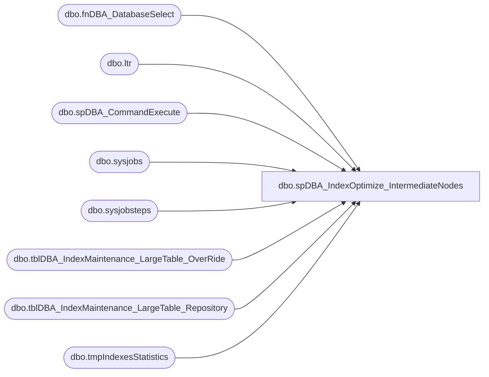

# dbo.spDBA_IndexOptimize_IntermediateNodes

**Database:** DBAUtility  
**Server:** bearcluster01  

## Architecture Diagram



## Table Dependencies

| Referenced Table |
|---|
| dbo.fnDBA_DatabaseSelect |
| dbo.ltr |
| dbo.spDBA_CommandExecute |
| dbo.sysjobs |
| dbo.sysjobsteps |
| dbo.tblDBA_IndexMaintenance_LargeTable_OverRide |
| dbo.tblDBA_IndexMaintenance_LargeTable_Repository |
| dbo.tmpIndexesStatistics |

## Stored Procedure Code

```sql
CREATE PROCEDURE [dbo].[spDBA_IndexOptimize_IntermediateNodes] 
@Action VARCHAR(100) = 'Process', 
@FragmentationLevel int = 30,
@PageCountLevel int = 1000,
@SortInTempdb nvarchar(max) = 'Y',
@MaxDOP int = NULL,
@FillFactor int = NULL,
@PadIndex nvarchar(max) = NULL,
@LOBCompaction nvarchar(max) = 'Y',
@UpdateStatistics nvarchar(max) = 'INDEX',
@OnlyModifiedStatistics nvarchar(max) = 'N',
@StatisticsSample int = NULL,
@StatisticsResample nvarchar(max) = 'N',
@PartitionLevel nvarchar(max) = 'N',
@TimeLimit int = 120,
@Indexes nvarchar(max) = NULL,
@Delay int = NULL,
@LogToTable nvarchar(max) = 'N',
@Execute nvarchar(max) = 'Y'

AS

-- =============================================================================================================
-- Name: spDBA_IndexOptimize_IntermediateNodes
--
-- Description:	Rebuilds Indexes that are stored in the central repository that have intermediate nodes that are fragmented
--
-- Output: Optional error logging.
-- 
-- Available actions:
-- 'INDEX_REBUILD_ONLINE'—Tells the stored procedure to rebuild the indexes online. (You need to be running the Enterprise or Developer Edition of SQL Server 2008 or SQL Server 2005 to use this option.)
--							Online rebuild only when table does not have LOB.
-- 'INDEX_REBUILD_OFFLINE'—Tells the stored procedure to rebuild the indexes offline.
-- 'INDEX_REORGANIZE'—Tells the stored procedure to reorganize the indexes.
-- 'INDEX_REORGANIZE_STATISTICS_ UPDATE'—Tells the stored procedure reorganize the indexes and update the statistics.
-- 'STATISTICS_UPDATE'—Tells the stored procedure to update the statistics.
-- 'NOTHING'—Tells the stored procedure to do nothing to the indexes.
--
-- Dependencies: fnDBA_DatabaseSelect
--DBAUtility.dbo.tblDBA_IndexMaintenance_LargeTable_Repository 
--DBAUtility.dbo.tblDBA_IndexMaintenance_LargeTable_OverRide
--spDBA_CommandExecute
--
-- Revision History
--		Name:			Date:			Comments:
--		Mike Pelikan	06/12/2012		Written based on ola.hallengren.com's script, modified to only work on indexes in tblDBA_IndexMaintenance_LargeTable_Repository
--		Mike Pelikan	07/19/2013		Updated to use DBAUtility.dbo.tblDBA_IndexMaintenance_LargeTable_OverRide and (NOLOCK) hint
--		Mike Pelikan	03/24/2014		Commented out the Mode logic
--		Mike Pelikan	08/07/2014		Added conversion of full recovery model DBs to bulk logged for duration of reindexing, with logbackups
--		Mike Pelikan	08/11/2014		Added "hard" stop to TimeLimit. Added Checkpoint to TempDB
--										
DECLARE @Revision DATETIME
SET @Revision = '08/11/2014'
 	
--DECLARE @Action VARCHAR(100), @FragmentationLevel int, @PageCountLevel int, @SortInTempdb nvarchar(max), @MaxDOP int, @FillFactor int, 
--@PadIndex nvarchar(max), @LOBCompaction nvarchar(max), @UpdateStatistics nvarchar(max), @OnlyModifiedStatistics nvarchar(max), @StatisticsSample int,
--@StatisticsResample nvarchar(max), @PartitionLevel nvarchar(max), @TimeLimit int, @Indexes nvarchar(max), @Delay int, @LogToTable nvarchar(max), 
--@Execute nvarchar(max)

--SELECT @Action = 'Process', 
--@FragmentationLevel = 30,
--@PageCountLevel = 1000,
--@SortInTempdb = 'Y',
--@MaxDOP = NULL,
--@FillFactor = NULL,
--@PadIndex = NULL,
--@LOBCompaction = 'Y',
--@UpdateStatistics  = 'ALL',
--@OnlyModifiedStatistics = 'N',
--@StatisticsSample = NULL,
--@StatisticsResample  = 'N',
--@PartitionLevel = 'N',
--@TimeLimit = NULL,
--@Indexes = NULL,
--@Delay = NULL,
--@LogToTable = 'N',
--@Execute = 'Y'

  ----------------------------------------------------------------------------------------------------
  --// Source: http://ola.hallengren.com                                                          //--
  ----------------------------------------------------------------------------------------------------
/*
*/
-- =============================================================================================================


SET NOCOUNT ON
SET ARITHABORT ON
SET LOCK_TIMEOUT 3600000

DECLARE @StartMessage nvarchar(max)
DECLARE @EndMessage nvarchar(max)
DECLARE @DatabaseMessage nvarchar(max)
DECLARE @ErrorMessage nvarchar(max)

DECLARE @Version numeric(18,10)

DECLARE @StartTime datetime

DECLARE @CurrentIndexList nvarchar(max)
DECLARE @CurrentIndexItem nvarchar(max)
DECLARE @CurrentIndexPosition int

DECLARE @CurrentID int
DECLARE @CurrentDatabaseID int
DECLARE @CurrentDatabaseName nvarchar(max)
DECLARE @CurrentIsDatabaseAccessible bit
DECLARE @CurrentMirroringRole nvarchar(max)

DECLARE @CurrentCommand01 nvarchar(max)
DECLARE @CurrentCommand02 nvarchar(max)
DECLARE @CurrentCommand03 nvarchar(max)
DECLARE @CurrentCommand04 nvarchar(max)
DECLARE @CurrentCommand05 nvarchar(max)
DECLARE @CurrentCommand06 nvarchar(max)
DECLARE @CurrentCommand07 nvarchar(max)
DECLARE @CurrentCommand08 nvarchar(max)
DECLARE @CurrentCommand09 nvarchar(max)
DECLARE @CurrentCommand10 nvarchar(max)
DECLARE @CurrentCommand11 nvarchar(max)
DECLARE @CurrentCommand12 nvarchar(max)

DECLARE @CurrentCommandOutput09 int
DECLARE @CurrentCommandOutput10 int

DECLARE @CurrentCommandType09 nvarchar(max)
DECLARE @CurrentCommandType10 nvarchar(max)

DECLARE @CurrentIxID int
DECLARE @CurrentSchemaID int
DECLARE @CurrentSchemaName nvarchar(max)
DECLARE @CurrentObjectID int
DECLARE @CurrentObjectName nvarchar(max)
DECLARE @CurrentObjectType nvarchar(max)
DECLARE @CurrentIndexID int
DECLARE @CurrentIndexName nvarchar(max)
DECLARE @CurrentIndexType int
DECLARE @CurrentStatisticsID int
DECLARE @CurrentStatisticsName nvarchar(max)
DECLARE @CurrentPartitionID bigint
DECLARE @CurrentPartitionNumber int
DECLARE @CurrentPartitionCount int
DECLARE @CurrentIsPartition bit
DECLARE @CurrentIndexExists bit
DECLARE @CurrentStatisticsExists bit
DECLARE @CurrentIsImageText bit
DECLARE @CurrentIsNewLOB bit
DECLARE @CurrentIsFileStream bit
DECLARE @CurrentAllowPageLocks bit
DECLARE @CurrentNoRecompute bit
DECLARE @CurrentStatisticsModified bit
DECLARE @CurrentOnReadOnlyFileGroup bit

DECLARE @CurrentAction nvarchar(max)
DECLARE @CurrentMaxDOP int
DECLARE @CurrentUpdateStatistics nvarchar(max)
DECLARE @CurrentComment nvarchar(max)
DECLARE @CurrentExtendedInfoXML XML
DECLARE @CurrentExtendedInfo NVARCHAR(max)
DECLARE @CurrentDelay datetime

DECLARE @strBackupSQL VARCHAR(1000), @strRecovery VARCHAR(20)

DECLARE @tmpDatabases TABLE (ID int IDENTITY PRIMARY KEY,
DatabaseName nvarchar(max),
Completed bit)

DECLARE @tmpIndexesStatistics TABLE (IxID int IDENTITY,
SchemaID int,
SchemaName nvarchar(max),
ObjectID int,
ObjectName nvarchar(max),
ObjectType nvarchar(max),
IndexID int,
IndexName nvarchar(max),
IndexType int,
StatisticsID int,
StatisticsName nvarchar(max),
PartitionID bigint,
PartitionNumber int,
PartitionCount int,
Selected bit,
Completed bit,
SortOrder int,
PRIMARY KEY(Selected, Completed, IxID))

IF OBJECT_ID('tempdb..##SelectedIndexes', 'U') IS NOT NULL DROP TABLE ##SelectedIndexes 
CREATE TABLE ##SelectedIndexes (
DatabaseName nvarchar(max),
SchemaName nvarchar(max),
ObjectName nvarchar(max),
IndexName nvarchar(max),
Selected bit,
SortOrder int)

DECLARE @tblPhysicalStats TABLE(
	[database_id] [smallint] NULL,
	[object_id] [int] NULL,
	[index_id] [int] NULL,
	[partition_number] [int] NULL,
	[index_type_desc] [nvarchar](60) NULL,
	[alloc_unit_type_desc] [nvarchar](60) NULL,
	[index_depth] [tinyint] NULL,
	[index_level] [tinyint] NULL,
	[avg_fragmentation_in_percent] [float] NULL,
	[fragment_count] [bigint] NULL,
	[avg_fragment_size_in_pages] [float] NULL,
	[page_count] [bigint] NULL,
	[avg_page_space_used_in_percent] [float] NULL,
	[record_count] [bigint] NULL,
	[ghost_record_count] [bigint] NULL,
	[version_ghost_record_count] [bigint] NULL,
	[min_record_size_in_bytes] [int] NULL,
	[max_record_size_in_bytes] [int] NULL,
	[avg_record_size_in_bytes] [float] NULL,
	[forwarded_record_count] [bigint] NULL,
	[compressed_page_count] [bigint] NULL
)

DECLARE @Actions TABLE ([Action] nvarchar(max))

IF CHARINDEX('Enterprise', CAST(SERVERPROPERTY('Edition') AS VARCHAR(200))) = 1 
BEGIN
	INSERT INTO @Actions([Action]) VALUES('INDEX_REBUILD_ONLINE')
END
BEGIN
	INSERT INTO @Actions([Action]) VALUES('INDEX_REBUILD_OFFLINE')
END

DECLARE @Error int
DECLARE @ReturnCode int

SET @Error = 0
SET @ReturnCode = 0

SET @Version = CAST(LEFT(CAST(SERVERPROPERTY('ProductVersion') AS nvarchar(max)),CHARINDEX('.',CAST(SERVERPROPERTY('ProductVersion') AS nvarchar(max))) - 1) + '.' + REPLACE(RIGHT(CAST(SERVERPROPERTY('ProductVersion') AS nvarchar(max)), LEN(CAST(SERVERPROPERTY('ProductVersion') AS nvarchar(max))) - CHARINDEX('.',CAST(SERVERPROPERTY('ProductVersion') AS nvarchar(max)))),'.','') AS numeric(18,10))

----------------------------------------------------------------------------------------------------
--// Revision Return		                                                                    //--
----------------------------------------------------------------------------------------------------

IF @Action = 'ReturnVersion' GOTO Logging

----------------------------------------------------------------------------------------------------
--// Log initial information                                                                    //--
----------------------------------------------------------------------------------------------------

SET @StartTime = CONVERT(datetime,CONVERT(nvarchar,GETDATE(),120),120)

SET @StartMessage = 'DateTime: ' + CONVERT(nvarchar,@StartTime,120) + CHAR(13) + CHAR(10)
SET @StartMessage = @StartMessage + 'Server: ' + CAST(SERVERPROPERTY('ServerName') AS nvarchar) + CHAR(13) + CHAR(10)
SET @StartMessage = @StartMessage + 'Version: ' + CAST(SERVERPROPERTY('ProductVersion') AS nvarchar) + CHAR(13) + CHAR(10)
SET @StartMessage = @StartMessage + 'Edition: ' + CAST(SERVERPROPERTY('Edition') AS nvarchar) + CHAR(13) + CHAR(10)
SET @StartMessage = @StartMessage + 'Procedure: ' + QUOTENAME(DB_NAME(DB_ID())) + '.' + (SELECT QUOTENAME(schemas.name) FROM sys.schemas schemas INNER JOIN sys.objects objects ON schemas.[schema_id] = objects.[schema_id] WHERE [object_id] = @@PROCID) + '.' + QUOTENAME(OBJECT_NAME(@@PROCID)) + CHAR(13) + CHAR(10)
SET @StartMessage = @StartMessage + 'Parameters: @Action = ' + ISNULL('''' + REPLACE(@Action,'''','''''') + '''','NULL')
SET @StartMessage = @StartMessage + ', @FragmentationLevel = ' + ISNULL(CAST(@FragmentationLevel AS nvarchar),'NULL')
SET @StartMessage = @StartMessage + ', @PageCountLevel = ' + ISNULL(CAST(@PageCountLevel AS nvarchar),'NULL')
SET @StartMessage = @StartMessage + ', @SortInTempdb = ' + ISNULL('''' + REPLACE(@SortInTempdb,'''','''''') + '''','NULL')
SET @StartMessage = @StartMessage + ', @MaxDOP = ' + ISNULL(CAST(@MaxDOP AS nvarchar),'NULL')
SET @StartMessage = @StartMessage + ', @FillFactor = ' + ISNULL(CAST(@FillFactor AS nvarchar),'NULL')
SET @StartMessage = @StartMessage + ', @PadIndex = ' + ISNULL('''' + REPLACE(@PadIndex,'''','''''') + '''','NULL')
SET @StartMessage = @StartMessage + ', @LOBCompaction = ' + ISNULL('''' + REPLACE(@LOBCompaction,'''','''''') + '''','NULL')
SET @StartMessage = @StartMessage + ', @UpdateStatistics = ' + ISNULL('''' + REPLACE(@UpdateStatistics,'''','''''') + '''','NULL')
SET @StartMessage = @StartMessage + ', @OnlyModifiedStatistics = ' + ISNULL('''' + REPLACE(@OnlyModifiedStatistics,'''','''''') + '''','NULL')
SET @StartMessage = @StartMessage + ', @StatisticsSample = ' + ISNULL(CAST(@StatisticsSample AS nvarchar),'NULL')
SET @StartMessage = @StartMessage + ', @StatisticsResample = ' + ISNULL('''' + REPLACE(@StatisticsResample,'''','''''') + '''','NULL')
SET @StartMessage = @StartMessage + ', @PartitionLevel = ' + ISNULL('''' + REPLACE(@PartitionLevel,'''','''''') + '''','NULL')
SET @StartMessage = @StartMessage + ', @TimeLimit = ' + ISNULL(CAST(@TimeLimit AS nvarchar),'NULL')
SET @StartMessage = @StartMessage + ', @Indexes = ' + ISNULL('''' + REPLACE(@Indexes,'''','''''') + '''','NULL')
SET @StartMessage = @StartMessage + ', @Delay = ' + ISNULL(CAST(@Delay AS nvarchar),'NULL')
SET @StartMessage = @StartMessage + ', @LogToTable = ' + ISNULL('''' + REPLACE(@LogToTable,'''','''''') + '''','NULL')
SET @StartMessage = @StartMessage + ', @Execute = ' + ISNULL('''' + REPLACE(@Execute,'''','''''') + '''','NULL') + CHAR(13) + CHAR(10)
SET @StartMessage = @StartMessage + 'Source: http://ola.hallengren.com' + CHAR(13) + CHAR(10) + ' '
SET @StartMessage = REPLACE(@StartMessage,'%','%%')
RAISERROR(@StartMessage,10,1) WITH NOWAIT

----------------------------------------------------------------------------------------------------
--// Check core requirements                                                                    //--
----------------------------------------------------------------------------------------------------

IF SERVERPROPERTY('EngineEdition') = 5
BEGIN
	SET @ErrorMessage = 'SQL Azure is not supported.' + CHAR(13) + CHAR(10) + ' '
	RAISERROR(@ErrorMessage,16,1) WITH NOWAIT
	SET @Error = @@ERROR
END

IF @Error <> 0
BEGIN
	SET @ReturnCode = @Error
	GOTO Logging
END

IF NOT EXISTS (SELECT * FROM sys.objects objects INNER JOIN sys.schemas schemas ON objects.[schema_id] = schemas.[schema_id] WHERE objects.[type] = 'P' AND schemas.[name] = 'dbo' AND objects.[name] = 'spDBA_CommandExecute')
BEGIN
	SET @ErrorMessage = 'The stored procedure spDBA_CommandExecute is missing. Download http://ola.hallengren.com/scripts/CommandExecute.sql.' + CHAR(13) + CHAR(10) + ' '
	RAISERROR(@ErrorMessage,16,1) WITH NOWAIT
	SET @Error = @@ERROR
END

IF EXISTS (SELECT * FROM sys.objects objects INNER JOIN sys.schemas schemas ON objects.[schema_id] = schemas.[schema_id] WHERE objects.[type] = 'P' AND schemas.[name] = 'dbo' AND objects.[name] = 'spDBA_CommandExecute' AND OBJECT_DEFINITION(objects.[object_id]) NOT LIKE '%@LogToTable%')
BEGIN
	SET @ErrorMessage = 'The stored procedure spDBA_CommandExecute needs to be updated. Download http://ola.hallengren.com/scripts/CommandExecute.sql.' + CHAR(13) + CHAR(10) + ' '
	RAISERROR(@ErrorMessage,16,1) WITH NOWAIT
	SET @Error = @@ERROR
END

IF NOT EXISTS (SELECT * FROM sys.objects objects INNER JOIN sys.schemas schemas ON objects.[schema_id] = schemas.[schema_id] WHERE objects.[type] = 'TF' AND schemas.[name] = 'dbo' AND objects.[name] = 'fnDBA_DatabaseSelect')
BEGIN
	SET @ErrorMessage = 'The function fnDBA_DatabaseSelect is missing. Download http://ola.hallengren.com/scripts/DatabaseSelect.sql.' + CHAR(13) + CHAR(10) + ' '
	RAISERROR(@ErrorMessage,16,1) WITH NOWAIT
	SET @Error = @@ERROR
END

IF @Error <> 0
BEGIN
	SET @ReturnCode = @Error
	GOTO Logging
END

----------------------------------------------------------------------------------------------------
--// Remove Nonexistant Items                                                                        //--
----------------------------------------------------------------------------------------------------
--Databases
DELETE
FROM DBAUtility.dbo.tblDBA_IndexMaintenance_LargeTable_Repository 
WHERE DatabaseName NOT IN 
	(SELECT DatabaseName COLLATE SQL_Latin1_General_CP1_CI_AS FROM dbo.fnDBA_DatabaseSelect('ALL_DATABASES'))

--Tables
DELETE 
FROM DBAUtility.dbo.tblDBA_IndexMaintenance_LargeTable_Repository 
WHERE OBJECT_NAME(TableID,DatabaseID) IS NULL

IF OBJECT_ID('tempdb..##AllIndexes', 'U') IS NOT NULL DROP TABLE ##AllIndexes 

CREATE TABLE ##AllIndexes (dbName VARCHAR(1000), iName VARCHAR(1000), tName VARCHAR(1000), sName VARCHAR(100))
EXEC master.dbo.sp_MSforeachdb 'INSERT INTO ##AllIndexes select "?" AS dbName, i.name, o.name, s.name
from [?].sys.indexes i  
INNER JOIN [?].sys.objects o ON i.object_id = o.object_id 
INNER JOIN [?].sys.schemas s ON o.schema_id = s.schema_id
WHERE i.name is not null' 

--Indexes
DELETE FROM ltr
FROM DBAUtility.dbo.tblDBA_IndexMaintenance_LargeTable_Repository ltr 
LEFT JOIN ##AllIndexes ai ON ltr.DatabaseName = ai.dbName COLLATE SQL_Latin1_General_CP1_CI_AS 
AND ltr.TableName = ai.tName COLLATE SQL_Latin1_General_CP1_CI_AS 
AND ltr.SchemaName = ai.sName COLLATE SQL_Latin1_General_CP1_CI_AS 
AND ltr.IndexName = ai.iName COLLATE SQL_Latin1_General_CP1_CI_AS 
WHERE ai.dbName is NULL

----------------------------------------------------------------------------------------------------
--// Select databases                                                                           //--
----------------------------------------------------------------------------------------------------

INSERT INTO @tmpDatabases (DatabaseName, Completed)
SELECT DISTINCT DatabaseName, 0 AS Completed
FROM DBAUtility.dbo.tblDBA_IndexMaintenance_LargeTable_Repository WITH (NOLOCK)
ORDER BY DatabaseName ASC

IF @@ERROR <> 0
BEGIN
	SET @ErrorMessage = 'Error selecting databases.' + CHAR(13) + CHAR(10) + ' '
	RAISERROR(@ErrorMessage,16,1) WITH NOWAIT
	SET @Error = @@ERROR
END

----------------------------------------------------------------------------------------------------
--// Select indexes                                                                             //--
----------------------------------------------------------------------------------------------------

INSERT INTO ##SelectedIndexes(DatabaseName, SchemaName, ObjectName, IndexName, Selected, SortOrder)
SELECT DatabaseName = DatabaseName,
SchemaName = SchemaName,
ObjectName = TableName,
IndexName = IndexName,
0 Selected, CAST(LastCheckDate AS INT) SortOrder
FROM DBAUtility.dbo.tblDBA_IndexMaintenance_LargeTable_Repository WITH (NOLOCK)
UNION
SELECT ltor.DatabaseName,
ltor.SchemaName,
ltor.TableName,
ltr.IndexName,
0 Selected, 0 SortOrder
FROM DBAUtility.dbo.tblDBA_IndexMaintenance_LargeTable_OverRide ltor WITH (NOLOCK)
INNER JOIN DBAUtility.dbo.tblDBA_IndexMaintenance_LargeTable_Repository ltr WITH (NOLOCK) 
	ON ltor.DatabaseID = ltr.DatabaseID AND ltor.TableID = ltr.TableID 
ORDER BY SortOrder
----------------------------------------------------------------------------------------------------
--// Check input parameters                                                                     //--
----------------------------------------------------------------------------------------------------

IF @PageCountLevel < 0 OR @PageCountLevel IS NULL
BEGIN
	SET @ErrorMessage = 'The value for parameter @PageCountLevel is not supported.' + CHAR(13) + CHAR(10) + ' '
	RAISERROR(@ErrorMessage,16,1) WITH NOWAIT
	SET @Error = @@ERROR
END

IF @SortInTempdb NOT IN('Y','N') OR @SortInTempdb IS NULL
BEGIN
	SET @ErrorMessage = 'The value for parameter @SortInTempdb is not supported.' + CHAR(13) + CHAR(10) + ' '
	RAISERROR(@ErrorMessage,16,1) WITH NOWAIT
	SET @Error = @@ERROR
END

IF @MaxDOP < 0 OR @MaxDOP > 64 OR @MaxDOP > (SELECT cpu_count FROM sys.dm_os_sys_info) OR (@MaxDOP > 1 AND SERVERPROPERTY('EngineEdition') <> 3)
BEGIN
	SET @ErrorMessage = 'The value for parameter @MaxDOP is not supported.' + CHAR(13) + CHAR(10) + ' '
	RAISERROR(@ErrorMessage,16,1) WITH NOWAIT
	SET @Error = @@ERROR
END

IF @MaxDOP > 1 AND SERVERPROPERTY('EngineEdition') <> 3
BEGIN
	SET @ErrorMessage = 'Parallel index operations are only supported in Enterprise, Developer and Datacenter Edition.' + CHAR(13) + CHAR(10) + ' '
	RAISERROR(@ErrorMessage,16,1) WITH NOWAIT
	SET @Error = @@ERROR
END

IF @FillFactor <= 0 OR @FillFactor > 100
BEGIN
	SET @ErrorMessage = 'The value for parameter @FillFactor is not supported.' + CHAR(13) + CHAR(10) + ' '
	RAISERROR(@ErrorMessage,16,1) WITH NOWAIT
	SET @Error = @@ERROR
END

IF @PadIndex NOT IN('Y','N')
BEGIN
	SET @ErrorMessage = 'The value for parameter @PadIndex is not supported.' + CHAR(13) + CHAR(10) + ' '
	RAISERROR(@ErrorMessage,16,1) WITH NOWAIT
	SET @Error = @@ERROR
END

IF @LOBCompaction NOT IN('Y','N') OR @LOBCompaction IS NULL
BEGIN
	SET @ErrorMessage = 'The value for parameter @LOBCompaction is not supported.' + CHAR(13) + CHAR(10) + ' '
	RAISERROR(@ErrorMessage,16,1) WITH NOWAIT
	SET @Error = @@ERROR
END

IF @UpdateStatistics NOT IN('ALL','COLUMNS','INDEX')
BEGIN
	SET @ErrorMessage = 'The value for parameter @UpdateStatistics is not supported.' + CHAR(13) + CHAR(10) + ' '
	RAISERROR(@ErrorMessage,16,1) WITH NOWAIT
	SET @Error = @@ERROR
END

IF @OnlyModifiedStatistics NOT IN('Y','N') OR @OnlyModifiedStatistics IS NULL
BEGIN
	SET @ErrorMessage = 'The value for parameter @OnlyModifiedStatistics is not supported.' + CHAR(13) + CHAR(10) + ' '
	RAISERROR(@ErrorMessage,16,1) WITH NOWAIT
	SET @Error = @@ERROR
END

IF @StatisticsSample <= 0 OR @StatisticsSample  > 100
BEGIN
	SET @ErrorMessage = 'The value for parameter @StatisticsSample is not supported.' + CHAR(13) + CHAR(10) + ' '
	RAISERROR(@ErrorMessage,16,1) WITH NOWAIT
	SET @Error = @@ERROR
END

IF @StatisticsResample NOT IN('Y','N') OR @StatisticsResample IS NULL OR (@StatisticsResample = 'Y' AND @StatisticsSample IS NOT NULL)
BEGIN
	SET @ErrorMessage = 'The value for parameter @StatisticsResample is not supported.' + CHAR(13) + CHAR(10) + ' '
	RAISERROR(@ErrorMessage,16,1) WITH NOWAIT
	SET @Error = @@ERROR
END

IF @PartitionLevel NOT IN('Y','N') OR @PartitionLevel IS NULL OR (@PartitionLevel = 'Y' AND SERVERPROPERTY('EngineEdition') <> 3)
BEGIN
	SET @ErrorMessage = 'The value for parameter @PartitionLevel is not supported.' + CHAR(13) + CHAR(10) + ' '
	RAISERROR(@ErrorMessage,16,1) WITH NOWAIT
	SET @Error = @@ERROR
END

IF @PartitionLevel = 'Y' AND SERVERPROPERTY('EngineEdition') <> 3
BEGIN
	SET @ErrorMessage = 'Table partitioning is only supported in Enterprise, Developer and Datacenter Edition.' + CHAR(13) + CHAR(10) + ' '
	RAISERROR(@ErrorMessage,16,1) WITH NOWAIT
	SET @Error = @@ERROR
END

IF @TimeLimit < 0
BEGIN
	SET @ErrorMessage = 'The value for parameter @TimeLimit is not supported.' + CHAR(13) + CHAR(10) + ' '
	RAISERROR(@ErrorMessage,16,1) WITH NOWAIT
	SET @Error = @@ERROR
END

IF @Delay < 0
BEGIN
	SET @ErrorMessage = 'The value for parameter @Delay is not supported.' + CHAR(13) + CHAR(10) + ' '
	RAISERROR(@ErrorMessage,16,1) WITH NOWAIT
	SET @Error = @@ERROR
END

IF @LogToTable NOT IN('Y','N') OR @LogToTable IS NULL
BEGIN
	SET @ErrorMessage = 'The value for parameter @LogToTable is not supported.' + CHAR(13) + CHAR(10) + ' '
	RAISERROR(@ErrorMessage,16,1) WITH NOWAIT
	SET @Error = @@ERROR
END

IF @Execute NOT IN('Y','N') OR @Execute IS NULL
BEGIN
	SET @ErrorMessage = 'The value for parameter @Execute is not supported.' + CHAR(13) + CHAR(10) + ' '
	RAISERROR(@ErrorMessage,16,1) WITH NOWAIT
	SET @Error = @@ERROR
END

IF @Error <> 0
BEGIN
	SET @ErrorMessage = 'The documentation is available on http://ola.hallengren.com/Documentation.html.' + CHAR(13) + CHAR(10) + ' '
	RAISERROR(@ErrorMessage,16,1) WITH NOWAIT
	SET @ReturnCode = @Error
	GOTO Logging
END

----------------------------------------------------------------------------------------------------
--// Execute commands                                                                           //--
----------------------------------------------------------------------------------------------------

WHILE EXISTS (SELECT * FROM @tmpDatabases WHERE Completed = 0)
BEGIN

	SELECT TOP 1 @CurrentID = ID,
	@CurrentDatabaseName = d.DatabaseName
	FROM @tmpDatabases d INNER JOIN ##SelectedIndexes i ON d.DatabaseName = i.DatabaseName COLLATE SQL_Latin1_General_CP1_CS_AS
	WHERE d.Completed = 0
	ORDER BY i.SortOrder ASC

	SET @CurrentDatabaseID = DB_ID(@CurrentDatabaseName)

	IF EXISTS (SELECT * FROM sys.database_recovery_status WHERE database_id = @CurrentDatabaseID AND database_guid IS NOT NULL)
	BEGIN
		SET @CurrentIsDatabaseAccessible = 1
	END
	ELSE
	BEGIN
		SET @CurrentIsDatabaseAccessible = 0
	END

	SELECT @CurrentMirroringRole = mirroring_role_desc
	FROM sys.database_mirroring
	WHERE database_id = @CurrentDatabaseID

	-- Set database message
	SET @DatabaseMessage = 'DateTime: ' + CONVERT(nvarchar,GETDATE(),120) + CHAR(13) + CHAR(10)
	SET @DatabaseMessage = @DatabaseMessage + 'Database: ' + QUOTENAME(@CurrentDatabaseName) + CHAR(13) + CHAR(10)
	SET @DatabaseMessage = @DatabaseMessage + 'Status: ' + CAST(DATABASEPROPERTYEX(@CurrentDatabaseName,'Status') AS nvarchar) + CHAR(13) + CHAR(10)
	SET @DatabaseMessage = @DatabaseMessage + 'Mirroring role: ' + ISNULL(@CurrentMirroringRole,'N/A') + CHAR(13) + CHAR(10)
	SET @DatabaseMessage = @DatabaseMessage + 'Standby: ' + CASE WHEN DATABASEPROPERTYEX(@CurrentDatabaseName,'IsInStandBy') = 1 THEN 'Yes' ELSE 'No' END + CHAR(13) + CHAR(10)
	SET @DatabaseMessage = @DatabaseMessage + 'Updateability: ' + CAST(DATABASEPROPERTYEX(@CurrentDatabaseName,'Updateability') AS nvarchar) + CHAR(13) + CHAR(10)
	SET @DatabaseMessage = @DatabaseMessage + 'User access: ' + CAST(DATABASEPROPERTYEX(@CurrentDatabaseName,'UserAccess') AS nvarchar) + CHAR(13) + CHAR(10)
	SET @DatabaseMessage = @DatabaseMessage + 'Is accessible: ' + CASE WHEN @CurrentIsDatabaseAccessible = 1 THEN 'Yes' ELSE 'No' END + CHAR(13) + CHAR(10)
	SET @DatabaseMessage = @DatabaseMessage + 'Recovery model: ' + CAST(DATABASEPROPERTYEX(@CurrentDatabaseName,'Recovery') AS nvarchar) + CHAR(13) + CHAR(10) + ' '
	SET @DatabaseMessage = REPLACE(@DatabaseMessage,'%','%%')
	RAISERROR(@DatabaseMessage,10,1) WITH NOWAIT

	IF DATABASEPROPERTYEX(@CurrentDatabaseName,'Status') = 'ONLINE'
	AND NOT (DATABASEPROPERTYEX(@CurrentDatabaseName,'UserAccess') = 'SINGLE_USER' AND @CurrentIsDatabaseAccessible = 0)
	AND DATABASEPROPERTYEX(@CurrentDatabaseName,'Updateability') = 'READ_WRITE'
	BEGIN
		----------------------------------------------------------------------------------------------------
		--	If Full Recovery Model, Backup the log, change recovery model to bulk logged 
		----------------------------------------------------------------------------------------------------
		SELECT @strRecovery = CAST(DATABASEPROPERTYEX(@CurrentDatabaseName,'Recovery') AS varchar)
		IF @strRecovery = 'FULL'
		BEGIN
	
			SELECT @strBackupSQL = REPLACE(REPLACE(command, 'SYSTEM_DATABASES, USER_DATABASES', @CurrentDatabaseName), 'EXECUTE dbo.', 'EXECUTE DBAUtility.dbo.')   
				FROM msdb.dbo.sysjobsteps WHERE job_id IN (SELECT job_id FROM msdb.dbo.sysjobs WHERE name LIKE 'DBA - Backups%Log') AND command like '%spDBA_DatabaseBackup%'
			--PRINT @strBackupSQL
			EXEC (@strBackupSQL)
			EXEC ('ALTER DATABASE ' + @CurrentDatabaseName + ' SET RECOVERY BULK_LOGGED WITH NO_WAIT')
		END

		----------------------------------------------------------------------------------------------------
		--	continue
		----------------------------------------------------------------------------------------------------

		-- Select indexes in the current database
		IF EXISTS(SELECT * FROM @Actions) OR @UpdateStatistics IS NOT NULL
		BEGIN
			SET @CurrentCommand01 = 'SELECT SchemaID, SchemaName, ObjectID, ObjectName, ObjectType, IndexID, IndexName, IndexType, StatisticsID, StatisticsName, PartitionID, PartitionNumber, PartitionCount, Selected, Completed, SortOrder FROM ('

			IF EXISTS(SELECT * FROM @Actions) OR @UpdateStatistics IN('ALL','INDEX')
			BEGIN
				SET @CurrentCommand01 = @CurrentCommand01 + 'SELECT schemas.[schema_id] AS SchemaID, schemas.[name] AS SchemaName, objects.[object_id] AS ObjectID, objects.[name] AS ObjectName, RTRIM(objects.[type]) AS ObjectType, indexes.index_id AS IndexID, indexes.[name] AS IndexName, indexes.[type] AS IndexType, 
				stats.stats_id AS StatisticsID, stats.name AS StatisticsName '
				IF @PartitionLevel = 'Y' 
					SET @CurrentCommand01 = @CurrentCommand01 + ', partitions.partition_id AS PartitionID, partitions.partition_number AS PartitionNumber, IndexPartitions.partition_count AS PartitionCount'
				IF @PartitionLevel = 'N' 
					SET @CurrentCommand01 = @CurrentCommand01 + ', NULL AS PartitionID, NULL AS PartitionNumber, NULL AS PartitionCount'
				SET @CurrentCommand01 = @CurrentCommand01 + ', 0 AS Selected, 0 AS Completed, si.SortOrder 
					FROM ' + QUOTENAME(@CurrentDatabaseName) + '.sys.indexes indexes 
					INNER JOIN ' + QUOTENAME(@CurrentDatabaseName) + '.sys.objects objects ON indexes.[object_id] = objects.[object_id] 
					INNER JOIN ' + QUOTENAME(@CurrentDatabaseName) + '.sys.schemas schemas ON objects.[schema_id] = schemas.[schema_id] 
					INNER JOIN ##SelectedIndexes si ON objects.name = si.ObjectName COLLATE SQL_Latin1_General_CP1_CI_AS AND indexes.name = si.IndexName COLLATE SQL_Latin1_General_CP1_CI_AS AND schemas.[name] = si.SchemaName COLLATE SQL_Latin1_General_CP1_CI_AS AND si.DatabaseName = ''' + @CurrentDatabaseName + ''' COLLATE SQL_Latin1_General_CP1_CI_AS  
					LEFT OUTER JOIN ' + QUOTENAME(@CurrentDatabaseName) + '.sys.stats stats ON indexes.[object_id] = stats.[object_id] AND indexes.[index_id] = stats.[stats_id]'
				IF @PartitionLevel = 'Y' 
					SET @CurrentCommand01 = @CurrentCommand01 + ' LEFT OUTER JOIN ' + QUOTENAME(@CurrentDatabaseName) + '.sys.partitions partitions ON indexes.[object_id] = partitions.[object_id] AND indexes.index_id = partitions.index_id LEFT OUTER JOIN (SELECT partitions.[object_id], partitions.index_id, COUNT(*) AS partition_count FROM ' + QUOTENAME(@CurrentDatabaseName) + '.sys.partitions partitions GROUP BY partitions.[object_id], partitions.index_id) IndexPartitions ON partitions.[object_id] = IndexPartitions.[object_id] AND partitions.[index_id] = IndexPartitions.[index_id]'
				
				IF @PartitionLevel = 'Y' 
					SET @CurrentCommand01 = @CurrentCommand01 + ' LEFT OUTER JOIN ' + QUOTENAME(@CurrentDatabaseName) + '.sys.dm_db_partition_stats dm_db_partition_stats ON indexes.[object_id] = dm_db_partition_stats.[object_id] AND indexes.[index_id] = dm_db_partition_stats.[index_id] AND partitions.partition_id = dm_db_partition_stats.partition_id'
				
				IF @PartitionLevel = 'N' 
					SET @CurrentCommand01 = @CurrentCommand01 + ' LEFT OUTER JOIN (SELECT dm_db_partition_stats.[object_id], dm_db_partition_stats.[index_id], SUM(dm_db_partition_stats.in_row_data_page_count) AS in_row_data_page_count FROM ' + QUOTENAME(@CurrentDatabaseName) + '.sys.dm_db_partition_stats dm_db_partition_stats GROUP BY dm_db_partition_stats.[object_id], dm_db_partition_stats.[index_id]) dm_db_partition_stats ON indexes.[object_id] = dm_db_partition_stats.[object_id] AND indexes.[index_id] = dm_db_partition_stats.[index_id]'
				SET @CurrentCommand01 = @CurrentCommand01 + ' WHERE objects.[type] IN(''U'',''V'') AND objects.is_ms_shipped = 0 AND indexes.[type] IN(1,2,3,4) AND indexes.is_disabled = 0 AND indexes.is_hypothetical = 0'
				
				IF (@UpdateStatistics NOT IN('ALL','INDEX') OR @UpdateStatistics IS NULL) AND @PageCountLevel > 0 
					SET @CurrentCommand01 = @CurrentCommand01 + ' AND (dm_db_partition_stats.in_row_data_page_count >= ' + CAST(@PageCountLevel AS VARCHAR(10)) + ' OR dm_db_partition_stats.in_row_data_page_count IS NULL)'
				IF NOT EXISTS(SELECT * FROM @Actions) SET @CurrentCommand01 = @CurrentCommand01 + ' AND stats.stats_id IS NOT NULL'
			END

			IF (EXISTS(SELECT * FROM @Actions) AND @UpdateStatistics = 'COLUMNS') OR @UpdateStatistics = 'ALL' SET @CurrentCommand01 = @CurrentCommand01 + ' UNION '

			IF @UpdateStatistics IN('ALL','COLUMNS') SET @CurrentCommand01 = @CurrentCommand01 + 'SELECT schemas.[schema_id] AS SchemaID, schemas.[name] AS SchemaName, 
			objects.[object_id] AS ObjectID, objects.[name] AS ObjectName, RTRIM(objects.[type]) AS ObjectType, NULL AS IndexID, NULL AS IndexName, NULL AS IndexType, 
			stats.stats_id AS StatisticsID, stats.name AS StatisticsName, NULL AS PartitionID, NULL AS PartitionNumber, NULL AS PartitionCount, 0 AS Selected, 0 AS Completed, si.SortOrder 
			FROM ' + QUOTENAME(@CurrentDatabaseName) + '.sys.stats stats 
			INNER JOIN ' + QUOTENAME(@CurrentDatabaseName) + '.sys.objects objects ON stats.[object_id] = objects.[object_id] 
			INNER JOIN ' + QUOTENAME(@CurrentDatabaseName) + '.sys.schemas schemas ON objects.[schema_id] = schemas.[schema_id] 
			INNER JOIN ##SelectedIndexes si ON objects.name = si.ObjectName COLLATE SQL_Latin1_General_CP1_CI_AS 
			AND schemas.[name] = si.SchemaName COLLATE SQL_Latin1_General_CP1_CI_AS 
			AND si.DatabaseName = ''' + @CurrentDatabaseName + ''' COLLATE SQL_Latin1_General_CP1_CI_AS 
			WHERE objects.[type] IN(''U'',''V'') AND objects.is_ms_shipped = 0 AND NOT EXISTS(SELECT * FROM ' + QUOTENAME(@CurrentDatabaseName) + '.sys.indexes indexes 
			WHERE indexes.[object_id] = stats.[object_id] AND indexes.index_id = stats.stats_id)'

			SET @CurrentCommand01 = @CurrentCommand01 + ') IndexesStatistics ORDER BY SortOrder ASC, SchemaName ASC, ObjectName ASC'
			IF (EXISTS(SELECT * FROM @Actions) AND @UpdateStatistics = 'COLUMNS') OR @UpdateStatistics = 'ALL' SET @CurrentCommand01 = @CurrentCommand01 + ', CASE WHEN IndexType IS NULL THEN 1 ELSE 0 END ASC'
			IF EXISTS(SELECT * FROM @Actions) OR @UpdateStatistics IN('ALL','INDEX') SET @CurrentCommand01 = @CurrentCommand01 + ', IndexType ASC, IndexName ASC'
			IF @UpdateStatistics IN('ALL','COLUMNS') SET @CurrentCommand01 = @CurrentCommand01 + ', StatisticsName ASC'
			IF @PartitionLevel = 'Y' SET @CurrentCommand01 = @CurrentCommand01 + ', PartitionNumber ASC'

			INSERT INTO @tmpIndexesStatistics (SchemaID, SchemaName, ObjectID, ObjectName, ObjectType, IndexID, IndexName, IndexType, StatisticsID, StatisticsName, PartitionID, PartitionNumber, PartitionCount, Selected, Completed, SortOrder)
			EXECUTE sp_executesql @statement = @CurrentCommand01
			SET @Error = @@ERROR
			IF @Error <> 0 SET @ReturnCode = @Error
			IF @Error = 1222
			BEGIN
				SET @ErrorMessage = 'The system tables are locked in the database ' + QUOTENAME(@CurrentDatabaseName) + '.' + CHAR(13) + CHAR(10) + ' '
				SET @ErrorMessage = REPLACE(@ErrorMessage,'%','%%')
				RAISERROR(@ErrorMessage,16,1) WITH NOWAIT
			END
		END

		IF @Indexes IS NULL
		BEGIN
			UPDATE tmpIndexesStatistics
			SET tmpIndexesStatistics.Selected = 1
			FROM @tmpIndexesStatistics tmpIndexesStatistics
		END
		ELSE
		BEGIN
			UPDATE tmpIndexesStatistics
			SET tmpIndexesStatistics.Selected = SelectedIndexes.Selected
			FROM @tmpIndexesStatistics tmpIndexesStatistics
			INNER JOIN ##SelectedIndexes SelectedIndexes
			ON @CurrentDatabaseName LIKE REPLACE(SelectedIndexes.DatabaseName,'_','[_]') COLLATE SQL_Latin1_General_CP1_CS_AS
			AND tmpIndexesStatistics.SchemaName LIKE REPLACE(SelectedIndexes.SchemaName,'_','[_]') COLLATE SQL_Latin1_General_CP1_CS_AS
			AND tmpIndexesStatistics.ObjectName LIKE REPLACE(SelectedIndexes.ObjectName,'_','[_]') COLLATE SQL_Latin1_General_CP1_CS_AS
			AND COALESCE(tmpIndexesStatistics.IndexName,tmpIndexesStatistics.StatisticsName) LIKE REPLACE(SelectedIndexes.IndexName,'_','[_]') COLLATE SQL_Latin1_General_CP1_CS_AS
			WHERE SelectedIndexes.Selected = 1

			UPDATE tmpIndexesStatistics
			SET tmpIndexesStatistics.Selected = SelectedIndexes.Selected
			FROM @tmpIndexesStatistics tmpIndexesStatistics
			INNER JOIN ##SelectedIndexes SelectedIndexes
			ON @CurrentDatabaseName LIKE REPLACE(SelectedIndexes.DatabaseName,'_','[_]') COLLATE SQL_Latin1_General_CP1_CS_AS
			AND tmpIndexesStatistics.SchemaName LIKE REPLACE(SelectedIndexes.SchemaName,'_','[_]') COLLATE SQL_Latin1_General_CP1_CS_AS
			AND tmpIndexesStatistics.ObjectName LIKE REPLACE(SelectedIndexes.ObjectName,'_','[_]') COLLATE SQL_Latin1_General_CP1_CS_AS
			AND COALESCE(tmpIndexesStatistics.IndexName,tmpIndexesStatistics.StatisticsName) LIKE REPLACE(SelectedIndexes.IndexName,'_','[_]') COLLATE SQL_Latin1_General_CP1_CS_AS
			WHERE SelectedIndexes.Selected = 0
		END

		WHILE EXISTS (SELECT * FROM @tmpIndexesStatistics WHERE Selected = 1 AND Completed = 0)
		BEGIN
			-- Check time limit
			IF GETDATE() >= DATEADD(mi,@TimeLimit,@StartTime)
			BEGIN
				 SET @Execute = 'N'
				 GOTO CheckRecoveryModel2 
			END
			
			SELECT TOP 1 @CurrentIxID = IxID,
			@CurrentSchemaID = SchemaID,
			@CurrentSchemaName = SchemaName,
			@CurrentObjectID = ObjectID,
			@CurrentObjectName = ObjectName,
			@CurrentObjectType = ObjectType,
			@CurrentIndexID = IndexID,
			@CurrentIndexName = IndexName,
			@CurrentIndexType = IndexType,
			@CurrentStatisticsID = StatisticsID,
			@CurrentStatisticsName = StatisticsName,
			@CurrentPartitionID = PartitionID,
			@CurrentPartitionNumber = PartitionNumber,
			@CurrentPartitionCount = PartitionCount
			FROM @tmpIndexesStatistics
			WHERE Selected = 1
			AND Completed = 0
			ORDER BY SortOrder, IxID ASC

			-- Is the index a partition?
			IF @CurrentPartitionNumber IS NULL OR @CurrentPartitionCount = 1 BEGIN SET @CurrentIsPartition = 0 END ELSE BEGIN SET @CurrentIsPartition = 1 END

			-- Does the index exist?
			IF @CurrentIndexID IS NOT NULL AND EXISTS(SELECT * FROM @Actions)
			BEGIN
				IF @CurrentIsPartition = 0 SET @CurrentCommand02 = 'IF EXISTS(SELECT * FROM ' + QUOTENAME(@CurrentDatabaseName) + '.sys.indexes indexes INNER JOIN ' + QUOTENAME(@CurrentDatabaseName) + '.sys.objects objects ON indexes.[object_id] = objects.[object_id] INNER JOIN ' + QUOTENAME(@CurrentDatabaseName) + '.sys.schemas schemas ON objects.[schema_id] = schemas.[schema_id] WHERE objects.[type] IN(''U'',''V'') AND objects.is_ms_shipped = 0 AND indexes.[type] IN(1,2,3,4) AND indexes.is_disabled = 0 AND indexes.is_hypothetical = 0 AND schemas.[schema_id] = @ParamSchemaID AND schemas.[name] = @ParamSchemaName AND objects.[object_id] = @ParamObjectID AND objects.[name] = @ParamObjectName AND objects.[type] = @ParamObjectType AND indexes.index_id = @ParamIndexID AND indexes.[name] = @ParamIndexName AND indexes.[type] = @ParamIndexType) BEGIN SET @ParamIndexExists = 1 END'
				IF @CurrentIsPartition = 1 SET @CurrentCommand02 = 'IF EXISTS(SELECT * FROM ' + QUOTENAME(@CurrentDatabaseName) + '.sys.indexes indexes INNER JOIN ' + QUOTENAME(@CurrentDatabaseName) + '.sys.objects objects ON indexes.[object_id] = objects.[object_id] INNER JOIN ' + QUOTENAME(@CurrentDatabaseName) + '.sys.schemas schemas ON objects.[schema_id] = schemas.[schema_id] INNER JOIN ' + QUOTENAME(@CurrentDatabaseName) + '.sys.partitions partitions ON indexes.[object_id] = partitions.[object_id] AND indexes.index_id = partitions.index_id WHERE objects.[type] IN(''U'',''V'') AND objects.is_ms_shipped = 0 AND indexes.[type] IN(1,2,3,4) AND indexes.is_disabled = 0 AND indexes.is_hypothetical = 0 AND schemas.[schema_id] = @ParamSchemaID AND schemas.[name] = @ParamSchemaName AND objects.[object_id] = @ParamObjectID AND objects.[name] = @ParamObjectName AND objects.[type] = @ParamObjectType AND indexes.index_id = @ParamIndexID AND indexes.[name] = @ParamIndexName AND indexes.[type] = @ParamIndexType AND partitions.partition_id = @ParamPartitionID AND partitions.partition_number = @ParamPartitionNumber) BEGIN SET @ParamIndexExists = 1 END'

				EXECUTE sp_executesql @statement = @CurrentCommand02, @params = N'@ParamSchemaID int, @ParamSchemaName sysname, @ParamObjectID int, @ParamObjectName sysname, @ParamObjectType sysname, @ParamIndexID int, @ParamIndexName sysname, @ParamIndexType int, @ParamPartitionID bigint, @ParamPartitionNumber int, @ParamIndexExists bit OUTPUT', @ParamSchemaID = @CurrentSchemaID, @ParamSchemaName = @CurrentSchemaName, @ParamObjectID = @CurrentObjectID, @ParamObjectName = @CurrentObjectName, @ParamObjectType = @CurrentObjectType, @ParamIndexID = @CurrentIndexID, @ParamIndexName = @CurrentIndexName, @ParamIndexType = @CurrentIndexType, @ParamPartitionID = @CurrentPartitionID, @ParamPartitionNumber = @CurrentPartitionNumber, @ParamIndexExists = @CurrentIndexExists OUTPUT
				SET @Error = @@ERROR
				IF @Error = 0 AND @CurrentIndexExists IS NULL SET @CurrentIndexExists = 0
				IF @Error <> 0
				BEGIN
					SET @ReturnCode = @Error
					GOTO NoAction
				END
				IF @CurrentIndexExists = 0 GOTO NoAction
			END

			-- Does the statistics exist?
			IF @CurrentStatisticsID IS NOT NULL AND @UpdateStatistics IS NOT NULL
			BEGIN
				SET @CurrentCommand03 = 'IF EXISTS(SELECT * FROM ' + QUOTENAME(@CurrentDatabaseName) + '.sys.stats stats INNER JOIN ' + QUOTENAME(@CurrentDatabaseName) + '.sys.objects objects ON stats.[object_id] = objects.[object_id] INNER JOIN ' + QUOTENAME(@CurrentDatabaseName) + '.sys.schemas schemas ON objects.[schema_id] = schemas.[schema_id] WHERE objects.[type] IN(''U'',''V'') AND objects.is_ms_shipped = 0 AND schemas.[schema_id] = @ParamSchemaID AND schemas.[name] = @ParamSchemaName AND objects.[object_id] = @ParamObjectID AND objects.[name] = @ParamObjectName AND objects.[type] = @ParamObjectType AND stats.stats_id = @ParamStatisticsID AND stats.[name] = @ParamStatisticsName) BEGIN SET @ParamStatisticsExists = 1 END'

				EXECUTE sp_executesql @statement = @CurrentCommand03, @params = N'@ParamSchemaID int, @ParamSchemaName sysname, @ParamObjectID int, @ParamObjectName sysname, @ParamObjectType sysname, @ParamStatisticsID int, @ParamStatisticsName sysname, @ParamStatisticsExists bit OUTPUT', @ParamSchemaID = @CurrentSchemaID, @ParamSchemaName = @CurrentSchemaName, @ParamObjectID = @CurrentObjectID, @ParamObjectName = @CurrentObjectName, @ParamObjectType = @CurrentObjectType, @ParamStatisticsID = @CurrentStatisticsID, @ParamStatisticsName = @CurrentStatisticsName, @ParamStatisticsExists = @CurrentStatisticsExists OUTPUT
				SET @Error = @@ERROR
				IF @Error = 0 AND @CurrentStatisticsExists IS NULL SET @CurrentStatisticsExists = 0
				IF @Error <> 0
				BEGIN
					SET @ReturnCode = @Error
					GOTO NoAction
				END
				IF @CurrentStatisticsExists = 0 GOTO NoAction
			END

			-- Is one of the columns in the index an image, text or ntext data type?
			IF @CurrentIndexID IS NOT NULL AND @CurrentIndexType IN(1) AND EXISTS(SELECT * FROM @Actions)
			BEGIN
				IF @CurrentIndexType = 1 SET @CurrentCommand11 = 'IF EXISTS(SELECT * FROM ' + QUOTENAME(@CurrentDatabaseName) + '.sys.columns columns INNER JOIN ' + QUOTENAME(@CurrentDatabaseName) + '.sys.types types ON columns.system_type_id = types.user_type_id WHERE columns.[object_id] = @ParamObjectID AND types.name IN(''image'',''text'',''ntext'')) BEGIN SET @ParamIsImageText = 1 END'

				EXECUTE sp_executesql @statement = @CurrentCommand11, @params = N'@ParamObjectID int, @ParamIndexID int, @ParamIsImageText bit OUTPUT', @ParamObjectID = @CurrentObjectID, @ParamIndexID = @CurrentIndexID, @ParamIsImageText = @CurrentIsImageText OUTPUT
				SET @Error = @@ERROR
				IF @Error = 0 AND @CurrentIsImageText IS NULL SET @CurrentIsImageText = 0
				IF @Error <> 0
				BEGIN
					SET @ReturnCode = @Error
					GOTO NoAction
				END
			END

			-- Is one of the columns in the index an xml, varchar(max), nvarchar(max), varbinary(max) or large CLR data type?
			IF @CurrentIndexID IS NOT NULL AND @CurrentIndexType IN(1,2) AND EXISTS(SELECT * FROM @Actions)
			BEGIN
				IF @CurrentIndexType = 1 SET @CurrentCommand04 = 'IF EXISTS(SELECT * FROM ' + QUOTENAME(@CurrentDatabaseName) + '.sys.columns columns INNER JOIN ' + QUOTENAME(@CurrentDatabaseName) + '.sys.types types ON columns.system_type_id = types.user_type_id OR (columns.user_type_id = types.user_type_id AND types.is_assembly_type = 1) WHERE columns.[object_id] = @ParamObjectID AND (types.name IN(''xml'') OR (types.name IN(''varchar'',''nvarchar'',''varbinary'') AND columns.max_length = -1) OR (types.is_assembly_type = 1 AND columns.max_length = -1))) BEGIN SET @ParamIsNewLOB = 1 END'
				IF @CurrentIndexType = 2 SET @CurrentCommand04 = 'IF EXISTS(SELECT * FROM ' + QUOTENAME(@CurrentDatabaseName) + '.sys.index_columns index_columns INNER JOIN ' + QUOTENAME(@CurrentDatabaseName) + '.sys.columns columns ON index_columns.[object_id] = columns.[object_id] AND index_columns.column_id = columns.column_id INNER JOIN ' + QUOTENAME(@CurrentDatabaseName) + '.sys.types types ON columns.system_type_id = types.user_type_id OR (columns.user_type_id = types.user_type_id AND types.is_assembly_type = 1) WHERE index_columns.[object_id] = @ParamObjectID AND index_columns.index_id = @ParamIndexID AND (types.[name] IN(''xml'') OR (types.[name] IN(''varchar'',''nvarchar'',''varbinary'') AND columns.max_length = -1) OR (types.is_assembly_type = 1 AND columns.max_length = -1))) BEGIN SET @ParamIsNewLOB = 1 END'

				EXECUTE sp_executesql @statement = @CurrentCommand04, @params = N'@ParamObjectID int, @ParamIndexID int, @ParamIsNewLOB bit OUTPUT', @ParamObjectID = @CurrentObjectID, @ParamIndexID = @CurrentIndexID, @ParamIsNewLOB = @CurrentIsNewLOB OUTPUT
				SET @Error = @@ERROR
				IF @Error = 0 AND @CurrentIsNewLOB IS NULL SET @CurrentIsNewLOB = 0
				IF @Error <> 0
				BEGIN
					SET @ReturnCode = @Error
					GOTO NoAction
				END
			END

			-- Is one of the columns in the index a file stream column?
			IF @CurrentIndexID IS NOT NULL AND @CurrentIndexType IN(1) AND EXISTS(SELECT * FROM @Actions)
			BEGIN
				IF @CurrentIndexType = 1 SET @CurrentCommand12 = 'IF EXISTS(SELECT * FROM ' + QUOTENAME(@CurrentDatabaseName) + '.sys.columns columns WHERE columns.[object_id] = @ParamObjectID  AND columns.is_filestream = 1) BEGIN SET @ParamIsFileStream = 1 END'

				EXECUTE sp_executesql @statement = @CurrentCommand12, @params = N'@ParamObjectID int, @ParamIndexID int, @ParamIsFileStream bit OUTPUT', @ParamObjectID = @CurrentObjectID, @ParamIndexID = @CurrentIndexID, @ParamIsFileStream = @CurrentIsFileStream OUTPUT
				SET @Error = @@ERROR
				IF @Error = 0 AND @CurrentIsFileStream IS NULL SET @CurrentIsFileStream = 0
				IF @Error <> 0
				BEGIN
					SET @ReturnCode = @Error
					GOTO NoAction
				END
			END

			-- Is Allow_Page_Locks set to On?
			IF @CurrentIndexID IS NOT NULL AND EXISTS(SELECT * FROM @Actions)
			BEGIN
				SET @CurrentCommand05 = 'IF EXISTS(SELECT * FROM ' + QUOTENAME(@CurrentDatabaseName) + '.sys.indexes indexes WHERE indexes.[object_id] = @ParamObjectID AND indexes.[index_id] = @ParamIndexID AND indexes.[allow_page_locks] = 1) BEGIN SET @ParamAllowPageLocks = 1 END'

				EXECUTE sp_executesql @statement = @CurrentCommand05, @params = N'@ParamObjectID int, @ParamIndexID int, @ParamAllowPageLocks bit OUTPUT', @ParamObjectID = @CurrentObjectID, @ParamIndexID = @CurrentIndexID, @ParamAllowPageLocks = @CurrentAllowPageLocks OUTPUT
				SET @Error = @@ERROR
				IF @Error = 0 AND @CurrentAllowPageLocks IS NULL SET @CurrentAllowPageLocks = 0
				IF @Error <> 0
				BEGIN
					SET @ReturnCode = @Error
					GOTO NoAction
				END
			END

			-- Is No_Recompute set to On?
			IF @CurrentStatisticsID IS NOT NULL AND @UpdateStatistics IS NOT NULL
			BEGIN
				SET @CurrentCommand06 = 'IF EXISTS(SELECT * FROM ' + QUOTENAME(@CurrentDatabaseName) + '.sys.stats stats WHERE stats.[object_id] = @ParamObjectID AND stats.[stats_id] = @ParamStatisticsID AND stats.[no_recompute] = 1) BEGIN SET @ParamNoRecompute = 1 END'

				EXECUTE sp_executesql @statement = @CurrentCommand06, @params = N'@ParamObjectID int, @ParamStatisticsID int, @ParamNoRecompute bit OUTPUT', @ParamObjectID = @CurrentObjectID, @ParamStatisticsID = @CurrentStatisticsID, @ParamNoRecompute = @CurrentNoRecompute OUTPUT
				SET @Error = @@ERROR
				IF @Error = 0 AND @CurrentNoRecompute IS NULL SET @CurrentNoRecompute = 0
				IF @Error <> 0
				BEGIN
					SET @ReturnCode = @Error
					GOTO NoAction
					END
				END

				-- Has the data in the statistics been modified since the statistics was last updated?
				IF @CurrentStatisticsID IS NOT NULL AND @UpdateStatistics IS NOT NULL AND @OnlyModifiedStatistics = 'Y'
				BEGIN
					SET @CurrentCommand07 = 'IF EXISTS(SELECT * FROM ' + QUOTENAME(@CurrentDatabaseName) + '.sys.sysindexes sysindexes WHERE sysindexes.[id] = @ParamObjectID AND sysindexes.[indid] = @ParamStatisticsID AND sysindexes.[rowmodctr] <> 0) BEGIN SET @ParamStatisticsModified = 1 END'

					EXECUTE sp_executesql @statement = @CurrentCommand07, @params = N'@ParamObjectID int, @ParamStatisticsID int, @ParamStatisticsModified bit OUTPUT', @ParamObjectID = @CurrentObjectID, @ParamStatisticsID = @CurrentStatisticsID, @ParamStatisticsModified = @CurrentStatisticsModified OUTPUT
					SET @Error = @@ERROR
					IF @Error = 0 AND @CurrentStatisticsModified IS NULL SET @CurrentStatisticsModified = 0
					IF @Error <> 0
					BEGIN
						SET @ReturnCode = @Error
						GOTO NoAction
					END
				END

				-- Is the index on a read-only filegroup?
				IF @CurrentIndexID IS NOT NULL AND EXISTS(SELECT * FROM @Actions)
				BEGIN
					SET @CurrentCommand08 = 'IF EXISTS(SELECT * FROM (SELECT filegroups.data_space_id FROM ' + QUOTENAME(@CurrentDatabaseName) + '.sys.indexes indexes INNER JOIN ' + QUOTENAME(@CurrentDatabaseName) + '.sys.destination_data_spaces destination_data_spaces ON indexes.data_space_id = destination_data_spaces.partition_scheme_id INNER JOIN ' + QUOTENAME(@CurrentDatabaseName) + '.sys.filegroups filegroups ON destination_data_spaces.data_space_id = filegroups.data_space_id WHERE filegroups.is_read_only = 1 AND indexes.[object_id] = @ParamObjectID AND indexes.[index_id] = @ParamIndexID'
					IF @CurrentIsPartition = 1 SET @CurrentCommand08 = @CurrentCommand08 + ' AND destination_data_spaces.destination_id = @ParamPartitionNumber'
					SET @CurrentCommand08 = @CurrentCommand08 + ' UNION SELECT filegroups.data_space_id FROM ' + QUOTENAME(@CurrentDatabaseName) + '.sys.indexes indexes INNER JOIN ' + QUOTENAME(@CurrentDatabaseName) + '.sys.filegroups filegroups ON indexes.data_space_id = filegroups.data_space_id WHERE filegroups.is_read_only = 1 AND indexes.[object_id] = @ParamObjectID AND indexes.[index_id] = @ParamIndexID'
					IF @CurrentIndexType = 1 SET @CurrentCommand08 = @CurrentCommand08 + ' UNION SELECT filegroups.data_space_id FROM ' + QUOTENAME(@CurrentDatabaseName) + '.sys.tables tables INNER JOIN ' + QUOTENAME(@CurrentDatabaseName) + '.sys.filegroups filegroups ON tables.lob_data_space_id = filegroups.data_space_id WHERE filegroups.is_read_only = 1 AND tables.[object_id] = @ParamObjectID'
					SET @CurrentCommand08 = @CurrentCommand08 + ') ReadOnlyFileGroups) BEGIN SET @ParamOnReadOnlyFileGroup = 1 END'

					EXECUTE sp_executesql @statement = @CurrentCommand08, @params = N'@ParamObjectID int, @ParamIndexID int, @ParamPartitionNumber int, @ParamOnReadOnlyFileGroup bit OUTPUT', @ParamObjectID = @CurrentObjectID, @ParamIndexID = @CurrentIndexID, @ParamPartitionNumber = @CurrentPartitionNumber, @ParamOnReadOnlyFileGroup = @CurrentOnReadOnlyFileGroup OUTPUT
					SET @Error = @@ERROR
					IF @Error = 0 AND @CurrentOnReadOnlyFileGroup IS NULL SET @CurrentOnReadOnlyFileGroup = 0
					IF @Error <> 0
					BEGIN
						SET @ReturnCode = @Error
						GOTO NoAction
					END
				END

				-- Is the index fragmented?
				IF @CurrentIndexID IS NOT NULL
				AND EXISTS(SELECT * FROM @Actions)
				AND @PageCountLevel > 0
				BEGIN
					DELETE FROM @tblPhysicalStats 
										
					INSERT INTO @tblPhysicalStats (database_id, object_id, index_id, partition_number, index_type_desc, alloc_unit_type_desc, index_depth, index_level, avg_fragmentation_in_percent, fragment_count, avg_fragment_size_in_pages, page_count, avg_page_space_used_in_percent, record_count, ghost_record_count, version_ghost_record_count, min_record_size_in_bytes, max_record_size_in_bytes, avg_record_size_in_bytes, forwarded_record_count)
					SELECT database_id, object_id, index_id, partition_number, index_type_desc, alloc_unit_type_desc, index_depth, index_level, avg_fragmentation_in_percent, fragment_count, avg_fragment_size_in_pages, page_count, avg_page_space_used_in_percent, record_count, ghost_record_count, version_ghost_record_count, min_record_size_in_bytes, max_record_size_in_bytes, avg_record_size_in_bytes, forwarded_record_count
					FROM sys.dm_db_index_physical_stats(@CurrentDatabaseID, @CurrentObjectID, @CurrentIndexID, @CurrentPartitionNumber, 'DETAILED')
					WHERE alloc_unit_type_desc = 'IN_ROW_DATA' AND index_level > 0 AND page_count > @PageCountLevel and avg_fragmentation_in_percent > @FragmentationLevel

					SET @Error = @@ERROR
					IF @Error = 1222
					BEGIN
						SET @ErrorMessage = 'The dynamic management view sys.dm_db_index_physical_stats is locked on the index ' + QUOTENAME(@CurrentSchemaName) + '.' + QUOTENAME(@CurrentObjectName) + '.' + QUOTENAME(@CurrentIndexName) + '.' + CHAR(13) + CHAR(10) + ' '
						SET @ErrorMessage = REPLACE(@ErrorMessage,'%','%%')
						RAISERROR(@ErrorMessage,16,1) WITH NOWAIT
					END
					
					UPDATE ltr 
					SET LastCheckDate = GETDATE(), avg_fragmentation_in_percent = ps.avg_fragmentation_in_percent
					FROM DBAUtility.dbo.tblDBA_IndexMaintenance_LargeTable_Repository ltr
					INNER JOIN @tblPhysicalStats ps on ltr.DatabaseID = ps.database_id AND ltr.TableID = ps.object_id AND ltr.IndexID = ps.index_id
					WHERE DatabaseID = @CurrentDatabaseID AND TableID = @CurrentObjectID AND SchemaName = @CurrentSchemaName AND IndexID = @CurrentIndexID 
									
					IF @Error <> 0
					BEGIN
						SET @ReturnCode = @Error
						GOTO NoAction
					END
				END

				-- Decide action
				IF @CurrentIndexID IS NOT NULL
				AND (SELECT COUNT(*) FROM @tblPhysicalStats) > 0
				BEGIN
					SELECT @CurrentAction = [Action]
					FROM @Actions
				END
				ELSE
				BEGIN
					--nothing to do for this one
					GOTO NoAction
				END
				
				-- Workaround for a bug in SQL Server 2005, SQL Server 2008 and SQL Server 2008 R2, http://support.microsoft.com/kb/2292737
				IF @CurrentIndexID IS NOT NULL
				BEGIN
					SET @CurrentMaxDOP = @MaxDOP
					IF @Version < 11 AND @CurrentAction = 'INDEX_REBUILD_ONLINE' AND @CurrentAllowPageLocks = 0
					BEGIN
						SET @CurrentMaxDOP = 1
					END
				END

				-- Update statistics?
				IF @CurrentStatisticsID IS NOT NULL
				AND (@UpdateStatistics = 'ALL' OR (@UpdateStatistics = 'INDEX' AND @CurrentIndexID IS NOT NULL) OR (@UpdateStatistics = 'COLUMNS' AND @CurrentIndexID IS NULL))
				AND (@CurrentStatisticsModified = 1 OR @OnlyModifiedStatistics = 'N')
				AND ((@CurrentIsPartition = 0 AND (@CurrentAction NOT IN('INDEX_REBUILD_ONLINE','INDEX_REBUILD_OFFLINE') OR @CurrentAction IS NULL)) OR (@CurrentIsPartition = 1 AND @CurrentPartitionNumber = @CurrentPartitionCount))
				BEGIN
					SET @CurrentUpdateStatistics = 'Y'
				END
				ELSE
				BEGIN
					SET @CurrentUpdateStatistics = 'N'
				END

				-- Create comment
				IF @CurrentIndexID IS NOT NULL
				BEGIN
					SET @CurrentComment = 'ObjectType: ' + CASE WHEN @CurrentObjectType = 'U' THEN 'Table' WHEN @CurrentObjectType = 'V' THEN 'View' ELSE 'N/A' END + ', '
					SET @CurrentComment = @CurrentComment + 'IndexType: ' + CASE WHEN @CurrentIndexType = 1 THEN 'Clustered' WHEN @CurrentIndexType = 2 THEN 'NonClustered' WHEN @CurrentIndexType = 3 THEN 'XML' WHEN @CurrentIndexType = 4 THEN 'Spatial' ELSE 'N/A' END + ', '
					SET @CurrentComment = @CurrentComment + 'ImageText: ' + CASE WHEN @CurrentIsImageText = 1 THEN 'Yes' WHEN @CurrentIsImageText = 0 THEN 'No' ELSE 'N/A' END + ', '
					SET @CurrentComment = @CurrentComment + 'NewLOB: ' + CASE WHEN @CurrentIsNewLOB = 1 THEN 'Yes' WHEN @CurrentIsNewLOB = 0 THEN 'No' ELSE 'N/A' END + ', '
					SET @CurrentComment = @CurrentComment + 'FileStream: ' + CASE WHEN @CurrentIsFileStream = 1 THEN 'Yes' WHEN @CurrentIsFileStream = 0 THEN 'No' ELSE 'N/A' END + ', '
					SET @CurrentComment = @CurrentComment + 'AllowPageLocks: ' + CASE WHEN @CurrentAllowPageLocks = 1 THEN 'Yes' WHEN @CurrentAllowPageLocks = 0 THEN 'No' ELSE 'N/A' END + ', '
				END

				IF @CurrentIndexID IS NOT NULL 
				BEGIN
					SELECT @CurrentExtendedInfo = CAST(@CurrentExtendedInfoXML AS NVARCHAR(MAX))
				END


				IF @CurrentIndexID IS NOT NULL AND @CurrentAction IS NOT NULL
				BEGIN
					SET @CurrentCommandType09 = 'ALTER_INDEX'

					SET @CurrentCommand09 = 'ALTER INDEX ' + QUOTENAME(@CurrentIndexName) + ' ON ' + QUOTENAME(@CurrentDatabaseName) + '.' + QUOTENAME(@CurrentSchemaName) + '.' + QUOTENAME(@CurrentObjectName)

					SET @CurrentCommand09 = @CurrentCommand09 + ' REBUILD'
					IF @CurrentIsPartition = 1 SET @CurrentCommand09 = @CurrentCommand09 + ' PARTITION = ' + CAST(@CurrentPartitionNumber AS nvarchar)
					SET @CurrentCommand09 = @CurrentCommand09 + ' WITH ('
					IF @SortInTempdb = 'Y' SET @CurrentCommand09 = @CurrentCommand09 + 'SORT_IN_TEMPDB = ON'
					IF @SortInTempdb = 'N' SET @CurrentCommand09 = @CurrentCommand09 + 'SORT_IN_TEMPDB = OFF'
					IF @CurrentAction = 'INDEX_REBUILD_ONLINE' AND @CurrentIsPartition = 0 SET @CurrentCommand09 = @CurrentCommand09 + ', ONLINE = ON'
					IF @CurrentAction = 'INDEX_REBUILD_OFFLINE' AND @CurrentIsPartition = 0 SET @CurrentCommand09 = @CurrentCommand09 + ', ONLINE = OFF'
					IF @CurrentMaxDOP IS NOT NULL SET @CurrentCommand09 = @CurrentCommand09 + ', MAXDOP = ' + CAST(@CurrentMaxDOP AS nvarchar)
					IF @FillFactor IS NOT NULL AND @CurrentIsPartition = 0 SET @CurrentCommand09 = @CurrentCommand09 + ', FILLFACTOR = ' + CAST(@FillFactor AS nvarchar)
					IF @PadIndex = 'Y' AND @CurrentIsPartition = 0 SET @CurrentCommand09 = @CurrentCommand09 + ', PAD_INDEX = ON'
					IF @PadIndex = 'N' AND @CurrentIsPartition = 0 SET @CurrentCommand09 = @CurrentCommand09 + ', PAD_INDEX = OFF'
					SET @CurrentCommand09 = @CurrentCommand09 + ')'


					EXECUTE @CurrentCommandOutput09 = [dbo].[spDBA_CommandExecute] @Command = @CurrentCommand09, @CommandType = @CurrentCommandType09, @Mode = 1, @Comment = @CurrentComment, @DatabaseName = @CurrentDatabaseName, @SchemaName = @CurrentSchemaName, @ObjectName = @CurrentObjectName, @ObjectType = @CurrentObjectType, @IndexName = @CurrentIndexName, @IndexType = @CurrentIndexType, @PartitionNumber = @CurrentPartitionNumber, @ExtendedInfo = @CurrentExtendedInfo, @LogToTable = @LogToTable, @Execute = @Execute
					SET @Error = @@ERROR
					IF @Error <> 0 SET @CurrentCommandOutput09 = @Error
					IF @CurrentCommandOutput09 <> 0 SET @ReturnCode = @CurrentCommandOutput09

					IF @Delay > 0
					BEGIN
						SET @CurrentDelay = DATEADD(mi,@Delay,'1900-01-01')
						WAITFOR DELAY @CurrentDelay
					END
				END

				IF @CurrentStatisticsID IS NOT NULL AND @CurrentUpdateStatistics = 'Y'
				BEGIN
					SET @CurrentCommandType10 = 'UPDATE_STATISTICS'

					SET @CurrentCommand10 = 'UPDATE STATISTICS ' + QUOTENAME(@CurrentDatabaseName) + '.' + QUOTENAME(@CurrentSchemaName) + '.' + QUOTENAME(@CurrentObjectName) + ' ' + QUOTENAME(@CurrentStatisticsName)
					IF @StatisticsSample IS NOT NULL OR @StatisticsResample = 'Y' OR @CurrentNoRecompute = 1 SET @CurrentCommand10 = @CurrentCommand10 + ' WITH'
					IF @StatisticsSample = 100 SET @CurrentCommand10 = @CurrentCommand10 + ' FULLSCAN'
					IF @StatisticsSample IS NOT NULL AND @StatisticsSample <> 100 SET @CurrentCommand10 = @CurrentCommand10 + ' SAMPLE ' + CAST(@StatisticsSample AS nvarchar) + ' PERCENT'
					IF @StatisticsResample = 'Y' SET @CurrentCommand10 = @CurrentCommand10 + ' RESAMPLE'
					IF (@StatisticsSample IS NOT NULL OR @StatisticsResample = 'Y') AND @CurrentNoRecompute = 1 SET @CurrentCommand10 = @CurrentCommand10 + ','
					IF @CurrentNoRecompute = 1 SET @CurrentCommand10 = @CurrentCommand10 + ' NORECOMPUTE'

					EXECUTE @CurrentCommandOutput10 = [dbo].[spDBA_CommandExecute] @Command = @CurrentCommand10, @CommandType = @CurrentCommandType10, @Mode = 1, @DatabaseName = @CurrentDatabaseName, @SchemaName = @CurrentSchemaName, @ObjectName = @CurrentObjectName, @ObjectType = @CurrentObjectType, @IndexName = @CurrentIndexName, @IndexType = @CurrentIndexType, @StatisticsName = @CurrentStatisticsName, @LogToTable = @LogToTable, @Execute = @Execute
					SET @Error = @@ERROR
					IF @Error <> 0 SET @CurrentCommandOutput10 = @Error
					IF @CurrentCommandOutput10 <> 0 SET @ReturnCode = @CurrentCommandOutput10
				END

				UPDATE DBAUtility.dbo.tblDBA_IndexMaintenance_LargeTable_Repository 
				SET TimeSpent = DATEDIFF(s, @StartTime, GETDATE())
				WHERE DatabaseID = @CurrentDatabaseID AND TableID = @CurrentObjectID AND SchemaName = @CurrentSchemaName AND IndexID = @CurrentIndexID 

				NoAction:

				-- Update that the index is completed
				UPDATE @tmpIndexesStatistics
				SET Completed = 1
				WHERE Selected = 1
				AND Completed = 0
				AND IxID = @CurrentIxID

				-- Clear variables
				SET @CurrentCommand02 = NULL
				SET @CurrentCommand03 = NULL
				SET @CurrentCommand04 = NULL
				SET @CurrentCommand05 = NULL
				SET @CurrentCommand06 = NULL
				SET @CurrentCommand07 = NULL
				SET @CurrentCommand08 = NULL
				SET @CurrentCommand09 = NULL
				SET @CurrentCommand10 = NULL

				SET @CurrentCommandOutput09 = NULL
				SET @CurrentCommandOutput10 = NULL

				SET @CurrentCommandType09 = NULL
				SET @CurrentCommandType10 = NULL

				SET @CurrentIxID = NULL
				SET @CurrentSchemaID = NULL
				SET @CurrentSchemaName = NULL
				SET @CurrentObjectID = NULL
				SET @CurrentObjectName = NULL
				SET @CurrentObjectType = NULL
				SET @CurrentIndexID = NULL
				SET @CurrentIndexName = NULL
				SET @CurrentIndexType = NULL
				SET @CurrentStatisticsID = NULL
				SET @CurrentStatisticsName = NULL
				SET @CurrentPartitionID = NULL
				SET @CurrentPartitionNumber = NULL
				SET @CurrentPartitionCount = NULL
				SET @CurrentIsPartition = NULL
				SET @CurrentIndexExists = NULL
				SET @CurrentStatisticsExists = NULL
				SET @CurrentIsImageText = NULL
				SET @CurrentIsNewLOB = NULL
				SET @CurrentIsFileStream = NULL
				SET @CurrentAllowPageLocks = NULL
				SET @CurrentNoRecompute = NULL
				SET @CurrentStatisticsModified = NULL
				SET @CurrentOnReadOnlyFileGroup = NULL
				SET @CurrentAction = NULL
				SET @CurrentMaxDOP = NULL
				SET @CurrentUpdateStatistics = NULL
				SET @CurrentComment = NULL
				SET @CurrentExtendedInfo = NULL

			END
		END
		
		----------------------------------------------------------------------------------------------------
		--	If Full Recovery Model, Backup the log, change recovery model back to full
		----------------------------------------------------------------------------------------------------
		CheckRecoveryModel2:
		IF @strRecovery = 'FULL'
		BEGIN
			SELECT @strBackupSQL = REPLACE(REPLACE(command, 'SYSTEM_DATABASES, USER_DATABASES', @CurrentDatabaseName), 'EXECUTE dbo.', 'EXECUTE DBAUtility.dbo.')   
				FROM msdb.dbo.sysjobsteps WHERE job_id IN (SELECT job_id FROM msdb.dbo.sysjobs WHERE name LIKE 'DBA - Backups%Log') AND command like '%spDBA_DatabaseBackup%'
			PRINT @strBackupSQL
			EXEC (@strBackupSQL)
			EXEC ('ALTER DATABASE ' + @CurrentDatabaseName + ' SET RECOVERY FULL WITH NO_WAIT')
		END
		IF @Execute = 'N' GOTO Logging
	----------------------------------------------------------------------------------------------------
		--	continue
		----------------------------------------------------------------------------------------------------


		-- Update that the database is completed
		UPDATE @tmpDatabases
		SET Completed = 1
		WHERE ID = @CurrentID

		-- Clear variables
		SET @CurrentID = NULL
		SET @CurrentDatabaseID = NULL
		SET @CurrentDatabaseName = NULL
		SET @CurrentIsDatabaseAccessible = NULL
		SET @CurrentMirroringRole = NULL

		SET @CurrentCommand01 = NULL

		DELETE FROM @tmpIndexesStatistics

	END

	----------------------------------------------------------------------------------------------------
	--// Log completing information                                                                 //--
	----------------------------------------------------------------------------------------------------
	Logging:
	IF @Action = 'ReturnVersion'
	BEGIN
		SELECT @Revision 
	END
	ELSE
	BEGIN
		SET @EndMessage = 'DateTime: ' + CONVERT(nvarchar,GETDATE(),120)
		SET @EndMessage = REPLACE(@EndMessage,'%','%%')
		RAISERROR(@EndMessage,10,1) WITH NOWAIT

		IF @ReturnCode <> 0
		BEGIN
			--RETURN @ReturnCode
		SELECT @ReturnCode
		END
	END
----------------------------------------------------------------------------------------------------	


dbo,spDBA_JobStatus,CREATE PROCEDURE [dbo].[spDBA_JobStatus] 
	@JOBNAME VARCHAR(100), @bitReturnJobName BIT = 0
AS

SET NOCOUNT ON

--CREATE TABLE #JOBSTATUS(
--       job_id uniqueidentifier 
--      ,originating_server nvarchar(30) null
--      ,name sysname null
--      ,enabled tinyint null
--      ,description nvarchar(512) null
--      ,start_step_id int null
--      ,category sysname null
--      ,owner sysname null
--      ,notify_level_eventlog int null
--      ,notify_level_email int null
--      ,notify_level_netsend int null
--      ,notify_level_page int null
--      ,notify_email_operator sysname null
--      ,notify_netsend_operator sysname null
--      ,notify_page_operator sysname null
--      ,delete_level int null
--      ,date_created datetime null
--      ,date_modified datetime null
--      ,version_number int null
--      ,last_run_date int null
--      ,last_run_time int null
--      ,last_run_outcome int null
--      ,next_run_date int null
--      ,next_run_time int null
--      ,next_run_schedule_id int null
--      ,current_execution_status int null
--      ,current_execution_step sysname  null
--      ,current_retry_attempt int null
--      ,has_step int null
--      ,has_schedule int null
--      ,has_target int null
--      ,type int      null
--); 
--INSERT INTO #JOBSTATUS
--exec msdb.dbo.sp_help_job
----INSERT INTO #JOBSTATUS
----SELECT * 
----FROM OPENROWSET('sqloledb', 'server=(local);trusted_connection=yes'
----, 'set fmtonly off exec msdb.dbo.sp_help_job')
EXEC [dbo].[spPOLL_ReloadJobHistoryDataPipeLineSalesPosting] 
WAITFOR DELAY '00:00:05'; -- 5 seconds

IF @bitReturnJobName = 1
BEGIN
	SELECT @JOBNAME JobName, CASE current_execution_status
	WHEN '0' THEN 'Returns only those jobs that are not idle or suspended. '        
	WHEN '1' THEN 'Executing.'        
	WHEN '2' THEN 'Waiting for thread.'       
	WHEN '3' THEN 'Between retries.'        
	WHEN '4' THEN 'Idle.'
	WHEN '5' THEN 'Suspended.'
	WHEN '6' THEN ''
	WHEN '7' THEN 'Performing completion actions.'
	ELSE 'UNKNOWN'
	END as 'current_execution_status'
	FROM [BAB\Poll].[JobStatus]--#JOBSTATUS
	WHERE name = @JOBNAME
END 
ELSE
BEGIN
	SELECT CASE current_execution_status
	WHEN '0' THEN 'Returns only those jobs that are not idle or suspended. '        
	WHEN '1' THEN 'Executing.'        
	WHEN '2' THEN 'Waiting for thread.'       
	WHEN '3' THEN 'Between retries.'        
	WHEN '4' THEN 'Idle.'
	WHEN '5' THEN 'Suspended.'
	WHEN '6' THEN ''
	WHEN '7' THEN 'Performing completion actions.'
	ELSE 'UNKNOWN'
	END as 'current_execution_status'
	FROM [BAB\Poll].[JobStatus]
	WHERE name = @JOBNAME
END
--DROP TABLE #JOBSTATUS
dbo,spDBA_JobStatusCheck,CREATE PROCEDURE [dbo].[spDBA_JobStatusCheck]
	@DaysBack int = 7,
	@SQLVersion nvarchar(200) = 'SQL2005',
	@ResultsToTable nvarchar(200) = 'N',
	@Action VARCHAR(20) = 'Process'
AS
-- =============================================================================================================
-- Name: spDBA_JobStatusCheck
--
-- Description:	Checks the status of SQL Server jobs.  This version is intended to work with 2000 or 2005
--
-- Output: error logging.
-- 
-- Available actions:
--	@DaysBack =  Defines the date range for which information will be provided.
--	@SQLVersion = Currently supports SQL2005 or SQL2000
--	@ResultsToTable = record results in a table.
--

-- Dependencies: 
--
-- Revision History
--		Name:			Date:			Comments:
--		Gary Derikito	05/11/2009		Created based on http://www.mssqltips.com/tip.asp?tip=1054
--		Gary Derikito	05/13/2009		Add functionality to write results to a table.
--		Gary Derikito	06/24/2009		Replace hardcoded value in 2000 @PreviousDate calc with variable.
--		Mike Pelikan	06/27/2012		Modified for versioning
--										Changed repository
DECLARE @Revision DATETIME
SET @Revision = '06/27/2012'
 	
/*
exec spDBA_JobStatusCheck
exec spDBA_JobStatusCheck @DaysBack = -1
exec spDBA_JobStatusCheck @DaysBack = 7 , @SQLVersion = 'SQL2005', @ResultsToTable = 'Y'
exec spDBA_JobStatusCheck @DaysBack = 27 , @SQLVersion = 'SQL2005', @ResultsToTable = 'N'
exec spDBA_JobStatusCheck @DaysBack = 700 , @SQLVersion = 'SQL2000', @ResultsToTable = 'N'
exec spDBA_JobStatusCheck @DaysBack = 7 , @SQLVersion = 'SQL2000', @ResultsToTable = 'Y'


*/
-- =============================================================================================================

BEGIN

  ----------------------------------------------------------------------------------------------------
  --// Set options                                                                                //--
  ----------------------------------------------------------------------------------------------------

  SET NOCOUNT ON
  
----------------------------------------------------------------------------------------------------
--// Revision                                                                                  //--
----------------------------------------------------------------------------------------------------
IF @Action = 'ReturnVersion'
BEGIN
	GOTO EndHere
END

  ----------------------------------------------------------------------------------------------------
  --// Declare variables                                                                          //--
  ----------------------------------------------------------------------------------------------------

--  DECLARE @StartMessage nvarchar(max)
  DECLARE @EndMessage nvarchar(2000)
--  DECLARE @DatabaseMessage nvarchar(max)
  DECLARE @ErrorMessage nvarchar(2000)

  DECLARE @CurrentID int
--  DECLARE @CurrentDatabase nvarchar(max)
--  DECLARE @CurrentCommand01 nvarchar(max)
--  DECLARE @CurrentCommandOutput01 int

	-- Variable Declarations 
	DECLARE @PreviousDate datetime 
	DECLARE @Year VARCHAR(4) 
	DECLARE @Month VARCHAR(2) 
	DECLARE @MonthPre VARCHAR(2) 
	DECLARE @Day VARCHAR(2) 
	DECLARE @DayPre VARCHAR(2) 
	DECLARE @FinalDate INT 

  DECLARE @Error int

  SET @Error = 0

  ----------------------------------------------------------------------------------------------------
  --// Log initial information                                                                    //--
  ----------------------------------------------------------------------------------------------------

--  SET @StartMessage = 'DateTime: ' + CONVERT(nvarchar,GETDATE(),120) + CHAR(13) + CHAR(10)
--  SET @StartMessage = @StartMessage + 'Server: ' + CAST(SERVERPROPERTY('ServerName') AS nvarchar) + CHAR(13) + CHAR(10)
--  SET @StartMessage = @StartMessage + 'Version: ' + CAST(SERVERPROPERTY('ProductVersion') AS nvarchar) + CHAR(13) + CHAR(10)
--  SET @StartMessage = @StartMessage + 'Edition: ' + CAST(SERVERPROPERTY('Edition') AS nvarchar) + CHAR(13) + CHAR(10)
--  SET @StartMessage = @StartMessage + 'Procedure: ' + QUOTENAME(DB_NAME(DB_ID())) + '.' + QUOTENAME(OBJECT_SCHEMA_NAME(@@PROCID)) + '.' + QUOTENAME(OBJECT_NAME(@@PROCID)) + CHAR(13) + CHAR(10)
--  SET @StartMessage = @StartMessage + 'Parameters: @DaysBack = ' + ISNULL('''' + REPLACE(@DaysBack,'''','''''') + '''','NULL')
--  SET @StartMessage = @StartMessage + ', @SQLVersion = ' + ISNULL('''' + REPLACE(@SQLVersion,'''','''''') + '''','NULL')
--  SET @StartMessage = @StartMessage + ', @ResultsToTable = ' + ISNULL('''' + REPLACE(@ResultsToTable,'''','''''') + '''','NULL')
--  SET @StartMessage = @StartMessage + CHAR(13) + CHAR(10)
--  SET @StartMessage = REPLACE(@StartMessage,'%','%%')
 
  ----------------------------------------------------------------------------------------------------
  --// Check input parameters                                                                     //--
  ----------------------------------------------------------------------------------------------------

  IF @DaysBack < 0 OR @DaysBack IS NULL
  BEGIN
    SET @ErrorMessage = 'The value for parameter @DaysBack is not supported.' + CHAR(13) + CHAR(10)
    RAISERROR(@ErrorMessage,16,1) WITH LOG
    SET @Error = @@ERROR
  END

  IF @SQLVersion NOT IN ('SQL2005','SQL2000') OR @SQLVersion IS NULL
  BEGIN
    SET @ErrorMessage = 'The value for parameter @SQLVersion is not supported.' + CHAR(13) + CHAR(10)
    RAISERROR(@ErrorMessage,16,1) WITH LOG
    SET @Error = @@ERROR
  END

 IF @ResultsToTable NOT IN ('Y','N') OR @ResultsToTable IS NULL
  BEGIN
    SET @ErrorMessage = 'The value for parameter @ResultsToTable is not supported.' + CHAR(13) + CHAR(10)
    RAISERROR(@ErrorMessage,16,1) WITH LOG
    SET @Error = @@ERROR
  END

  ----------------------------------------------------------------------------------------------------
  --// Check error variable                                                                       //--
  ----------------------------------------------------------------------------------------------------

  IF @Error <> 0 GOTO Crash

  ----------------------------------------------------------------------------------------------------
  --// Execute commands                                                                           //--
  ----------------------------------------------------------------------------------------------------

--TODO:  Add logic to write to a table.
IF @SQLVersion = 'SQL2005'
BEGIN
	SET @PreviousDate = DATEADD(dd, -@DaysBack, GETDATE()) -- Last 7 days  
	SET @Year = DATEPART(yyyy, @PreviousDate)  
	SELECT @MonthPre = CONVERT(VARCHAR(2), DATEPART(mm, @PreviousDate)) 
	SELECT @Month = RIGHT(CONVERT(VARCHAR, (@MonthPre + 1000000000)),2) 
	SELECT @DayPre = CONVERT(VARCHAR(2), DATEPART(dd, @PreviousDate)) 
	SELECT @Day = RIGHT(CONVERT(VARCHAR, (@DayPre + 1000000000)),2) 
	SET @FinalDate = CAST(@Year + @Month + @Day AS INT) 


	IF @ResultsToTable = 'N'
	BEGIN
		-- Final Logic 
		SELECT  h.server, 
				j.[name], 
				 s.step_name, 
				 h.step_id, 
				 h.step_name, 
				 h.run_date, 
				 h.run_time, 
				 h.sql_severity, 
				 h.message 				 
		FROM     msdb.dbo.sysjobhistory h 
				 INNER JOIN msdb.dbo.sysjobs j 
				   ON h.job_id = j.job_id 
				 INNER JOIN msdb.dbo.sysjobsteps s 
				   ON j.job_id = s.job_id
				   AND h.step_id = s.step_id
		WHERE    h.run_status = 0 -- Failure 
				 AND h.run_date > @FinalDate 
		ORDER BY h.instance_id DESC 
	END
	IF @ResultsToTable = 'Y'
	BEGIN

		-- Final Logic 
		INSERT INTO COREDB01_MAINT.DBAUtilityMaster.dbo.tblDBA_JobHistoryRepository(
				InstanceName
				, JobName
				, StepName
				, StepID
				, StepNameHistory
				, RunDate
				, RunTime
				, SQLSeverity
				, MessageText)
		SELECT  h.server, 
				j.[name], 
				 s.step_name, 
				 h.step_id, 
				 h.step_name, 
				 h.run_date, 
				 h.run_time, 
				 h.sql_severity, 
				 h.message 				 
		FROM     msdb.dbo.sysjobhistory h 
				 INNER JOIN msdb.dbo.sysjobs j 
				   ON h.job_id = j.job_id 
				 INNER JOIN msdb.dbo.sysjobsteps s 
				   ON j.job_id = s.job_id
				   AND h.step_id = s.step_id
		WHERE    h.run_status = 0 -- Failure 
				 AND h.run_date > @FinalDate 
		ORDER BY h.instance_id DESC 
	END


END

IF @SQLVersion = 'SQL2000'
BEGIN
-- Initialize Variables 
SET @PreviousDate = DATEADD(dd, -@DaysBack, GETDATE()) -- Last 7 days  
SET @Year = DATEPART(yyyy, @PreviousDate)  
SELECT @MonthPre = CONVERT(VARCHAR(2), DATEPART(mm, @PreviousDate)) 
SELECT @Month = RIGHT(CONVERT(VARCHAR, (@MonthPre + 1000000000)),2) 
SELECT @DayPre = CONVERT(VARCHAR(2), DATEPART(dd, @PreviousDate)) 
SELECT @Day = RIGHT(CONVERT(VARCHAR, (@DayPre + 1000000000)),2) 
SET @FinalDate = CAST(@Year + @Month + @Day AS INT) 

	IF @ResultsToTable = 'N'
	BEGIN
		-- Final Logic 
		SELECT  h.server, 
				j.[name], 
				 s.step_name, 
				 h.step_id, 
				 h.step_name, 
				 h.run_date, 
				 h.run_time, 
				 h.sql_severity, 
				 h.message 
		FROM     msdb.dbo.sysjobhistory h 
				 INNER JOIN msdb.dbo.sysjobs j 
				   ON h.job_id = j.job_id 
				 INNER JOIN msdb.dbo.sysjobsteps s 
				   ON j.job_id = s.job_id 
		WHERE    h.run_status = 0 -- Failure 
				 AND h.run_date > @FinalDate 
		ORDER BY h.instance_id DESC 
	END
	IF @ResultsToTable = 'Y'
	BEGIN

		-- Final Logic 
		INSERT INTO COREDB01_MAINT.DBAUtilityMaster.dbo.tblDBA_JobHistoryRepository(
				InstanceName
				, JobName
				, StepName
				, StepID
				, StepNameHistory
				, RunDate
				, RunTime
				, SQLSeverity
				, MessageText)
		SELECT  h.server, 
				j.[name], 
				 s.step_name, 
				 h.step_id, 
				 h.step_name, 
				 h.run_date, 
				 h.run_time, 
				 h.sql_severity, 
				 h.message 
		FROM     msdb.dbo.sysjobhistory h 
				 INNER JOIN msdb.dbo.sysjobs j 
				   ON h.job_id = j.job_id 
				 INNER JOIN msdb.dbo.sysjobsteps s 
				   ON j.job_id = s.job_id 
		WHERE    h.run_status = 0 -- Failure 
				 AND h.run_date > @FinalDate 
		ORDER BY h.instance_id DESC 
	END

END

RETURN 0


  ----------------------------------------------------------------------------------------------------
  --// Log completing information                                                                 //--
  ----------------------------------------------------------------------------------------------------

Logging:

--SET @EndMessage = 'DateTime: ' + CONVERT(nvarchar,GETDATE(),120)
--
--RAISERROR(@EndMessage,10,1) WITH LOG

RETURN 0


  Crash:
	  SET @EndMessage = 'DateTime: ' + CONVERT(nvarchar,GETDATE(),120) + ' Error with ' + OBJECT_NAME(@@PROCID)
	  SET @EndMessage = REPLACE(@EndMessage,'%','%%')
	  RAISERROR(@EndMessage,10,1) WITH Log
	  RETURN 99
  ----------------------------------------------------------------------------------------------------

END

EndHere:
IF @Action = 'ReturnVersion'
BEGIN
	SELECT @Revision 
END
```

