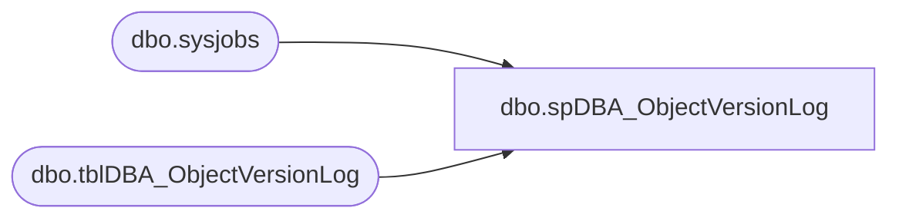

# dbo.spDBA_ObjectVersionLog

**Database:** DBAUtility  
**Server:** bearcluster01  

## Architecture Diagram



## Table Dependencies

| Referenced Table |
|---|
| dbo.sysjobs |
| dbo.tblDBA_ObjectVersionLog |

## Stored Procedure Code

```sql
CREATE PROCEDURE [dbo].[spDBA_ObjectVersionLog]
	@Action VARCHAR(20) = 'Process'
AS
-- =============================================================================================================
-- Name: spDBA_ObjectVersionLog
--
-- Description:	Inserts all user created procedures in the DBAUtility database, with install date & version if 
--	possible
--
-- Output: none
-- 
-- Available actions:
-- @Action:
--	'ReturnVersion' = Do not do anything but return the version of the objects
--	'Process' = populate the object version log 

-- Dependencies: 
--  DBAUtility.dbo.tblDBA_ObjectVersionLog
--
-- Revision History:
--		Mike Pelikan	06/27/2012		Intitial deployment
--		Mike Pelikan	06/28/2012		Added DBA Jobs
--		Mike Pelikan	06/29/2012		Added temp syscomments table to overcome rows being to big.
--		Mike Pelikan	01/07/2014		Added  "AND category <> 2" to the WHERE clauses to remove system objects


DECLARE @Revision DATETIME
SET @Revision = '01/07/2014'
	
---- =============================================================================================================
--DECLARE @Action VARCHAR(20)
--SELECT @Action = 'Process'
---- =============================================================================================================

----------------------------------------------------------------------------------------------------
--// Set options                                                                                //--
----------------------------------------------------------------------------------------------------
SET NOCOUNT ON

----------------------------------------------------------------------------------------------------
--// Declare variables                                                                          //--
----------------------------------------------------------------------------------------------------
DECLARE @EndMessage varchar(2000)
DECLARE @ReturnCode int

----------------------------------------------------------------------------------------------------
--// Revision                                                                                  //--
----------------------------------------------------------------------------------------------------
IF @Action = 'ReturnVersion'
BEGIN
	SELECT @Revision
	GOTO EndHere
END

--use temp table to overcome rows being to large to sort (> 8000
DECLARE @syscomments TABLE (id int, colid int, text varchar(4000))

INSERT INTO @syscomments 
SELECT sc.id, sc.colid,  sc.text
FROM sysobjects so
LEFT JOIN syscomments sc ON so.id = sc.id AND 0 = OBJECTPROPERTY(sc.id, 'IsMSShipped') 
WHERE xtype NOT IN ('D','IT','PK','S','SQ') AND category <> 2


--TableVersions:
DECLARE @tblVersions TABLE (TableName Varchar(100), VersionDate DateTime)
INSERT INTO @tblVersions 
SELECT objname, CAST(value AS Datetime) FROM ::fn_listextendedproperty (NULL, 'schema', 'dbo', 'table', NULL , NULL, NULL) WHERE name = 'Version'
UNION 
SELECT objname, CAST(value AS Datetime) FROM ::fn_listextendedproperty (NULL, 'user', 'dbo', 'table', NULL , NULL, NULL) WHERE name = 'Version'

--Update existing
UPDATE DBAUtility.dbo.tblDBA_ObjectVersionLog
SET VersionDate = ISNULL(
	REPLACE(REPLACE(
	REPLACE(	CASE PATINDEX('%SET @Revision =%', sc.text) 
				WHEN 0 THEN NULL 
				ELSE 	REPLACE(REPLACE(SUBSTRING(sc.text, PATINDEX('%SET @Revision =%', sc.text), 30),'SET @Revision = ','') , CHAR(39),'') 
			END	, CHAR(13),''), CHAR(10), ''), CHAR(9),'')	,ver.VersionDate),
usesRevision = 1
FROM  DBAUtility.dbo.tblDBA_ObjectVersionLog pvl
INNER JOIN sysobjects so ON pvl.ObjectName = so.name 
LEFT JOIN @syscomments sc ON so.id=sc.id AND OBJECTPROPERTY(sc.id, 'IsMSShipped') = 0
LEFT JOIN @tblVersions ver ON pvl.ObjectName = ver.TableName COLLATE SQL_Latin1_General_CP1_CI_AS AND pvl.ObjectType = 'Table' 
WHERE xtype IN ( 'P', 'TF', 'U')  AND category <> 2
AND pvl.ObjectType <> 'Job'

AND CASE WHEN ver.VersionDate IS NULL THEN PATINDEX('%SET @Revision =%', sc.text) ELSE 1 END > 0 
AND ISDATE(ISNULL(REPLACE(REPLACE(
	REPLACE(CASE PATINDEX('%SET @Revision =%', sc.text) WHEN 0 THEN NULL ELSE
	REPLACE(REPLACE(SUBSTRING(sc.text, PATINDEX('%SET @Revision =%', sc.text), 30),'SET @Revision = ','') , CHAR(39),'') 
	END
	,CHAR(13),'')
	,CHAR(10), '')
	, CHAR(9),'')
,'1/1/1900') ) = 1
AND ISNULL(pvl.VersionDate, '1/1/1900') <> ISNULL(
	REPLACE(REPLACE(
	REPLACE(	CASE PATINDEX('%SET @Revision =%', sc.text) 
				WHEN 0 THEN NULL 
				ELSE 	REPLACE(REPLACE(SUBSTRING(sc.text, PATINDEX('%SET @Revision =%', sc.text), 30),'SET @Revision = ','') , CHAR(39),'') 
			END	, CHAR(13),''), CHAR(10), ''), CHAR(9),'')	,ver.VersionDate)


--Update existing jobs
UPDATE DBAUtility.dbo.tblDBA_ObjectVersionLog
SET VersionDate = ISNULL( 
		CAST( 
		REPLACE(REPLACE(
		REPLACE(CASE PATINDEX('%SET @Revision =%', [description]) WHEN 0 THEN NULL ELSE
		REPLACE(REPLACE(SUBSTRING([description], PATINDEX('%SET @Revision =%', [description]), 30),'SET @Revision = ','') , CHAR(39),'') 
		END
		,CHAR(13),'')
		,CHAR(10), '')
		, CHAR(9),'')
		AS DATETIME)
	, sj.date_modified),
usesRevision = CASE ISNULL(PATINDEX('%SET @Revision =%', [description]),0) WHEN 0 THEN 0 ELSE 1 END 
FROM  DBAUtility.dbo.tblDBA_ObjectVersionLog pvl
INNER JOIN [msdb].[dbo].[sysjobs] sj ON pvl.ObjectName = sj.name COLLATE SQL_Latin1_General_CP1_CI_AS  
WHERE pvl.ObjectType = 'Job'
AND ISNULL(VersionDate, '1/1/1900') <> ISNULL( 
		CAST( 
		REPLACE(REPLACE(
		REPLACE(CASE PATINDEX('%SET @Revision =%', [description]) WHEN 0 THEN NULL ELSE
		REPLACE(REPLACE(SUBSTRING([description], PATINDEX('%SET @Revision =%', [description]), 30),'SET @Revision = ','') , CHAR(39),'') 
		END
		,CHAR(13),'')
		,CHAR(10), '')
		, CHAR(9),'')
		AS DATETIME)
	, sj.date_modified)


--Insert New
INSERT INTO DBAUtility.dbo.tblDBA_ObjectVersionLog (InstanceName, ObjectName, ObjectType, InstallDate, VersionDate, usesRevision)
SELECT @@SERVERNAME InstanceName, so.name ObjectName, 
	CASE xtype 
	WHEN 'P' THEN 'Procedure'
	WHEN 'TF' THEN 'User Defined Function'
	WHEN 'U' THEN 'Table'
	ELSE 'Undefined'
	END ObjectType,
	crdate InstallDate,
	MAX( 
		ISNULL(
	REPLACE(REPLACE(
	REPLACE(	CASE PATINDEX('%SET @Revision =%', sc.text) 
				WHEN 0 THEN NULL 
				ELSE 	REPLACE(REPLACE(SUBSTRING(sc.text, PATINDEX('%SET @Revision =%', sc.text), 30),'SET @Revision = ','') , CHAR(39),'') 
			END	, CHAR(13),''), CHAR(10), ''), CHAR(9),'')	,ver.VersionDate)	
	) VersionDate, 
	MAX(
		CASE ISNULL(PATINDEX('%SET @Revision =%', sc.text),0) WHEN 0 THEN 0 ELSE 1 END 
	)usesRevision		
FROM sysobjects so
LEFT JOIN @syscomments sc ON so.id = sc.id AND 0 = OBJECTPROPERTY(sc.id, 'IsMSShipped') 
LEFT JOIN DBAUtility.dbo.tblDBA_ObjectVersionLog pvl ON so.name = pvl.ObjectName
LEFT JOIN @tblVersions ver ON so.name = ver.TableName COLLATE SQL_Latin1_General_CP1_CI_AS AND so.xtype = 'U' 
WHERE xtype NOT IN ('D','IT','PK','S','SQ') AND category <> 2
AND pvl.ProcVersionID IS NULL
AND ISDATE(ISNULL(REPLACE(REPLACE(
	REPLACE(CASE PATINDEX('%SET @Revision =%', sc.text) WHEN 0 THEN NULL ELSE
	REPLACE(REPLACE(SUBSTRING(sc.text, PATINDEX('%SET @Revision =%', sc.text), 30),'SET @Revision = ','') , CHAR(39),'') 
	END
	,CHAR(13),'')
	,CHAR(10), '')
	, CHAR(9),'')
,'1/1/1900') ) = 1
GROUP BY  so.name, CASE xtype 
WHEN 'P' THEN 'Procedure'
WHEN 'TF' THEN 'User Defined Function'
WHEN 'U' THEN 'Table'
ELSE 'Undefined'
END ,
crdate


-- Insert New Jobs
INSERT INTO DBAUtility.dbo.tblDBA_ObjectVersionLog (InstanceName, ObjectName, ObjectType, InstallDate, VersionDate, usesRevision)
SELECT @@SERVERNAME, [name], 'Job', 
      [date_created],
	ISNULL( 
		CAST( 
		REPLACE(REPLACE(
		REPLACE(CASE PATINDEX('%SET @Revision =%', [description]) WHEN 0 THEN NULL ELSE
		REPLACE(REPLACE(SUBSTRING([description], PATINDEX('%SET @Revision =%', [description]), 30),'SET @Revision = ','') , CHAR(39),'') 
		END
		,CHAR(13),'')
		,CHAR(10), '')
		, CHAR(9),'')
		AS DATETIME)
	, sj.date_modified) VersionDate,
	CASE ISNULL(PATINDEX('%SET @Revision =%', [description]),0) WHEN 0 THEN 0 ELSE 1 END 
FROM [msdb].[dbo].[sysjobs] sj
LEFT JOIN DBAUtility.dbo.tblDBA_ObjectVersionLog pvl ON sj.name = pvl.ObjectName COLLATE SQL_Latin1_General_CP1_CI_AS 
WHERE name like 'DBA%' AND [enabled] = 1 AND pvl.ProcVersionID IS NULL


--Delete old
DELETE FROM DBAUtility.dbo.tblDBA_ObjectVersionLog 
FROM  DBAUtility.dbo.tblDBA_ObjectVersionLog pvl
LEFT JOIN sysobjects so ON pvl.ObjectName = so.name AND category <> 2
WHERE so.id IS NULL AND pvl.ObjectType <> 'Job' 

--Delete old jobs/disabled jobs
DELETE FROM DBAUtility.dbo.tblDBA_ObjectVersionLog 
FROM  DBAUtility.dbo.tblDBA_ObjectVersionLog pvl
LEFT JOIN [msdb].[dbo].[sysjobs] sj ON sj.name = pvl.ObjectName COLLATE SQL_Latin1_General_CP1_CI_AS  AND sj.name like 'DBA%' AND sj.enabled = 1 
WHERE sj.job_id IS NULL AND pvl.ObjectType = 'Job'

EndHere:
IF @Action = 'ReturnVersion'
BEGIN
	SELECT @Revision 
END
ELSE
BEGIN
	SET @EndMessage = 'DateTime: ' + CONVERT(nvarchar,GETDATE(),120)
	SET @EndMessage = REPLACE(@EndMessage,'%','%%')
	RAISERROR(@EndMessage,10,1) WITH NOWAIT

	IF @ReturnCode <> 0
	BEGIN
		--RETURN @ReturnCode
		SELECT @ReturnCode
	END
END

dbo,spDBA_PurgeTmpTables,CREATE PROCEDURE [dbo].[spDBA_PurgeTmpTables]
	@Databases nvarchar(2000) = '',
	@DaysBack smallint = 1,
	@GracePeriod smallint = 60, 
	@Action VARCHAR(20) = 'Process'
AS
-- =============================================================================================================
-- Name: spDBA_PurgeTmpTables
--
-- Description:	Remove tmp prefixed data to save space.
--  Process:
--		1.  Get database name
--		2.  Get table names like tmp* and that are older than a specified parameter
--		3.  Rename tables with x_ extension to allow for tables that may be needed.
--		4.  Delete tables
--				with name like x_* and date > than parameter
--				or a more recent version of the same table exists.
--	If there are tables with the tmp* prefix that should not be dropped,
--  make an entry for the table in DBAUtility.dbo.TMPTABLE_EXCLUDED.  Tables
--  in TMPTABLE_EXCLUDED will be ignored. 
--
--
-- Output: error logging.
-- 
-- Available actions:
--	@Databases:
--	E.g. SYSTEM_DATABASES
--	E.g. USER_DATABASES
--	E.g. Database1
--	E.g. Database1, Database2
--	E.g. USER_DATABASES, master
--	E.g. SYSTEM_DATABASES, -master
--	E.g. %Database%
--	E.g. %Database%, -Database1
--
--  @DaysBack: Tables created prior to this number of days are candidates for renaming.
--  This allows newer tables to be used without risk of being renamed.
--  
--  @GracePeriod:  numbers of days that renamed tables will be saved.
--
-- Dependencies: 
--
-- Revision History
--		Name:			Date:			Comments:
--		Gary Derikito	05/21/2009		Create initial version
--		Gary Derikito	06/19/2009		Enhance text description.	
--		Gary Derikito	07/08/2009		Allow for schemas other than dbo. 	
--		Mike Pelikan	06/27/2012		Modified for versioning
DECLARE @Revision DATETIME
SET @Revision = '06/27/2012'

/*
exec spDBA_PurgeTmpTables @Databases = dw, @DaysBack = 0, @GracePeriod = 10
select * from master.sys.databases
*/
-- =============================================================================================================

BEGIN

  ----------------------------------------------------------------------------------------------------
  --// Set options                                                                                //--
  ----------------------------------------------------------------------------------------------------

  SET NOCOUNT ON
  
----------------------------------------------------------------------------------------------------
--// Revision                                                                                  //--
----------------------------------------------------------------------------------------------------
IF @Action = 'ReturnVersion'
BEGIN
	GOTO EndHere
END

  ----------------------------------------------------------------------------------------------------
  --// Declare variables                                                                          //--
  ----------------------------------------------------------------------------------------------------

--  DECLARE @StartMessage nvarchar(max)
  DECLARE @EndMessage nvarchar(2000)
  DECLARE @DatabaseMessage nvarchar(2000)
  DECLARE @ErrorMessage nvarchar(2000)
  DECLARE @CurrentID int
  DECLARE @CurrentTableID int
  DECLARE @DupTableID int
  DECLARE @ExpiredTableID int
  DECLARE @CurrentDatabase nvarchar(2000)
  DECLARE @CurrentTable nvarchar(2000)
  DECLARE @CurrentSchema nvarchar(128)
  DECLARE @ExpiredTable nvarchar(2000)
  DECLARE @ExpiredSchema nvarchar(128)  
  DECLARE @DupTable nvarchar(2000)
  DECLARE @DupSchema nvarchar(128)
  DECLARE @CurrentCommand01 nvarchar(2000)
  DECLARE @CurrentCommandOutput01 int
  DECLARE @CreateDate datetime
  DECLARE @CurrentDate CHAR(8)
  DECLARE @tmpDatabases TABLE (ID int IDENTITY PRIMARY KEY,
                               DatabaseName nvarchar(2000),
                               Completed bit)
  DECLARE @Tables TABLE(TableID int IDENTITY PRIMARY KEY,
							TableSchema nvarchar(128) NOT NULL,
							TableName nvarchar(128) NOT NULL,
                            CreateDate DATETIME NOT NULL,
							Completed bit)
  DECLARE @DupTables TABLE(TableID int IDENTITY PRIMARY KEY,
							TableSchema nvarchar(128) NOT NULL,
							TableName nvarchar(128) NOT NULL,
							Deleted bit)
  DECLARE @ExpiredTables TABLE(TableID int IDENTITY PRIMARY KEY,
							TableSchema nvarchar(128) NOT NULL,
							TableName nvarchar(128) NOT NULL,
							Deleted bit)

  DECLARE @Error int
  DECLARE @RowCount int
  DECLARE @ProductVersion	NVARCHAR(20) 
  DECLARE @Prefix nvarchar(100)
  DECLARE @GracePeriodVar nvarchar(10)
  DECLARE @SQL nvarchar(1000)

  SET @Error = 0
  SET @ProductVersion =  CAST(SERVERPROPERTY('productversion') AS VARCHAR)
  SET @Prefix = 'tmp' --be careful setting the prefix as this defines tables that may as a result be deleted
  SET @CurrentDate = CONVERT(CHAR(8), GETDATE(), 112)
  SET @GracePeriodVar = CAST(@GracePeriod AS VARCHAR)
  ----------------------------------------------------------------------------------------------------
  --// Log initial information                                                                    //--
  ----------------------------------------------------------------------------------------------------

--  SET @StartMessage = 'DateTime: ' + CONVERT(nvarchar,GETDATE(),120) + CHAR(13) + CHAR(10)
--  SET @StartMessage = @StartMessage + 'Server: ' + CAST(SERVERPROPERTY('ServerName') AS nvarchar) + CHAR(13) + CHAR(10)
--  SET @StartMessage = @StartMessage + 'Version: ' + CAST(SERVERPROPERTY('ProductVersion') AS nvarchar) + CHAR(13) + CHAR(10)
--  SET @StartMessage = @StartMessage + 'Edition: ' + CAST(SERVERPROPERTY('Edition') AS nvarchar) + CHAR(13) + CHAR(10)
--  SET @StartMessage = @StartMessage + 'Procedure: ' + QUOTENAME(DB_NAME(DB_ID())) + '.' + QUOTENAME(OBJECT_SCHEMA_NAME(@@PROCID)) + '.' + QUOTENAME(OBJECT_NAME(@@PROCID)) + CHAR(13) + CHAR(10)
--  SET @StartMessage = @StartMessage + 'Parameters: @Databases = ' + ISNULL('''' + REPLACE(@Databases,'''','''''') + '''','NULL')
--  SET @StartMessage = @StartMessage + ', @PhysicalOnly = ' + ISNULL('''' + REPLACE(@PhysicalOnly,'''','''''') + '''','NULL')
--  SET @StartMessage = @StartMessage + ', @NoIndex = ' + ISNULL('''' + REPLACE(@NoIndex,'''','''''') + '''','NULL')
--  SET @StartMessage = @StartMessage + CHAR(13) + CHAR(10)
--  SET @StartMessage = REPLACE(@StartMessage,'%','%%')
--  RAISERROR(@StartMessage,10,1) WITH NOWAIT

  ----------------------------------------------------------------------------------------------------
  --// Select databases                                                                           //--
  ----------------------------------------------------------------------------------------------------

  IF @Databases IS NULL OR @Databases = ''
  BEGIN
    SET @ErrorMessage = 'The value for parameter @Databases is not supported.' + CHAR(13) + CHAR(10)
    RAISERROR(@ErrorMessage,16,1) WITH LOG
    SET @Error = @@ERROR
  END


  IF SUBSTRING(@ProductVersion, 1, 1) = '8' --2000
	BEGIN
		INSERT INTO @tmpDatabases (DatabaseName, Completed)
		SELECT DatabaseName AS DatabaseName, 0 AS Completed
		FROM dbo.fnDBA_DatabaseSelect2000 (@Databases)
		ORDER BY DatabaseName ASC
		SET @RowCount = @@RowCount
	END
	ELSE --2005
	BEGIN
		INSERT INTO @tmpDatabases (DatabaseName, Completed)
		SELECT DatabaseName AS DatabaseName, 0 AS Completed
		FROM dbo.fnDBA_DatabaseSelect (@Databases)
		ORDER BY DatabaseName ASC
		SET @RowCount = @@RowCount
	END

  IF @@ERROR <> 0 OR (@RowCount = 0 AND @Databases <> 'USER_DATABASES')
  BEGIN
    SET @ErrorMessage = 'Error selecting databases.' + CHAR(13) + CHAR(10)
    RAISERROR(@ErrorMessage,16,1) WITH LOG
    SET @Error = @@ERROR
  END

  ----------------------------------------------------------------------------------------------------
  --// Check input parameters                                                                     //--
  ----------------------------------------------------------------------------------------------------

  IF @DaysBack < 0 OR @DaysBack IS NULL
  BEGIN
    SET @ErrorMessage = 'The value for parameter @DaysBack is not supported.' + CHAR(13) + CHAR(10)
    RAISERROR(@ErrorMessage,16,1) WITH LOG
    SET @Error = @@ERROR
  END

  IF @GracePeriod < 0 OR @GracePeriod IS NULL
  BEGIN
    SET @ErrorMessage = 'The value for parameter @GracePeriod is not supported.' + CHAR(13) + CHAR(10)
    RAISERROR(@ErrorMessage,16,1) WITH LOG
    SET @Error = @@ERROR
  END

  ----------------------------------------------------------------------------------------------------
  --// Check error variable                                                                       //--
  ----------------------------------------------------------------------------------------------------

  IF @Error <> 0 GOTO Crash

  ----------------------------------------------------------------------------------------------------
  --// Execute commands                                                                           //--
  ----------------------------------------------------------------------------------------------------

  WHILE EXISTS (SELECT * FROM @tmpDatabases WHERE Completed = 0)
  BEGIN --loop through databases

--select * from @tmpDatabases return

    SELECT TOP 1 @CurrentID = ID,
                 @CurrentDatabase = DatabaseName
    FROM @tmpDatabases
    WHERE Completed = 0
    ORDER BY ID ASC

  IF SUBSTRING(@ProductVersion, 1, 1) = '8' --2000
  BEGIN --SQL2000 code

    IF DATABASEPROPERTYEX(@CurrentDatabase,'status') = 'ONLINE'
    BEGIN
		print '2000'
--      SET @CurrentCommand01 = 'DBCC CHECKDB (' + QUOTENAME(@CurrentDatabase)
--      IF @ResultsToTable = 'Y' SET @CurrentCommand01 = @CurrentCommand01 + ') WITH TABLERESULTS ' ELSE SET @CurrentCommand01 = @CurrentCommand01 + ') WITH NO_INFOMSGS, ALL_ERRORMSGS' --no info prevents verbose messages
--		IF @ResultsToTable = 'N'
--		BEGIN
--		  EXECUTE @CurrentCommandOutput01 = [dbo].[spDBA_CommandExecute] @CurrentCommand01, '', 1
--		  SET @Error = @@ERROR
--		  IF @Error <> 0 SET @CurrentCommandOutput01 = @Error
--		END
	END
  END  --SQL2000 code end
  ELSE ---if not SQL2000 then assume 2005
  BEGIN---2005 code

    -- Set database message
    SET @DatabaseMessage = 'DateTime: ' + CONVERT(nvarchar,GETDATE(),120) + CHAR(13) + CHAR(10)
    SET @DatabaseMessage = @DatabaseMessage + 'Database: ' + QUOTENAME(@CurrentDatabase) + CHAR(13) + CHAR(10)
    SET @DatabaseMessage = @DatabaseMessage + 'Status: ' + CAST(DATABASEPROPERTYEX(@CurrentDatabase,'status') AS nvarchar) + CHAR(13) + CHAR(10)
    SET @DatabaseMessage = REPLACE(@DatabaseMessage,'%','%%')
--    RAISERROR(@DatabaseMessage,10,1) WITH NOWAIT

    IF DATABASEPROPERTYEX(@CurrentDatabase,'status') = 'ONLINE'
    BEGIN
--	select @CurrentCommand01 = 'SELECT [name], create_date, 0
--		FROM ' + @CurrentDatabase + '.sys.tables'
--		+ ' WHERE [name] LIKE ''' + @Prefix + '%'''
--		+ ' AND [name] NOT IN (SELECT TABLE_NM FROM DBAUtility.dbo.TMPTABLE_EXCLUDED WHERE DB_NM = ''' + @CurrentDatabase + '''' + ')' 
--select @CurrentCommand01 return

		INSERT INTO @Tables(TableSchema, TableName, CreateDate, Completed)
		EXEC('SELECT i.TABLE_SCHEMA, i.TABLE_NAME, t.create_date, 0
		FROM ' + @CurrentDatabase + '.INFORMATION_SCHEMA.TABLES i '
		+ 'JOIN ' + @CurrentDatabase + '.sys.tables t on (i.TABLE_NAME = t.name) '
		+ 'JOIN ' + @CurrentDatabase + '.sys.schemas s on (i.TABLE_SCHEMA = s.name AND s.schema_id = t.schema_id)'
		+ ' WHERE i.TABLE_NAME LIKE ''' + @Prefix + '%'''
		+ ' AND i.TABLE_NAME NOT IN (SELECT TABLE_NM FROM DBAUtility.dbo.TMPTABLE_EXCLUDED WHERE DB_NM = ''' + @CurrentDatabase + '''' + ')' )


--select * from @Tables return

		  WHILE EXISTS (SELECT * FROM @Tables WHERE Completed = 0)
		  BEGIN --loop through tables

			SELECT TOP 1 @CurrentTableID = TableID,
						 @CurrentSchema = TableSchema, 
						 @CurrentTable = TableName,
						 @CreateDate = CreateDate
			FROM @Tables
			WHERE Completed = 0
			ORDER BY TableID ASC

			--Rename tmp tables that were created more than a configurable number of days back
			IF DATEDIFF(day, @CreateDate, getdate()) >= @DaysBack
			BEGIN
--				select @CurrentDatabase + '.sys.sp_rename ''' +  @CurrentSchema + '.' + @CurrentTable + '''' + ' , ' + '''x_' + @CurrentTable + '_' + @CurrentDate + '''' --return
				EXEC(@CurrentDatabase + '.sys.sp_rename ''' +  @CurrentSchema + '.' + @CurrentTable + '''' + ' , ' + '''x_' + @CurrentTable + '_' + @CurrentDate + '''')  
			END
		  --check if multiple versions of the table exist.  Keep the most recent

		  INSERT INTO @DupTables(TableSchema, TableName, Deleted)
		  EXEC('SELECT s.name AS TableSchema, i.TABLE_NAME, 0 
					FROM ' + @CurrentDatabase + '.INFORMATION_SCHEMA.TABLES i '
					+ 'JOIN ' + @CurrentDatabase + '.sys.tables t on (i.TABLE_NAME = t.name) '
					+ 'JOIN ' + @CurrentDatabase + '.sys.schemas s on (i.TABLE_SCHEMA = s.name AND s.schema_id = t.schema_id)'
					+ ' WHERE i.table_type = ''base table''' 
					+ ' AND i.TABLE_NAME LIKE ''' + 'x[_]' + '' + @CurrentTable + '[_]%'''
					+ ' AND i.TABLE_NAME <> ''' + 'x_' + @CurrentTable + '_' + @CurrentDate + ''''
					+ ' AND i.TABLE_SCHEMA = ''' + @CurrentSchema + '''')


		  WHILE EXISTS (SELECT * FROM @DupTables WHERE Deleted = 0)
		  BEGIN --loop through dup tables

			SELECT TOP 1 @DupTableID = TableID,
						 @DupSchema = TableSchema,
						 @DupTable = TableName
			FROM @DupTables
			WHERE Deleted = 0
			ORDER BY TableID ASC

			EXEC('DROP TABLE ' + @CurrentDatabase + '.' + @DupSchema + '.' + @DupTable)
			PRINT @DupTable + ' has been deleted'
--			select @CurrentCommand01 return

			UPDATE @DupTables
			SET Deleted = 1
			WHERE TableID = @DupTableID

			SET @DupTableID = NULL
			SET @DupSchema = NULL
			SET @DupTable = NULL

		  END--end dupes
		  --empty DupTable
--		  DELETE @DupTables


		  UPDATE @Tables
		  SET Completed = 1
		  WHERE TableID = @CurrentTableID

		  -- Clear variables
		  SET @CurrentTableID = NULL
		  SET @CurrentSchema = NULL
		  SET @CurrentTable = NULL
		  SET @CreateDate = NULL

		  END -- end loop through tables

	END
  END---2005 code end


	INSERT INTO @ExpiredTables(TableSchema, TableName, Deleted)
	EXEC('SELECT s.name AS TableSchema, i.TABLE_NAME, 0 
		FROM ' + @CurrentDatabase + '.INFORMATION_SCHEMA.TABLES i '
		+ 'JOIN ' + @CurrentDatabase + '.sys.tables t on (i.TABLE_NAME = t.name) '
		+ 'JOIN ' + @CurrentDatabase + '.sys.schemas s on (i.TABLE_SCHEMA = s.name AND s.schema_id = t.schema_id)'
		+ ' WHERE i.table_type = ''base table''' 
		+ ' AND i.TABLE_NAME LIKE ''' + 'x[_]tmp' + '[_]%'''
		+ ' AND DATEDIFF(day, RIGHT(TABLE_NAME, 8), getdate()) > ' + @GracePeriodVar)


	  WHILE EXISTS (SELECT * FROM @ExpiredTables WHERE Deleted = 0)
		  BEGIN --loop through expired tables

			SELECT TOP 1 @ExpiredTableID = TableID,
						 @ExpiredSchema = TableSchema,
						 @ExpiredTable = TableName
			FROM @ExpiredTables
			WHERE Deleted = 0
			ORDER BY TableID ASC

			EXEC('DROP TABLE ' + @CurrentDatabase + '.' + @ExpiredSchema + '.' + @ExpiredTable)
			PRINT @ExpiredTable + ' has been deleted'
--			select @CurrentCommand01 return

			UPDATE @ExpiredTables
			SET Deleted = 1
			WHERE TableID = @ExpiredTableID

			SET @ExpiredTableID = NULL
			SET @ExpiredSchema = NULL
			SET @ExpiredTable = NULL

		  END--end expired tables.
	

	-- Update that the database is completed
    UPDATE @tmpDatabases
    SET Completed = 1
    WHERE ID = @CurrentID

    -- Clear variables
    SET @CurrentID = NULL
    SET @CurrentDatabase = NULL

    SET @CurrentCommand01 = NULL

    SET @CurrentCommandOutput01 = NULL
 
	
  END--loop through databases end
  RETURN 0


  ----------------------------------------------------------------------------------------------------
  --// Log completing information                                                                 //--
  ----------------------------------------------------------------------------------------------------

  Crash:
  SET @EndMessage = 'DateTime: ' + CONVERT(nvarchar,GETDATE(),120) + ' Error with ' + OBJECT_NAME(@@PROCID)
  SET @EndMessage = REPLACE(@EndMessage,'%','%%')
  RAISERROR(@EndMessage,10,1) WITH Log

  ----------------------------------------------------------------------------------------------------

END

EndHere:
IF @Action = 'ReturnVersion'
BEGIN
	SELECT @Revision 
END
```

