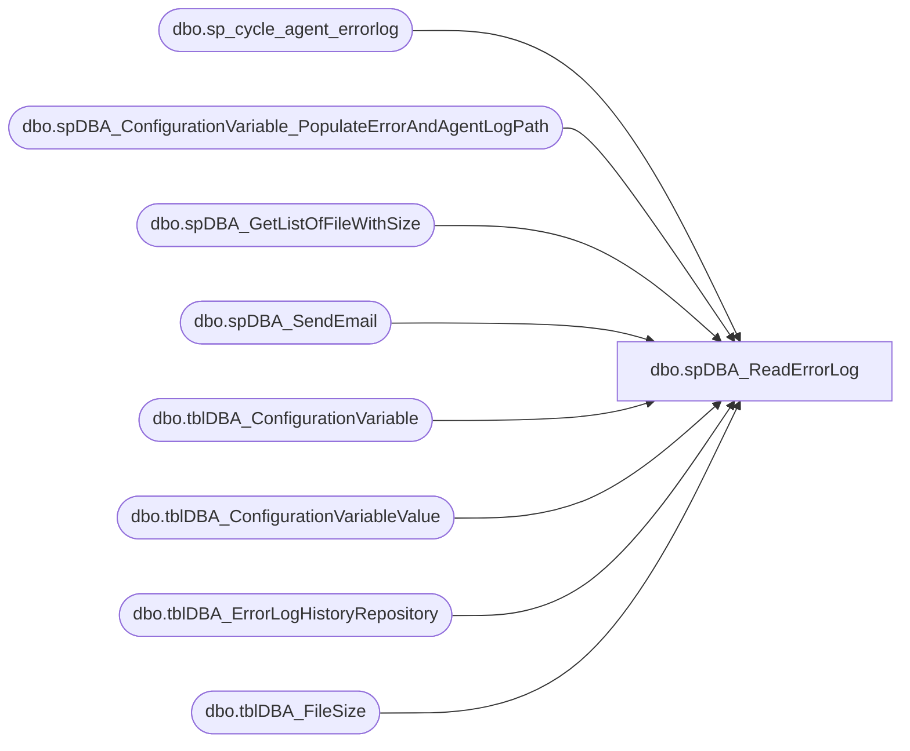

# dbo.spDBA_ReadErrorLog

**Database:** DBAUtility  
**Server:** bearcluster01  

## Architecture Diagram



## Table Dependencies

| Referenced Table |
|---|
| dbo.sp_cycle_agent_errorlog |
| dbo.spDBA_ConfigurationVariable_PopulateErrorAndAgentLogPath |
| dbo.spDBA_GetListOfFileWithSize |
| dbo.spDBA_SendEmail |
| dbo.tblDBA_ConfigurationVariable |
| dbo.tblDBA_ConfigurationVariableValue |
| dbo.tblDBA_ErrorLogHistoryRepository |
| dbo.tblDBA_FileSize |

## Stored Procedure Code

```sql
CREATE PROCEDURE [dbo].[spDBA_ReadErrorLog]
	@LogVersion int = NULL,--0, --0 is current
	@LogType int = 0, --0 is both, 1 is SQL Server Error log, 2 is agent log
	@String1 varchar(255) = NULL,
	@String2 varchar(255) = NULL,
	@ResultsToTable nvarchar(1) = 'N',
	@FileName	varchar(200) = NULL,
	@Action VARCHAR(20) = 'Process'
AS
-- =============================================================================================================
-- Name: spDBA_ReadErrorLog
--
-- Description:	Returns information from the error and agent log.
--
-- Output: error logging.
-- 
-- Available actions:
-- @Action:
--	'ReturnVersion' = Do not do anything but return the version of the procedure
--	'Process' = Do not return log records to user 
--	'Return' = Return contents of log
-- @ResultsToTable: 
--		'Y' = Record Log to Consolidated Reporting Table
--		'N' = Do not insert records into Reporting table
-- Available actions (2005):
--1.  Value of error log file you want to read: 0 = current, 1 = Archive #1, 2 = Archive #2, etc... 
--2.  Log file type: null is both, 1 is SQL Server Error log, 2 is agent log
--3.  Search string 1: String one you want to search for 
--4.  Search string 2: String two you want to search for to further refine the results 
--5.  ? 
--6.  ? 
--7.  Sort order for results: N'asc' = ascending, N'desc' = descending
--
-- Available actions (2000):
--Parameter 1 : Non zero integer value (use 1 in @LogVersion)
--Parameter 2 : File name of error log (@FileName)
--Parameter 3 : Line number in the file (use 1 in @LogVersion)
--Parameter 4 : Search string (@String1)
--2000 example: EXEC spDBA_ReadErrorLog @LogVersion=1,  @FileName='F:\Program Files\Microsoft SQL Server\MSSQL\log\ERRORLOG', @String1='Error:', @ResultsToTable = 'N'
--				EXEC spDBA_ReadErrorLog @LogVersion=1,  @FileName='F:\Program Files\Microsoft SQL Server\MSSQL\log\ERRORLOG', @String1='Error:', @ResultsToTable = 'Y'
-- Dependencies: 
--	DBAUtility.dbo.spDBA_ConfigurationVariable_PopulateErrorAndAgentLogPath
--  DBAUtility.dbo.spDBA_SendEmail
--	DBAUtility.dbo.spDBA_GetListOfFileWithSize
--	DBAUtility.dbo.tblDBA_FileSize
--
-- Revision History
--		Name:			Date:			Comments:
--		Gary Derikito	04/29/2009		Created based on http://www.mssqltips.com/tip.asp?tip=1476
--		Gary Derikito	05/18/2009		Changed nvarchar(max) to nvarchar(2000) to allow working with SQL2000.
--										Add logic to check if SQL 2000 or 2005 and allow for appropriate version of log output.
--		Mike Pelikan	05/24/2012		Added logic to look at SQL Server Agent log.
--		Mike Pelikan	05/29/2012		Corrected for SQL 2000
--		Mike Pelikan	05/29/2012		FilePath Correction for SQL 2000
--		Mike Pelikan	05/30/2012		Corrected searching for SQL 2000
--		Mike Pelikan	06/06/2012		Added logic to remove extraneous files from ##FileSize
--		Mike Pelikan	06/10/2012		Added @@ServerName to where clause for variable selection
--		Mike Pelikan	06/14/2012		Replaced ##FileSize with tblDBA_FileSize
--		Mike Pelikan	06/25/2012		Corrected bug for Servers that have no records in repository table - Working date was null
--										Changed temporary table (#TempLog) to have a text field, instead of a varchar(2000) field
--		Mike Pelikan	07/10/2012		Changed check date logic so current log will always be checked
--										Corrected DELETE statements to not remove Current Logs
--		Mike Pelikan	12/31/2013		Modifed MAX(LogDate) logic to use a temp table
--		Mike Pelikan	01/02/2014		Increaded #logF.LogSize to BIGINT

DECLARE @Revision DATETIME
SET @Revision = '01/02/2014'
	
/*
DECLARE @LogVersion int ,--0, --0 is current
@LogType int, --0 is both, 1 is SQL Server Error log, 2 is agent log
@String1 varchar(255),
@String2 varchar(255),
@ResultsToTable nvarchar(1),
@FileName	varchar(200),
@Action VARCHAR(20)

SELECT @LogVersion = NULL,--0, --0 is current
@LogType = 0, --0 is both, 1 is SQL Server Error log, 2 is agent log
@String1 = NULL,
@String2 = NULL,
@ResultsToTable = 'Y',
@FileName	= NULL,
@Action = 'Process'

*/
-- =============================================================================================================

----------------------------------------------------------------------------------------------------
--// Set options                                                                                //--
----------------------------------------------------------------------------------------------------
SET NOCOUNT ON

  ----------------------------------------------------------------------------------------------------
  --// Declare variables                                                                          //--
  ----------------------------------------------------------------------------------------------------
DECLARE @TSQL  NVARCHAR(2000)
DECLARE @ProductVersion	NVARCHAR(20)

DECLARE @SQLWorkingDate DATETIME
DECLARE @AgentWorkingDate DATETIME
----------------------------------------------------------------------------------------------------
--// Revision                                                                                //--
----------------------------------------------------------------------------------------------------
IF @Action = 'ReturnVersion'
BEGIN
	SELECT @Revision
	GOTO EndHere
END

--set the product version to allow for differences between 2000 and 2005
SET @ProductVersion =  CAST(SERVERPROPERTY('productversion') AS VARCHAR)

IF object_id('tempdb..#TempLog','u')  IS NOT NULL
	DROP TABLE #TempLog

CREATE TABLE #TempLog (
	  ServerName	VARCHAR(100),
	  LogType		VARCHAR(100),
      LogDate     DATETIME,
      ProcessInfo VARCHAR(50),
      LogText TEXT,

      --LogText VARCHAR(2000),
	  ContinuationRow	TINYINT,--2000 only
	  InsertDate [datetime] NOT NULL DEFAULT (GETDATE()))

IF object_id('tempdb..#logF','u')  IS NOT NULL
	DROP TABLE #logF

CREATE TABLE #logF (
	LogType INT NULL, 
	ArchiveNumber     INT,
	LogDate           DATETIME,
	LogSize           BIGINT,
	LogPath			  VARCHAR(2000) NULL, 
	isProcessed		  BIT DEFAULT(0)
)

  ----------------------------------------------------------------------------------------------------
  --// Declare variables                                                                          //--
  ----------------------------------------------------------------------------------------------------

  DECLARE @StartMessage nvarchar(2000)
  DECLARE @EndMessage nvarchar(2000)
  DECLARE @DatabaseMessage nvarchar(2000)
  DECLARE @ErrorMessage nvarchar(2000)

  DECLARE @CurrentID int
  DECLARE @CurrentDatabase nvarchar(2000)

  DECLARE @CurrentCommand01 nvarchar(2000)

  DECLARE @CurrentCommandOutput01 int

  DECLARE @tmpDatabases TABLE (ID int IDENTITY PRIMARY KEY,
                               DatabaseName nvarchar(2000),
                               Completed bit)

  DECLARE @Error int

  SET @Error = 0

DECLARE @SQLAgentLogPath VARCHAR(1000)
  ----------------------------------------------------------------------------------------------------
  --// Log initial information                                                                    //--
  ----------------------------------------------------------------------------------------------------
--not currently doing anything with start message
--  SET @StartMessage = 'DateTime: ' + CONVERT(nvarchar,GETDATE(),120) + CHAR(13) + CHAR(10)
--  SET @StartMessage = @StartMessage + 'Server: ' + CAST(SERVERPROPERTY('ServerName') AS nvarchar) + CHAR(13) + CHAR(10)
--  SET @StartMessage = @StartMessage + 'Version: ' + CAST(SERVERPROPERTY('ProductVersion') AS nvarchar) + CHAR(13) + CHAR(10)
--  SET @StartMessage = @StartMessage + 'Edition: ' + CAST(SERVERPROPERTY('Edition') AS nvarchar) + CHAR(13) + CHAR(10)
--  SET @StartMessage = @StartMessage + 'Procedure: ' + QUOTENAME(DB_NAME(DB_ID())) + '.' + QUOTENAME(OBJECT_SCHEMA_NAME(@@PROCID)) + '.' + QUOTENAME(OBJECT_NAME(@@PROCID)) + CHAR(13) + CHAR(10)
--  SET @StartMessage = @StartMessage + 'Parameters: @LogVersion = ' + ISNULL('''' + REPLACE(@LogVersion,'''','''''') + '''','NULL')
--  SET @StartMessage = @StartMessage + ', @LogType = ' + ISNULL('''' + REPLACE(@LogType,'''','''''') + '''','NULL')
--  SET @StartMessage = @StartMessage + ', @String1 = ' + ISNULL('''' + REPLACE(@String1,'''','''''') + '''','NULL')
--  SET @StartMessage = @StartMessage + ', @String2 = ' + ISNULL('''' + REPLACE(@String2,'''','''''') + '''','NULL')
--  SET @StartMessage = @StartMessage + ', @ResultsToTable = ' + ISNULL('''' + REPLACE(@ResultsToTable,'''','''''') + '''','NULL')
--  SET @StartMessage = @StartMessage + CHAR(13) + CHAR(10)
--  SET @StartMessage = REPLACE(@StartMessage,'%','%%')
--  RAISERROR(@StartMessage,10,1) WITH NOWAIT


  ----------------------------------------------------------------------------------------------------
  --// Check input parameters                                                                     //--
  ----------------------------------------------------------------------------------------------------

  IF @LogVersion < 0 
  BEGIN
    SET @ErrorMessage = 'The value for parameter @LogVersion is not supported.' + CHAR(13) + CHAR(10)
    RAISERROR(@ErrorMessage,16,1) WITH LOG
    SET @Error = @@ERROR
  END

  IF @LogType NOT IN (0, 1, 2) 
  BEGIN
    SET @ErrorMessage = 'The value for parameter @LogType is not supported.' + CHAR(13) + CHAR(10)
    RAISERROR(@ErrorMessage,16,1) WITH LOG
    SET @Error = @@ERROR
  END

 IF @ResultsToTable NOT IN ('Y','N') OR @ResultsToTable IS NULL
  BEGIN
    SET @ErrorMessage = 'The value for parameter @ResultsToTable is not supported.' + CHAR(13) + CHAR(10)
    RAISERROR(@ErrorMessage,16,1) WITH LOG
    SET @Error = @@ERROR
  END

----------------------------------------------------------------------------------------------------
--// Check error variable                                                                       //--
----------------------------------------------------------------------------------------------------

IF @Error <> 0 GOTO EndHere

----------------------------------------------------------------------------------------------------
--// Execute commands                                                                           //--
----------------------------------------------------------------------------------------------------
--Populate #logF with all log files of approirate type(s)

IF @LogVersion IS NULL 
BEGIN
	IF @LogType = 0 OR @LogType = 1
	BEGIN
	--Error Log		
		SELECT @SQLAgentLogPath = cvv.VariableValue
		FROM COREDB01_MAINT.DBAUtilityMaster.dbo.tblDBA_ConfigurationVariableValue cvv 
		INNER JOIN COREDB01_MAINT.DBAUtilityMaster.dbo.tblDBA_ConfigurationVariable cv ON cvv.VariableID = cv.VariableID
		WHERE cv.VariableName = 'SQLErrorLogPath' AND cvv.InstanceName = @@SERVERNAME

		DELETE FROM tblDBA_FileSize WHERE Process = @@SPID AND UserName = SYSTEM_USER

		IF @SQLAgentLogPath IS NULL 
			EXEC DBAUtility.dbo.spDBA_ConfigurationVariable_PopulateErrorAndAgentLogPath 
		
		SELECT @SQLAgentLogPath = cvv.VariableValue
		FROM COREDB01_MAINT.DBAUtilityMaster.dbo.tblDBA_ConfigurationVariableValue cvv
		INNER JOIN COREDB01_MAINT.DBAUtilityMaster.dbo.tblDBA_ConfigurationVariable cv ON cvv.VariableID = cv.VariableID
		WHERE cv.VariableName = 'SQLErrorLogPath' AND cvv.InstanceName = @@SERVERNAME

		SELECT @SQLAgentLogPath = REPLACE (@SQLAgentLogPath, '.OUT', '.') + '*'
		
		EXEC DBAUtility.dbo.spDBA_GetListOfFileWithSize @SQLAgentLogPath
	
		-- the Error log will end with G, all other alpha records should be removed from temp table		
		DELETE FROM tblDBA_FileSize WHERE PATINDEX('%[a-z]%',RIGHT(FilePath,1)) = 1 AND UPPER(RIGHT(FilePath, 1)) <> 'G' AND Process = @@SPID AND UserName = SYSTEM_USER
		 
		INSERT INTO #logF (LogType, ArchiveNumber, LogDate, LogSize, LogPath)
		SELECT 1, CASE RIGHT(FilePath, 1) WHEN 'T' THEN 0 WHEN 'G' THEN 0 ELSE CAST(RIGHT(FilePath, 1) AS INT) END, ModifiedDate, SizeInKB * 1024, 
					CASE RIGHT(FilePath, 1) 
				WHEN 'G' THEN REPLACE (@SQLAgentLogPath, '.*', '') 
				ELSE REPLACE (@SQLAgentLogPath, '.*', '.' + RIGHT(FilePath, 1)) END FilePath  
		FROM tblDBA_FileSize 
		WHERE Process = @@SPID AND UserName = SYSTEM_USER
		ORDER BY 2
		
	END
	SET @SQLAgentLogPath = NULL
	IF @LogType = 0 OR @LogType = 2
	BEGIN
	--Agent Log
		SELECT @SQLAgentLogPath = cvv.VariableValue
		FROM COREDB01_MAINT.DBAUtilityMaster.dbo.tblDBA_ConfigurationVariableValue cvv
		INNER JOIN COREDB01_MAINT.DBAUtilityMaster.dbo.tblDBA_ConfigurationVariable cv ON cvv.VariableID = cv.VariableID
		WHERE cv.VariableName = 'SQLAgentLogPath' AND cvv.InstanceName = @@SERVERNAME


		IF @SQLAgentLogPath IS NULL 
			EXEC DBAUtility.dbo.spDBA_ConfigurationVariable_PopulateErrorAndAgentLogPath 
		
		SELECT @SQLAgentLogPath = cvv.VariableValue
		FROM COREDB01_MAINT.DBAUtilityMaster.dbo.tblDBA_ConfigurationVariableValue cvv
		INNER JOIN COREDB01_MAINT.DBAUtilityMaster.dbo.tblDBA_ConfigurationVariable cv ON cvv.VariableID = cv.VariableID
		WHERE cv.VariableName = 'SQLAgentLogPath' AND cvv.InstanceName = @@SERVERNAME

		SELECT @SQLAgentLogPath = REPLACE (@SQLAgentLogPath, '.OUT', '.*')
		
		DELETE FROM tblDBA_FileSize WHERE Process = @@SPID AND UserName = SYSTEM_USER
					
		EXEC DBAUtility.dbo.spDBA_GetListOfFileWithSize @SQLAgentLogPath
		
		-- the Agent log will end with T, all other alpha records should be removed from temp table		
		DELETE FROM tblDBA_FileSize WHERE PATINDEX('%[a-z]%',RIGHT(FilePath,1)) = 1 AND UPPER(RIGHT(FilePath, 1)) <> 'T' AND Process = @@SPID AND UserName = SYSTEM_USER
		
		INSERT INTO #logF (LogType, ArchiveNumber, LogDate, LogSize, LogPath)
		SELECT 2, CASE RIGHT(FilePath, 1) WHEN 'T' THEN 0 ELSE CAST(RIGHT(FilePath, 1) AS INT) END, ModifiedDate, SizeInKB * 1024, 
			CASE RIGHT(FilePath, 1) 
				WHEN 'T' THEN REPLACE (@SQLAgentLogPath, '.*', '.OUT') 
				ELSE REPLACE (@SQLAgentLogPath, '.*', '.' + RIGHT(FilePath, 1)) END FilePath  
		FROM tblDBA_FileSize 
		WHERE Process = @@SPID AND UserName = SYSTEM_USER
		ORDER BY 2
		
	END
END
ELSE
	BEGIN 

	IF @LogType = 0 
	BEGIN
		INSERT INTO #logF(LogType, ArchiveNumber)
		VALUEs (1, @LogVersion)
		INSERT INTO #logF(LogType, ArchiveNumber)
		VALUEs (2, @LogVersion)
	END
	ELSE
	BEGIN
		INSERT INTO #logF(LogType, ArchiveNumber)
		VALUES (@LogType, @LogVersion)
	END	
END   

--Check repository for latest archive for this Instance.
IF @ResultsToTable = 'Y'
BEGIN
	IF OBJECT_ID('tempdb..#RepositoryDates','u')  IS NOT NULL
		DROP TABLE #RepositoryDates

	SELECT MAX(LogDate) LogDate, InstanceName, LogType
	INTO #RepositoryDates
	FROM COREDB01_MAINT.DBAUtilityMaster.dbo.tblDBA_ErrorLogHistoryRepository
	GROUP BY InstanceName, LogType
	
	IF REPLACE(@LogType,0,1) = 1
	BEGIN
		SET @SQLWorkingDate = NULL
		SELECT @SQLWorkingDate = MAX(LogDate) FROM #RepositoryDates
		WHERE InstanceName = @@SERVERNAME AND LogType = 'SQL Server'
		
		IF @SQLWorkingDate IS NULL
			SET @SQLWorkingDate = DATEADD(mm, -3, GETDATE() )
		DELETE FROM #logF WHERE LogType = 1 AND LogDate < ISNULL(@SQLWorkingDate, DATEADD(mm, -3, GETDATE() ))  AND LogPath NOT LIKE '%ERRORLOG'

	END
	
	IF REPLACE(@LogType,0,2) = 2
	BEGIN
		SELECT @AgentWorkingDate = MAX(LogDate) FROM #RepositoryDates
		WHERE InstanceName = @@SERVERNAME AND LogType = 'Agent'
		
		IF @AgentWorkingDate IS NULL
					SET @AgentWorkingDate = DATEADD(mm, -3, GETDATE() )

		DELETE FROM #logF WHERE LogType = 2 AND LogDate < ISNULL(@AgentWorkingDate, DATEADD(mm, -3, GETDATE() )) AND LogPath NOT LIKE '%.OUT'

	END
END
IF (@Action = 'Process' AND @ResultsToTable = 'Y') OR @Action = 'Return'
BEGIN
	WHILE (SELECT COUNT(*) FROM #logF WHERE isProcessed = 0) > 0
	BEGIN
		SELECT TOP 1 @LogType = LogType, @LogVersion = ArchiveNumber, @FileName = LogPath
		FROM #logF
		WHERE isProcessed = 0
		ORDER BY LogType, ArchiveNumber
		
		IF SUBSTRING(@ProductVersion, 1, 1) = '8'
		BEGIN
			INSERT INTO #TempLog( LogText, ContinuationRow)
			EXEC msdb.dbo.sp_readerrorlog @LogVersion, @FileName, @LogVersion, @String1 
			
			IF ISNULL(@String1, '') <> ''
				DELETE FROM #TempLog WHERE CAST(LogText AS VARCHAR(2000)) NOT LIKE '%'+@String1+'%'
				
			IF @LogType = 1
			BEGIN
				UPDATE #TempLog
				SET LogDate = CAST(LEFT(CAST(LogText AS VARCHAR(2000)) ,22) AS DATETIME), 
					ProcessInfo = SUBSTRING(CAST(LogText AS VARCHAR(2000)) , 23, 10), 
					LogText = SUBSTRING(CAST(LogText AS VARCHAR(2000))  , 34, 2000) 
				WHERE ContinuationRow = 0 AND CAST(LogText AS VARCHAR(2000))  LIKE '20%' 
			END
			ELSE
			BEGIN
				UPDATE #TempLog
				SET LogDate = CAST(LEFT(CAST(LogText AS VARCHAR(2000)) ,19) AS DATETIME), 
					ProcessInfo = 'Agent', 
					LogText = SUBSTRING(CAST(LogText AS VARCHAR(2000))  , 25, 2000) 
				WHERE ContinuationRow = 0 AND CAST(LogText AS VARCHAR(2000))  LIKE '20%' 
			END
			
		END
		ELSE--If not 2000 then assume 2005
		BEGIN
			INSERT INTO #TempLog( LogDate, ProcessInfo, LogText)
			EXEC msdb.dbo.sp_readerrorlog @LogVersion,  @LogType, @String1, @String2
		END
		
		--finally insert clean data into permanent table
		IF @ResultsToTable = 'Y'
		BEGIN
			INSERT INTO COREDB01_MAINT.DBAUtilityMaster.dbo.tblDBA_ErrorLogHistoryRepository(InstanceName, LogType, LogDate, ProcessInfo, MessageText, InsertDate)
			SELECT @@ServerName,
			CASE 
				WHEN @LogType IS NULL OR @LogType = 1 THEN 'SQL Server' 
				WHEN @LogType = 2 THEN 'Agent' 
			END AS 'LogType', LogDate, ProcessInfo, CAST(LogText AS VARCHAR(2000)), InsertDate
			FROM #TempLog
			WHERE LogDate > CASE @LogType WHEN 1 THEN @SQLWorkingDate ELSE @AgentWorkingDate END
			
			SET @Error = @@ERROR
			IF @Error <> 0 SET @CurrentCommandOutput01 = @Error
			DELETE FROM #TempLog		
		END
		
		UPDATE #logF
		SET isProcessed = 1
		WHERE @LogType = LogType AND @LogVersion = ArchiveNumber
	END
END
IF @ResultsToTable = 'N' AND @Action = 'Return'
BEGIN
	SELECT @@ServerName ServerName,
	CASE 
		WHEN @LogType IS NULL OR @LogType = 1 THEN 'SQL Server' 
		WHEN @LogType = 2 THEN 'Agent' 
	END AS 'LogType', LogDate, ProcessInfo, LogText, InsertDate
	FROM #TempLog
	SET @Error = @@ERROR
	IF @Error <> 0 SET @CurrentCommandOutput01 = @Error
END

  ----------------------------------------------------------------------------------------------------
  --// Cycle Log                                                                 //--
  ----------------------------------------------------------------------------------------------------
IF (SELECT LogSize FROM #logF WHERE ArchiveNumber = 0  AND LogType = 1) > 10485760-- 10 Mb
BEGIN
	EXEC msdb.dbo.sp_cycle_errorlog
END
IF (SELECT LogSize FROM #logF WHERE ArchiveNumber = 0  AND LogType = 2) > 10485760-- 10 Mb
BEGIN
	IF SUBSTRING(@ProductVersion, 1, 1) = '8'
	BEGIN
		DECLARE @EmailSubject VARCHAR(1000), @EmailMessage VARCHAR(1000)
		SELECT @EmailSubject = @@ServerName + ': SQL Server Agent Error Log needs to be cycled', 
		@EmailMessage = 'SQL Server Agent Error Log needs to be cycled' + CHAR(13) + CHAR(13) + CHAR(13) + CHAR(13) + CHAR(13) + 'Sent From ' + @@ServerName + '.DBAUtiltity.dbo.spDBA_ReadErrorLog'
	
		EXEC DBAUtility.dbo.spDBA_SendEmail  @recipients = 'databears@buildabear.com',
		@subject = @EmailSubject, @MessageTxt = @EmailMessage
	END
	ELSE
	BEGIN
		EXEC msdb.dbo.sp_cycle_agent_errorlog
	END
END


DELETE FROM tblDBA_FileSize WHERE Process = @@SPID AND UserName = SYSTEM_USER

 ----------------------------------------------------------------------------------------------------
  --// Log completing information                                                                 //--
  ----------------------------------------------------------------------------------------------------
--disable logging because makes an entry in the error log that is returned by this procedure.
--  Logging:
--  SET @EndMessage = 'DateTime: ' + CONVERT(nvarchar,GETDATE(),120)
--  SET @EndMessage = REPLACE(@EndMessage,'%','%%')
--  RAISERROR(@EndMessage,10,1) WITH LOG
  
  --RETURN 0
  ----------------------------------------------------------------------------------------------------

EndHere:
	IF @Error <> 0
		SET @EndMessage = 'DateTime: ' + CONVERT(nvarchar,GETDATE(),120) + ' Error with ' + OBJECT_NAME(@@PROCID)
	ELSE
		SET @EndMessage = 'DateTime: ' + CONVERT(nvarchar,GETDATE(),120) + ' ' + OBJECT_NAME(@@PROCID) + ' Completed.'
	SET @EndMessage = REPLACE(@EndMessage,'%','%%')
	RAISERROR(@EndMessage,10,1) WITH Log
	--RETURN 99
/* record error log entries in a common table                             */
/**************************************************************************/


dbo,spDBA_RebuildIndexes_TableList_2000,CREATE PROCEDURE [dbo].[spDBA_RebuildIndexes_TableList_2000] 
@TableListCommaDelimited VARCHAR(2000), 
	@MaxLogicalfrag DECIMAL = 15.0,  @MaxScanDensity DECIMAL = 90.0
	, @DatabaseName varchar(150), @RunMinutes SMALLINT = 120
	, @Schema varchar(25) = 'dbo'
	, @Action varchar(25) = 'Rebuild'
	, @Logging varchar(3) = 'No'
AS
-- =============================================================================================================
-- Name: spDBA_RebuildIndexes_2000
--
-- Description:	Performs maintenance on indexes depending on parameters passed in.
--	Use this procedure with SQL Server 2000 databases and SQL Server 2005 databasess that are compatibility 80.
--	The Rebuild option does the best job of maintaining indexes but causes blocking and can fill the log.
--	The Reorg option is not as good as rebuild, but is an online operation.
--	Use the reorg option when other database activities prevent using the rebuild option.
--	
--	@MaxLogicalfrag			-- Maximum fragmentation after which indexes will be rebuilt.
--	@MaxScanDensity			-- Minimum average page fullness before the index must be rebuilt.
--  @DatabaseName			-- Name of the db
--	@RunMinutes				-- Number of minutes after which another rebuild will not start
--  @Schema					-- Table schema name
--  @Action					-- Choose between doing a rebuild or defrag.  Base decision on maintenance window and testing.
--  @Logging				-- Yes or no.  If yes then latest statements logged to DBAUtility..INDEX_MAINT_HIST
--  
-- Output: returns error messages
--
-- Dependencies: 
--
-- Revision History
--		Name:			Date:			Comments:
--		Gary Derikito	12/31/2008		Created based on article http://blogs.digineer.com/blogs/larar/archive/2006/08/16/smart-index-defrag-reindex-for-a-consolidated-sql-server-2005-environment.aspx
--										Added logic to not start another rebuild if past a specified number of minutes. 	
--		Gary Derikito	6/1/2009		Correct case to allow for case sensitive dbs.	
--		Gary Derikito	7/31/2009		Add filter on tables with x* and tmp* prefix and optional filter on schema.
--		Gary Derikito	8/3/2009		Add filter on tables with %.% because the period caused issues with 3 part naming.
--		Gary Derikito	8/9/2009		Add reorg section inspired by http://www.mssqltips.com/tip.asp?tip=1165.  Reorg is online while rebuild is offline.
--		Gary Derikito	8/10/2009		Add #IndexProperty process because property function has to be run in local database.
--		Gary Derikito	8/11/2009		Add optional logging of latest statements
--		Mike Pelikan	2/21/2012		Added comma delimited 

/*
exec spDBA_RebuildIndexes_2000 1,  90, 'dw', 10, 'dbo'
exec spDBA_RebuildIndexes_2000 1,  90, 'dw', 10, 'pm_repo'
exec spDBA_RebuildIndexes_2000 1,  90, 'dw', 10
exec spDBA_RebuildIndexes_2000 1,  90, 'dw', 10, 'cube'

spDBA_RebuildIndexes_2000 @MaxLogicalfrag = 0.0, @MaxScanDensity = 90.0, @DatabaseName = 'dw_test', @RunMinutes = 120, @Schema = 'dbo', @Action = 'Defrag', @Logging = 'Yes'
spDBA_RebuildIndexes_2000 @MaxLogicalfrag = 3.0, @MaxScanDensity = 90.0, @DatabaseName = 'dw_test', @RunMinutes = 120, @Schema = 'dbo', @Action = 'Defrag', @Logging = 'Yes'
spDBA_RebuildIndexes_2000 @MaxLogicalfrag = 3.0, @MaxScanDensity = 80.0, @DatabaseName = 'dw_test', @RunMinutes = 120, @Schema = 'dbo', @Action = 'Rebuild', @Logging = 'Yes'
spDBA_RebuildIndexes_2000 @MaxLogicalfrag = 70.0, @MaxScanDensity = 30.0, @DatabaseName = 'dw_test', @RunMinutes = 120, @Schema = 'dbo', @Action = 'Rebuild', @Logging = 'Yes'

spDBA_RebuildIndexes_2000 @MaxLogicalfrag = 15.0, @MaxScanDensity = 80.0, @DatabaseName = 'dw_test', @RunMinutes = 120, @Schema = 'dbo', @Action = 'Defrag', @Logging = 'Yes'

*/
-- =============================================================================================================

-- Declare variables
SET NOCOUNT ON
DECLARE @TableName VARCHAR (128)
DECLARE @TableSchema varchar(128)
DECLARE @execstr   VARCHAR (255)
DECLARE @ObjectId  INT
DECLARE @IndexId   INT
DECLARE @IndexName   VARCHAR (255)
DECLARE @LogicalFrag    DECIMAL
DECLARE @ScanDensity    DECIMAL
DECLARE @StartTime	DATETIME
DECLARE @FinishLine DATETIME
DECLARE @SQL NVARCHAR (1000)


--capture when the run is started
SET @StartTime = getdate()

SELECT @FinishLine = DATEADD(mi, @RunMinutes, @StartTime) 

-- Create the temp tables
CREATE TABLE #tables(
	TableName varchar(255)
	,TableSchema varchar(255)
	,UpdateStats TINYINT
)

CREATE TABLE #fraglist (
   OwnerName varchar(128),
   ObjectName CHAR (255),
   ObjectId INT,
   IndexName CHAR (255),
   IndexId INT,
   Lvl INT,
   CountPages INT,
   CountRows INT,
   MinRecSize INT,
   MaxRecSize INT,
   AvgRecSize INT,
   ForRecCount INT,
   Extents INT,
   ExtentSwitches INT,
   AvgFreeBytes INT,
   AvgPageDensity INT,
   ScanDensity DECIMAL,
   BestCount INT,
   ActualCount INT,
   LogicalFrag DECIMAL,
   ExtentFrag DECIMAL)

INSERT INTO #tables(TableName, TableSchema)
EXEC('SELECT TABLE_NAME, TABLE_SCHEMA
   FROM ' + @DatabaseName + '.INFORMATION_SCHEMA.TABLES T
   INNER JOIN (SELECT txt_value FROM DBAUtility.dbo.fnDBA_ParseDelimitedVarchar('''+@TableListCommaDelimited+''',''' + ',' + ''')) tmpT ON T.TABLE_NAME = tmpT.txt_value
   WHERE TABLE_TYPE = ''BASE TABLE''' + ' AND TABLE_NAME NOT LIKE ''x%''' + ' AND TABLE_NAME NOT LIKE ''%.%''' + ' AND TABLE_NAME NOT LIKE ''tmp%'''
	+ ' AND TABLE_SCHEMA = ''' + @Schema + ''''
	+ ' ORDER BY TABLE_NAME')

--select * from #tables return
--store index property data in a temp table because the function needs to run in the local database
CREATE TABLE #IndexProperty (
	ObjectId	INT
	,IndexId	INT
	,IndexName	VARCHAR(255)
	,IndexDepth	INT)


-- Declare cursor
DECLARE tables CURSOR FOR
   SELECT TableName, TableSchema
   FROM #tables

-- Open the cursor
OPEN tables

-- Loop through all the tables in the database
FETCH NEXT
   FROM tables
   INTO @TableName, @TableSchema

WHILE @@FETCH_STATUS = 0
BEGIN

-- Do the showcontig of all indexes of the table
   INSERT INTO #fraglist (
	ObjectName, ObjectId, IndexName, IndexId, Lvl, CountPages, CountRows, MinRecSize, MaxRecSize, AvgRecSize, ForRecCount, Extents, ExtentSwitches, AvgFreeBytes, AvgPageDensity, ScanDensity, BestCount, ActualCount, LogicalFrag, ExtentFrag
	)
   EXEC ('USE ' + @DatabaseName + ' DBCC SHOWCONTIG (''' + @TableSchema + '.' + @TableName + ''') 
      WITH FAST, TABLERESULTS, ALL_INDEXES, NO_INFOMSGS')

   UPDATE #fraglist
   SET OwnerName = @TableSchema
   WHERE OwnerName IS NULL

   FETCH NEXT
      FROM tables
      INTO @TableName, @TableSchema

END

-- Close and deallocate the cursor
CLOSE tables
DEALLOCATE tables

--select * from #fraglist return

/********************************/
---Update fraglist with INDEXPROPERTY value

DECLARE IndexProp CURSOR FOR
   SELECT ObjectId, IndexId, IndexName
   FROM #fraglist

OPEN IndexProp

FETCH NEXT FROM IndexProp INTO @ObjectId,  @IndexId, @IndexName

WHILE @@FETCH_STATUS = 0
BEGIN


	SET @SQL = 'USE ' + @DatabaseName + '; SELECT ' + CAST(@ObjectId AS VARCHAR(50)) + ', ' + CAST(@IndexId AS VARCHAR(50)) + ', ' + '''' + @IndexName + '''' + ',
	INDEXPROPERTY (' + CAST(@ObjectId AS VARCHAR(50)) + ', ' + '''' + @IndexName + '''' + ', ' + '''IndexDepth''' + ') IndexDepth'

	INSERT INTO #IndexProperty(
		ObjectId
		,INDEXID
		,IndexName
		,IndexDepth)
	
	EXEC sp_executesql @SQL

FETCH NEXT FROM IndexProp INTO @ObjectId,  @IndexId, @IndexName
END

CLOSE IndexProp
DEALLOCATE IndexProp

SET @ObjectId = NULL
SET @IndexId = NULL
SET @IndexName = NULL  

--select * from #fraglist
--select * from #IndexProperty
--return
/********************************/

---optional log the latest statements

IF @Logging = 'Yes'
BEGIN
	--check for the local logging table
    IF EXISTS ( SELECT  *
                FROM    dbo.sysobjects
                WHERE   id = OBJECT_ID(N'[DBAUtility].[dbo].[INDEX_MAINT_HIST]') ) 
		BEGIN
			DELETE [DBAUtility].[dbo].[INDEX_MAINT_HIST]
		END
	ELSE
		BEGIN

			CREATE TABLE [DBAUtility].[dbo].[INDEX_MAINT_HIST](
				[RUN_DT] [smalldatetime] NULL,
				[SQL_TXT] [varchar](1000) NULL
			)

		END
END

----------------------------------
IF @Action = 'Rebuild'
BEGIN -- start of rebuild section

-- Declare cursor for list of indexes to be defragged
-- If clustered index meets the criteria, just reindex the entire table
-- If clustered index does not require a reindex, only return the non-clustered
-- which meet the criteria.
DECLARE indexes CURSOR FOR
        SELECT f.ObjectName, f.OwnerName, f.ObjectId, f.IndexId, f.IndexName, f.LogicalFrag, f.ScanDensity
        FROM #fraglist f JOIN #IndexProperty p ON (f.ObjectId = p.ObjectId AND f.IndexId = p.IndexId)    
        WHERE (f.LogicalFrag >= @MaxLogicalfrag
                OR f.ScanDensity < @MaxScanDensity)
--                AND INDEXPROPERTY (ObjectId, IndexName, 'IndexDepth') > 0
				AND p.IndexDepth > 0 --indexproperty function has to be run in local database
                AND NOT EXISTS(SELECT ObjectId 
                                FROM #fraglist i1 
                                WHERE IndexId = 1 
                                AND (LogicalFrag >= @MaxLogicalfrag
                                OR ScanDensity < @MaxScanDensity)
				AND i1.ObjectId = f.ObjectId)
        UNION 
        SELECT f.ObjectName, f.OwnerName, f.ObjectId, f.IndexId, f.IndexName, f.LogicalFrag, f.ScanDensity
        FROM #fraglist f JOIN #IndexProperty p ON (f.ObjectId = p.ObjectId AND f.IndexId = p.IndexId)
        WHERE (f.LogicalFrag >= @MaxLogicalfrag
                OR f.ScanDensity < @MaxScanDensity)
--                AND INDEXPROPERTY (ObjectId, IndexName, 'IndexDepth') > 0
				AND p.IndexDepth > 0 --indexproperty function has to be run in local database
                AND f.IndexId = 1 
                AND (f.LogicalFrag >= @MaxLogicalfrag
                OR f.ScanDensity < @MaxScanDensity)
        ORDER BY f.ObjectName, f.IndexId


--        SELECT ObjectName, OwnerName, ObjectId, IndexId, IndexName, LogicalFrag, ScanDensity
--        FROM #fraglist f    
--        WHERE (LogicalFrag >= @MaxLogicalfrag
--                OR ScanDensity < @MaxScanDensity)
----                AND INDEXPROPERTY (ObjectId, IndexName, 'IndexDepth') > 0
--                AND NOT EXISTS(SELECT ObjectId 
--                                FROM #fraglist i1 
--                                WHERE IndexId = 1 
--                                AND (LogicalFrag >= @MaxLogicalfrag
--                                OR ScanDensity < @MaxScanDensity)
--				AND i1.ObjectId = f.ObjectId)
--        UNION 
--        SELECT ObjectName, OwnerName, ObjectId, IndexId, IndexName, LogicalFrag, ScanDensity
--        FROM #fraglist f    
--        WHERE (LogicalFrag >= @MaxLogicalfrag
--                OR ScanDensity < @MaxScanDensity)
----                AND INDEXPROPERTY (ObjectId, IndexName, 'IndexDepth') > 0
--                AND IndexId = 1 
--                AND (LogicalFrag >= @MaxLogicalfrag
--                OR ScanDensity < @MaxScanDensity)
--        ORDER BY ObjectName, IndexId

-- Open the cursor
OPEN indexes

-- loop through the indexes
FETCH NEXT
   FROM indexes
   INTO @TableName, @TableSchema, @ObjectId, @IndexId, @IndexName, @LogicalFrag, @ScanDensity

--select @TableName, @TableSchema, @ObjectId, @IndexId, @IndexName, @LogicalFrag, @ScanDensity
--return


WHILE @@FETCH_STATUS = 0
BEGIN

        IF @IndexId = 1
        BEGIN

--           PRINT 'Executing DBCC DBREINDEX ('+ RTRIM(@TableSchema) + '.' + RTRIM(@TableName) + ') - fragmentation currently '
--                + RTRIM(CONVERT(varchar(15),@LogicalFrag)) + '% and Scan Density currently '
--                + RTRIM(CONVERT(VARCHAR(15), @ScanDensity))

          SELECT @execstr = 'USE ' + @DatabaseName + ' DBCC DBREINDEX (['+ RTRIM(@TableSchema) + '.' + RTRIM(@TableName) + '])'
--  		SELECT @execstr
			IF @Logging = 'Yes'
			BEGIN
				INSERT INTO [DBAUtility].[dbo].[INDEX_MAINT_HIST] (RUN_DT, SQL_TXT)
				SELECT GETDATE(), @execstr
			END 

          EXEC (@execstr)

        END

        IF @IndexId > 1

        BEGIN
--           PRINT 'Executing DBCC DBREINDEX ('+ RTRIM(@TableSchema) + '.' + RTRIM(@TableName) + ',' 
--                + RTRIM(@indexid) + ') - fragmentation currently '
--                + RTRIM(CONVERT(VARCHAR(15),@LogicalFrag)) + '% and Scan Density currently '
--                + RTRIM(CONVERT(VARCHAR(15), @ScanDensity))

          SELECT @execstr = 'USE ' + @DatabaseName + ' DBCC DBREINDEX (['+ RTRIM(@TableSchema) + '.'  + RTRIM(@TableName) + '],' + RTRIM(@IndexName) + ')'
--  		SELECT @execstr

			IF @Logging = 'Yes'
			BEGIN
				INSERT INTO [DBAUtility].[dbo].[INDEX_MAINT_HIST] (RUN_DT, SQL_TXT)
				SELECT GETDATE(), @execstr
			END 

          EXEC (@execstr)

        END

		--check how long the job has been running.  Do not run anymore if finishline crossed.
		IF GETDATE() > @FinishLine
		GOTO Crash

   FETCH NEXT
      FROM indexes
      INTO @TableName, @TableSchema, @ObjectId, @IndexId, @IndexName, @LogicalFrag, @ScanDensity

END

-- Close and deallocate the cursor

CLOSE indexes
DEALLOCATE indexes
END -- end of rebuild section


IF @Action = 'Defrag'
BEGIN -- start of Defrag section

-- Declare cursor for list of indexes to be defragged 
DECLARE indexes CURSOR FOR 
   SELECT f.ObjectName, f.ObjectId, f.IndexId, f.LogicalFrag 
   FROM #fraglist f JOIN #IndexProperty p ON (f.ObjectId = p.ObjectId AND f.IndexId = p.IndexId)
   WHERE f.LogicalFrag >= @MaxLogicalfrag
      --AND INDEXPROPERTY (ObjectId, IndexName, 'IndexDepth') > 0 
		AND p.IndexDepth > 0

-- Open the cursor 
OPEN indexes 

-- loop through the indexes 
FETCH NEXT FROM indexes INTO @TableName, @ObjectId, @IndexId, @LogicalFrag 

--select @tablename, @objectid, @indexid, @LogicalFrag 

WHILE @@FETCH_STATUS = 0 
BEGIN 

--   PRINT 'Executing DBCC INDEXDEFRAG (0, ' + RTRIM(@TableName) + ', 
--      ' + RTRIM(@IndexId) + ') - fragmentation currently ' 
--       + RTRIM(CONVERT(VARCHAR(15),@LogicalFrag)) + '%' 
   SELECT @execstr = 'USE ' + @DatabaseName + ' DBCC INDEXDEFRAG (0, ' + RTRIM(@ObjectId) + ', 
       ' + RTRIM(@IndexId) + ')' 
--	select    @execstr

		IF @Logging = 'Yes'
		BEGIN
			INSERT INTO [DBAUtility].[dbo].[INDEX_MAINT_HIST] (RUN_DT, SQL_TXT)
			SELECT GETDATE(), @execstr
		END 


	EXEC (@execstr) 

	--Track which tables to update statistics
	--Run update stats once per table
	UPDATE #tables SET UpdateStats = 1 WHERE TableName = @TableName

	--check how long the job has been running.  Do not run anymore if finishline crossed.
   IF GETDATE() > @FinishLine
   GOTO Crash

FETCH NEXT FROM indexes INTO @TableName, @ObjectId, @IndexId, @LogicalFrag 
END 

-- Close and deallocate the cursor 
CLOSE indexes 
DEALLOCATE indexes 

SET @TableName = NULL
SET @TableSchema = NULL
SET @execstr = NULL

--select * from #tables
---update statistics

DECLARE NewStats CURSOR FOR
   SELECT TableName, TableSchema
   FROM #tables
	WHERE UpdateStats = 1

-- Open the cursor
OPEN NewStats

-- Loop through all the tables in the database
FETCH NEXT FROM NewStats INTO @TableName, @TableSchema

WHILE @@FETCH_STATUS = 0
BEGIN --begin update stats loop

--   PRINT 'Executing UPDATE STATISTICS ON ' + RTRIM(@TableName) 
   SELECT @execstr = 'USE ' + @DatabaseName + ' UPDATE STATISTICS ' + @TableName
--	select    @execstr

		IF @Logging = 'Yes'
		BEGIN
			INSERT INTO [DBAUtility].[dbo].[INDEX_MAINT_HIST] (RUN_DT, SQL_TXT)
			SELECT GETDATE(), @execstr
		END 

	EXEC (@execstr) 

FETCH NEXT FROM NewStats INTO @TableName, @TableSchema
END --end update stats loop

CLOSE NewStats
DEALLOCATE NewStats

END -- end of Defrag section


-- Delete the temporary table 
DROP TABLE #fraglist 
DROP TABLE #IndexProperty
DROP TABLE #tables

RETURN 0

Crash:
	BEGIN	
		CLOSE indexes
		DEALLOCATE indexes
		RAISERROR('Rebuild index has taken longer than limit of run minutes: %d', 1, 2, @RunMinutes )  WITH LOG
		RETURN 99
	END

dbo,spDBA_replDistributorStatusGet,CREATE   procedure [dbo].[spDBA_replDistributorStatusGet]    
@pRecipients varchar(255) = 'databears@buildabear.com'  
AS  
-- =============================================================================================================
-- Name: spDBA_replDistributorStatusGet
--
-- Description:	Checks the status of the continous distributor agent.
-- Based on http://www.mssqltips.com/sqlservertip/1901/customized-alerts-for-sql-server-transactional-replication/
--
-- Output: 
-- 
-- Available actions:
-- @pRecipients:
--		email address of recipient of alert
--
-- Dependencies: 
--	Only to be used on servers with Replication 
--
-- Revision History
--		Name:			Date:			Comments:
--		Mike Pelikan	12/30/2013		Created
--		Mike Pelikan	01/03/2014		commented out "step_id = 2 and " in the WHERE clauses
--
-- =============================================================================================================

SET NOCOUNT ON
SET TRANSACTION ISOLATION LEVEL READ UNCOMMITTED

DECLARE @is_sysadmin INT  
DECLARE @job_owner   sysname  
DECLARE @job_id uniqueidentifier  
DECLARE @job_name sysname  
DECLARE @running int   
DECLARE @cnt int  
DECLARE @msg varchar(8000)  
DECLARE @msg_header varchar(4000)  
DECLARE @categoryid int   

SELECT  @job_owner =   SUSER_SNAME()  
     ,@is_sysadmin = 1   
     ,@running = 0  
     ,@categoryid = 10 -- Distributor jobs  

CREATE TABLE #jobStatus (job_id  UNIQUEIDENTIFIER NOT NULL,  
                last_run_date         INT ,  
                last_run_time         INT ,  
                next_run_date         INT ,  
                next_run_time         INT ,  
                next_run_schedule_id  INT ,  
                requested_to_run      INT ,   
                request_source        INT ,  
                request_source_id     sysname COLLATE database_default NULL,  
                running               int ,  
                current_step          INT ,  
                current_retry_attempt INT ,  
                job_state             INT)  

  INSERT INTO #jobStatus  
  EXECUTE master.dbo.xp_sqlagent_enum_jobs @is_sysadmin, @job_owner--, @job_id   
   

--
select j.name, js.command, jss.running
from msdb.dbo.sysjobsteps js
	join msdb.dbo.sysjobs j on js.job_id = j.job_id
	join #jobStatus jss on js.job_id = jss.job_id
where --step_id = 2 and 
subsystem = 'Distribution'
	and command like '%-Continuous'
	and jss.running <> 1 -- Not running

  
 if @@ROWCOUNT > 0
 BEGIN  
 
  SELECT @msg_header = 'Distributor job(s) FAILING OR STOPPED. Please check replication job(s) ASAP.'  
  SELECT @msg_header = @msg_header + char(10)  
    SELECT @msg_header = @msg_header + 'Here is the list of Job(s) that are failing or stopped'
  SELECT @msg_header = @msg_header + char(10)   
  SELECT @msg_header = @msg_header + '****************************************************************************'   
  
  set @msg = ''
	select @msg = @msg + CHAR(10) + j.name
	from msdb.dbo.sysjobsteps js
		join msdb.dbo.sysjobs j on js.job_id = j.job_id
		join #jobStatus jss on js.job_id = jss.job_id
	where --step_id = 2 and 
	subsystem = 'Distribution'
		and command like '%-Continuous'
		and jss.running <> 1 -- Not running
	
    
  SELECT @msg = @msg_header + char(10) + nullif(@msg,'')  
  
  print @msg
     
  if @@version like 'Microsoft SQL Server  2000%'  
     exec master.dbo.xp_sendmail                     
     @recipients= @pRecipients , --'youremail@yourcompany.com',  
     @subject='Production Replication Distributor Alert',  
     @message = @msg,  
       @width = 100    
  else   
    exec msdb.dbo.sp_send_dbmail --@profile_name = 'SQLMail Profile',                     
     @recipients= @pRecipients , --'youremail@yourcompany.com',  
     @subject= 'Production Replication Distributor Alert',  
     @body = @msg   
 END  

drop table #jobStatus

dbo,spDBA_replLogReaderStatusGet,CREATE   procedure [dbo].[spDBA_replLogReaderStatusGet]    
@pRecipients varchar(255) = 'databears@buildabear.com'  
AS  
 
-- =============================================================================================================
-- Name: spDBA_replLogReaderStatusGet
--
-- Description:	Checks the status of the LogReader job or jobs.  
-- Based on http://www.mssqltips.com/sqlservertip/1901/customized-alerts-for-sql-server-transactional-replication/
--
-- Output: 
-- 
-- Available actions:
-- @pRecipients:
--		email address of recipient of alert
--
-- Dependencies: 
--	Only to be used on servers with Replication 
--
-- Revision History
--		Name:			Date:			Comments:
--		Mike Pelikan	12/30/2013		Created
--		Mike Pelikan	01/03/2014		Added logic to look for distribution database, else use the 
--											custom databases
--
-- =============================================================================================================

  SET NOCOUNT ON
  SET TRANSACTION ISOLATION LEVEL READ UNCOMMITTED
  
  DECLARE @is_sysadmin INT  
  DECLARE @job_owner   sysname  
  DECLARE @job_id uniqueidentifier  
  DECLARE @job_name sysname  
  DECLARE @running int   
  DECLARE @cnt int  
  DECLARE @msg varchar(8000)  
  DECLARE @msg_header varchar(1000)  
  DECLARE @categoryid int   
    

IF (SELECT COUNT(*) FROM master.dbo.sysdatabases WHERE name = 'distribution')> 0 
BEGIN
	select la.name,la.publisher_db,  
	case lh.runstatus  
	when 1 then 'Start'  
	when 2 then 'Succeed'  
	when 3 then 'In progress'  
	when 4 then 'Idle'  
	when 5 then 'Retry'  
	when 6 then 'Fail'  
	else 'Unknown'  
	end as runstatus  
	, lh.time, lh.comments  
	from distribution..MSlogreader_history lh   
	inner join distribution..MSlogreader_agents la on lh.agent_id = la.id  
	inner join (   
	select lh.agent_id, max(lh.time) as LastTime  
	from distribution..MSlogreader_history lh   
	inner join distribution..MSlogreader_agents la on lh.agent_id = la.id  
	group by lh.agent_id) r   
	on r.agent_id = lh.agent_id  
	and r.LastTime = lh.time  
	where lh.runstatus not in (3,4) -- 3:In Progress, 4: Idle  
END
ELSE
BEGIN
	select la.name,la.publisher_db,  
	case lh.runstatus  
		when 1 then 'Start'  
		when 2 then 'Succeed'  
		when 3 then 'In progress'  
		when 4 then 'Idle'  
		when 5 then 'Retry'  
		when 6 then 'Fail'  
		else 'Unknown'  
	end as runstatus, lh.time, lh.comments  
	from FusionRoomView_distribution..MSlogreader_history lh   
	inner join FusionRoomView_distribution..MSlogreader_agents la on lh.agent_id = la.id  
	inner join (   
		select lh.agent_id, max(lh.time) as LastTime  
		from FusionRoomView_distribution..MSlogreader_history lh   
		inner join FusionRoomView_distribution..MSlogreader_agents la on lh.agent_id = la.id  
		group by lh.agent_id
	) r  on r.agent_id = lh.agent_id and r.LastTime = lh.time  
	where lh.runstatus not in (3,4) -- 3:In Progress, 4: Idle  
	UNION  
	select la.name,la.publisher_db,  
	case lh.runstatus  
		when 1 then 'Start'  
		when 2 then 'Succeed'  
		when 3 then 'In progress'  
		when 4 then 'Idle'  
		when 5 then 'Retry'  
		when 6 then 'Fail'  
		else 'Unknown'  
	end as runstatus, lh.time, lh.comments  
	from RoomView_distribution..MSlogreader_history lh   
	inner join RoomView_distribution..MSlogreader_agents la on lh.agent_id = la.id  
	inner join (   
		select lh.agent_id, max(lh.time) as LastTime  
		from RoomView_distribution..MSlogreader_history lh   
		inner join RoomView_distribution..MSlogreader_agents la on lh.agent_id = la.id  
		group by lh.agent_id
	) r  on r.agent_id = lh.agent_id and r.LastTime = lh.time  
	where lh.runstatus not in (3,4) -- 3:In Progress, 4: Idle  
END

if @@rowcount > 0    
  
BEGIN  
  SELECT  @job_owner =   SUSER_SNAME()  
         ,@is_sysadmin = 1   
         ,@running = 0  
         ,@categoryid = 13 -- LogReader jobs  
  
  CREATE TABLE #job (job_id  UNIQUEIDENTIFIER NOT NULL,  
                    last_run_date         INT ,  
                    last_run_time         INT ,  
                    next_run_date         INT ,  
                    next_run_time         INT ,  
                    next_run_schedule_id  INT ,  
                    requested_to_run      INT ,   
                    request_source        INT ,  
                    request_source_id     sysname COLLATE database_default NULL,  
                    running               int ,  
                    current_step          INT ,  
                    current_retry_attempt INT ,  
                    job_state             INT)  
  
      INSERT INTO #job  
      EXECUTE master.dbo.xp_sqlagent_enum_jobs @is_sysadmin, @job_owner--, @job_id   
    
      SELECT @running = isnull(sum(j.running),-1),@cnt = count(*)   
      FROM #job j  
      join msdb..sysjobs s on j.job_id = s.job_id  
      where category_id = @categoryid -- logreader jobs  
  
 if @running <> @cnt  
 BEGIN  
  SELECT @msg_header = 'LogReader job(s) FAILING OR STOPPED. Please check replication job(s) ASAP.'  
  SELECT @msg_header = @msg_header + char(10)   
  SELECT @msg_header = @msg_header + '************************************************************************'   

  set @msg = ''    
  SELECT @msg = @msg + char(10)+'"' + s.[name] + '" - '+ convert(varchar, isnull(j.running,-1))  
  FROM #job j  
  join msdb..sysjobs s on j.job_id = s.job_id  
  where category_id = @categoryid  
  and isnull(j.running,-1) <> 1  
    
  SELECT @msg = @msg_header + char(10) + nullif(@msg,'')  
     
  if @@version like 'Microsoft SQL Server  2000%'  
     exec master.dbo.xp_sendmail                     
     @recipients= @pRecipients , --'youremail@yourcompany.com',  
     @subject='Production Replication LogReader Alert',  
     @message = @msg,  
       @width = 100    
  else   
    exec msdb.dbo.sp_send_dbmail --@profile_name = 'SQLMail Profile',                     
     @recipients= @pRecipients , --'youremail@yourcompany.com',  
     @subject= 'Production Replication LogReader Alert',  
     @body = @msg   
 END  
  
END
```

