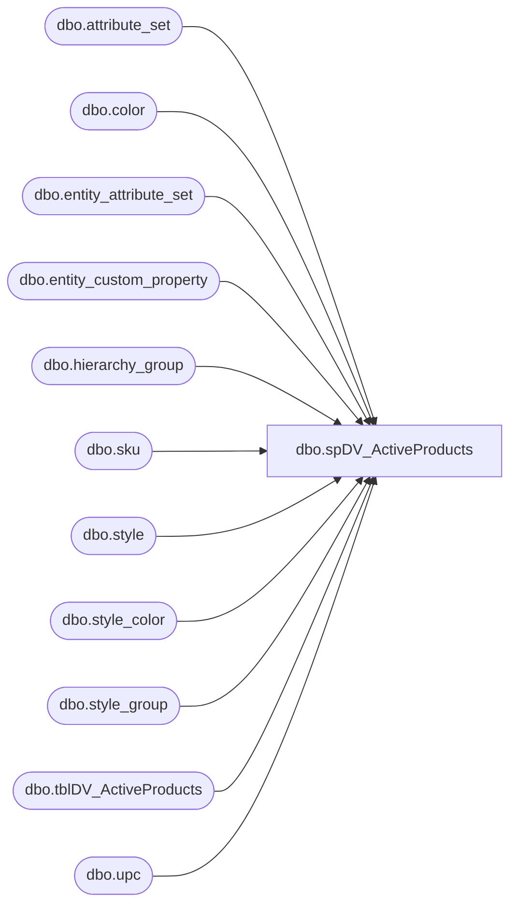

# dbo.spDV_ActiveProducts

**Database:** DBAUtility  
**Server:** bearcluster01  

## Architecture Diagram



## Table Dependencies

| Referenced Table |
|---|
| dbo.attribute_set |
| dbo.color |
| dbo.entity_attribute_set |
| dbo.entity_custom_property |
| dbo.hierarchy_group |
| dbo.sku |
| dbo.style |
| dbo.style_color |
| dbo.style_group |
| dbo.tblDV_ActiveProducts |
| dbo.upc |

## Stored Procedure Code

```sql
CREATE PROC [dbo].[spDV_ActiveProducts] 
@Action VARCHAR(20) = 'CREATE'
WITH EXECUTE AS 'dbo'
AS

-- =============================================================================================================
-- Name: spDV_ActiveProducts
--
-- Description:	Populates table used by Digital Ventures to get "Active" Products
--
-- Output: Error logging.
-- 
-- Available actions: 
--
-- @Action:
--	'ReturnVersion' = Do not do anything but return the version of the objects
--	'CREATE' = TRUNCATE then populate tblDV_ActiveProducts
--	'DROP' = just TRUNCATE tblDV_ActiveProducts
--
-- Dependency: 
--	BEDROCKDB02.me_01 tables
--
-- Revision History
--		Name:			Date:			Comments:
--		Mike Pelikan	04/07/2014		Creation
--		Mike Pelikan	07/21/2014		Added Scents to WHERE clause
--
-- =============================================================================================================
DECLARE @Revision DATETIME
SET @Revision = '04/07/2014'
/*
DECLARE @Action VARCHAR(15)
SET @Action = 'Process'

exec spMaintainProducts

*/
-- =============================================================================================================

----------------------------------------------------------------------------------------------------
--// Set options                                                                                //--
----------------------------------------------------------------------------------------------------
SET NOCOUNT ON

----------------------------------------------------------------------------------------------------
--// Revision                                                                                  //--
----------------------------------------------------------------------------------------------------
IF @Action = 'ReturnVersion'
BEGIN
	GOTO EndHere
END
SET NOCOUNT ON 
TRUNCATE TABLE DBAUtility.dbo.tblDV_ActiveProducts

IF @Action = 'CREATE'
BEGIN

INSERT INTO  [tblDV_ActiveProducts] ([style_code], [end_date])
select  style_code, MAX(CAST(OUTSTORE_DT AS DATETIME))
	From (
		select 
		CASE 
			WHEN ecpod.custom_property_value IS NULL THEN CONVERT(VARCHAR(10), GETDATE(), 101) 
			WHEN ecpod.custom_property_value LIKE '%JANUARY%' THEN '1/1/' + CAST(DATEPART(YEAR, GETDATE()) AS VARCHAR) 
			WHEN ecpod.custom_property_value LIKE '%FEBRUARY%' THEN '2/1/' + CAST(DATEPART(YEAR, GETDATE()) AS VARCHAR) 
			WHEN ecpod.custom_property_value LIKE '%MARCH%' THEN '3/1/' + CAST(DATEPART(YEAR, GETDATE()) AS VARCHAR) 
			WHEN ecpod.custom_property_value LIKE '%APRIL%' THEN '4/1/' + CAST(DATEPART(YEAR, GETDATE()) AS VARCHAR) 
			WHEN ecpod.custom_property_value LIKE '%MAY%' THEN '5/1/' + CAST(DATEPART(YEAR, GETDATE()) AS VARCHAR) 
			WHEN ecpod.custom_property_value LIKE '%JUNE%' THEN '6/1/' + CAST(DATEPART(YEAR, GETDATE()) AS VARCHAR) 
			WHEN ecpod.custom_property_value LIKE '%JULY%' THEN '7/1/' + CAST(DATEPART(YEAR, GETDATE()) AS VARCHAR) 
			WHEN ecpod.custom_property_value LIKE '%AUGUST%' THEN '8/1/' + CAST(DATEPART(YEAR, GETDATE()) AS VARCHAR) 
			WHEN ecpod.custom_property_value LIKE '%SEPTEMBER%' THEN '9/1/' + CAST(DATEPART(YEAR, GETDATE()) AS VARCHAR) 
			WHEN ecpod.custom_property_value LIKE '%OCTOBER%' THEN '10/1/' + CAST(DATEPART(YEAR, GETDATE()) AS VARCHAR) 
			WHEN ecpod.custom_property_value LIKE '%NOVEMBER%' THEN '11/1/' + CAST(DATEPART(YEAR, GETDATE()) AS VARCHAR) 
			WHEN ecpod.custom_property_value LIKE '%DECEMBER%' THEN '12/1/' + CAST(DATEPART(YEAR, GETDATE()) AS VARCHAR) 
			WHEN ISDATE(ecpod.custom_property_value) = 1 THEN ecpod.custom_property_value ELSE CONVERT(VARCHAR(10), GETDATE(), 101) END AS OUTSTORE_DT,
		s.style_code
		FROM BEDROCKDB02.me_01.dbo.style AS s 
		INNER JOIN BEDROCKDB02.me_01.dbo.style_group AS sg  ON s.style_id = sg.style_id 
		INNER JOIN BEDROCKDB02.me_01.dbo.hierarchy_group AS hg ON sg.hierarchy_group_id = hg.hierarchy_group_id 
		INNER JOIN BEDROCKDB02.me_01.dbo.entity_custom_property AS ecph ON s.style_id = ecph.parent_id AND ecph.custom_property_id = 45 --animal height
		INNER JOIN BEDROCKDB02.me_01.dbo.entity_custom_property AS ecpw ON s.style_id = ecpw.parent_id AND ecpw.custom_property_id = 44 --animal weight
		INNER JOIN BEDROCKDB02.me_01.dbo.entity_custom_property AS ecpn ON s.style_id = ecpn.parent_id AND ecpn.custom_property_id = 43 --anmal name
		INNER JOIN BEDROCKDB02.me_01.dbo.entity_custom_property AS ecpid ON s.style_id = ecpid.parent_id AND ecpid.custom_property_id = 5 
		INNER JOIN BEDROCKDB02.me_01.dbo.entity_custom_property AS ecpod ON s.style_id = ecpod.parent_id AND ecpod.custom_property_id = 6 
		LEFT JOIN BEDROCKDB02.me_01.dbo.entity_attribute_set AS easat ON s.style_id = easat.parent_id AND easat.attribute_id = 335 --animal type
		LEFT OUTER JOIN BEDROCKDB02.me_01.dbo.attribute_set AS attat ON easat.attribute_set_id = attat.attribute_set_id 
		LEFT OUTER JOIN BEDROCKDB02.me_01.dbo.entity_attribute_set AS easec ON s.style_id = easec.parent_id AND easec.attribute_id = 333 --eyecolor
		LEFT OUTER JOIN BEDROCKDB02.me_01.dbo.attribute_set AS attec ON easec.attribute_set_id = attec.attribute_set_id 
		LEFT OUTER JOIN BEDROCKDB02.me_01.dbo.style_color AS sc ON s.style_id = sc.style_id AND sc.reorder_flag = 1 
		LEFT OUTER JOIN BEDROCKDB02.me_01.dbo.color AS c ON sc.color_id = c.color_id 
		LEFT OUTER JOIN BEDROCKDB02.me_01.dbo.sku AS sk ON s.style_id = sk.style_id AND sc.style_color_id = sk.style_color_id 
		INNER JOIN BEDROCKDB02.me_01.dbo.upc AS u ON sk.sku_id = u.sku_id AND u.upc_number < '000001000000' AND u.upc_number IS NOT NULL 
						
	WHERE     (hg.hierarchy_group_code LIKE 'R-_-_-25%' OR hg.hierarchy_group_code LIKE 'R-_-_-30%' OR hg.hierarchy_group_code LIKE 'R-_-_-21%' OR hg.hierarchy_group_code LIKE 'R-_-_-20%') 
		AND (sc.reorder_flag = 1) -- AND (dup1.style_code IS NULL) AND (dup2.style_code IS NULL)
		and S.active_flag = 1
	) qry

	WHERE OUTSTORE_DT 	> DATEADD(mm,-6,GETDATE())
	GROUP BY style_code
	order by 2
END

EndHere:
IF @Action = 'ReturnVersion'
BEGIN
	SELECT @Revision 
END


dbo,spFindReferencesToTable,-- =============================================
-- Author:		Tim Bytnar
-- Create date: 2/2/2018
-- Description:	This stored proc will search all Stored Procedures, Views and Jobs for references to a given table
-- =============================================
CREATE PROCEDURE spFindReferencesToTable
	@TableName varchar(100)
AS
BEGIN

	SET NOCOUNT ON;

    -- Just set the keyword default to what you're looking for
	DECLARE @keyword varchar(250) = @TableName
	DECLARE @jobkeyword varchar(250)
	DECLARE @results table (objectType varchar(32), dbname varchar(64), objectName varchar(64), objectDefinition varchar(MAX))
	SET @keyword = '''%' + @keyword + '%''';
	SET @jobkeyword = '%' + @keyword + '%'

	-- search the jobs for a specific text 
	INSERT INTO @results (objectType, dbname, objectName, objectDefinition)
	SELECT 'Agent Job' as objectType,
		'Agent Jobs' as dbname,
		(j.name + ' - Step ' + CAST(js.step_id as varchar(15))) as objectName,
		js.command as objectDefinition
	FROM	msdb.dbo.sysjobs j
	JOIN	msdb.dbo.sysjobsteps js
		ON	js.job_id = j.job_id 
	WHERE	js.command LIKE @jobkeyword

	-- search all stored procs and views in all databases for a specific keyword
	DECLARE @dbname nvarchar(123)
	, @id int
	, @max int
	, @cmdSearch nvarchar(max)

	IF OBJECT_ID('tempdb..#db_list') IS NOT NULL
		DROP TABLE #db_list

	CREATE TABLE #db_list
	(
		id int identity (1,1)
		, dbname nvarchar(123)
	);

	IF OBJECT_ID('tempdb..#dbs_storedprocs') IS NOT NULL
		DROP TABLE #dbs_storedprocs
	IF OBJECT_ID('tempdb..#dbs_views') IS NOT NULL
		DROP TABLE #dbs_views

	CREATE TABLE #dbs_storedprocs
	(
		dbname nvarchar(123),
		storedproc_name nvarchar(250),
		storeproc_definition nvarchar(max)
	);

	CREATE TABLE #dbs_views
	(
		dbname nvarchar(123),
		view_name nvarchar(250),
		view_definition nvarchar(max)
	);

	INSERT INTO #db_list
	SELECT db.name
	FROM sys.databases db
	WHERE db.state = 0;

	SELECT @id = 1, @max = max(id)
	FROM #db_list

	WHILE (@id <= @max)
	BEGIN
		SELECT @dbname = dbname
		FROM #db_list
		WHERE id = @id;

		SET @cmdSearch = 'USE ' +@dbname+
			' SELECT DB_NAME(), 
					OBJECT_NAME(object_id), 
					OBJECT_DEFINITION(object_id) 
			 FROM sys.procedures
			 WHERE OBJECT_DEFINITION(object_id) LIKE ' + @keyword;

		INSERT INTO #dbs_storedprocs
		EXEC (@cmdSearch);

		SET @cmdSearch = 'SELECT TABLE_CATALOG,
							  TABLE_NAME,
							  VIEW_DEFINITION						
						  FROM INFORMATION_SCHEMA.VIEWS WHERE VIEW_DEFINITION like ' + @keyword;
		INSERT INTO #dbs_views
		EXEC (@cmdSearch);

		SET @id = @id + 1;
	END

	INSERT INTO @results (objectType, dbname, objectName, objectDefinition)
	SELECT 'StoredProc' as objectType,
		dbname  AS dbname,
		storedproc_name  AS objectName,
		storeproc_definition AS objectDefinition
	FROM #dbs_storedprocs 

	INSERT INTO @results (objectType, dbname, objectName, objectDefinition)
	SELECT 'View' as objectType,
		dbname  AS dbname,
		view_name  AS objectName,
		view_definition AS objectDefinition
	FROM #dbs_views 

	IF EXISTS (SELECT * FROM @results)
		BEGIN
			INSERT INTO COREDB01_MAINT.GDPRTracking.dbo.PIIConnections
			SELECT @@SERVERNAME,
				   dbname,
				   @TableName,
				   objectType,
				   objectName,
				   objectDefinition
			 FROM @results
		END
	ELSE
		BEGIN
			INSERT INTO COREDB01_MAINT.GDPRTracking.dbo.PIIConnections
			SELECT @@SERVERNAME,
				   NULL,
				   @TableName,
				   'NONE',
				   'NONE',
				   'NONE'
		END
END
```

