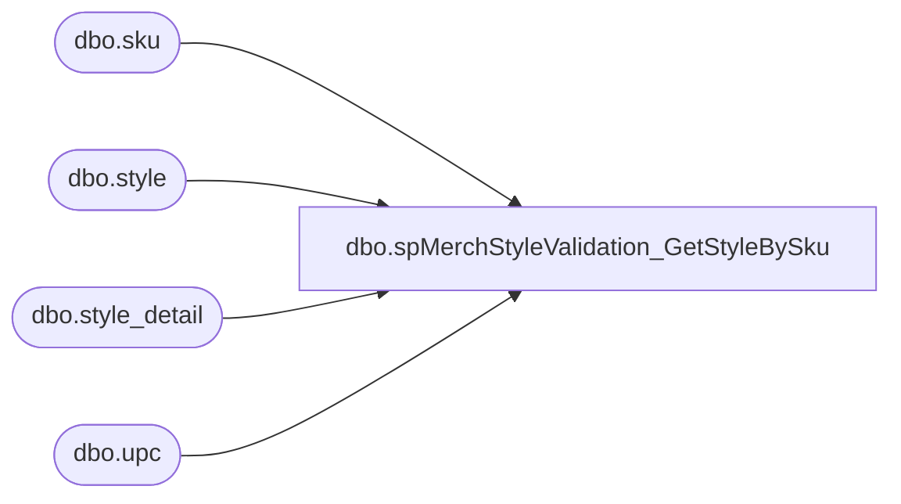

# dbo.spMerchStyleValidation_GetStyleBySku

**Database:** DBAUtility  
**Server:** bearcluster01  

## Architecture Diagram



## Table Dependencies

| Referenced Table |
|---|
| dbo.sku |
| dbo.style |
| dbo.style_detail |
| dbo.upc |

## Stored Procedure Code

```sql
CREATE PROCEDURE [dbo].[spMerchStyleValidation_GetStyleBySku] 
	@upc AS VARCHAR(12)
AS
BEGIN

-- =============================================================================================================
-- Name: [dbo].[spMerchStyleValidation_GetStyleBySku] 
--
-- Description:	Get Style by Sku.
--
-- Input: Style Code
--
-- Output: N/A
--
-- Dependencies: 
--
-- Revision History
--		Name:			Date:			Comments:
--		Ben Barud		04/27/2016		created
-- =============================================

	SET NOCOUNT ON;

	--DECLARE @styleCode AS VARCHAR(6)
	--SET @styleCode = '823042'

	SELECT s.style_code as styleCode
	FROM me_01.dbo.style s with(nolock)
	JOIN me_01.dbo.style_detail sd with(nolock) ON s.style_id = sd.style_id
	JOIN me_01.dbo.sku sk with(nolock) ON s.style_id = sk.style_id
	JOIN me_01.dbo.upc u with(nolock) ON sk.sku_id = u.sku_id
	WHERE u.upc_number = (@upc)
END
```

