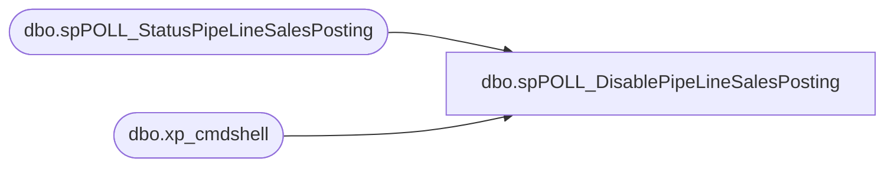

# dbo.spPOLL_DisablePipeLineSalesPosting

**Database:** DBAUtility  
**Server:** bearcluster01  

## Architecture Diagram



## Table Dependencies

| Referenced Table |
|---|
| dbo.spPOLL_StatusPipeLineSalesPosting |
| dbo.xp_cmdshell |

## Stored Procedure Code

```sql
create PROCEDURE [dbo].[spPOLL_DisablePipeLineSalesPosting]
AS
DECLARE @sql VARCHAR(1000)
SET @sql = 'OSQL -E -Q "EXEC msdb.dbo.sp_update_job @job_name = ''MERCHANDISING - Process - Pipeline Sales Posting'', @enabled  = 0"' 

--print @sql
EXEC master.dbo.xp_cmdshell @sql
EXEC [spPOLL_StatusPipeLineSalesPosting]
```

