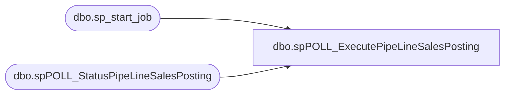

# dbo.spPOLL_ExecutePipeLineSalesPosting

**Database:** DBAUtility  
**Server:** bearcluster01  

## Architecture Diagram



## Table Dependencies

| Referenced Table |
|---|
| dbo.sp_start_job |
| dbo.spPOLL_StatusPipeLineSalesPosting |

## Stored Procedure Code

```sql
CREATE PROCEDURE [dbo].[spPOLL_ExecutePipeLineSalesPosting]
AS

EXEC msdb.dbo.sp_start_job @job_name = 'MERCHANDISING - Process - Pipeline Sales Posting'

EXEC [spPOLL_StatusPipeLineSalesPosting]
```

