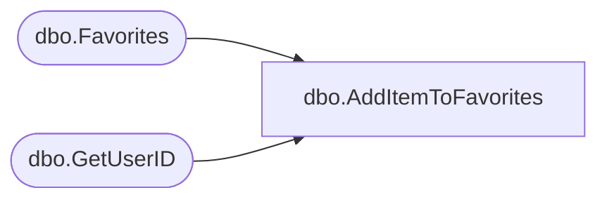

# dbo.AddItemToFavorites

**Database:** ReportServerBIRPT02  
**Server:** bearcluster01  

## Architecture Diagram



## Table Dependencies

| Referenced Table |
|---|
| dbo.Favorites |
| dbo.GetUserID |

## Stored Procedure Code

```sql
CREATE PROCEDURE [dbo].[AddItemToFavorites]
@ItemID uniqueidentifier,
@UserName nvarchar (425),
@UserSid varbinary(85) = NULL,
@AuthType int
AS

DECLARE @UserID uniqueidentifier
EXEC GetUserID @UserSid, @UserName, @AuthType, @UserID OUTPUT

IF NOT EXISTS (SELECT UserID FROM [Favorites] WHERE UserID = @UserID AND ItemID = @ItemID)
BEGIN
    INSERT INTO [dbo].[Favorites] (ItemID, UserID) VALUES (@ItemID, @UserID)
END
```

