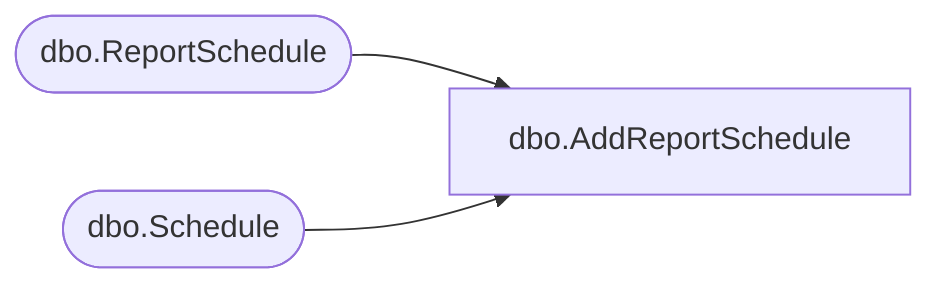

# dbo.AddReportSchedule

**Database:** ReportServerBIRPT02  
**Server:** bearcluster01  

## Architecture Diagram



## Table Dependencies

| Referenced Table |
|---|
| dbo.ReportSchedule |
| dbo.Schedule |

## Stored Procedure Code

```sql
CREATE PROCEDURE [dbo].[AddReportSchedule]
@ScheduleID uniqueidentifier,
@ReportID uniqueidentifier,
@SubscriptionID uniqueidentifier = NULL,
@Action int
AS

-- VSTS #139366: SQL Deadlock in AddReportSchedule stored procedure
-- Hold lock on [Schedule].[ScheduleID] to prevent deadlock
-- with Schedule_UpdateExpiration Schedule's after update trigger
select 1 from [Schedule] with (HOLDLOCK) where [Schedule].[ScheduleID] = @ScheduleID

Insert into ReportSchedule ([ScheduleID], [ReportID], [SubscriptionID], [ReportAction]) values (@ScheduleID, @ReportID, @SubscriptionID, @Action)
```

