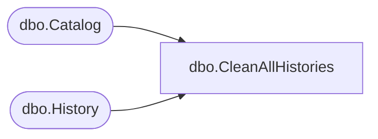

# dbo.CleanAllHistories

**Database:** ReportServerBIRPT02  
**Server:** bearcluster01  

## Architecture Diagram



## Table Dependencies

| Referenced Table |
|---|
| dbo.Catalog |
| dbo.History |

## Stored Procedure Code

```sql
-- delete snapshots exceeding # of snapshots for the whole system
CREATE PROCEDURE [dbo].[CleanAllHistories]
@SnapshotLimit int
AS
SET NOCOUNT OFF
DELETE FROM History
WHERE HistoryID in
    (SELECT HistoryID
     FROM History JOIN Catalog AS ReportJoinSnapshot ON ItemID = ReportID
     WHERE SnapshotLimit IS NULL and SnapshotDate <
        (SELECT MIN(SnapshotDate)
         FROM
            (SELECT TOP (@SnapshotLimit) SnapshotDate
             FROM History AS InnerSnapshot
             WHERE InnerSnapshot.ReportID = ReportJoinSnapshot.ItemID
             ORDER BY SnapshotDate DESC
            ) AS TopSnapshots
        )
    )
```

