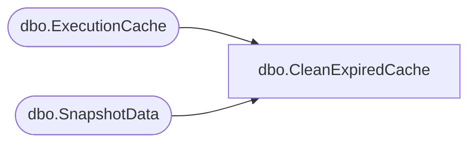

# dbo.CleanExpiredCache

**Database:** ReportServerBIRPT02  
**Server:** bearcluster01  

## Architecture Diagram



## Table Dependencies

| Referenced Table |
|---|
| dbo.ExecutionCache |
| dbo.SnapshotData |

## Stored Procedure Code

```sql
CREATE PROCEDURE [dbo].[CleanExpiredCache]
AS
SET NOCOUNT OFF
DECLARE @now as datetime
SET @now = DATEADD(minute, -1, GETDATE())

UPDATE SN
SET
   PermanentRefcount = PermanentRefcount - 1
FROM
   [ReportServerBIRPT02TempDB].dbo.SnapshotData AS SN
   INNER JOIN [ReportServerBIRPT02TempDB].dbo.ExecutionCache AS EC ON SN.SnapshotDataID = EC.SnapshotDataID
WHERE
   EC.AbsoluteExpiration < @now

DELETE EC
FROM
   [ReportServerBIRPT02TempDB].dbo.ExecutionCache AS EC
WHERE
   EC.AbsoluteExpiration < @now
```

