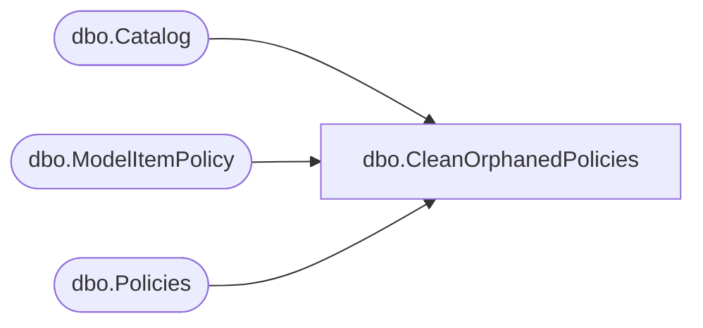

# dbo.CleanOrphanedPolicies

**Database:** ReportServerBIRPT02  
**Server:** bearcluster01  

## Architecture Diagram



## Table Dependencies

| Referenced Table |
|---|
| dbo.Catalog |
| dbo.ModelItemPolicy |
| dbo.Policies |

## Stored Procedure Code

```sql
-- Cleaning orphan policies
CREATE PROCEDURE [dbo].[CleanOrphanedPolicies]
AS
SET NOCOUNT OFF
DELETE
   [Policies]
WHERE
   [Policies].[PolicyFlag] = 0
   AND
   NOT EXISTS (SELECT ItemID FROM [Catalog] WHERE [Catalog].[PolicyID] = [Policies].[PolicyID])

DELETE
   [Policies]
FROM
   [Policies]
   INNER JOIN [ModelItemPolicy] ON [ModelItemPolicy].[PolicyID] = [Policies].[PolicyID]
WHERE
   NOT EXISTS (SELECT ItemID
               FROM [Catalog]
               WHERE [Catalog].[ItemID] = [ModelItemPolicy].[CatalogItemID])
```

