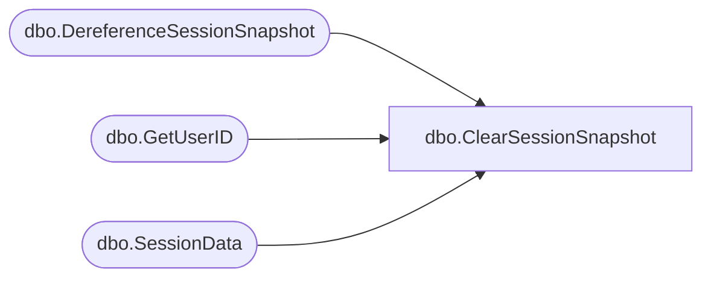

# dbo.ClearSessionSnapshot

**Database:** ReportServerBIRPT02  
**Server:** bearcluster01  

## Architecture Diagram



## Table Dependencies

| Referenced Table |
|---|
| dbo.DereferenceSessionSnapshot |
| dbo.GetUserID |
| dbo.SessionData |

## Stored Procedure Code

```sql
CREATE PROCEDURE [dbo].[ClearSessionSnapshot]
@SessionID as varchar(32),
@OwnerSid as varbinary(85) = NULL,
@OwnerName as nvarchar(260),
@AuthType as int,
@Expiration as datetime
AS

DECLARE @OwnerID uniqueidentifier
EXEC GetUserID @OwnerSid, @OwnerName, @AuthType, @OwnerID OUTPUT

EXEC DereferenceSessionSnapshot @SessionID, @OwnerID

UPDATE SE
SET
   SE.SnapshotDataID = null,
   SE.IsPermanentSnapshot = null,
   SE.SnapshotExpirationDate = null,
   SE.ShowHideInfo = null,
   SE.HasInteractivity = null,
   SE.AutoRefreshSeconds = null,
   SE.Expiration = @Expiration
FROM
   [ReportServerBIRPT02TempDB].dbo.SessionData AS SE
WHERE
   SE.SessionID = @SessionID AND
   SE.OwnerID = @OwnerID
```

